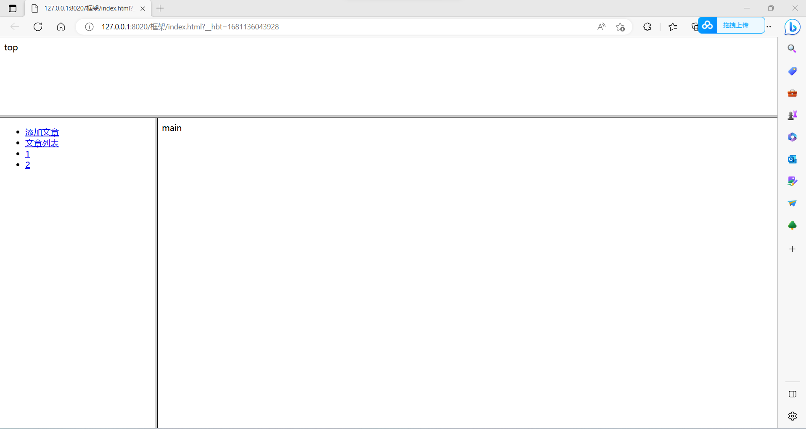
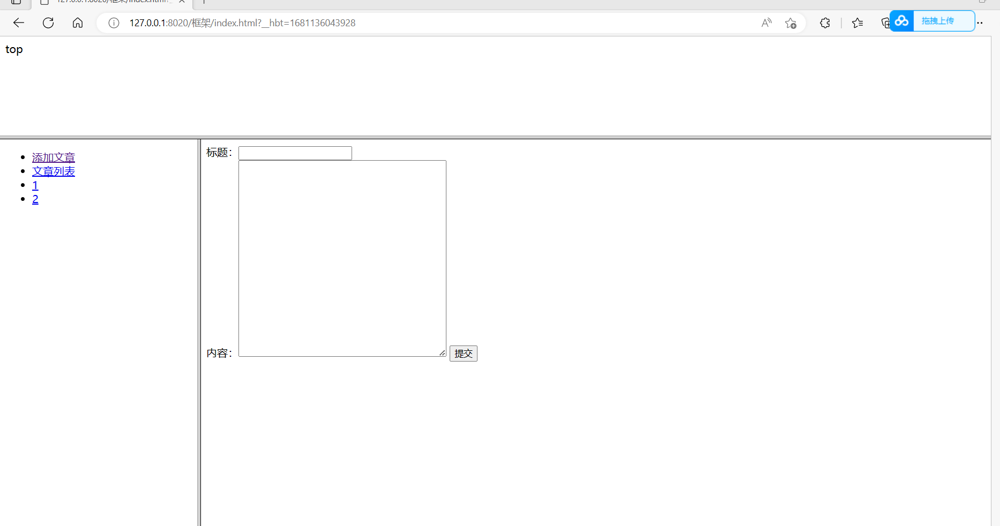

 本文记录了学习前端三件套过程中，写过的代码，以及一些相关知识 

<!-- more -->

# HTML

```html
<!DOCTYPE html>
<html>
	<head>
		<title></title>
	</head>
	<body>
	</body>
</html>
```

### HBuilder编译器

- 保存的快捷方式 **ctrl+s**
- 自动生成简单页面架构
- 链接：https://pan.baidu.com/s/1peqP33i_RBJTNfGi3ECzKw?pwd=hdf3 
  提取码：hdf3

### HTML常见标签

- **!--**xxxxxx-- 注释

- **head内的标签**

  - **meta标签** 可以提供有关页面的元信息，比如针对搜索引擎和更新频度的描述和关键词
    - 设置网站关键字：meta name= "keywords"  content= "关键词" charset=“编码”
    - charset 编码 **gbk gbk2312 utf-8**

  ```html
  <meta charset="utf-8">
  <meta name="keywords" content = "网络安全，web基础"></meta>
  ```

  - **link标签** 定义文档与外部资源的关系

  - **script标签** 引入js文件

- **body内的标签**

  - **p标签** 段落
  - **hx 标题标签** 从h1 到h6 由大变小
  - **br标签** 换行标签
  - **hr标签** 换行线标签

```html
<p>这是一段文本</p><br>
<h1>h1</h1><h2>h2</h2><h3>h3</h3><h4>h4</h4><h5>h5</h5><h6>h6</h6>
<hr></hr>
```

<p>这是一段文本</p><br>
<h4>h4</h4><h5>h5</h5><h6>h6</h6>
<hr></hr>

- **文本属性标签**
  - **strong标签  b标签** 加粗
  - **i标签** 斜体
  - **u标签** 下划线
  - **sup sub标签** 上标下标
  - **del标签** 删除线
  - **font标签** 规定字体的属性
    - **size** 字体大小 font size=""
    - **color** 字体颜色
  - **pre标签** 按代码原样输出

```html
<p><strong>这是一段文本</strong><b>这是</b><i>一段文本</i><u>这是一段文本</u>这是<sub>一段文本</sub>这是<sup>一段文本</sup><del>这是一段文本</del><font size="1px" color="red">这是一段文本</font></p><br>
```

<p><strong>这是一段文本</strong><b>这是</b><i>一段文本</i><u>这是一段文本</u>这是<sub>一段文本</sub>这是<sup>一段文本</sup><del>这是一段文本</del><font size="1px" color="red">这是一段文本</font></p><br>

- **特殊标签 a标签**
  - **href** 跳转地址href="https://   "
  - **href** 锚文本href="#{name}"
  - **target** 跳转方式:
    - _self 默认，在相同的框架中打开被链接文档
    - _blank 在新窗口中打开被链接文档
    - _parent 在父框架集中打开被链接文档
    - _top 在整个窗口中打开被链接文档

```html
<a href="https://www.baidu.com">百度</a>
<a href="https://www.baidu.com" target="_blank">百度</a>
<a href="#简单的HTML页面架构">锚文本</a>
```

<a href="https://www.baidu.com">百度</a>
<a href="https://www.baidu.com" target="_blank">百度</a>
<a href="#简单的HTML页面架构">锚文本</a>

- **特殊标签 img标签**
  - **scr** 图片地址 本地/外网
  - **width height** 宽、高
  - **alt** 文件显示失败时显示的文字

### form表单

- **form表单** 规定当前提交表单时向何处发送表单数据
- **method** 提交方法 有 **get post**
- **enctype** 规定在发送表单数据之前如何对其进行编码
  - application/x-www-form-urlencoded  默认
  - multipart/form-data 
  - text/plain 文本，一般不用
- **input标签** 输入框
  - name 表示文本输入框名称
  - size 输入框的长度大小
  - maxlength 允许输入的最大字符数
  - value 输入框中的默认值
  - readonly 表示该框中只能显示，不能添加修改
  - **input类型**
    - type = text 文本
    - type = password 密码输入框
    - type = file 文件上传
    - type = hidden 隐藏域
      - 在页面上看不到
      - 在查询数据时看得到
    - type = button 按钮
    - type = checkbox 复选框
    - type = radio 单选框
      - name属性一样的单选
    - type = submit 提交按钮
      - 将数据提交到服务器 
    - type = reset 重置按钮

```html
<!--文件上传-->
<form method="post" enctype="multipart/form-data" name="fileupdata">
    <input type="file">
    <input type="submit">
</form>
<!--登入-->
<form method="get" name="login">
    <lable>用户名：</lable><input type="text" size="15" maxlength="10" value="admin"><br>
    <lable>密&nbsp;&nbsp;码：</lable><input type="password" size="15"><br>
    <input type="submit" value="登入"><input type="reset" value="重置">
</form>
<!--上传表单-->
<form name="loadupskills">
    <lable>性别&nbsp;&nbsp;：</lable><lable>男</lable><input type="radio" name="sex"><lable>女</lable><input type="radio" name="sex"><br>
    <lable>拥有技能：</lable><lable>web渗透</lable><input type="checkbox"><lable>内网穿透</lable><input type="checkbox">
</form>
```

<!--文件上传-->

<form method="post" enctype="multipart/form-data" name="fileupdata">
    <input type="file">
    <input type="submit">
</form>


<!--登入-->

<form method="get" name="login">
    <lable>用户名：</lable><input type="text" size="15" maxlength="10" value="admin"><br>
    <lable>密&nbsp;&nbsp;码：</lable><input type="password" size="15"><br>
    <input type="submit" value="登入"><input type="reset" value="重置">
</form>


<!--上传表单-->

<form name="loadupskills">
    <lable>性别：&nbsp;&nbsp;</lable><lable>男</lable><input type="radio" name="sex"><lable>女</lable><input type="radio" name="sex"><br>
    <lable>拥有技能：</lable><lable>web渗透</lable><input type="checkbox"><lable>内网穿透</lable><input type="checkbox">
</form>

### table表格

- **caption** 表格带标题
- **border** 边框
- **width height** 宽、高
- **colspan rowspan** 行、列合并
- **tr th td** 行单元格 表头单元格 标准单元格 一般th内部文本居中粗体，td内左对齐普通文本
- **cellpadding** 单元边与内容的空白
- **cellspacing** 单元格的空白

```html
<table border="10">
    <caption>这是一个表格标题</caption>
    <tr><th>#</th><th>姓名</th><th>年龄</th></tr><br>
    <tr><td>1</td><td>张三</td><td rowspan="2">20</td></tr><br>
    <tr><td>2</td><td>李四</td></tr><br>
    <tr><td>3</td><td>王五</td><td>21</td></tr><br>
    <tr><td>总人数</td><td colspan="2">3</td></tr>
</table>
```

<table border="10">
    <caption>这是一个表格标题</caption>
    <tr><th>#</th><th>姓名</th><th>年龄</th></tr><br>
    <tr><td>1</td><td>张三</td><td rowspan="2">20</td></tr><br>
    <tr><td>2</td><td>李四</td></tr><br>
    <tr><td>3</td><td>王五</td><td>21</td></tr><br>
    <tr><td>总人数</td><td colspan="2">3</td></tr>
</table>

### 列表标签

- **li 标签** 每一行表示标签
- **ul 标签** 无序标签
  - square 方框
  - circle 空心圆圈
  - disc 实心圆圈
- **ol 标签** 有序标签
  -  数字列表 默认 数字
  -  小写字母列表 a
  -  大写字母列表 A
  -  罗马字母列表  I
  -  小写罗马字母列表 i	

```html
<ol type="a">
    <li>文本</li><li>文本</li><li>文本</li>
</ol>
<ul>
    <li>文本</li><li>文本</li><li>文本</li>
</ul>
```

<ol type="a">
    <li>文本</li><li>文本</li><li>文本</li>
</ol>
<ul>
    <li>文本</li><li>文本</li><li>文本</li>
</ul>


### 框架

- **frameset标签** 可定义一个框架集。它被用来组织多个窗口（框架）。每个框架存有独立的文档。在其最简单的应用中，frameset 元素仅仅会规定在框架集中存在多少列或多少行。必须使用 cols 或 rows 属性，不能嵌套在body标签里
- **frame标签** 在frameset中使用的框架
- **scrolling**  滚动条
  - auto	在需要的情况下出现滚动条（默认值）
  - yes	始终显示滚动条（即使不需要）
  - no	从不显示滚动条（即使需要）

**index.html**

```html
<frameset rows="20%,*">
	<frame src="top.html" />
	<frameset cols="20%,*">
		<frame src="left.html" />
		<frame src="main.html" name="add"/>
	</frameset>
</frameset>
```

**left.html**

```html
<body>
	<ul>
		<li><a href="add.html" target="add">添加文章</a></li>
		<li><a href="artlist.html" target="add">文章列表</a></li>
		<li><a href="#">系统信息</a></li>
		<li><a href="#">备份</a></li>
	</ul>
</body>
```

**add.html**

```html
<body>
	<form method="post">
		标题：<input type="text" /><br>
		内容：<textarea cols="40" rows="20"></textarea>
		<input type="submit" />
	</form>
</body>
```

**main.html**

```html
<body>
        main
</body>
```

**top.html**

```html
<body>
    top
</body>
```

**artlist.html**

```html
<body>
    <ol>
       <li>1</li>
       <li>2</li>
    </ol>
</body>
```





# css

​		层叠样式表(英文全称：Cascading Style Sheets)是一种用来表现HTML（标准通用标记语言的一个应用）或XML（标准通用标记语言的一个子集）等文件样式的计算机语言。CSS不仅可以静态地修饰网页，还可以配合各种脚本语言动态地对网页各元素进行格式化。

## 样式表类型

- 嵌入样式表：写在head内部 style标签内

  ```html
  <!DOCTYPE html>
  <html>
      <head>
          <meta charset="UTF-8">
          <titile></titile>
          <style>
              .demo1{
                  color:颜色;
                  width:宽度;
                  height:高度;
                  background:背景色;
              }
          </style>
      </head>
      <body>
          <div class="demo1">
              demo1
          </div>
      </body>
  </html>
  ```

- 外部样式：将style标签中的css代码存到css文件中，再index使用link标签嵌入

  ```html
  <!DOCTYPE html>
  <html>
      <head>
          <meta charset="UTF-8">
          <titile></titile>
          <link rel="stylesheet" href="css/style.css">
      </head>
      <body>
          <div class="demo1">
              demo1
          </div>
      </body>
  </html>
  ```

  其中style.css文件代码如下

  ```css
  .demo1{
  	color:red;
  	width:100px;
  	height:100px;
  	background:blue;
  	}
  ```

  **在css中引用外部css **使用@import url("")

  ```css
  @import url("css/gs.css")
  .demo1{
  	color:red;
  	width:100px;
  	height:100px;
  	background:blue;
  	}
  ```

- 内联样式：在div中使用style属性

  ```html
  <div style="color: blue;width: 100px;height: 100px; background: black;">demo2</div>
  ```

## 样式选择器

- **元素选择器**  div{属性：值}
- **ID选择器** #id{属性：值}     其中ID值不能重复
- **class选择器**  .类名{属性：值}  class可以在div中定义
- **通配符选择器**  *{属性：值}   选择所有元素
- **子选择器**  父类 空格 子类{属性:值}  如对一个名为demo1的div内的p标签：demo1 p{ }
- **后代选择器**   父类 > 子类 {属性：值}
- **属性选择器**  元素[属性]{}

## 背景

- **backgroud-color** 调节背景颜色

- **backgroud-image** 使用图片填充背景（自动铺满）

  - **backgroud-repeat:**
    - no-repeat;不铺满
    - repeat-y;纵向铺满
    - repeat-x;横向铺满
  - **backgroud-attachment:**
    - fixed：图片固定
    - scroll：图片随内容滚动而滚动

- **背景的简写：** 

  ```css
  .demo{
      backgroud: url(img/1.jpg) no-repeat fixed;
  }
  ```

## 边框

- **border-width** 边框宽度

- **border-color** 边框颜色

- **四周边框设置**

  - border-left
  - border-right
  - border-top
  - border-bottom

- **border-style** 边框样式

  - none 无边框
  - hidden 隐藏边框，IE不支持
  - dotted 在MAC平台上IE4+与WINDOWS和UNIX平台上IE5.5+为点线。否则为实线
  - dashed 在MAC平台上IE4+与WINDOWS和UNIX平台上IE5.5+为虚线。否则为实线
  - solid 实线
  - double 双线边框

- **边框简写**

  ```css
  .demo{
  	border: 1px solid red;
  }
  <div style="border: 5px solid red;text-align:center">xxxxxxxxx</div>
  ```

<div style="border: 5px solid red;text-align:center">xxxxxxxxx</div>

## 文字属性

- **color** 文字颜色
- **font-size** 文字大小
- **font-weight:bolds** 文字粗细
- **font-family** 文字字体
- **font-variant:small-caps** 小写字母大写显示

```html
<p style="color:red;font-weight:bolds">这是一段文字</p>
```

<p style="color:red;font-weight:bolds">这是一段文字</p>

## 文本属性

- **text-align:center**  文本对齐(right/left/center)
- **line-height**  行间距(可通过它实现文本的垂直居中)
- **text-indent** 首行缩进
- **text-decoration** 划线
  - none  去除,主要用于a标签
  - underline  下划线
  - overline   上划线
  - line-through   中划线
- **letter-spacing**  字间距

```html
<p style="text-align:center;text-indent:2px;text-decoration:overline">这是一段文本这是一段文本这是一段文本这是一段文本这是一段文本这是一段文本这是一段文本这是一段文本</p>
```

<p style="text-align:center;text-indent:2px;text-decoration:overline">这是一段文本这是一段文本这是一段文本这是一段文本这是一段文本这是一段文本这是一段文本这是一段文本</p>

## 列表

- **list-style-type** 标记类型，可简写为list-style
  - disc 点| circle 圈| square 正方形| decimal 数字| decimal-leading-zero | lower-roman | upper-roman | lower-greek | lower-latin | upper-latin | armenian | georgian | lower-alpha 
- **list-style-position** 列表项标记

#  javascript

JavaScript是目前web开发中不可缺少的脚本语言，js不需要编译即可运行，运行在客户端，需要通过浏览器来解析执行JavaScript代码。javaScript 被用来改进设计、验证表单、检测浏览器、创建cookies，等等。JavaScript 是因特网上最流行的脚本语言，并且可在所有主要的浏览器中运行

## javascript组成

- ECMAScript  js语法
- DOM 页面文档对象模型
- BOM 浏览器对象模型

## ECMAScript

### 嵌入方法

- **内嵌式**

  ```html
  <script type="application/javascript">
  	alert("demo");
  </script>
  ```

- **外链式**

  ```html
  <script src="js路径"></script>
  ```

- **行内式**

  ```html
  <input type="button" value="点击" onclick="alert('demo1');">
  <button onclick="alert('demo2')">点击</button>
  ```

## 输入输出语句

- alert(msg); 浏览器弹出警示框
- console.log(msg); 浏览器控制台打印输出信息
- prompt(info); 浏览器弹出输入框，用户可以输入info为提示语

## 变量

变量用于存储信息，声明变量使用 var

```js
var a='dome';
var age = 10, name= 'xx', sex= 2; //声明多个变量
```

**变量名规范**

- 由字母、数字、下划线、美元符号组成
- 严格区分大小写
- 不能以数字开头
- 不能是关键字、保留字
- 变量名必须有意义
- 遵循驼峰命名法

## 数据类型

js的变量数据类型是只有程序在运行过程中，根据所赋的值判断。动态类型，数据类型可变

- 数值型：number
  - **八进制 **数字前面加0
  - **十六进制** 数字前面加0x
  - **数字型的最大值** Number.MAX_VALUE
  - **数字型的最大值** Number.MIN_VALUE

- 字符串：string
- 布尔：boolean  true\false
- 对象类型：object  数组\字典\null
- 未定义型：undefined

**一般将数据类型分为两类：**

- 简单数据类型（number,string,boolean,undefined,null)
- 复杂数据类型（object）

## 类型判断

使用函数 typeof，其中prompt取的值为字符串

```js
alert(typeof a)
```

#### 数字类型

- parseInt()  将某值转换成数字，不成功则NaN
- parseFloat()  转化成浮点数
- NaN  非数字，用isNaN(num)函数判断
- Infinity 无穷大，用isFinite(num)函数判断

#### 字符串型

- obj.length 长度
- obj.trim() 移除空白
  - obj.trimLeft
  - obj.trimRight
- obj.charAt(n) 返回字符串中的第n个字符,从零开始
- obj.concat(value,...)  拼接
- obj.indexOf(substring,start) 字序列位置
- obj.toLowerCase() 转小写
- obj.toUpperCase() 转大写
- obj.split(delimiter,limit) 分割
- obj.serch(regexp) 从头开始匹配，返回匹配成功的第一位置
- obj.match(regexp) 全局搜索，如果正则中有g表示全部，否则只找第一个
- obj.replace(regexp,replacement)  替换

#### 布尔类型

- 值只有true和false
- 通过逻辑运算

#### undefined

这个值表示变量不含有值、没有定义的值、或者被定义了一个不存在的属性值

#### 类型转化

- **转为字符串**

  ```js
  var num = 10;
  console.log(num.toString()); //toString()
  console.log(String(num));  //String()强制转化
  console.log(num+'');	//+隐含转化
  ```

- **转为数字型**  

  ```js
  var src='xx';
  console.log(parseInt(src));//parseInt整数去尾
  console.log(parseFloat(Src));//浮点数
  console.log(Number(src)); //利用Number
  console.log(src-0); //-、*隐含转化
  ```

- **转为布尔型**

  ```js
  var src={ };
  console.log(Boolean(src));
  // ''、数字、NaN、null、undefined转为false，其余为true
  ```

## 逻辑中断

**逻辑与短路** 

- 如果表达式1 结果为真 则返回表达式2

- 如果表达式1 结果为假 则返回表达式1

  ```js
  console.log(123 && 456); //456
  console.log(0 && 456); //0
  console.log(0 && 1+2 && 456*79); //0
  console.log('' && 1+2 && 456*79); //''
  ```

**逻辑或短路**

- 如果表达式1 结果为真 则返回表达式1

- 如果表达式1 结果为假 则返回表达式2

  ```js
  console.log(123 || 456); //123
  console.log(123 || 456 || 123+456); //123
  console.log(0 || 456 || 123+456); // 456
  ```

#### 逻辑中断示例

```js
var num = 0;
console.log(123 || num++); //123
console.log(num);   //0
```

## 数组

- 不赋值时值为undefined

- 数组不会出现越界，定义了数组的大小，照样可以添加更过元素

- 定义数组，数组内容可以是不同类型的，索引从0开始

  ```js
  var arr=[]//定义一个空数组
  var arr=[10,20{"name":"tomy","age":19},0.1,"string",true,["aaa","bbb"]]//定义的同时赋值
  
  var arr=new Array();//定义一个空数组
  var arr=new Array(10,20,{"name":"tomy","age":19},0.1,"string",true,["aaa","bbb"])//定义的同时赋值
  var arr=new Array(10)//定义一个长度为10的数组
  ```

- 数组操作

  - .length 数组大小
  - push(ele) 尾部加入元素
  - pop() 尾部获取一个元素
  - unshift(ele) 头部插入元素
  - shift() 头部移除元素
  - splice(start,deleteCount,value,...) 
    - splice(n,0,val) 插入
    - splice(n,1,val) 替换
    - splice(n,1) 删除
  - reverse() 反转
  - join(sep) 将数组合成一个字符串
  - concat(val,...) 连接数组
  - sort() 对数元素进行排序

  

## 函数

- **普通函数**

  ```js
  function 函数名(参数){
  	函数体
      return 需要返回的结果;//可无
  }
  var result = 函数名(参数);
  console.log(result);//在控制台输出
  //如果实参多于形参，取到形参的个数
  //如果实参少于形参，多余的形参定义为undefined
  ```

- **匿名函数**

  ```js
  setInterval(function(){
  	console.log(123);
  },500)  //setInterval() 方法会不停地调用函数
  ```

- **自执行函数**

  ```js
  (function(arg)){
  	console.log(arg);
  })(1);
  ```

- **arguments** 当不确定有多少个参数传递的时候可以用arguments来获取，伪数组展示

  ```js
  function demo(){
  	console.log(arguments);
  }
  demo(1,2,3); //控制台显示1，2，3
  ```


## 字典

字典是一种键值对形式存储数据的数据结构

```js
var dict = {'k1':"xxxx",'k2':"xx"};
```

- 输出字典元素

  ```js
  for(var item in dict){
  	console.log(dict[item]);
  }
  ```

- 获取指定元素

  ```js
  dict['age']; //获取key为age的元素
  ```

- 赋值

  ```js
  dict['age']=10;
  ```

- 删除元素

  ```js
  delete dict[''];
  delete dict.age;
  ```


## 序列化和反序列化

指的是Json与字符串的转换

- 序列化 即js中的object转化为字符串

  ```js
  var last=obj.toJSONString(); //使用toJSONString将JSON对象转化为JSON字符串
  var last=JSON.stringify(obj);//使用stringify将JSON对象转化为JSON字符串
  ```

## 转义

- decodeURI( )          URl中未转义的字符
- decodeURIComponent( )  URI组件中的未转义字符
- encodeURI( )          URI中的转义字符
- encodeURIComponent( )  转义URI组件中的字符
- escape( )             对字符串转义
- unescape( )           给转义字符串解码
- URIError             由URl的编码和解码方法抛出

## eval

eval() 函数可计算某个字符串，并执行其中的的 JavaScript 代码。

## 对象

```js
var obj = {
	uname:'',
	age:19,
	sayHi: function(){
	
	}
}; //创建对象方法1
console.log(obj.uname);
console.log(obj[uname]); //两种调用方法

var obj = new Object();
obj.uname = '';
obj.age = 18;
obj.sayHi = function(){}
//创建方法2

function 构造函数名(){
    this.属性 = 值;
    this.方法 = function(){}
}
new 构造函数名;
//创建方法3
```

## 面向对象

JavaScript是一种基于原型的语言，它没类的声明语句，比如C+ +或Java中用的。这有时会对习惯使用有类申明语句语言的程序员产生困扰。相反，JavaScript可用方法作类。定义一个类跟定义一个函数一样简单。

```js
function Person(name) {
     //构造函数里面的方法和属性
    this._name = name;
    this.getName = function () {
         console.log(this._name);
     };
     this.setName = function (name) {
         this._name = name;
     };
 }
 
 var p = new Person("张三");
 p.getName();  // 张三
 p.setName("李四");
 p.getName();  // 李四
```

```js
class Person {
     //类的构造函数，实例化的时候执行，new的时候执行
     constructor(name) {
         this._name = name;
     }
     getName() {
         console.log(this._name);
     }
     setName(name) {
        this._name = name
    }
}
 let p = new Preson('张三')
 p.getName();  // 张三
 p.setName('李四');
 p.getName();  // 李四
```

## 内置对象

#### 查文档MDN

https://developer.mozilla.org/zh-CN/

#### Math对象

- Math.PI 圆周率
- Math.max() 求最大

#### 日期对象

- myDate.getYear(); //获取当前年份(2位)  
- myDate.getFullYear(); //获取完整的年份(4位,1970-????)  
- myDate.getMonth(); //获取当前月份(0-11,0代表1月) 所以获取当前月份是 myDate.getMonth()+1;  
- myDate.getDate(); //获取当前日(1-31)  
- myDate.getDay(); //获取当前星期X(0-6,0代表星期天)  

## 原型

我们所创建的每一个函数，解析器都会向函数中添加一个属性prototype这个属性对应着一个对象，这个对象就是我们所谓的原型对象如果函数作为普通函数调用时 prototype没有任何作用当函数以构造函数调用时，它所创建的对象中都会有一个隐含的的属性指向该构造函数的原型 我们可以通过__proto__来访问该属性我们可以将对象中公有的内容，统一设置到原型对象中

```js
function Persion(username,age){
}
//console.log(Persion.prototype);
var p = new Persion();
console.log(p.__proto__ == Persion.prototype);


定义原型变量和原型变量
function Persion(username,age){

}
//console.log(Persion.prototype);
Persion.prototype.a = '女';
Persion.prototype.Sayname=function(){
	return Persion.name;
}
var p1 = new Persion('moonsec');
var p2 = new Persion();
alert(p1.Sayname());
```

## 流程控制语句

- **if else语句**

  ```js
  if(条件1){
  	函数体1;
  }else if(条件2){
  	函数体2;
  }else if(条件n){
  	函数体n;
  }else{
  	函数体n+1;
  }
  ```

- **switch语句:多分支语句**

  ```js
  switch(表达式) {
       case value1:
          代码块
          break;
       case value2:
          代码块
          break;
       default:
          默认代码块
  } 
  ```

- **while循环**

  ```js
  while(循环成立条件){
  	函数体;
  }
  ```

- **do while循环、for循环、for in 循环**

# DOM

## DOM简介

DOM（document object model）文档对象模型，是针对HTML和XML的一个API（应用程序接口）。

- JavaScript 能够改变页面中的所有 HTML 元素
- JavaScript 能够改变页面中的所有 HTML 属性
- JavaScript 能够改变页面中的所有 CSS 样式
- JavaScript 能够对页面中的所有事件做出反应

## DOM树

文档：一个页面就是一个文档，DOM中用document表示

元素：页面里面所有的标签都是元素，DOM中使用element表示

节点：网页中的所有内容都是节点，DOM中使用node表示

## 获取元素

-  根据id获取：getElementByld()方法

```html
<body>
    <div id="time">111</div>
	<scrpt>
    	var element = dovument.getElementById("time")
	</scrpt>
</body>
//文档页面从上往下加载，现有标签后有获取元素
//参数，大小写铭感
//返回的是一个元素对象
//console.dir返回更详细结果
```

- 根据name获取元素：getElementsByName()

```html
<body>
    <ul>
        <li>1</li>
        <li>2</li>
        <li>3</li>
    </ul>
    <ul name='nav'>
        <li>2</li>
        <li>3</li>
    </ul>
</body>
<script>
	var lis = document.getElementByTagName('li'); //会获取所有的li
    console.log(lis)
</script>
//1.得到的是一个对象的集合，要操作里面的元素叫需要遍历
//2.得到元素对象是动态的
//3.element.getElementByTagName
<script>
	var nav = document.getElementById('nav');
    var navLis = nav.getElementByTagName('li');
</script>
```

- H5新增获取元素：getElementsByClassName()

```html
<body>
    <div class="box">
        盒子1
    </div>
    <div class="box">
        盒子2
    </div>
    <script>
    	var boxs = document.getElementsByClassName('box');
        console.log(boxs);
    </script>
</body>
```

- H5优化选择器：querySelector 返回指定选择器的第一个元素对象

```html
<body>
    <div class="box">
        盒子1
    </div>
    <div class="box">
        盒子2
    </div>
    <script>
    	var firstboxs = document.querySelector('.box');
        console.log(firstboxs);
    </script>
</body>
```

- H5优化选择器：querySelectorAll() 返回指定选择器的所有元素对象

### 特殊元素

#### 获取body标签

```js
var bodyEle = document.body;
```

#### 获取html元素

```js
var htmlEle = document.documentElement;
```

## 事件基础

**触发——响应 机制**

事件由三部分组成：事件源  事件类型  事件处理程序

**事件源：**事件被触发的对象

```html
<body>
    <button id="btn">按钮1</button>
    <script>
        //事件源
    	var btn = document.getElementById('btn');
        //事件类型 鼠标点击(onclick)
        //事件处理程序 通过一个函数赋值的方式完成
        btn.onclick = function(){
            alert('点击')
        }
    </script>
</body>
```

**直接查找**

var obj = document.getElementById('id');

**间接查找**

文件内容操作

- innerText 仅文本
- innerHTML 全内容
- value
- input value 获取当前的值
- select 获取选中的value的值 document.getElementById('s1').selectedIndex=1
- Textarea 获取value的值

**样式操作**

- className 列出样式 字符串
- classList 列出样式 返回数组
- classList.add 增加样式
- classList.remove 删除样式

**属性操作**

- 获取属性
- getAttribute()
- 增加设置一个属性
- 添加属性
- setAttribute('xxx','alexe')
- 删除属性
- removeAttribute(value)

创建标签 并添加到html中

```html
insertAdjacentHTML()

		<input type="button" value="+" onclick="add();"/>
		<div id="div1">
			<p><input type="text"/></p>
		</div>
		<script>
			function add(){
				var tag="<p><input type='text'></p>"
				document.getElementById('div1').insertAdjacentHTML('beforeEnd',tag);
			}
			
		</script>
	</body>
```

- beforeBegin: 插入到标签开始前
- afterBegin:插入到标签开始标记之后
- beforeEnd:插入到标签结束标记前
- afterEnd:插入到标签结束标记后

```html
<input type="button" value="+" onclick="add2();"/>
		<div id="div1">
			<p><input type="text"/></p>
		</div>
		<script>
			function add(){
				var tag="<p><input type='text'></p>"
				document.getElementById('div1').insertAdjacentHTML('beforeEnd',tag);
			}
			
			
			function add2(){
				var tag =document.createElement('input');
				tag.setAttribute('type','text');
				tag.style.color='red';
				var p =document.createElement('p');
				p.appendChild(tag)
				document.getElementById('div1').appendChild(p);
			}
			
		</script>appendChild 在节点后面增加一个子节点
```

提交表单

任何标签都可以通过dom提交

```html
getElementById('id').submit()
				<form id='f1' action="https://www.moonsec.com/">
			<input type="submit" value="提交" />
			<input type="button" value="botton" onclick="Sub();" />
			<a onclick="Sub();">提交</a>
		</form>
		<script>
			function Sub(){
				document.getElementById('f1').submit();
			}
			
		</script>
```

**其他**

- console.log 终端输出
- alert 弹出框
- confirm 确认框 标题 true false

**url和刷新**

- location.href  获取url
- location.href ='url' 重定向
- location.reload() 重新加载

**定时器**

- setInterval()
- clearInterval()
