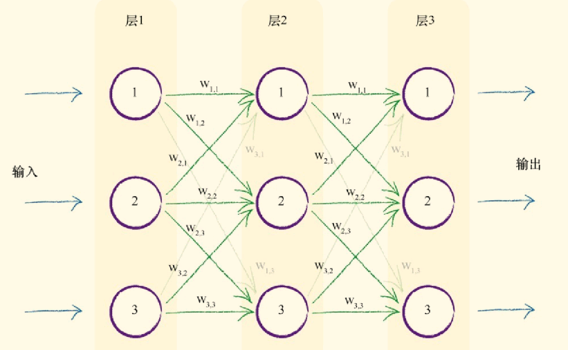
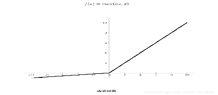
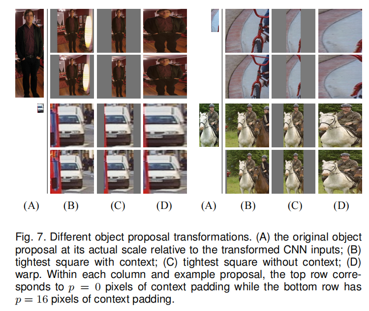
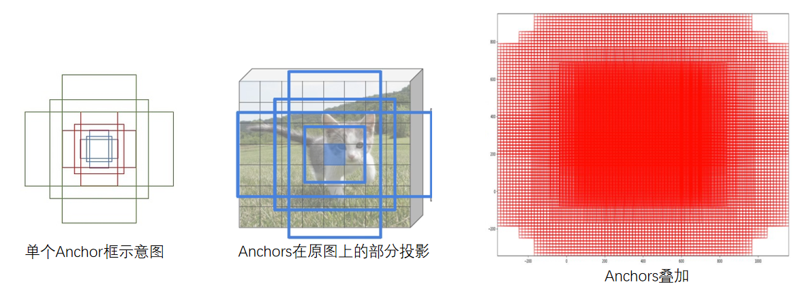
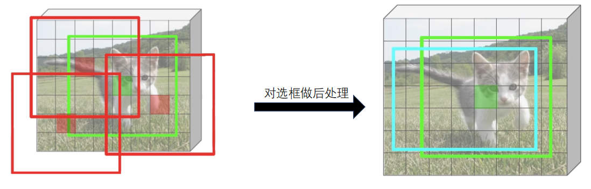

 本文章粗略介绍了R-CNN系列的神经网络，并对前置知识做了详细的介绍与说明。

<!--more-->

#  Nature Network

## 1.构成

由输入层、隐藏层、输出层、激活函数、损失函数组成。

- 输入层：接收原始数据
- 隐藏层：进行特征提取和转换
- 输出层：输出预测结果
- 激活函数：非线性变换
- 损失函数：衡量模型预测结果与真实值之间的差距

## 2.正向传播过程

​	基础的神经网络如下图所示，其中层1为输入层，层2为隐藏层，层3为输出层：



​	每一个圆圈代表了一个神经元，各层的神经元各自相连，如图中的绿色箭头。每一条相连的绿线上拥有起始设定好的权重。隐藏层的神经元后跟着激活函数，进行信号的转变。

​	对于每一层信号的输入输出，均有以下公式表达，X为此层的输入，O为此层的输出，一般输入层采用激活函数，即输入即为输出。
$$
X=W·Input\\
O=sigmoid(X)
$$
$Input$ 为输入矩阵，此处以如下为例：
$$
Input = 
\begin{bmatrix}
  1.0\\
  0.5\\
  0.35
\end{bmatrix}
$$
$W$ 为权重矩阵，各层的权重各不相同
$$
W=
\begin{bmatrix}
w_{1.1} & w_{1.2} &w_{1.3}\\
w_{2.1} & w_{2.2} &w_{2.3}\\
w_{3.1} & w_{3.2} &w_{3.3}
\end{bmatrix}
$$
$sigmoid$ 为激活函数
$$
y=\frac{1}{1+e^{-x}}
$$

### 过程演示（3层）

**1.输入层：**由于输入层一般不使用激活函数，输入层的输出即为输入数据 $Input$。

**2.隐藏层：** 此层的输入为：
$$
X_{hidden}=W_{input2hidden} · Input=
\begin{bmatrix}
w_{1.1} & w_{1.2} &w_{1.3}\\
w_{2.1} & w_{2.2} &w_{2.3}\\
w_{3.1} & w_{3.2} &w_{3.3}
\end{bmatrix} · \begin{bmatrix}
  1.0\\
  0.5\\
  0.35
\end{bmatrix}
$$
​					此层的输出为：
$$
O_{hidden} = sigmoid(X_{hidden})=\frac{1}{1+e^{X_{hidden}}}
$$
**3.输出层：** 输出层永远不使用激活函数，输出层的输出即为输入，输出层的输入为：
$$
X_{output} = W_{hidden2output}·O_{hidden}
$$

## 3.激活函数

​	上文使用的是$sigmoid$函数作为激活函数，还可以将其根据具体应用，更换为以下函数：

- Sigmoid函数：将输入值压缩到0到1之间，常用于二分类问题

  

- ReLU函数：将负值置为0，常用于深度神经网络中

  

- Tanh函数：将输入值压缩到-1到1之间，常用于回归问题

  

- Leaky ReLU函数：对负值进行微小的缩放，避免梯度消失问题

  

## 4.反向传播过程

​	误差计算：目标值-实际值		$e_n = t_n - o_n$

​	下面以单个神经元返回误差为例：


​	对于最后输出的误差我们需要将他根据前一层的权重传播到前一层，以上面单个神经元的反向传播过程为例。传回1号神经元的误差为 $errors·\frac{w_1}{w_1+w_2}$ ，传回2号神经元的误差为 $errors·\frac{w_2}{w_1+w_2}$ 。

### 过程演示（3层）

​	下面我们把这个过程放到三层的神经网络中分析：


​	我们以第二层第一个神经元为例，分析误差传播到此的值。
$$
e_{hidden1} = e_{output1}·\frac{w_{1.1}}{w_{1.1}+w_{2.1}+w_{3.1}}+e_{output2}·\frac{w_{1.2}}{w_{1.2}+w_{2.2}+w_{3.2}}+e_{output3}·\frac{w_{1.3}}{w_{1.3}+w_{2.3}+w_{3.3}}
$$
​	接下来我们使用矩阵来表达这个麻烦的公式：

**输出层误差：**
$$
error_{output}=\begin{pmatrix}
e_1\\
e_2\\
e_3
\end{pmatrix}
$$
**隐藏层误差：**
$$
error_{hidden}=\begin{bmatrix}
\frac{w_{1.1}}{w_{1.1}+w_{2.1}+w_{3.1}} &\frac{w_{1.2}}{w_{1.2}+w_{2.2}+w_{3.2}} &\frac{w_{1.3}}{w_{1.3}+w_{2.3}+w_{3.3}}\\
\frac{w_{2.1}}{w_{1.1}+w_{2.1}+w_{3.1}} &\frac{w_{2.2}}{w_{1.2}+w_{2.2}+w_{3.2}} &\frac{w_{2.3}}{w_{1.3}+w_{2.3}+w_{3.3}}\\
\frac{w_{3.1}}{w_{1.1}+w_{2.1}+w_{3.1}} &\frac{w_{3.2}}{w_{1.2}+w_{2.2}+w_{3.2}} &\frac{w_{3.3}}{w_{1.3}+w_{2.3}+w_{3.3}}\\
\end{bmatrix} · error_{output}
$$
**去归一化：**
$$
error_{hidden}=\begin{bmatrix}
w_{1.1} & w_{1.2} & w_{1.3}\\
w_{2.1} & w_{2.2} & w_{2.3}\\
w_{3.1} & w_{3.2} & w_{3.3}
\end{bmatrix} · error_{output} = w_{hidden2output}·error_{output}
$$

## 5.更新权重

​	下一步需要取得误差最小的权重作为最优权重，在此我们使用梯度下降的方法找到误差最小时的权重。

​	**梯度下降：**用于计算函数的最小值。随机起始点，通过导数的正负判断方向，朝着函数减小的方向，一步步增加x，并计算他的导数当导数为零或为设定范围内，取得最小值；否则继续增加。

​	在神经网络中由于x为权重矩阵，我们使用的梯度下降为多维梯度下降。

### 设定误差函数

​		在此例中我们使用 $E = (t_n-o_n)^2$

### 误差函数的斜率

$$
\frac{\partial E}{\partial w_{ij}}=\frac{\partial}{\partial w_{ij}}\sum_n(t_n-o_n)^2
$$

由于在这里 $o_n$​ 仅取决于连接着的权重，所以误差函数的斜率可以改写为：
$$
\frac{\partial}{\partial w_{ij}}(t_n-o_n)^2
$$
根据导数的链式法则，我们改写斜率函数：
$$
\frac{\partial E}{\partial w_{ij}}=\frac{\partial E}{\partial o_n}\times \frac{\partial o_n}{\partial w_{ij}}=-2(t_n-o_n)\frac{\partial o_n}{\partial w_{ij}}
$$
我们再将$o_n$带入到此函数  $o_n=sigmoid(\sum_j w_{j,k}·o_j)$，$o_j$为前一层的输出，得到函数如下：
$$
斜率函数 = -2(t_n-o_n)\frac{\partial}{\partial w_{i,j}}sigmoid(\sum_j w_{jk}·o_j)
$$
我们对sigmoid函数进行微分：
$$
\frac{\partial sigmoid(x)}{\partial x} = sigmoid(x)(1-sigmoid(x))
$$
我们再把它放到斜率函数之中：
$$
斜率函数=-2·(t_n-o_n)·sigmoid(\sum_jw_{jk}·o_j)·(1-\sum_jw_{jk}·o_j)·\frac{\partial }{\partial w_{i.j}}(\sum_jw_{jk}·o_j)\\
=-2·(t_n-o_n)·sigmoid(\sum_jw_{jk}·o_j)·(1-\sum_jw_{jk}·o_j)·o_j
$$
由于在此过程中我们只需判断斜率方向，我们可以把常数去除，即：
$$
斜率函数=-(t_n-o_n)·sigmoid(\sum_jw_{jk}·o_j)·(1-\sum_jw_{jk}·o_j)·o_j
$$
我们根据已有的关系对斜率在此修改：

- $(t_n - o_n)$ 为 $(目标值-实际值)$，即$e_i$
- $\sum_i w_{i,j}·o_i$ 为进入上一层的输入
- $o_i$ 为上一层的输出

$$
\frac{\partial E}{\partial w_{ij}}=-e_i \cdot sigmoid(\sum_i w_{ij}o_i)\cdot (1-sigmoid(\sum_i w_{ij}o_i))\cdot  o_i
$$

### 更新权重

​	有了误差函数的斜率，我们就可以通过梯度下降的方式更新权重，其中$\alpha$为设定好的学习率：
$$
W_{new} = W_{old}-\alpha \frac{\partial E}{\partial w_{ij}} 
$$

### 权重的矩阵变化

$$
\Delta w_{ij} = \alpha \cdot E_k \cdot o_k \cdot (1-o_k) \cdot o_j
$$

## 6.代码实现

神经网络代码应该由三部分组成：初始化函数、训练函数、查询函数

- 初始化函数：应该包含各层的节点数，学习率，随机权重矩阵以及激活函数
- 训练函数：应该包含正、反向传播，权重更新
- 查询函数：正向传播过程

```python
import numpy.random
import scipy.special

# 激活函数设置
def activation_function(x):
    return scipy.special.expit(x)

# 神经网络类
class NeuralNetwork:
    # 初始化函数
    def __init__(self, inputnodes, hiddennodes, outputnodes, learningrate):
        # 输入层、隐含层、输出层节点数
        self.inodes = inputnodes
        self.hnodes = hiddennodes
        self.onodes = outputnodes
        # 学习率
        self.lr = learningrate
        # 随机权重矩阵
        self.Wih = numpy.random.normal(0.0, pow(self.hnodes, -0.5), (self.hnodes, self.inodes))
        self.Who = numpy.random.normal(0.0, pow(self.onodes, -0.5), (self.onodes, self.hnodes))
        # 激活函数
        self.activation_function = activation_function
        pass

    # 训练函数
    def train(self, inputs_list, targets_list):
        # 输入的目标list改为2D数组
        targets = numpy.array(targets_list, ndmin=2).T
        # 第一步计算结果（与query一致）
        inputs = numpy.array(inputs_list, ndmin=2).T
        hidden_inputs = numpy.dot(self.Wih, inputs)
        hidden_outputs = self.activation_function(hidden_inputs)
        final_inputs = numpy.dot(self.Who, hidden_outputs)
        final_outputs = self.activation_function(final_inputs)

        # 计算输出层误差 error_output = 目标值 - 测量值
        output_errors = targets - final_outputs
        # 计算隐含层误差 errors_hidden = w_hidden2output^T · errors_output
        hidden_errors = numpy.dot(self.Who.T, output_errors)

        # 权重更新
        self.Who += self.lr * numpy.dot((output_errors * final_outputs * (1.0 - final_outputs)),
                                        numpy.transpose(hidden_outputs))
        self.Wih += self.lr * numpy.dot((hidden_errors * hidden_outputs * (1.0 - hidden_outputs)),
                                        numpy.transpose(inputs))
        pass

    # 查询函数
    def query(self, inputs_list):
        # 输入的list改为2D数组
        inputs = numpy.array(inputs_list, ndmin=2).T
        # 隐含层的输入 hidden_inputs = w_input2hedden · inputs
        hidden_inputs = numpy.dot(self.Wih, inputs)
        # 隐含层的输出 hidden_outputs = sigmoid(hidden_inputs)
        hidden_outputs = self.activation_function(hidden_inputs)
        # 输出层的输入
        final_inputs = numpy.dot(self.Who, hidden_outputs)
        # 输出层的输出
        final_outputs = self.activation_function(final_inputs)
        return final_outputs
```

# CNN（卷积神经网络）

## 1.构成

​	由输入层、卷积层、池化层、全连接层构成。

- 输入层：输入数据
- 卷积层：提取图像特征
- 池化层：压缩特征
- 全连接层：为输出准备，形同一维神经网络，下文不另起文笔描述

## 2.神经网络与CNN对比


​	左边为神经网络，右边为卷积神经网络。均采用的时较为简单的结构，卷积神经网络是对基础神经网络的延申，由一维扩展到三位空间，适用于对图像的操作。

## 3.卷积层

​	假设我们在输入一张$32 \times 32 \times 3$ 大小的图片进入CNN，我们在卷积层对他进行图像特征提取，输入图片输出特征图。首先我们需要设定以下参数作为卷积层的参数：

- 滑动窗口步长：卷积核移动的方式，通常使用1，即每进行一次卷积操作向右移动一个像素。
- 卷积核尺寸：常用 $3\times 3 ,11\times 11$等奇数尺寸。用于设定进行卷积操作的范围。
- 边缘填充：有时为了保证特征提取的结果（特征图）的大小，会在原图周围添加像素为零的点，再进行卷积操作。
- 卷积核个数：设定卷积核的个数。

### 卷积操作


​		其中卷积操作为需要卷积操作的范围内，对原图像的像素分别乘上卷积核对应内容并相加，得到结果，以红框即第一次卷积操作为例 结果为：
$$
0*1+2*0+4*1+1*0+3*1+5*0+30*1+12*0+32*1=64
$$
图片中展示的为单通道的卷积操作，由于我们输入的时RGB三通道的图片，我们需要3个卷积核对每一个通道进行卷积操作，再将三个通道相加得到特征图。

### 特征图尺寸

​	我们可以通过公式计算出最终得到的卷积结果的大小，其中H代表长，F代表卷积核，P代表Padding边缘填充，S代表步长：
$$
H_2 =\frac{H_1-F_H+2P}{S}+1\\
W_2 = \frac{W_2-F_H+2P}{S}+1
$$

## 4.池化层

​	池化层是为了对特征图进行下采样（即压缩）而被使用的，池化有很多种方式，Max Pooling , Min Pooling , Average Pooling 等。在此我们仅解释Max Pooling操作，其余操作可依此类推：


Max Pooling：对取样范围内的值进行压缩，取范围内最大的值。

## 5.网络构建

​	在构成卷积神经网络时，在卷积层后增加激活函数，一般深度神经网络使用ReUL激活函数，每一个卷积层(conv)或全连接层(fc)称为神经网络中的一层。下面我们以一个四层神经网络为例：


## 6.常见的卷积神经网络

### AlexNet*

​	AlexNet 为第一个深度神经网络，他一共有八层，其中五个卷积层和三个全连接层，卷积核的大小为 $11 \times 11$ ，0 padding。


### Vgg*

​	下列图中的结构为Vgg16，一共有16层，其中13个卷积层，三个全连接层，卷积核的大小为$3 \times 3$ 


### ResNet*

​	由于添加更深层网络（大于20层）时，会出现精度下降的情况，导致20层以上的深度神经网络无法达到更好的性能。resnet网络则解决了这一问题，通过将上一层结果和本层卷积结果进行比较，取更优的网络作为我们传入下层的输入。


# RCNN（区域神经网络）

​	RCNN的基本流程如下图所示，图片输入(1.)后通过区域选择算法取得候选框(2.)，再将候选框通过图像缩放处理，统一到相同大小，传入深度神经网络中(论文中使用的AlexNet作为分类网络)，最后通过支持向量机进行分类任务。


接下来我们一步一步学习具体的方法

## 1.区域选择算法*

​	在RCNN中我们选用selective search (选择性搜索算法)

- 生成区域集$R$，建立区域分割模型
- 计算$R$中每个相邻取悦的相似度$S = [S_1,S_2,S_3,\dots]$
- 找到相似度最高的两个区域，将他们合并成新集，添加到$R$中
- 从$S$ 中移除所有上一步中的有关子集
- 计算新集与所有子集的相似度
- 进行寻找相似度的步骤，除非$S$集合为空

相似度计算时需要分别计算颜色相似度、纹理相似度、尺寸相似度、填充相似度。最后乘权相加。

## 2.候选区域缩放

​	由于RCNN中采用的深度神经网络的输入是固定大小的，而通过选择性搜索后的2000个proposal大小并不相同，所以我们需要通过某种算法对proposals的图像大小进行更改使得propsals的大小符合深度神经网络的输入要求。

​	通过比较多种图像缩放的技术，我们采用各向异性图像缩放（图像拉伸）的方式对神经网络的输入进行修正。



​	A为选择性搜索算法的结果，BC为padding与否的正方形选框，D为各向异性图像缩放技术，上图为0 padding，下图为16 padding。

## 3.整体流程

- 训练分类网络（AlexNet）
- 模型迁移：去除AlexNet中的FC，将类别修改为需要分类的类别数（论文中为20）
- 特征特区：分为候选区域提取、图像缩放、分类网络图像特征提取
- 训练SVM分类器：每一个类别对于一个SVM，训练N+1（增加背景）
- 回归定位：回归经过精修后的候选框位置，利用线性回归模型判定框的精确度

## 4.存在缺点

- 候选框选择算法耗时严重
- 重叠区域特征重复计算
- 分步骤执行，过程繁琐

# SPP-Net

​	SPP-Net是对于RCNN的优化，对于图像首先进行图像特征提取，对于原图像进行selective search，截取feature map中对应的候选区域作为propsals，再建立 Spatial Pyramid Pooling （池化金字塔）调整最终的输出，传入FC层，最终通过SVM进行图像分类。


## Spatial Pyramid Pooling 

​	通过将输入的feature map 分别分成 $4*4$  $2*2$  $1*1$ 网格，在对网格进行 Max Pooling 操作，再把所得的结果拼接在一起就形成了相同大小的特征向量了，具体流程如下图所示：


# Fast R-CNN

​	Fast R-CNN 是结合SPP-Net 对于RCNN的改进，将SPP-Net中的Spatial Pyramid Pooling结构调整为 RoI Pooling结构，只是用SPP中的一层。


​	输入图片后，同时进行选取propsals和提取feature map 操作在进行RoI pooling 操作将特征图传入全连接层，在对其进行分类和回归任务。

# Faster R-CNN


​	Faster R-cnn 是对Fast R-cnn的更新，采用了RPN区域建议网络以及Fast RCNN中提出的RoI Pooling层，实现了端到端的检测。

## RPN网络

​	为了提升传统的selecive search 方法的速率，Faster R-CNN中使用一个小的神经网络结构优化了目标框取，即RPN网络，接下来我们分点介绍RPN网络的功能结构。

- 预选框：我们对每一个点进行Anchor生成，一个点对应设定好的九个Anchor框作为预选框

  

- 前后景区分：我们采用二分类的方法区分前后景

  

- 选框后处理：我们需要对于选出的前景框进行处理，使得更接近目标框

  
