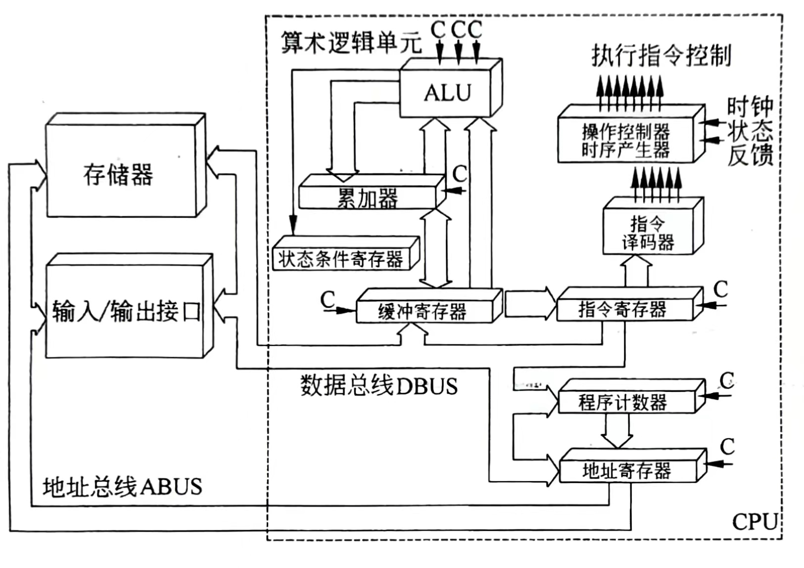
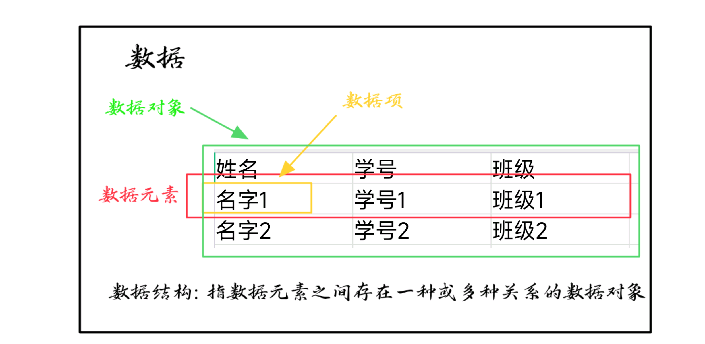
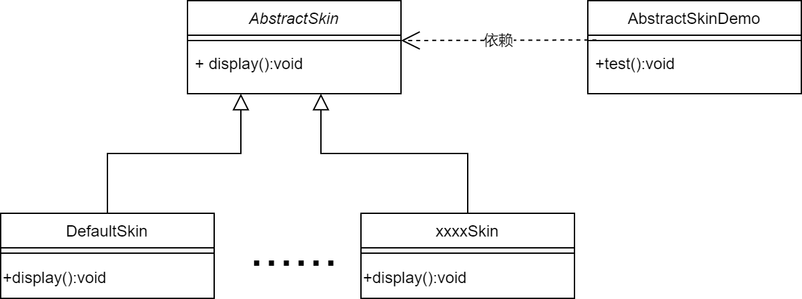
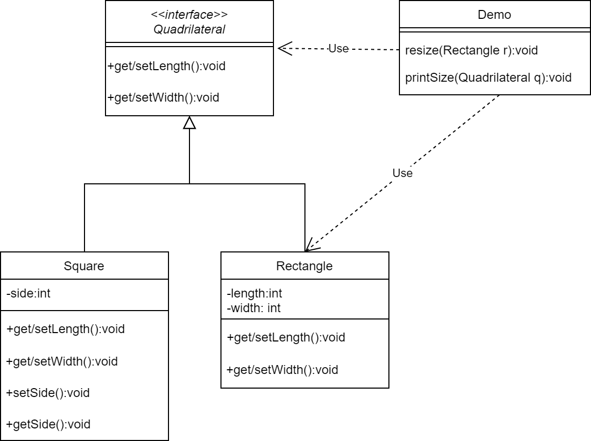
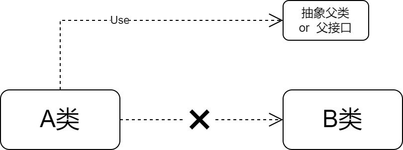
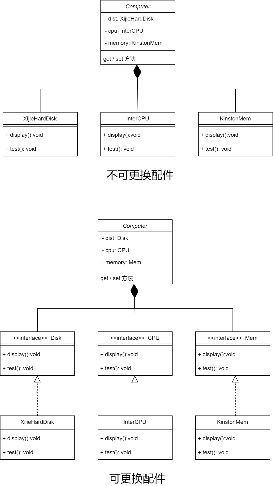
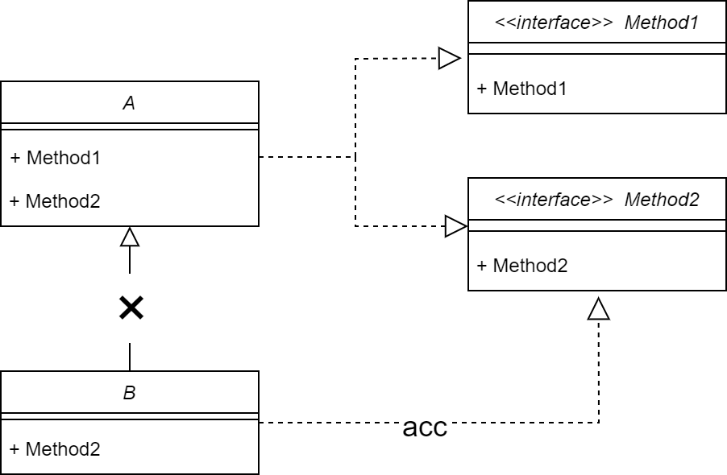
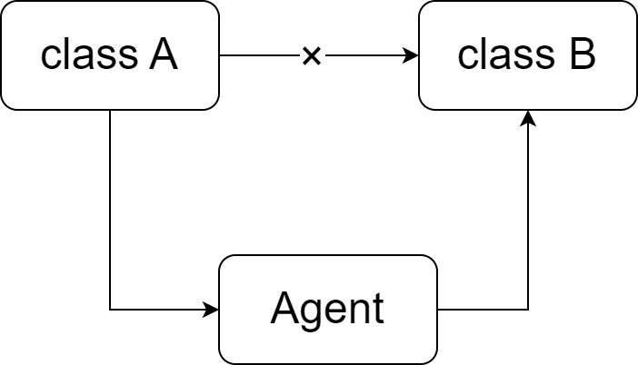

  **现在是2024年的2月13日，一月份购置了《软件设计师教程》一书，想着单单看着总会遗忘很多知识点，于是有了这一篇文章。原本的打算是做成零碎的文章，但零碎的知识点于平时别的碎碎念会产生混乱，于是今日将他们整合到一起，同时将之前写过的相关内容一并放于此地。这一篇文章会慢慢更新，逐步完善下去，希望不会再次发生弃坑的恶习吧~** 

[TOC]


<!-- more -->

# 计算机系统硬件的基本组成

​		计算机系统是由 **软件和硬件** 构成的。硬件系统由 **运算器、控制器、存储器、输入设备、输出设备** 五大部件组成。运算器、控制器等部件被集成在一起统称为**中央处理单元 Central Processing Unit** 。输入和输出设备合称为**外部设备**。存储器分为内部存储器和外部存储器，**内部存储器 **速度高、容量小，一般用于**临时**存放程序、数据及中间结果，**外部存储器 **速度慢、容量大，**长期**保存程序和数据。


## 中央处理单元

​		中央处理单元 **CPU** 是计算机系统的核心不见，它负责 **获取** 程序指令、对指令进行 **译码** 并进行 **处理** 。

### CPU的功能

- **程序控制** ：控制程序执行的 **顺序** 
- **操作控制** ：发出 **操作信号** 至对应部件并使对应部件执行程序
- **时间控制** ：控制操作信号的 **出现** 时间、**保持** 时间和出现的 **时间顺序**
- **数据处理** ：算术和 **逻辑运算**
- **中断(异常)响应** 

### CPU的组成

​		CPU主要由 **运算器** 、 **控制器** 、 **寄存器组** 和 **内部总线** 等部件组成。



### 运算器

​		运算器由 **算术逻辑单元**(Arithmetic and Logic Unit, **ALU**)、**累加寄存器**、**数据缓冲寄存器** 和 **状态条件寄存** 等组成。它是数据加工处理部件，用于完成计算机的各种算术和逻辑运算。

- **算术逻辑单元 ALU**			处理数据
- **累加寄存器 AC**                  提供工作区，存放结果
- **数据缓冲寄存器 DR**          数据暂存，速度缓冲，单AC结构兼做操作数寄存器
- **状态条件寄存器 PSW**       保存状态标志和控制标志

### 控制器

​		保证程序正确执行，且能够处理异常事件。一般包括指 **令控制逻辑** ， **时序控制逻辑** ， **总线控制逻辑** 和 **终端控制逻辑** 几个部分。

​		指令控制逻辑要完成取指令、分析指令和执行指令的操作，其过程分为**取指令、指令译码、按指令操作码执行、形成下一条指令地址** 等步骤。

- **指令寄存器 IR**                     指令暂存，指令从内存中取出放入DR中，再从DR通过总线到达IR。
- **程序计数器 PC**                    寄存信息、计数，指向下一条地址
- **地址寄存器 AR**                    保存当前访问的指令
- **指令译码器 ID**                     分析解释操作码字段，发出控制信号 

## 多核CPU

核心，又称内核，使CPU最重要的组成部分。CPU所有的 **计算、接收/存储命令、处理数据** 都由 **核心** 执行。


单核多线程CPU是 **交替地转换执行** 多个任务。多核在理论上则是在 **任何时间内** 每个核执行各自的任务，不存在交替问题。因此多核速度更快。注：采用了 **Intel超线程技术** 的单核可以视为是双核，但 **比不上** 实际双核的性能。

## 数据表示

仅在数值为 **负** 时，各种码的相互转换 **如下图** 。当数值为 **正** 时各码 **相同** 。


数值0的原码表示有两种形式：$[+0]_原=0 0000000$ ，$[-0]_原=1 0000000$ 

浮点数表示时采用 **IEEE754** 标准，$N = 2^E \times F$ , E为解码，F为尾数。浮点数所能表示的 **数值范围** 由 **阶码** 决定，所表示数值的 **精度** 则是由 **尾数** 决定。为了充分利用尾数来表示更多的有效数字，通常采用 **规格化浮点数** 。将尾数的绝对值限定在区间[0.5,1]。

IEEE754标准，一般单精度浮点个参数需牢记

| 数符 S（1位） | 阶码 E （8位） | 尾数 M （23位） |
| :-----------: | :------------: | :-------------: |

|       参数       |     单精度浮点      |      双精度浮点       |      扩充精度浮点       |
| :--------------: | :-----------------: | :-------------------: | :---------------------: |
|    浮点数字长    |         32          |          64           |           80            |
|    尾数长度P     |         23          |          52           |           64            |
|     符号位S      |          1          |           1           |            1            |
|    指数长度E     |          8          |          11           |           15            |
|     最大指数     |        +127         |         +1023         |         +16383          |
|     最小指数     |        -126         |         -1022         |         -16383          |
|    指数偏移量    |        +127         |         +1023         |         +16383          |
| 可表示的实数范围 | $10^{-38}-10^{+38}$ | $10^{-308}-10^{+308}$ | $10^{-4932}-10^{+4932}$ |

IEE754对阶码采用偏移量表示，**单精度浮点数** 偏移值为 **127** ，双精度浮点数的偏移值为1023，临时浮点数的偏移值为16383。计算阶码时需要在 **阶数的原码上加上偏移量**，以单精度浮点数为例阶数为7，则$[7]_原$ = 0000 0111 ，阶码为 $[7]_原+[偏移量]_原$= 0000 0111 + 0111 1111 = 1000 0110

- **规格化的值** ：阶码部分的二进制值不全为0或1。表示的是规格化的值。
- **非规格化的值** ：当阶码部分的二进制全为0时，所表示的数是非规格化的。表示数值0，或是哪些非常接近0的数
- **特殊值** ：当阶码部分的二进制权威1时，符号位为0表示正无穷，为1表示负无穷

## 校验码

- **合法编码** ：用于传送数据。
- **错误编码** ：不允许在数据中出现的编码。
- **码距** ： 任意两个合法编码之间至少有多少个二进制位不同。

### 奇偶校验码

**奇偶校验 Parity Codes**  ，通过在编码中加入一位校验位来使编码中的 **1的个数为奇数** (奇校验)，或者使**1的个数为偶数** (偶校验)

|   数据    |       偶校验编码C       |      奇校验编码C       |
| :-------: | :---------------------: | :--------------------: |
| 1010 1010 | 1010 1010 0   (偶数个1) | 1010 1010 1  (奇数个1) |
| 0101 0100 |       0101 0100 1       |      0101 0100 0       |
| 0111 1111 |       0111 1111 1       |      0111 1111 0       |
| 1111 1111 |       1111 1111 0       |      1111 1111 1       |

### 海明码

**海明码 Hamming Code**  在数据为之间的特定位置上插入k个校验码，通过扩大码距来实现检错和纠错。假设k个校验位为 $P_k,P_{k-1},...,P_1$，n个数据位为 $D_{n-1},D_{n-2},...,D_{0}$ ,对应的海明码为 $H_{k+n} ... ,H_1$

- $P_i$ 在海明码的第 $2^{i-1}$ 位置，数据位则依序从低到高占据海明码的剩余位置
- 海明码中的任何一位都是由若干个校验位来校验的。其对应关系如下：被校验的海明位的下标等于所有参与校验该位的校验位的下标之和，而校验位由自身校验。

|   海明码   | 海明码的下标 |   校验位组    |
| :--------: | :----------: | :-----------: |
| $H_1(P_1)$ |      1       |     $P_1$     |
| $H_2(P_2)$ |      2       |     $P_2$     |
| $H_3(D_0)$ |    3=1+2     |  $P_1,$$P_2$  |
| $H_4(P_3)$ |      4       |     $P_3$     |
| $H_5(D_1)$ |    5=1+4     |   $P_1,P_3$   |
| $H_6(D_2)$ |    6=2+4     |   $P_2,P_3$   |
| $H_7(D_3)$ |   7=1+2+4    | $P_1,P_2,P_3$ |
| $H_8(P_4)$ |      8       |     $P_8$     |

其中校验位的生成由校验位组的异或和决定：

$P_1 = D_0\oplus D_1 \oplus D_3$

$P_2 = D_0\oplus D_2\oplus D_3$

$P_3 = D_1\oplus D_2 \oplus D_3$

### 循环冗余校验码

**循环冗余校验码 Cyclic Redundancy Check**  广泛应用于**数据通信**领域和磁介质存储系统中。利用生成多项式为k个数据为产生r个校验位来进行编码。左边信息码k位，右边校验码n-k位。故又称(n,k)码。

# 数据结构

- **数据：**  所有能被 **输入到计算机** 中，且能 **被计算机处理** 的符号的集合，是计算机操作对象的总称
- **数据元素：** 数据中的一个个体，通常作为一个整体考虑和处理。也被称为元素、结点、记录。
- **数据项：** 具有 **独立含义** 的最小标识单位，也称字段或域。
- **数据对象**： 具有 **相同特性** 的元素的集合。
- **数据结构： ** 指以某种内在联系将数据元素组成一个数据对象。



## 基本形式

$$
Data\_Structure = (D,R)  \\    
其中D为数据元素的有限集合，R为D上关系的有限集
$$

## 基本结构

- 集合结构：元素关系松散
- 线性结构：元素之间有 **一对一关系**
- 树形结构：元素之间有 **一对多关系**
- 图形结构：元素之间有 **多对多关系**

- **逻辑结构**：是对数据元素之间存在的逻辑关系的描述。

- **物理结构**：又称存储结构，是指在计算机中的表示和实现。	
  - 顺序存储
  - 链式存储
  - 索引存储
  - 哈希存储

## 抽象数据类型

抽象数据类型（ADT）是指一个数学模型以及定义在该模型上的一组操作。通常如下表示：

```
ADT 抽象数据类型名{
	数据对象：数据对象的定义
	数据关系：数据关系的定义
	基本操作：基本操作的定义
}
```

## 算法

算法是一个有穷的规则集合，这些规则为解决某一特定任务规定了一个 **运算序列** 。简单来说算法是解题的步骤。

### 算法描述方法

- 自然语言：英语、汉语、日语等自然演化的语言
- 程序设计语言
- 流程图：传统流程图或者N-S结构图
- 伪语言：伪代码，介于自然语言与程序设计语言之间。
- PAD图：问题分析图，较为新颖，可以深入了解

### 特性

- 有穷性：必须在有穷步之后正常结束
- 确定性：每一步必须有确切的定义，无二义性
- 可行性：每一条指令确实可行
- 输入：零个或多个
- 输出：一个或多个

### 算法分析

所需要的时间却决于下列因素：

- 硬件速度
- 书写的程序语言：实现语言越高级，执行效率越低
- 编译程序所生成目标代码的质量
- 问题规模

### 空间复杂度

指程序运行从开始到结束所需的存储量。包括两部分

- 固定部分：主要包括程序代码、常量、简单变量、定长成分和结构变量所占空间
- 可变部分：与算法在某次执行中处理的特定数据的大小和规模有关

### 时间复杂度

指程序运行从开始到结束所需要的时间。针对算法中语句执行次数做出估计。首先计算算法语句对应的语句频度，以下列c语言代码为例：

```c
for(i=0;i<n;i++){								n
    for(j=0;j<n;j++){							n^2
        c[i][j]=0;								n^2
        for(k=0;k<n;k++){						n^3
            c[i][j]=1;							n^3
        }
    }
}
```

总执行次数为
$$
T(n)=2n^3+2n^2+n
\\
算法的时间复杂度记为：T(n)=O(f(n))
$$
我们仅用最大次数表示算法的时间复杂度，即上文的代码时间复杂度为$T(n)=O(n^3)$

**常用的世间法咋读频次计数**：常数型$O(1))$ ，线性型$O(n)$ ，平方型$O(n^2)$ ，立方型$O(n^3)$ ，指数型$O(2^n)$ ，对数型$O(\log _2 n)$ ，二维型$O(n\log _2 n)$ 。

## 基本算法策略

### 穷举法

穷举法，或称枚举法、暴力破解法，是一种针对密码的破译方法，即将密码进行逐个推演指导找出真正的密码为止。

应用：求质数、百钱买百鸡

### 递推法与迭代法

递推是计算机数值计算中对的一个重要算法，将复杂的运算划分为可以重复操作的若干个简单运算。

典型应用：Fibonacci

### 分治法

将一个难以直接解决的大问题，**分割** 成一些规模较小的相同问题，以便各个击破。适用于规模缩小到一定程度可以解决、具有最优子结构性质、子问题的解可以合并为该问题的解、子问题相互独立的问题中。下面介绍分治法的步骤：

在每一层递归上都有三个步骤

- 分解：将原问题分解为若干个规模较小，相互独立，与原问题形式相同的子问题
- 解决：若子问题规模较小而容易被解决则直接解，否则再继续分解为更小的子问题
- 合并：将已经求解的子问题的解逐步合并为原问题的解

### 贪心算法

不追求最优解，只希望得到较为满意解的方法。一般可以快速得到满意的答案。常以当前情况为基础作最优选择，而不考虑各种可能的整体情况，所以贪心算法不需要回溯

### 动态规划

引入一个数组，不管他们是否对最终解有用，把所有子问题的解存放于该数组中。基本思想为：把求解的问题分成许多阶段或者子问题，然后按照顺序求解各阶段或子问题，记录每个阶段决策得到的觉果序列。最后阶段的解就是初始问题的解。

**适用问题：**最优子结构(必须有)，无后向性，子问题重叠性质

# 编译原理

## 词法分析/扫描(Scanning)

从左向右逐行扫描源程序的字符，识别出各个单词，确定 **单词的类型** 。将识别出的单词转换成统一的 **机内表示** ， 词法单元(token)形式：

```
token:<种别码, 属性值>
```

| 单词类型 | 种别                      | 种别码        |
| -------- | ------------------------- | ------------- |
| 关键字   | program, if , else...     | 一词一码      |
| 标识符   | 变量名，数组名，记录名... | 多词一码      |
| 常量     | 整型，浮点型，字符型...   | 一型一码      |
| 运算符   | 算术、关系、逻辑          | 一词\一型一码 |
| 界限符   | ; ( ) = { } ...           | 一词一码      |

## 语法分析( parsing)

**语法分析器** (parsing) 从此法分析器输出的token序列中 **识别出各类短语** ，并构造**语法分析树**。

```
position = initial + rate * 6;
<id, position> <=> <id,initial> <+> <id, rate> <*> <num,60><;>
```

## 语义分析

- **收集标识符的属性信息**

  - 种属 (kind)

  - 类型 (type)

  - 存储位置，长度

  - 值

  - 作用域

  - 参数和返回值信息

- **语义检查**

  - 变量或过程未经声明就使用
  - 变量或过程名重复声明
  - 运算分量类型不匹配
  - 操作符与操作数之间的类型不匹配
    - 数组下标不是证书
    - 对非数组变量使用数组访问操作符
    - 对非过程名使用过程调用操作符
    - 过程调用的参数类型或数目不匹配
    - 函数返回类型不匹配

## 中间代码生成

- **三地址码** (Three-address Code)
  - 三地址码由类似汇编语言的指令序列组成，每个指令最多有三个操作数
- **语法结构树/语法树** (Syntax Trees)

## 目标代码生成

- 目标代码生成以源程序的**中间表示形式**作为输入，并把它映射到**目标语言**
- 目标代码生成的一个重要人物是为程序中使用的变量 **合理分配寄存器**

## 代码优化

- 为改进代码所进行的 **等价程序变换** ，使其 **运行得更快** ， **占用空间更少** 。

# 语言和文法

## 字母表(Alphabet)

- 字母表$\Sigma$ 是一个**有穷符号集合**
- 字母表的 **乘积** ： $\Sigma_1 \Sigma_2 = \{ab|a\in\Sigma_1,b\in \Sigma_2\}$
- 字母表的 **n次幂** :  $\Sigma^n = \Sigma^{n-1}\Sigma$
- 字母表的 **正闭包** :  $\Sigma^+ = \Sigma^1U\Sigma^2U\Sigma^3...$
- 字母表的 **克林闭包** :  $\Sigma^* = \Sigma^0 U \Sigma^+$

## 串(String)

- 串是字母表中 **符号的** 一个  **有穷序列**
- 串s的 **长度** 通常记作 **|s|** ,指其中符号的个数
- **空串** 是长度为0的串，用 $\epsilon$ 表示
- **串的连接** ： x = dog , y= house , xy = doghouse
- **串的幂运算** ：若s = ba, 有 $s^1=ba, s^2=baba, s^3=bababa...$

## 文法

$$
G=(V_T,V_N,P,S)
$$

- $V_T：$ **终结符集合** ， 终结符(terminal symbol) 是文法所定义的语言的 **基本符号** ，有时也称为token
- $V_N：$ **非终结符集合** ，非终结符(nonterminal) 是用来表示语法成分的符号，也称语法变量

- $P：$ **产生式集合**，产生式(production) 描述了将终结符和非终结符组合成串的方法
  - 一般形式：$\alpha$->$\beta$ 
  - 产生式的简写：对一组有相同 **左部** 的产生式可以简记为：$\alpha$ -> $\beta_1 | \beta_2 | \beta_3...$ ,右部可称为 $\alpha$ 的**候选式**
- $S：$ **开始符号**
- **推导(Derivations)和归约(Reductions)** 
  - **推导：** 用产生式的左部替换产生式的左部
  - **归约：** 推导的逆运算
- **文法分类：**
  - **0型文法：** 无限制文法，左部至少包含一个非终结符
  - **1型文法：** 上下文有关文法，左部符号的个数不准多于右部符号。不包含空产生式
  - **2型文法：** 上下文无关文法，左部不能出现终结符
  - **3型文法：** 正则文法(RG)
    - 右线性文法: $A$->$w B$ 或 $A$->$w$
    - 左线性文法: $A$->$B w$ 或 $A$->$w$

# 设计原则

为了提高软件的可维护性、可复用性，增加软件的可扩展性和灵活性，在面向对象编程的过程中我们需要遵守以下六条原则。

### 开闭原则

**定义：** 编写的代码需要对 **扩展开放** 对 **修改关闭** ，实现 **热插拔** 的效果。

例：在编写不同皮肤类的时候， **不能对抽象类进行修改** ，而是开放扩展功能，通过编写子类实现不同效果。



### 里氏代换原则

**定义：** 任何 **基类** 可以出现的地方， **子类** 一定可以出现。即，子类 **可以扩展** 父类功能，但 **不能改变** 原有的功能，尽量 **不重写** 父类的方法。 **多态频繁的程序出错的概率很大。**

例：正方形若直接继承长方形，则需要修改其父类的方法。正确的方式应该是将两者抽象出一个共同的接口，用于实现。



### 依赖倒转原则

**定义：** 高层模块 **不应该** 依赖低层模块，两者都应该 **都依赖其抽象** 。抽象不应该依赖于细节，**细节应该依赖抽象** 。

若A类是高层模块，B类是低层模块，那么他们应该有如下关系：



例：若要组装一个电脑类，若实现的是各个部件组合于此类，则会出现不能进行具体更改的情况，应该实现将他们的接口组合于此类的效果，再实现各个接口。



### 接口隔离原则

**定义：** 客户端不应该依赖于他不使用的方法。一个类对另一个类的依赖应该建立在最小的接口上。

列：若B类想要实现A类中的方法2，则不应该继承A类，而是实现方法2的接口。



### 迪米特法则

**定义：** 又称 **最少知识法则**，*Talk only to your immediate friends and not to strangers.* 如果两个软件实体 **无需通信** ，那么就 **不应当** 发生直接的相互调用，可通过 **第三方转发调用** 。（降低耦合）

**friend:** 当前对象 **本身** ，当前对象的 **成员对象** ，当前对象 **所建的对象** ，当前对象的 **方法参数** 。  



### 合成复用原则

**定义：** 尽量先使用组合或聚合等关联关系实现某一个实例，其次才考虑继承。通常类的复用分为 **继承复用** 和 **合成复用**

- **继承复用：** 简单、易实例化
  - 破坏类的封装性
  - 子类与父类的耦合度高
  - 限制复用的灵活性
- **组合/聚合复用：** 将已有对象进行组合
  - 维护了类的封装性
  - 子类父类低耦合
  - 灵活性得到了保证
