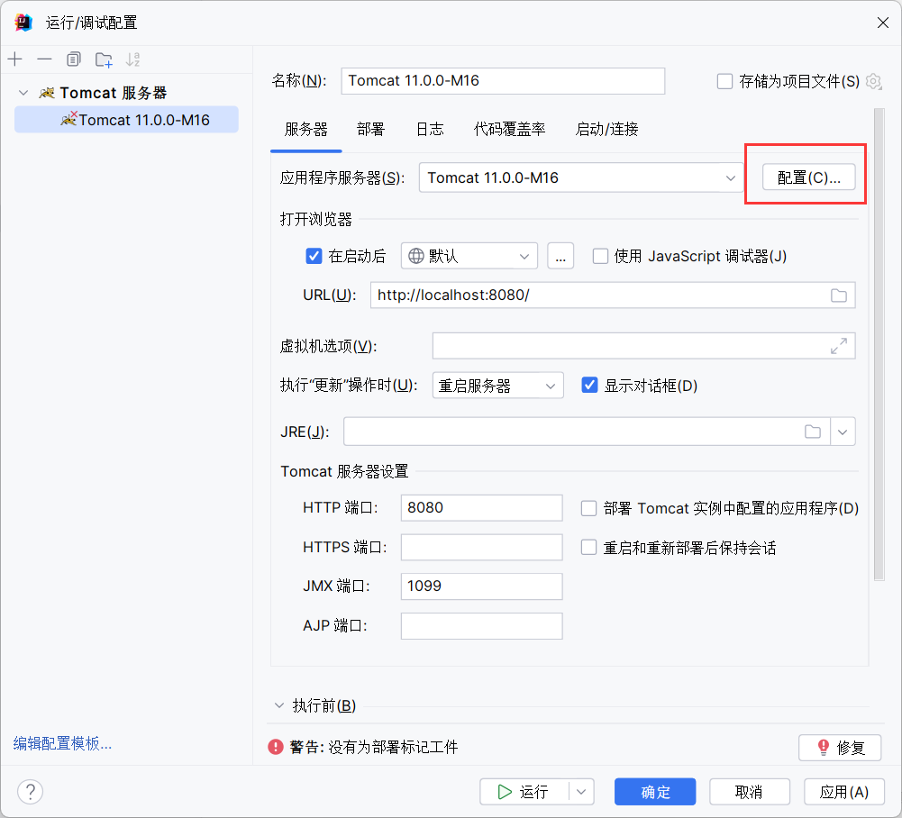

#  起因 

在学习javaEE课程之处，需要安装搭建相关的javaEE环境，过程中遇到许多困难，本文记录一下正确安装并运行的过程。以及项目创建的过程，为java web入门环境安装提供思路。

## Tomcat 安装

安装途径： 1. 钉钉群中的免安装版  2. 官网下载 [Apache Tomcat® - Welcome!](https://tomcat.apache.org/)

无论是哪种方式下载，都需要检查环境配置，**方法**：资源管理器中右键 **此电脑** —>**属性** —> **高级环境配置**—> **环境变量**


### CATALINA_HOME

观察系统变量中是否存在CATALINA_HOME，若无请添加：新建->变量名->变量值

==此处的变量值为tomcat的根目录==


添加（此处需要设置自己的目录）：


### bin&lib

随后进入path目录，观察是否有%CATALINA_HOME%\bin和\lib，无前者一般均无此处的path


若无，请添加，此处的变量和我一致


### 配置完成

win+r 打开cmd，在终端中输入startup，出现


并开始执行程序说明配置完成了，可以在浏览器中输入**localhost:8080** 或 **127.0.0.1:8080** 进行查看(默认8080端口)。


## IDEA创建web项目

### 一、新建项目

由于idea自带maven，我们可以在创建的时候直接选择maven项目


### 二、创建web模块

我们需要创建一个web模块，右键项目，打开模块配置


我们需要在新建的项目中添加web模块


**注意： 为了接下来项目结构不至于混乱，使用默认的路径即可 **  个人认为直接放置于项目下即可，浏览前端代码也方便，若是前端使用框架开发，如vue则无需新增web模块。


### 三、创建工件

然后我们需要在工件中，创建一个web应用程序：展开型工件，用于在idea中运行时生成war包


### 四、观察项目结构

若项目结构实在混乱，可参考我的项目结构


## 配置编译环境

运行tomcat，我们需要配置tomcat的编译环境


基本上都会自动查询到应用程序服务器，若无，请单机配置idea会根据环境变量查找到tomcat的位置



在部署中添加刚刚创建的工件


### 配置完成

我们在web下创建一个index.html做测试（war包会自动访问到内部的index文件，即首页，这里使用index.html是为了方便观察）


单机运行，会自动弹出页面


### MAVEN打包

在pom.xml中添加

```
<packaging>war</packaging>
```

注意需要放在项目前面，推荐下图的位置。

注：每次操作完maven记得更新配置(即下图另一红框)


在整个idea的右边选择这个"m"，clean是清除之前生成的文件，在打包前可以清理一下。


选择打包则可以生成一个target目录，内含一个本项目的war包

此处的clean和package均双击就可运行


### TOMCAT下运行war

以刚刚打包的war为例，将war移动到tomcat的webapps下


我们将war包的名称修改，方便等一下浏览。


启动tomcat


在浏览器中输入localhost:8080/项目名称（即刚刚重命名的web，注意这里的.war省略）


.war省略的原因为：tomcat在运行后会自动解压war包，生成一个web目录，实质上访问的是该目录。

值得注意的是：在tomcat运行的时候千万不要去删除war包，会使的解压的目录一并被清除

如果你的项目中未设定index，按照上文进行会出现404的情况，千万不要着急，在$localhost:8080/项目名称$ 后跟上$/你的文件名$即可

例：

```
localhost:8080/web/test.html
```

## MAVEN项目添加依赖

工具网站：[Maven Repository: Search/Browse/Explore (mvnrepository.com)](https://mvnrepository.com/)

此网站用于添加依赖，请各位添加到收藏夹中

我们首先需要在pom.xml中添加条目，用于存放依赖


### JUNIT

JUnit 是一个编写可重复测试的简单框架。它是单元测试框架的 xUnit 架构的一个实例。

相关的详细介绍：[详解介绍JUnit单元测试框架（完整版）_junit整体框架详细介绍-CSDN博客](https://blog.csdn.net/qq_26295547/article/details/83145642)


单机需要的版本


将代码复制到pom.xml中


这边给出5.10.2的依赖

```
<!-- https://mvnrepository.com/artifact/org.junit.jupiter/junit-jupiter-api -->
        <dependency>
            <groupId>org.junit.jupiter</groupId>
            <artifactId>junit-jupiter-api</artifactId>
            <version>5.10.2</version>
            <scope>test</scope>
        </dependency>
```

### SERVLET

Java Servlet 是运行在 Web 服务器或应用服务器上的程序，它是作为来自 Web 浏览器或其他 HTTP 客户端的请求和 HTTP 服务器上的数据库或应用程序之间的中间层。

相关介绍：[Servlet 简介 | 菜鸟教程 (runoob.com)](https://www.runoob.com/servlet/servlet-intro.html)


servlet需要和tomcat的版本匹配，可以在tomcat的lib中的jar中看到对应的版本匹配。也可以在官方对应的表格中看到需要添加的servlet依赖。


同样在Maven Repository中搜素servlet，并将代码添加到依赖中


这边给出tomcat9对应的servlet的引用代码

```XML
<!-- https://mvnrepository.com/artifact/javax.servlet/javax.servlet-api -->
<dependency>
    <groupId>javax.servlet</groupId>
    <artifactId>javax.servlet-api</artifactId>
    <version>4.0.1</version>
    <scope>provided</scope>
</dependency>
```

