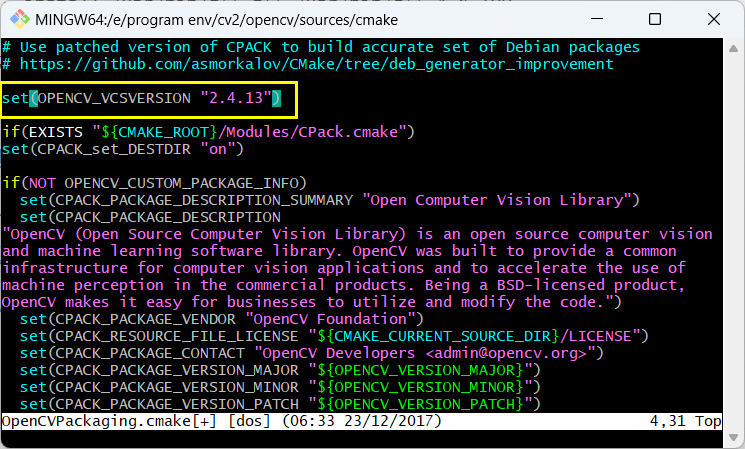

##  起因

在阅读论文时许多论文都提到了 Fornaciari 的椭圆检测方法。找到原文以及论文的代码（C++），原码的README中提到推荐在安装opencv2.4.13版本运行，之前使用opencv均是在python或是java（尝试过）上使用，没有接触过C++，记录一下安装过程，为需要在ubuntu24.04版本下安装旧版opencv提供思路。

<!-- more -->

## 下载opencv原码

windows下官方提供了编译后的文件，可以直接配置环境变量使用，但是论文的原码在linux系统上实现有许多函数windows下无法使用。   相关资料： [2023年最全 Windows + VSCode 配置 OpenCV C++ 一站式开发调试环境教程 - 知乎 (zhihu.com)](https://zhuanlan.zhihu.com/p/599002329)

我们首先下载opencv2.4.13的原码：[OpenCV官网](https://opencv.org/releases/)


在家目录创建一个cv2文件夹，将压缩包解压。

## 环境配置

安装opencv之前需要安装一些依赖库

```
sudo apt-get install build-essential 
sudo apt-get install cmake git libgtk2.0-dev pkg-config libavcodec-dev libavformat-dev libswscale-dev
```

如果遇到一些报错，可以根据**报错信息**在互联网上寻觅一下解决办法，**再次多提一嘴，报错信息真的至关重要！！！** 我在看一些博客安装教程时遇到了需要安装 libpng12.0-dev库的建议，而我安装时遇到了问题，提示找不到库，根据互联网上的提示，新版的ubuntu去除了本库，可以使用libpng-dev代替。上文的代码块也没有放入libpng12.0-dev。

安装编译工具

```
sudo apt install -y g++
sudo apt install -y cmake
sudo apt install -y cmake-gui
sudo apt install -y make
sudo apt install -y wget unzip
sudo apt-get install pkg-config
```

如果熟悉cmake命令行操作，可以不安装cmake-gui，使用指令编译：

```
sudo cmake -D CMAKE_BUILD_TYPE=Release -D CMAKE_INSTALL_PREFIX=/usr/local ..
```

但是我在直接编译时候遇到了问题，根据提示在安装cuda和ffmpeg遇到了问题，我在gui中将两个去除勾选才编译成功


## Gcc/G++版本问题

无法直接通过现有的教程在ubuntu24.04上编译opencv2.4.13，专门研究c++的同学提示我跟g++的版本有关系，我才注意到并成功编译。

ubuntu24.04的gcc和g++的默认版本是13，可以通过指令进行查看版本

```
gcc --version
g++ --version
```

根据笔者的测试，opencv2.4.13可以在gcc/g++ 4.8的环境中编译起来，安装4.8：

```
sudo add-apt-repository ppa:ubuntu-toolchain-r/test  
sudo apt-get update  
sudo apt-get install gcc-4.8   
sudo apt-get install g++-4.8  
```

为每个版本配置替代版本，并将优先级与之关联，系统默认版本为优先级最高的版本。

```
sudo update-alternatives --install /usr/bin/gcc gcc /usr/bin/gcc-13 90
sudo update-alternatives --install /usr/bin/g++ g++ /usr/bin/g++-13 90

sudo update-alternatives --install /usr/bin/gcc gcc /usr/bin/gcc-4.8 100
sudo update-alternatives --install /usr/bin/g++ g++ /usr/bin/g++-4.8 100
```

再次查看gcc/g++版本，若更改成功则继续，若不成功则再次停止，查看是否是版本切换的问题

多版本安装/切换参考博客：

[【Linux】Ubuntu系统下安装与切换多版本gcc/g++_ubuntu 配置指定版本gcc环境-CSDN博客](https://blog.csdn.net/tangjiahao10/article/details/125501412)

[Ubuntu如何优雅地切换gcc版本（编译“现代C++”程序）_ubuntu切换gcc版本-CSDN博客](https://blog.csdn.net/L_Y_Fei/article/details/103405260)

[ubuntu之gcc、g++版本管理 - 知乎 (zhihu.com)](https://zhuanlan.zhihu.com/p/434686328)

[Ubuntu安装与切换多个版本gcc、g++ - 知乎 (zhihu.com)](https://zhuanlan.zhihu.com/p/555635813)


## 修改cmake文件

在此用git bash展示（没有用ubuntu机器写这篇文章）

使用vim，或者直接编辑，在 cmake/OpenCVPackaging.cmake文件最前面加上

```
set(OPENCV_VCSVERSION "2.4.13")
```



参考 ： [Ubuntu18.04 + OpenCv 2.4.13安装（亲测有效，内含踩坑解决方案）_opencv2.4.13安装-CSDN博客](https://blog.csdn.net/whstudio123/article/details/121732606)


## 编译开始

说了这么多，我们终于要开始编译opencv2.4.13了

```
cd opencv-2.4.13
mkdir build
cd build
cmake-gui ..
```

gui内操作：

- 点击config 选择unix makefile
- 会出现大片红色，不要惊慌，取消勾选with_cuda和with_ffepng
- 再次点击config
- 点击generate

生成完毕后在终端输入

```
make -j20    //建议先看一下自己的线程数，不知道的可以直接make
sudo make install 
```

笔者在编译完成后过于激动忘记install，在编译论文代码时寄了，想了一晚上才想起来忘了install。。。

## 编译过程中会遇到的问题

**<sys/sysctl.h> not found**

opencv-2.4.13/modules/core/src/parallel.cpp:60:18: fatal error: sys/sysctl.h: No such file or directory
         #include <sys/sysctl.h>
                  ^~~~~~~~~~~~~~
compilation terminated.
make[2]: *** [modules/core/CMakeFiles/opencv_core.dir/build.make:370: modules/core/CMakeFiles/opencv_core.dir/src/parallel.cpp.o] Error 1

**解决：** 新版本Linux 系统删除了sys/sysctl.h了，经过测试，直接将报错的文件内的 #include <sys/sysctl.h>注释掉即可，

笔者编译时遇到了三个需要注释掉include的文件。


## 配置opencv

```
sudo gedit /etc/ld.so.conf.d/opencv.conf
末尾加入/usr/local/lib，保存退出
sudo ldconfig    使配置生效

sudo gedit /etc/bash.bashrc 
末尾加入
PKG_CONFIG_PATH=$PKG_CONFIG_PATH:/usr/local/lib/pkgconfig
export PKG_CONFIG_PATH
保存退出
sudo source /etc/bash.bashrc  #使配置生效
（该步骤可能会报错找不到命令，原因是source为root命令
su（进入root权限）
输入密码
source /etc/bash.bashrc
Ctrl+d（推迟root）
sudo updatedb #更新database
```

环境配置搞了挺久的有点乱，最终使用的是替换opencv.pc的方法，但是博客找不到了，尝试以下配置应该也可以运行。。。

[Ubuntu18.04 + OpenCv 2.4.13安装（亲测有效，内含踩坑解决方案）_opencv2.4.13安装-CSDN博客](https://blog.csdn.net/whstudio123/article/details/121732606)


## 测试是否成果

```
cd opencvPath/sample/c
```

opencv解压后有一个sample的文件夹存放了一些opencv使用的例子，可以用来学习研究，我们尝试编译c文件夹下的内容，看看环境是否ok

```
g++ 原码.cpp -o 输出文件 `pkg-config --cflags --libs opencv`
```


也可以通过以下代码查看opencv版本

```
pkg-config opencv --modversion
```

参考： [Ubuntu下查看自己安装的opencv版本号和路径以及使用cmake链接自己路径下的指定opencv版本_ubuntu cpp链接指定路径下opencv-CSDN博客](https://blog.csdn.net/wangmj_hdu/article/details/111507782)
