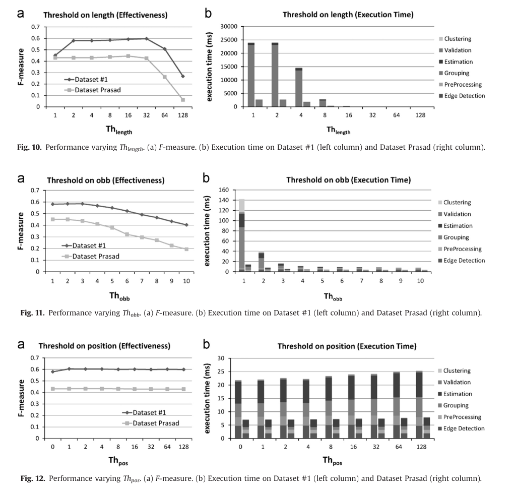

# 起因

在阅读完论文“A fast and effective ellipse detector for embedded vision applications”后尝试在ubuntu上运行论文代码。

论文：[A fast and effective ellipse detector for embedded vision applications](https://www.sciencedirect.com/science/article/abs/pii/S0031320314001976)

代码：[Fornaciari 方法源码 ](https://sourceforge.net/projects/yaed/)

# 前置工作

由于源代码是在opencv2.4.13环境下编写运行的，尝试了新版的opencv，好像出现了许多错误，我还是选择在ubuntu上配置2.4.13环境，在我的博客中已经写了安装oepncv2.4.13的环境，整个过程还是很艰辛的qwq.

# 编译代码

源码的内容如下图，其中我们只需要修改Main.cpp中的内容就可以将代码运行起来了


我们来看一下Main.cpp中有什么内容吧～

- SaveEllipses函数：保存椭圆

- LoadGT函数 ： 加载标注文件 gt(ground truth)
- Count函数 ： 计数，用在指标计算的时候
- Ealuate函数： 指标评价函数
- main 函数 ：程序入口

内置了三个方式检测椭圆：

- OnImage :  检测单张图片
- OnVideo :  检测视频文件
- OnDataset : 检测整个数据集

在此仅仅展示数据集上的用法，其余两种方式与本文要展示的方法相似。

# argc参数问题

如果要在数据集上检测，需要把main函数中前三行关于argc的操作注释掉，数据集的路径在代码中直接给出，无需在多加参数。

这是导致我编译老是失败的原因之一。


# 改写OnDataset函数

我们拿prasad数据集作测试，尝试复现论文中的prasad数据集相关指标，把数据集和代码放在同一目录下。

首先，我们修改工作目录和结果输出目录，即sWorkingDir 和 out_folder，采用了绝对路径的方式：

```c++
	string sWorkingDir = "/home/zfmx/code/fast_ellipse_detector/Prasad Images - Dataset Prasad/";
	string out_folder = "/home/zfmx/code/fast_ellipse_detector/result/"
```

接下来，设置一些检测时需要用到的阈值，论文中的4.2节介绍了相关的取值



这里采用论文推荐的阈值。

然后初始化检测器，进行椭圆检测，这几个步奏无需修改，我想看一下程序的运行时间，把代码中注释掉的运行时间部分恢复。


根据提示需要修改加载标注文件时的参数

```c++
LoadGT(gt, sWorkingDir + "gt/" + "gt_" + name_ext + ".txt", true); // Prasad is in radians,set to true
```

如果需要保存图像，或是查看检测效果图，恢复注释代码：

```c++
imwrite(out_folder + name + ".jpg", resultImage);
imshow("Yaed", resultImage);
waitKey();
```

由于最终展示的只有运行时间和F-meansure评分，但是代码中计算了Precision和recall，我在输出最终指标之前添加这两行代码，将precision和recall一起输出

```c++
cout << "meanPR : " << meanPR << endl;
cout << "meanRE : " << meanRE << endl;
```

# 编译代码

在main函数中只调用OnDataset函数即可。

由于我采用的是apt install 的 g++-4.8，在编译时，采用：

```
g++-4.8 Main.cpp EllipseDetectorYaed.cpp common.cpp -o ellipse_det -std=c++11 `pkg-config --cflags --libs opencv`
```

如果是其他方式安装的可以将-4.8去掉尝试编译。


可能会和我一样出现一些warning警告，但是依旧可以将代码编译起来。

# 运行

使用 ./ellipse_det （编译后生成的文件） 即可运行代码。


其中，红色的椭圆为绘制的标注椭圆，绿色的为检测出来的椭圆。最终参数F-measure : 0.4 左右和论文给出的数值差别不大。

至此，代码成功复现。


