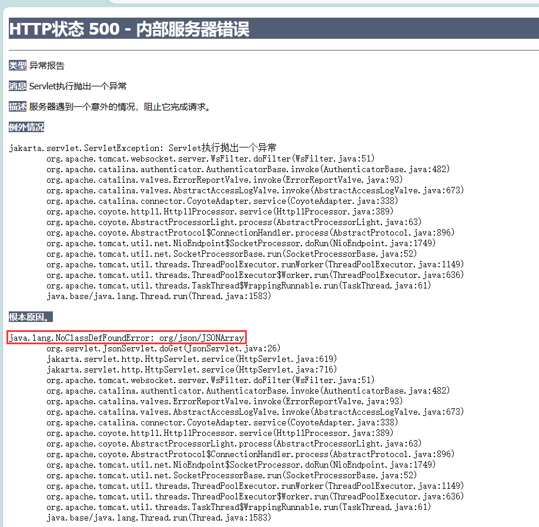
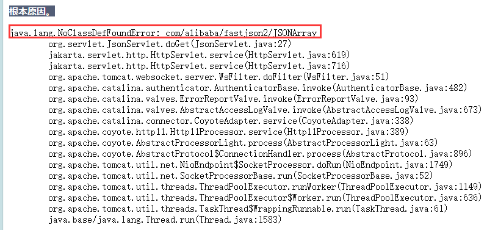
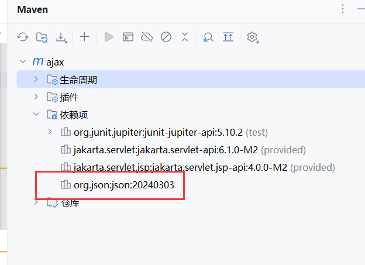
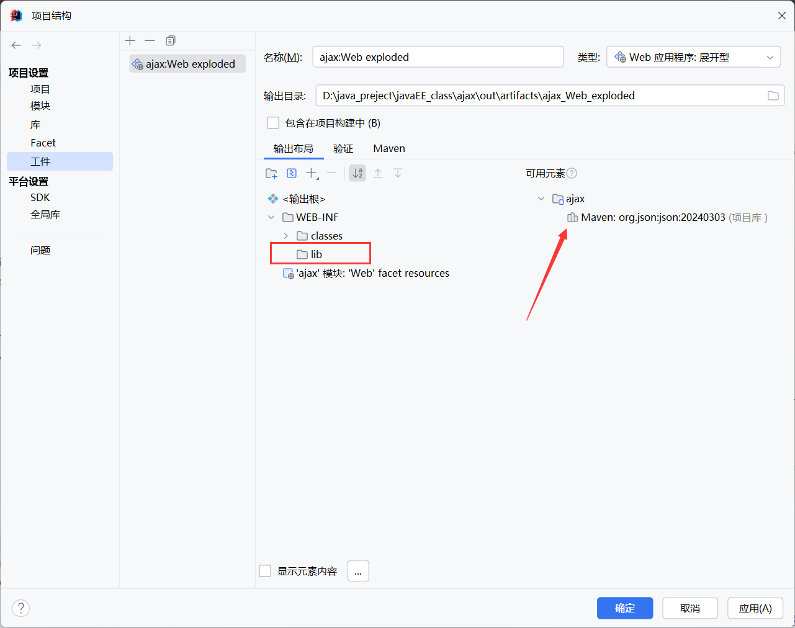
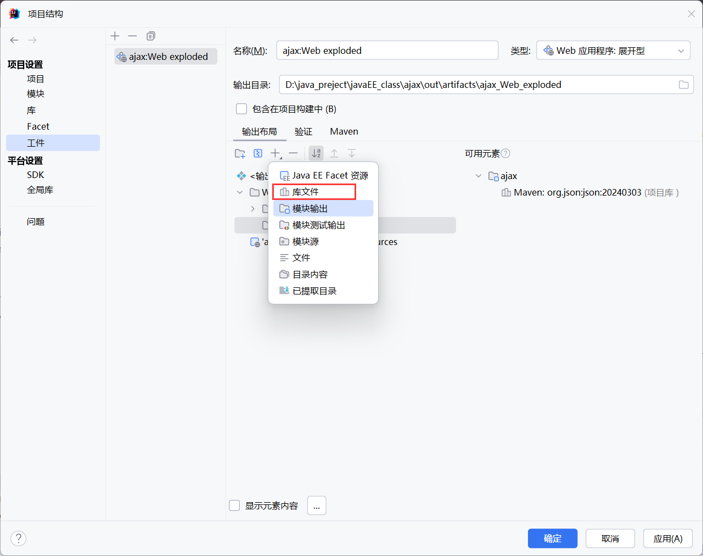
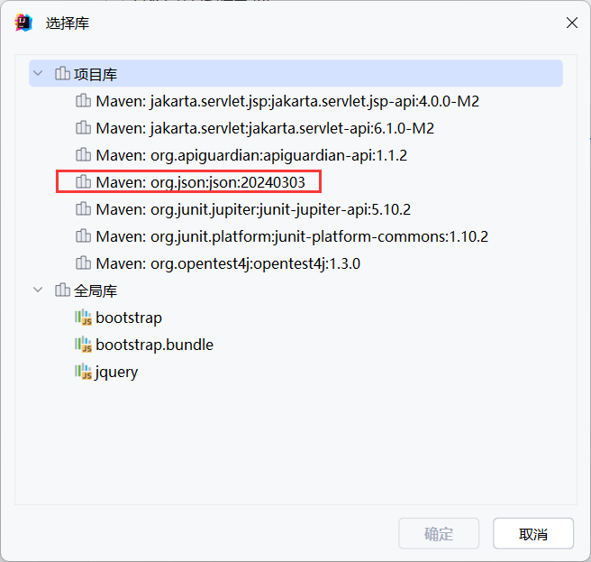
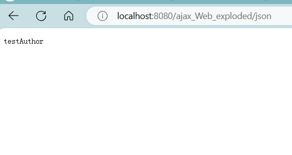

#  起因

在servlet中尝试使用json传输信息，但是在运行servlet时发生了500错误

​	报错信息：java.lang.NoClassDefFoundError: org/json/JSONArray



来看看我的servlet现在里面有啥吧

```java
@WebServlet("/json")
public class JsonServlet extends HttpServlet {
    private static final long serialVersionUID = 32232L;

    @Override
    protected void doGet(HttpServletRequest req, HttpServletResponse resp) throws ServletException,IOException {
        var list = new ArrayList<Book>();
        var testBook = new Book("testAuthor","testName",65.8);
        var testBook2 = new Book("testAuthor2","testName2",60.9);
        list.add(testBook);
        list.add(testBook2);

        JSONArray array = new JSONArray(list);
//
//        System.out.println(array);
        resp.getWriter().println(testBook.getName());
    }

    @Override
    protected void doPost(HttpServletRequest req, HttpServletResponse resp) throws ServletException, IOException {
        doGet(req, resp);
    }


}
```

**尝试了许久，最后发现引起500错误的语句居然是   JSONArray array = new JSONArray(list);**

# fastjson2

原本我在pom.xml文件中添加的依赖为org.json

```
<dependency>
    <groupId>org.json</groupId>
    <artifactId>json</artifactId>
    <version>20240303</version>
</dependency>
```

以为是这个库的问题，尝试更换一个库，采用阿里的fastjson2

```
<dependency>
    <groupId>com.alibaba.fastjson2</groupId>
    <artifactId>fastjson2</artifactId>
    <version>2.0.48</version>
</dependency>
```

再一次出现NoClassDefFoundError错误

****

更换依赖宣布失败


# 工件未导入


我又想为何会出现找不到类，这个类没有定义？难道是maven的问题，于是我又去查看了maven的依赖性是否包含了org.json



可以看到已经包含了，思路再次被打断了。

然后我在互联网上寻觅可能引起NoClassDefFoundError的原因，看到了这一篇博客：[java.lang.NoClassDefFoundError: com/alibaba/fastjson/JSONArray 解决方法-CSDN博客](https://blog.csdn.net/weixin_46822367/article/details/117529566)，他同我一样查看了maven的依赖性，但是他提出了工件中同样需要包含某些库的依赖，按照他提出的方法，我成功解决了500报错


# 解决过程

在工件的输出布局中新建一个lib文件夹存放依赖



可以看到idea自动展示了可用元素，org.json就在这里面，我们将这个库添加到lib中：





添加完后，尝试启动tomcat，浏览servlet:



没有500报错了！问题解决
