本文仅限于初次安装mysql，若此前已经安装过mysql，请参照此文卸载并安装新本的mysql。

参考博客：[MySQL 学习三：如何完全卸载掉本地 MySQL 数据库步骤小结-腾讯云开发者社区-腾讯云 ](https://cloud.tencent.com/developer/article/1795354) 

# 安装mysql

前往官网下载稳定版的mysql，官网：[MySQL](https://www.mysql.com/)

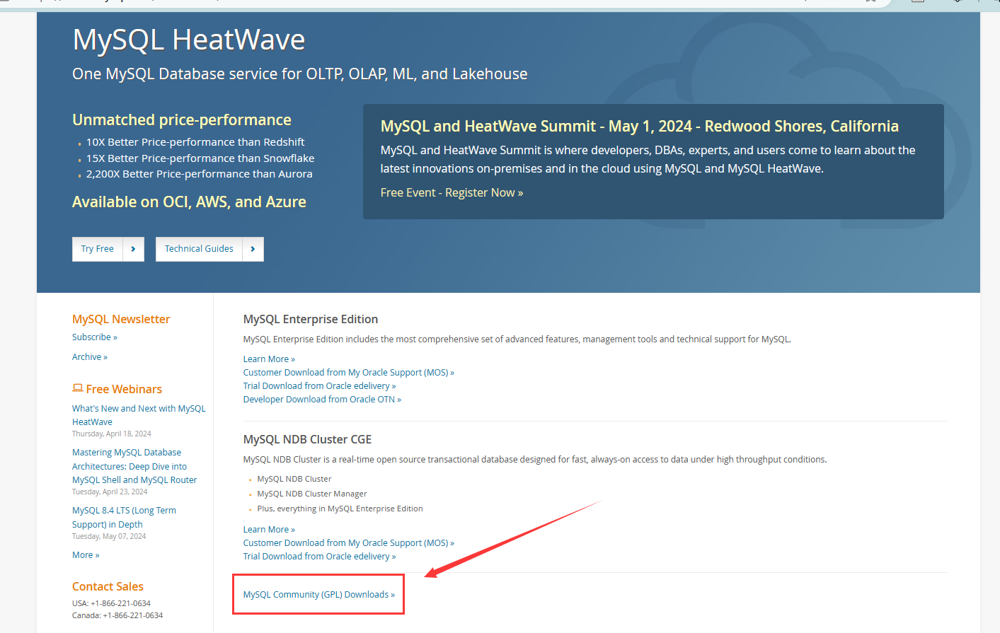

进入官网的下载页面，根据操作系统选择安装版本，本文仅展示windows

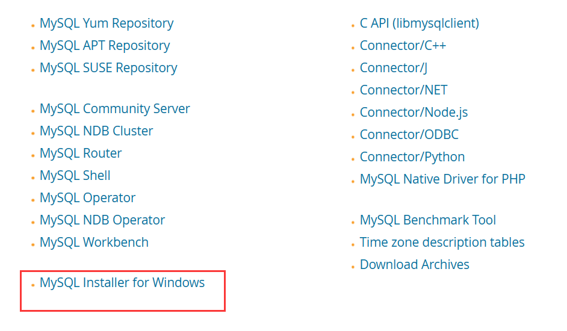

下载这个带安装器的版本：

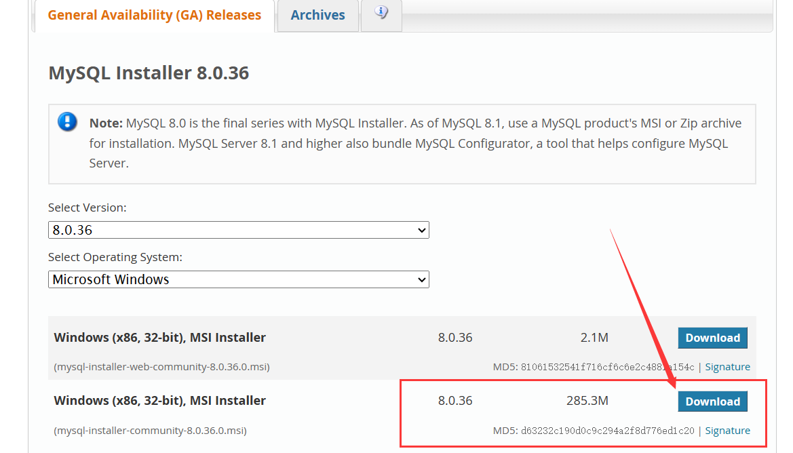

下载完成后，选择仅安装service即可：

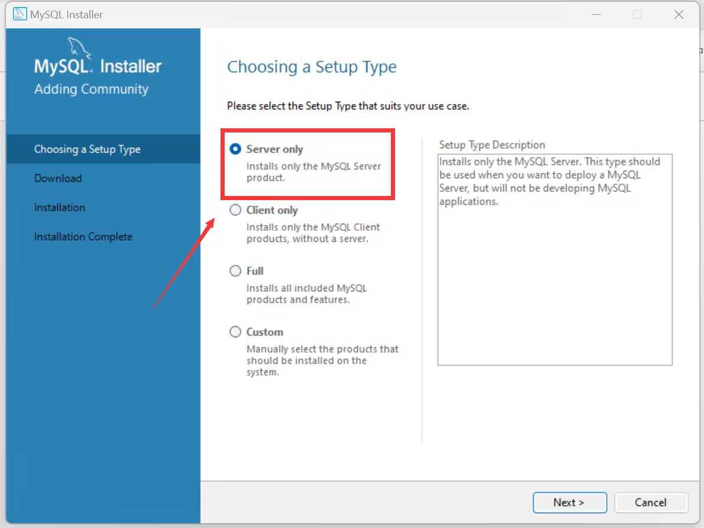

下一步，安装：

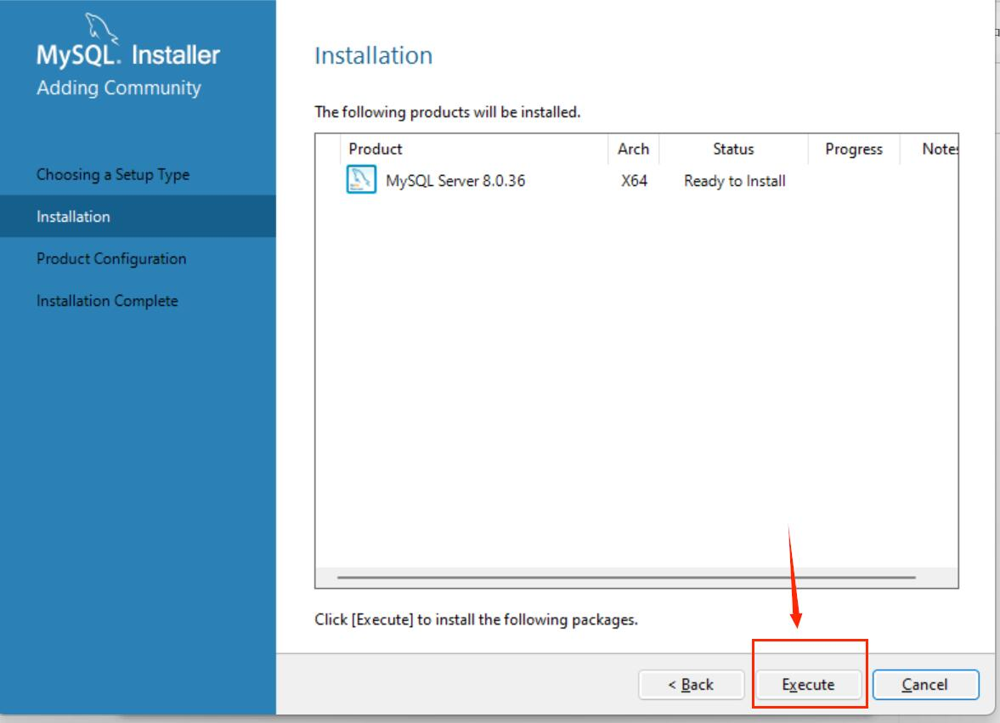

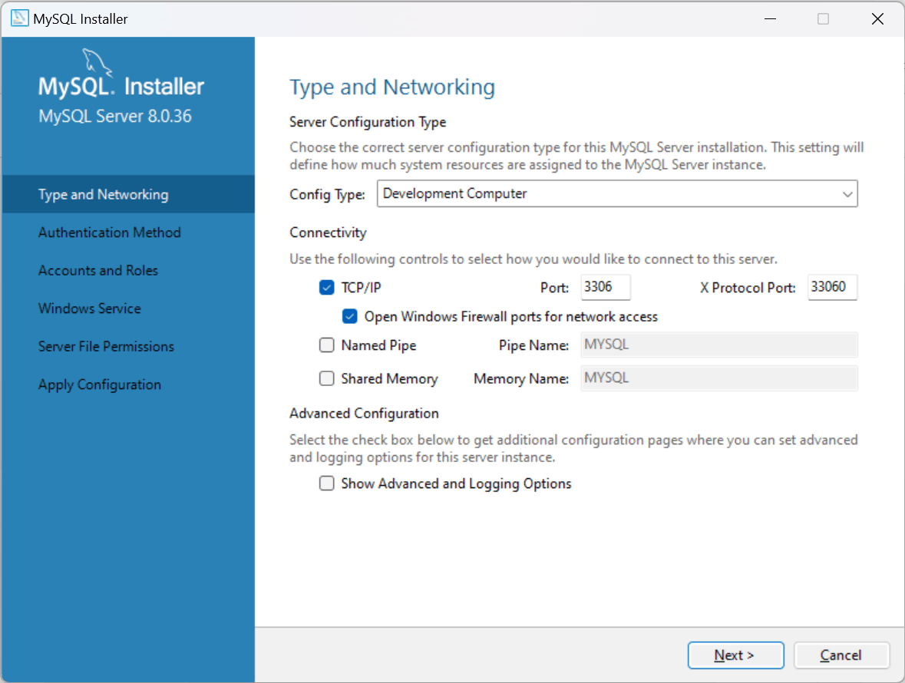

如果3306端口已经占用可以使用指令查看进程，并停止：

```
netstat -aon|findstr 3306
taskkill [进程ID]
```

选择下一步后，这个强密码验证需要勾选，否则无法使用高版本的jdbc相关工具。

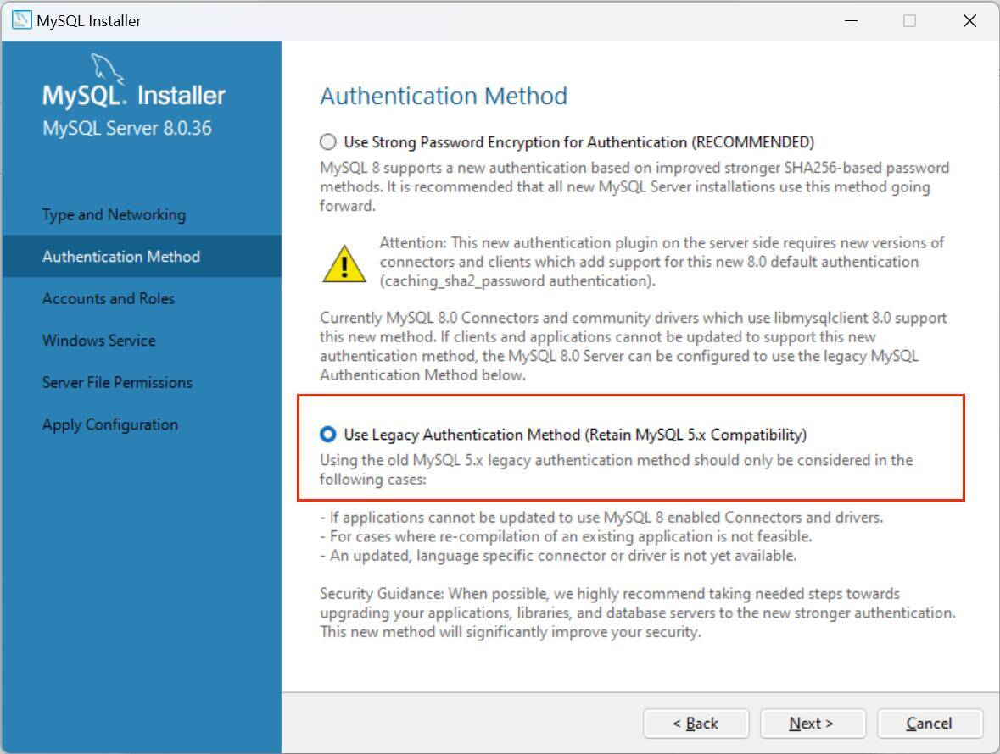

输入root登录密码，这个密码一定不能忘记。

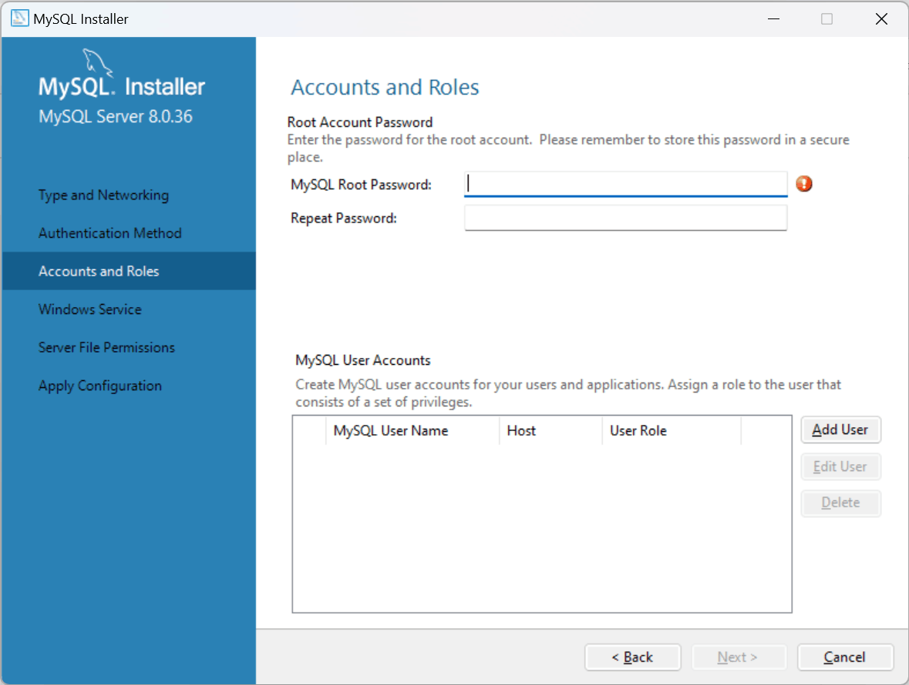

接下来一路next，即可安装完成

# 测试是否安装成功

使用管理员身份打开cmd，输入

```
mysql --version
```

若出现版本号则安装成功。

# 登录mysql

使用指令

```
mysql -u root[用户名] -p
```

按照提示，输入密码成功进入mysql。

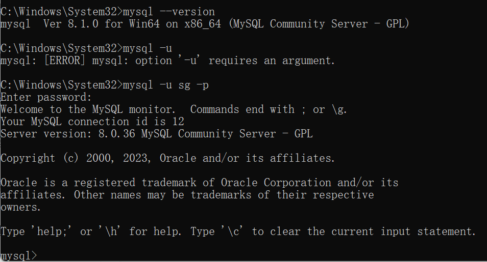

# mysql相关指令

### 操作数据库

```
CREATE DATABASE [数据库名];	/* 创建数据库 */
USE [数据库名]; /* 使用数据库 */
DROP DATABASE [数据库名]; /* 删库 */
```

注：在终端中执行sql语句时，需要添加";"

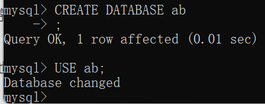

### 操作表

```
CREATE TABLE [表名](id int,name varchar(50));  /* 创建表id和name为自定义的字段名 */
INSERT INTO [表名] (id,name) VALUE (1,'admin')  /* 插入的值 */
DELET FROM [表名] /* 删除表 */
```

注：sql中的字符串需要使用单引号，双引号会报错。

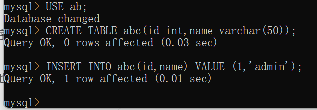

### 查询

```
SELECT * FROM [表名] /* 查看表中所有数据 */
```

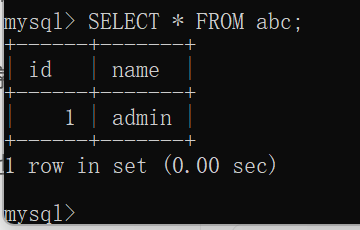

# idea链接数据库

使用maven创建项目，将mysql-connector-j放入依赖项。

```
<!-- https://mvnrepository.com/artifact/com.mysql/mysql-connector-j -->
<dependency>
    <groupId>com.mysql</groupId>
    <artifactId>mysql-connector-j</artifactId>
    <version>8.2.0</version>
</dependency>
```

在idea中链接数据库：

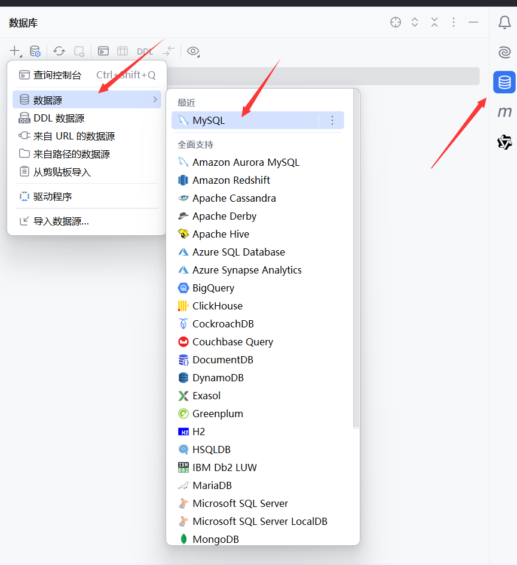

输入用户名和密码，如果左下角提示缺少文件，点击下载新版idea会自动帮助你下载缺失的文件

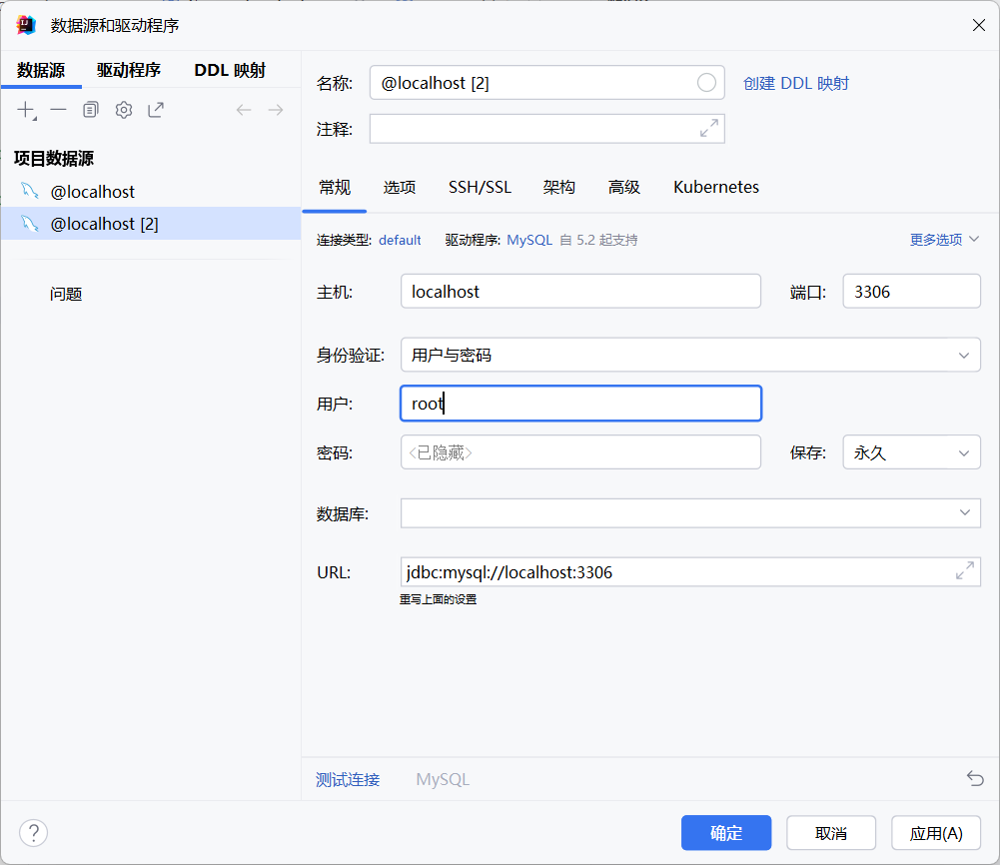

可以使用左下角的测试链接，查看是否能正常链接。

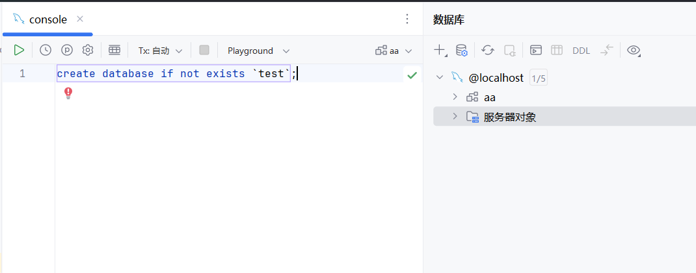

可以在idea自带的console控制台使用sql语句。

# 在类中创建链接

```
Class.forName("com.mysql.cj.jdbc.Driver");
String urlString = "jdbc:mysql://localhost:3306/数据库名?characterEncoding=utf-8 & serverTimezone=GMT%2B8";
String user = "root";
String password = "";
Connection connection = DriverManager.getConnection(urlString, user, password);
```

在类中使用上述代码，即可链接数据库。
