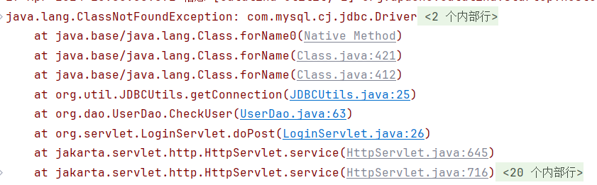
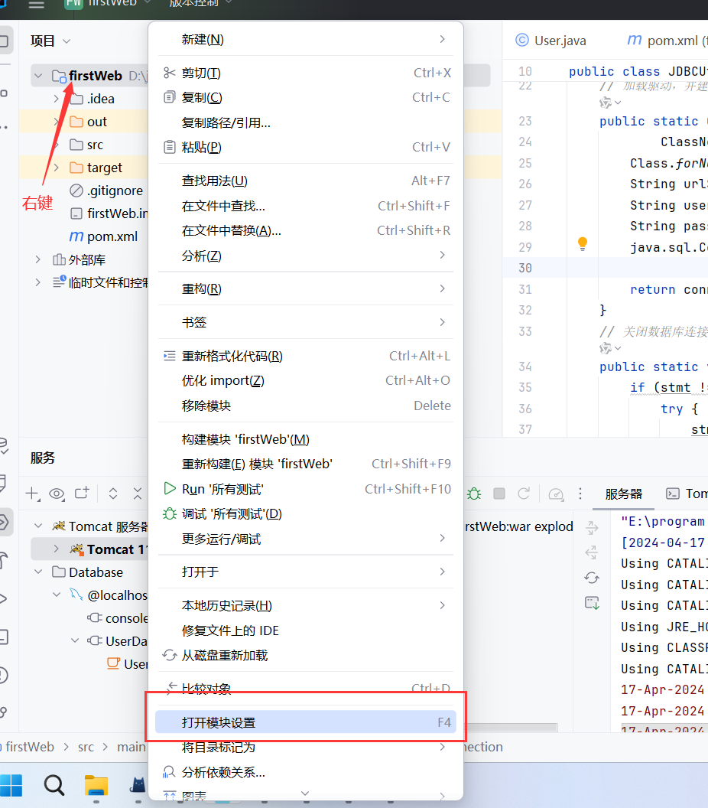
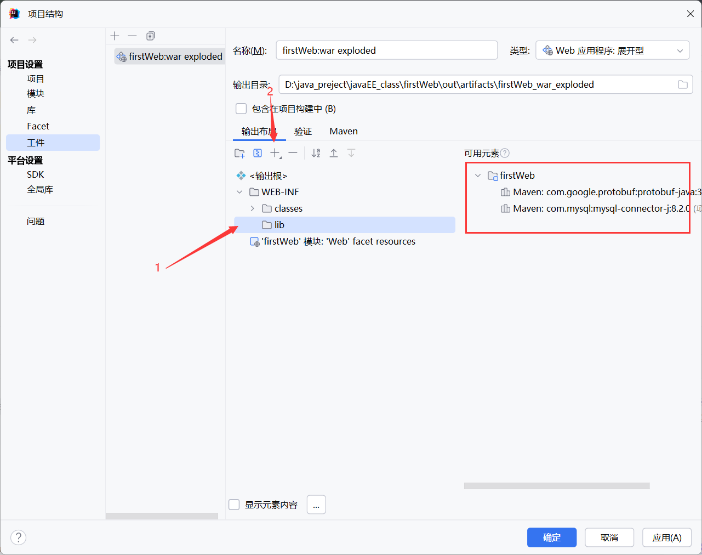
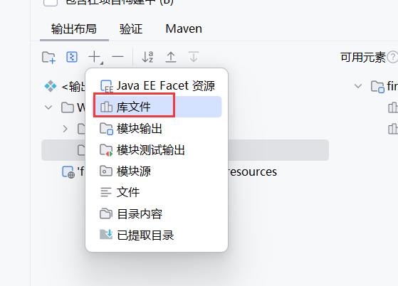
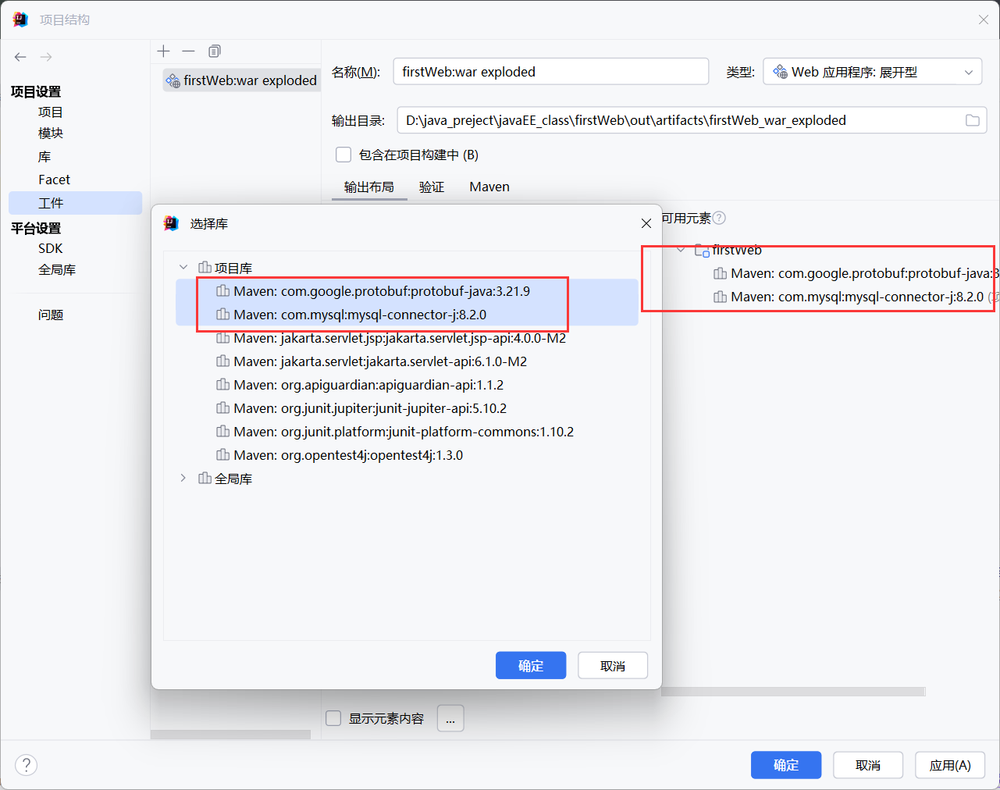
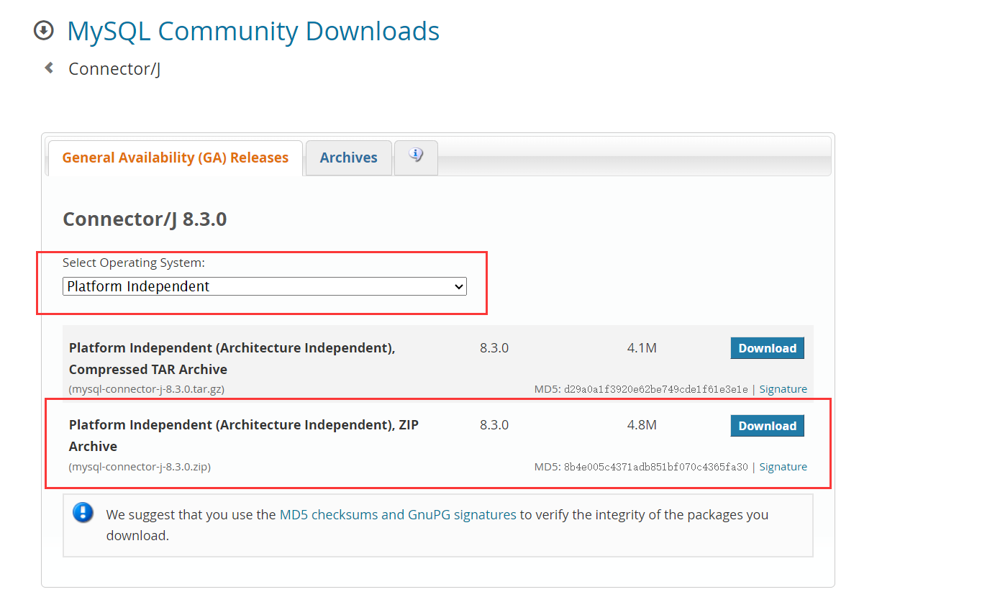
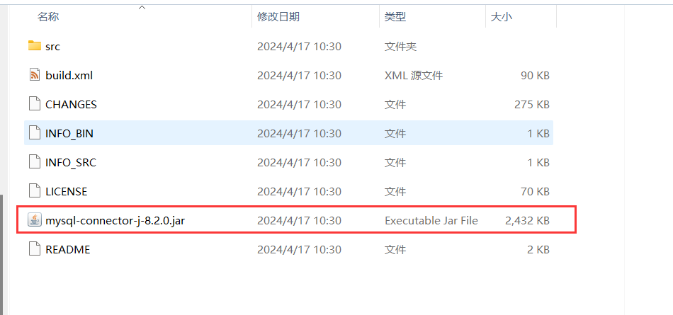
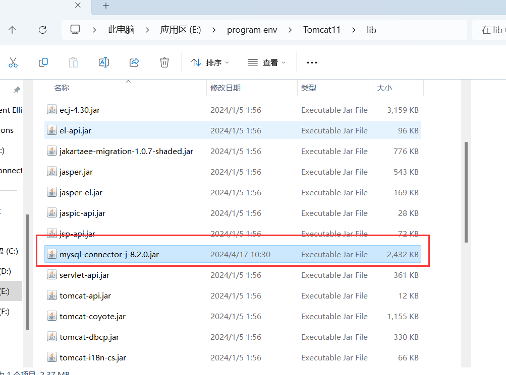

#  起因

在idea中使用tomcat操作数据库时，出现ClassNotFoundException报错。



在直接运行java代码时，可以实现数据库的操作（maven中导入依赖），但是在tomcat上运行的时候会出现这个找不到类的报错

```xml
<!-- https://mvnrepository.com/artifact/com.mysql/mysql-connector-j -->
<dependency>
    <groupId>com.mysql</groupId>
    <artifactId>mysql-connector-j</artifactId>
    <version>8.2.0</version>
</dependency>
```

代码如下所示，其中xxxxxx为数据库名和密码：

```java
 Class.forName("com.mysql.cj.jdbc.Driver");
String urlString = "jdbc:mysql://localhost:3306/xxxxx?characterEncoding=utf-8";
String user = "root";
String password = "xxxxxxxxxxxxxx";
Connection connection = DriverManager.getConnection(urlString, user, password);
```

# 解决问题

在自习阅读了报错信息并思考后，可以大概了解到这个错误的原因： **tomcat在运行的时候没有正确的找到Driver类的位置。**

## 方案一：为工件添加依赖

首先我想到的就是上一次org.json包的错误问题，文章：[解决tomcat找不到org.json | zfmx's Blog (zhifengmuxue.top)](https://zhifengmuxue.top/2024/04/10/2024-04-10/)

尝试采取同样的方式为工件加入依赖，查看是否可行。打开项目的模块设置



将可用元素添加到  **输出web-inf的lib文件夹**（若无，请右键web-inf新建）



添加库文件



按照可用元素把依赖添加进去。




## 方案二：引入jar包

我们可以把jar包放入tomcat的lib文件夹下，使其正确找到路径。

jar包下载： [MySQL :: Download Connector/J](https://dev.mysql.com/downloads/connector/j/)



解压后，我们只需要其中的jar包即可



将jar包移动到tomcat下的lib中即可正常运行。


