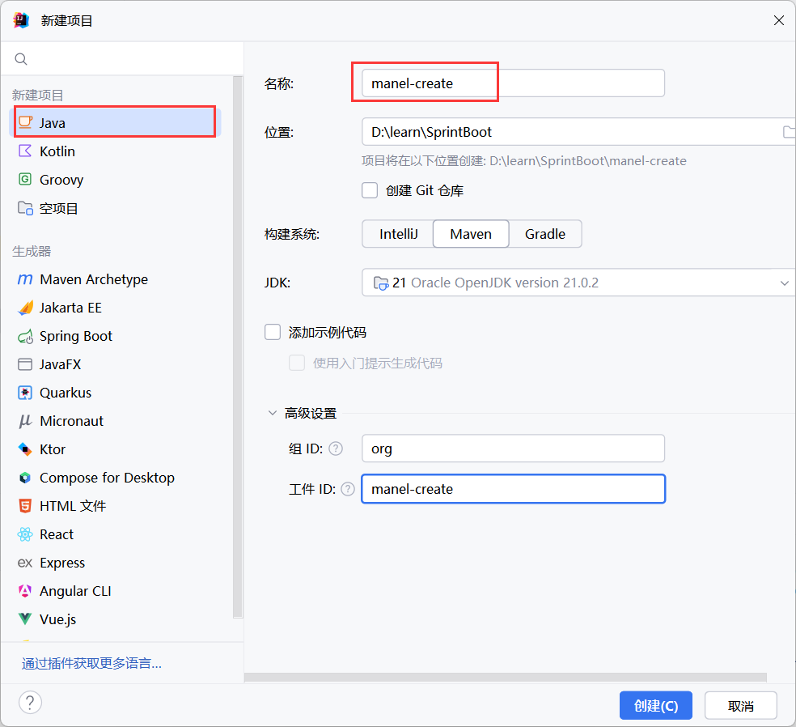
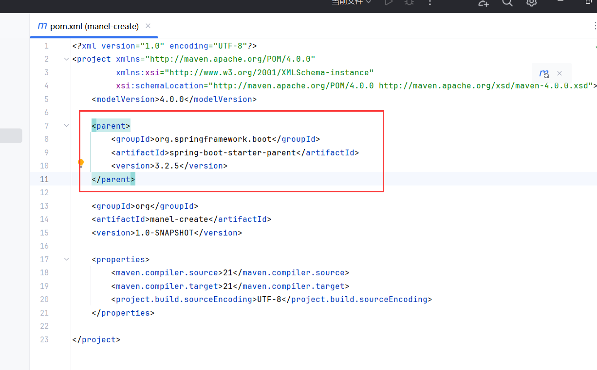
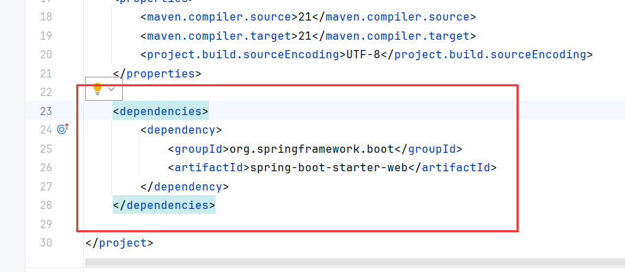
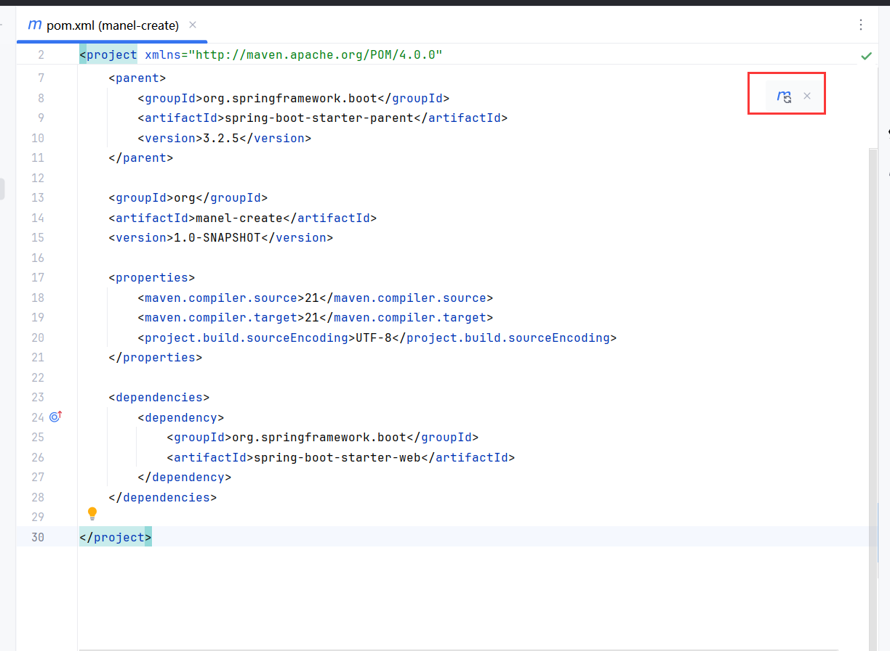
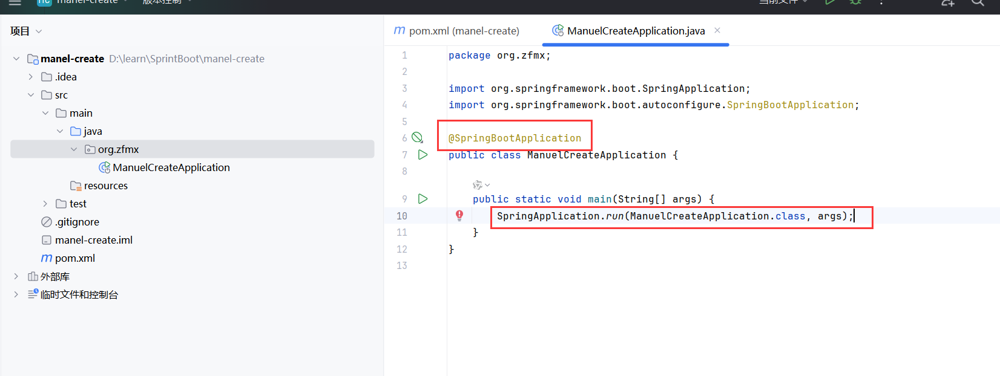
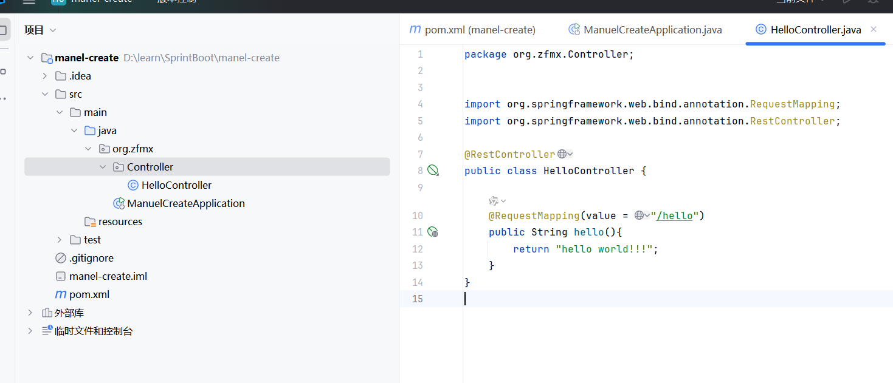
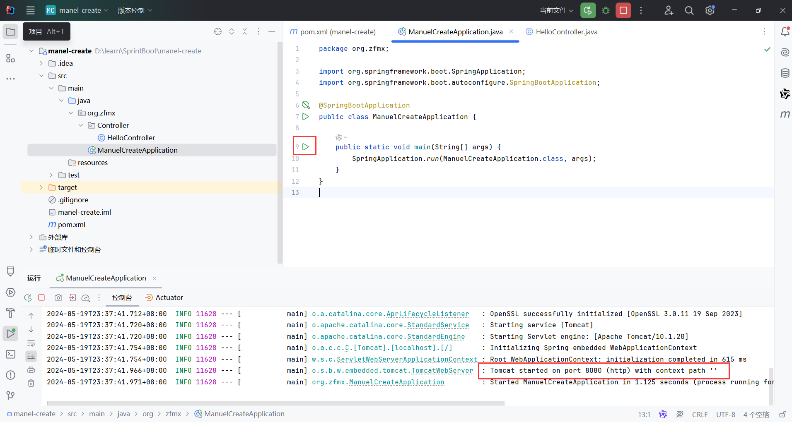
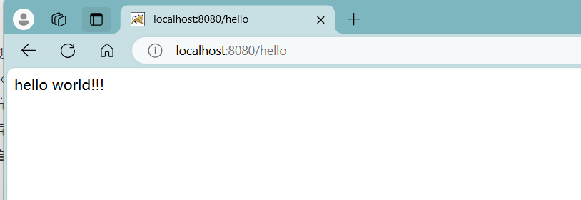

# 前言

​	我正在学习Spring Boot相关知识，并打算手动创建一个Spring Boot的博客。Spring Boot是一个用于简化Spring应用程序开发的框架，它通过提供默认配置和自动化的方式，使开发过程更加高效和便捷。学习Spring Boot不仅可以提升我的Java开发技能，还能帮助我掌握现代Web开发的核心技术。


#  创建新项目

我们首先按照正常的创建步骤， 创建一个maven的空项目



# pom中加入依赖

### 父工程 —— parent

我们需要在maven的配置文件pom.xml中引入父工程：



```xml
<parent>
    <groupId>org.springframework.boot</groupId>
    <artifactId>spring-boot-starter-parent</artifactId>
    <version>3.2.5</version>
</parent>
```

这里的版本可以根据需求进行更换，artifactId是固定的。

### web 起步依赖 —— dependencies

在依赖项中，引入web的起步依赖



```xml
<dependency>
    <groupId>org.springframework.boot</groupId>
    <artifactId>spring-boot-starter-web</artifactId>
</dependency>
```

注意，这里的依赖无需添加版本号，版本会根据上述的父工程的版本号而定。

### 重新加载maven



# 编写启动类

Spring Boot 项目需要使用一个启动类进行运行，需要加上 @SpringBootApplication 注解，并在main方法中加入入口。



```java
package org.zfmx;

import org.springframework.boot.SpringApplication;
import org.springframework.boot.autoconfigure.SpringBootApplication;

@SpringBootApplication
public class ManuelCreateApplication {

    public static void main(String[] args) {
        SpringApplication.run(ManuelCreateApplication.class, args);
    }
}
```

# 编写controller类

我们创建一个controller类，验证该项目是否正确运行



```java
package org.zfmx.Controller;


import org.springframework.web.bind.annotation.RequestMapping;
import org.springframework.web.bind.annotation.RestController;

@RestController
public class HelloController {

    @RequestMapping(value = "/hello")
    public String hello(){
        return "hello world!!!";
    }
}
```

此处用到了两个注解：

- @RestController  : 主要用于构建 RESTful 风格的 Web 服务。这个注解结合了 @Controller 和 @ResponseBody 的功能，简化了控制器类的编写。
- @RequestMapping : 是 Spring MVC 中的一个注解，用于映射 HTTP 请求到控制器类的方法。它允许你指定一个或多个 URL 模式，以便当这些模式匹配到客户端发送的请求时，Spring 将调用相应的方法进行处理

该controller类的作用：

​	当访问 "/hello" 时返回一串字符串

# 启动程序

我们运行入口程序， 可以在控制台中看到spring boot的启动信息， 并可以看到已经运行tomcat在8080端口了。



我们去浏览器访问 "localhost : 8080/hello" ，可以看到，我们成功的运行了Spring Boot项目！


