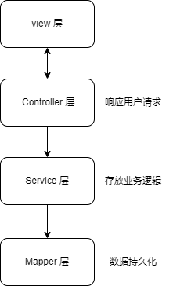

#  前言

在这篇文章中，我们通过一个简单的Spring Boot应用程序示例，展示了如何集成MyBatis和SQLite数据库，并详细介绍了每一层的功能和实现方法。

- **MyBatis** 是一个Java的持久层框架，主要用于将SQL查询结果映射到Java对象中，适用于需要复杂查询和灵活配置的企业级应用。
- **SQLite** 是一个轻量级的嵌入式关系型数据库管理系统，适用于需要简单、便携的数据库解决方案的小型应用和嵌入式系统。

# 引入坐标

我们通过在依赖项中加入坐标，来使我们的工程能够使用mybatis控制sqlite

```xml
<dependency>
    <groupId>com.baomidou</groupId>
    <artifactId>mybatis-plus-spring-boot3-starter</artifactId>
    <version>3.5.5</version>
</dependency>

<dependency>
    <groupId>org.xerial</groupId>
    <artifactId>sqlite-jdbc</artifactId>
    <version>3.45.3.0</version>
</dependency>
```


# 添加配置文件

我们需要在springboot配置文件中添加datasource的值，此处采用yaml格式文件配置 

```yaml
spring:
  datasource:
    driver-class-name: org.sqlite.JDBC
    url: jdbc:sqlite:identifier.sqlite
    username:
    password:
```

需要加入driver-class-name，即类名，url 访问路径

由于username和password在sqlite中默认为空，再此我们也同样先放空

# 实例 : 根据id查询用户

我们做一个通过id来查询并返回用户的简单小项目来学习mybatis的基本使用方法

### 创建数据

我们在sqlite的命令行中执行以下代码，创建一些用户用于查找

```sqlite
CREATE TABLE user(
                     id INTEGER PRIMARY KEY AUTOINCREMENT,
                     name TEXT,
                     age INTEGER,
                     gender INTEGER,
                     phone TEXT
);

INSERT INTO user(name, age, gender, phone) VALUES ('张三', 24, 1, '18800000000');
INSERT INTO user(name, age, gender, phone) VALUES ('李四', 25, 1, '18800000001');
INSERT INTO user(name, age, gender, phone) VALUES ('王五', 26, 2, '18800000002');
INSERT INTO user(name, age, gender, phone) VALUES ('赵六', 27, 2, '18800000003');
```

执行后，user表如下图所示


### POJO层

POJO（Plain Old Java Object）层是Java应用程序架构中的一部分，主要用于表示业务数据和业务逻辑的简单Java对象。POJO层通常不依赖于特定的框架或库，仅包含属性、构造方法、getter和setter方法，有时还包含基本的业务逻辑。它是Java EE（Enterprise Edition）开发中非常常见的一个概念。

我们在pojo层放入User类，用于返回和承接数据

```java
public class User {
    private Integer id;
    private String name;
    private Integer age;
    private Integer gender;
    private String phone;

    public User() {}
    public User(Integer id, String name, Integer age, Integer gender, String phone){
        this.id = id;
        this.name = name;
        this.age = age;
        this.gender = gender;
        this.phone = phone;
    }
    // set + get 省略了
    // 想要返回数据好看些，重写toString函数
}
```


### MAPPER层

在Spring Boot应用程序中，Mapper层（或称为数据访问层）负责与数据库进行交互。Mapper层是Spring Boot应用程序中负责数据库操作的重要部分。通过MyBatis的集成，开发者可以方便地执行各种SQL操作并将数据库记录映射为Java对象。无论是通过XML配置还是注解方式，MyBatis都提供了灵活的映射和查询功能，使得数据访问层的开发更加高效和简洁。

我们需要在mapper层进行sql操作，这就使用到了mybatis的一些相关操作

```java
@Mapper
public interface UserMapper {

    @Select("select * from user where id=${userId}")
    User findById(Integer userId);
}
```

- @Mapper  声明了这是MAPPER层的一个mapper
- @Select  则是使用注解方式描述sql语句，其中的${ userId } 就是函数findById的输入参数。  


### SERVICE层

Service层（服务层）是用于实现业务逻辑的一个重要层次。它处于控制层（Controller）和数据访问层（Mapper/Repository）之间，负责处理应用程序的业务需求、业务规则和数据操作。Service层在Spring Boot应用程序中承担了重要的角色，通过实现业务逻辑、管理事务和调用数据访问层，它将应用程序的各个层次有机地联系在一起。使用清晰的接口和实现分离，以及Spring提供的强大事务管理功能，开发者可以构建出结构良好、可维护和可扩展的业务逻辑层。

我们在service层进行业务需求的操作

```java
@Service
public class UserServiceImpl implements UserService {

    @Autowired
    private UserMapper userMapper;

    @Override
    public User findById(Integer userId) {
        return userMapper.findById(userId);
    }
}
```

- @Service  表明此类为Service
- @Autowired  注入容器，如不添加，会出现null的报错，即未进行注入


### CONTROLLER层

在Spring Boot应用程序中，Controller层（控制层）是用于处理用户请求的一个重要层次。它位于应用程序的最外层，负责接收HTTP请求、调用Service层进行业务处理，并将处理结果返回给客户端。Controller层在Spring Boot应用程序中负责处理用户请求和响应，是应用程序与外界交互的桥梁。通过使用各种注解和Spring Boot提供的强大功能，开发者可以轻松地实现请求处理、业务逻辑调用、参数验证和异常处理，构建出结构清晰、功能完善的Web应用程序。

```java
@RestController
public class UserController {

    @Autowired
    private UserService userService;

    @RequestMapping(value = "/findById")
    public User findById(Integer userId) {
        return userService.findById(userId);
    }

}
```

### RUN

至此一个简单的实例就编写完成了，通过运行入口就可以完成操作。


这是一个简单的层次结构图：


