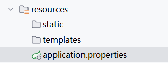
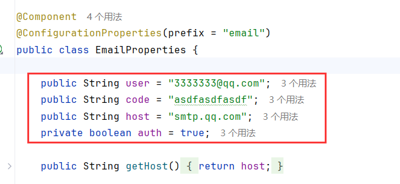
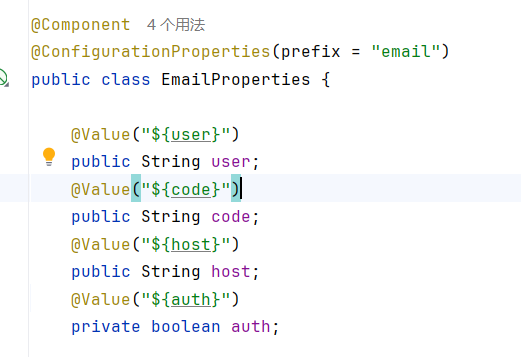

# 配置文件

在自动生成的SpringBoot项目中，在resources文件夹下自动生成了一个名为application.properties的文件



而SpringBoot拥有两种格式的配置文件，分别是properties和yaml配置文件，我们可以通过配置文件，更改一些服务器以及第三方或自制库的配置。下面我们通过两个简单的可修改项  (端口和虚拟路径)  来看一下相关的配置文件如何编写吧：

# properties文件编写

properties文件格式以 “." 分割 ： 

```properties
spring.application.name=hello-world
# 修改端口号
server.port=65500
# 修改虚拟路径
server.servlet.context-path=/start
```

修改完后运行入口， 可以通过路径 ：localhost:65500/start/ 进行访问

# yaml文件编写

拥有更好的可读性，相同路径无需多次编写：

```yaml
server:
  port: 65501
  servlet:
    context-path: /start
```

# 编写配置文件

我们可以把类中的一些值放在配置文件之中， 比如邮件发送类：



这几个变量的值理应不在此处写死，若是写死，每次更改需要重新编译、运行，我们可以把他们放在配置文件之中，这样就灵活多了

### yaml配置文件

我们可以在配置文件中把信息填写完毕

注意： 值的前面需要一个空格，使用空格作为层级关系

```yaml
# 发件人相关信息
email:
  user: 133333333@qq.com
  code: asdfasdfasdfsad
  host: smtp.qq.com
  auth: true
```

在通过SpringBoot的注解 @Value( " $ { 键名}  " ) 的形式获取信息

```java
// 注解可以时接下来的@Value注解内容简化,如果不写此注解， @Value中得写全 如@Value("${email.user}")
@ConfigurationProperties(prefix = "email")
```

注意实体类的属性名和配置文件中的键名一致时才能使用 @ConfigurationProperties 注解



运行代码， 成功的对QQ邮箱发送了测试邮件


