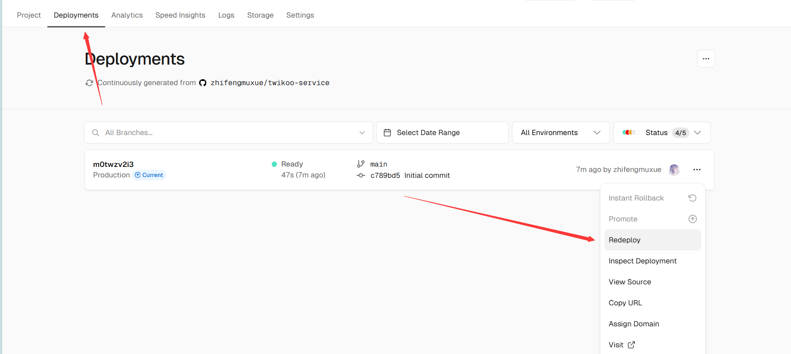

#  创建MongoDB数据库

[MongoDB Atlas | MongoDB](https://www.mongodb.com/zh-cn/cloud/atlas/register) 注册账号，然后创建数据库


选择免费的数据库创建 ， 使用亚马逊的服务商，地区选择us-east-1。


可以在name中自定义数据库名

然后创建一个用户，用于登录数据库，记住密码


往下翻，填入允许访问的ip，我们需要所有人均可访问填入0.0.0.0


创建连接 ，在database页面选择连接刚刚创建的数据库，在这里我的数据库名为commits


选择默认的drivers连接


复制这一段代码，并把\<password\>改成刚刚创建的用户的密码


# Vercel一键部署

[Vercel 创建新项目](https://vercel.com/import/project?template=https://github.com/imaegoo/twikoo/tree/main/src/server/vercel-min")

填入仓库名


如下图所示，创建成功


进入 `Settings - Environment Variables`，添加环境变量 `MONGODB_URI`，值为前面记录的数据库连接字符串,最后`save`保存即可


重启一下服务：

访问地址看到下图信息，说明配置完成


# 完善博客主题相关配置

由于我是用的主题为Butterfly，直接修改相关内容即可

```yaml
comments:
  # Up to two comments system, the first will be shown as default
  use: twikoo # Valine,Disqus
  text: true # Display the comment name next to the button
  # lazyload: The comment system will be load when comment element enters the browser's viewport.
  # If you set it to true, the comment count will be invalid
  lazyload: true
  count: true # Display comment count in post's top_img
  card_post_count: true # Display comment count in Home Page
  
# Twikoo
twikoo:
  envId: https://twikoo-service-nuhq.vercel.app/
  region:
  visitor: false
  option:
```

点击设置可以编辑控制评论


