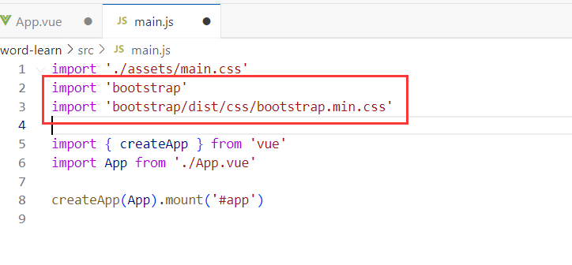
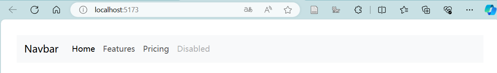

#  Bootstrap5

Bootstrap 5 是一个流行的前端框架，用于构建响应式、移动优先的网站和网络应用。它提供了一套 CSS 和 JavaScript 工具，旨在简化开发美观且功能丰富的用户界面。

[Bootstrap5 中文文档](https://v5.bootcss.com/) <del>虽然里面大部分是英文</del>

接下来本文将描述在vue中使用Bootstrap5的步骤


### npm安装

首先安装 bootstrap5 和 popperjs，由于我是用的是npm仅以npm演示

```
npm install bootstrap @popperjs/core --save
```


### 引入Bootstrap5

我们需要在vue项目的main.js中，引入bootstrap5



```
import 'bootstrap'
import 'bootstrap/dist/css/bootstrap.min.css'
```


### 栗子

```html
<nav class="navbar navbar-expand-lg bg-body-tertiary">
    <div class="container-fluid">
        <a class="navbar-brand" href="#">Navbar</a>
        <button class="navbar-toggler" type="button" data-bs-toggle="collapse" data-bs-target="#navbarNav" aria-controls="navbarNav" aria-expanded="false" aria-label="Toggle navigation">
            <span class="navbar-toggler-icon"></span>
        </button>
        <div class="collapse navbar-collapse" id="navbarNav">
            <ul class="navbar-nav">
                <li class="nav-item">
                    <a class="nav-link active" aria-current="page" href="#">Home</a>
                </li>
                <li class="nav-item">
                    <a class="nav-link" href="#">Features</a>
                </li>
                <li class="nav-item">
                    <a class="nav-link" href="#">Pricing</a>
                </li>
                <li class="nav-item">
                    <a class="nav-link disabled">Disabled</a>
                </li>
            </ul>
        </div>
    </div>
</nav>
```


