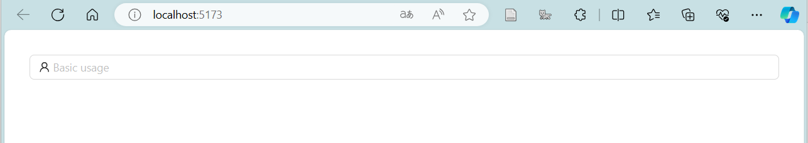

#  前言

 在b站上刷到了Erik的 [【25分钟技术入门】兄弟，转过去，真有急事 | 超简洁的前后端通信教程](https://www.bilibili.com/video/BV1eC411V7BK/?share_source=copy_web&vd_source=6c86d21d58077c25b95a6bc060e35197) ，正巧最近在学习Vue的相关知识，在这里写下这篇博客以及我的一些理解记录。本篇博客用到的一些框架：

- Vue：一款流行的前端 JavaScript 框架，用于构建交互式的用户界面。// 前端
- Ant Design ：一个基于 React 的 UI 组件库，它提供了一套丰富的、美观的、易于使用的组件，帮助开发者快速构建出具有统一风格的用户界面。 // 前端组件
- Express ：一个流行的 Node.js Web 应用程序框架，它简化了构建 Web 应用和 API 的过程。Express 提供了一系列强大的功能和工具，使得开发者可以更轻松地处理 HTTP 请求、路由、中间件等任务。 // 用作后端
- axios ：Axios 是一个基于 Promise 的 HTTP 客户端，用于浏览器和 Node.js 环境中发送 HTTP 请求。它是一个流行的第三方库，广泛应用于前端开发中，用于与后端服务进行数据交互。 // 前后端相连
- nodemon：一个非常方便的Node.js开发工具，它可以帮助开发者在开发过程中自动监视文件的变化并重新启动Node.js应用程序。

并附上官方文档：

[简介 | Vue.js (vuejs.org)](https://cn.vuejs.org/guide/introduction.html) 

 [Ant Design of Vue - Ant Design Vue (antdv.com)](https://www.antdv.com/docs/vue/introduce-cn)

 [Express 中文网 (nodejs.cn)](https://express.nodejs.cn/) 

[起步 | Axios中文文档 | Axios中文网 (axios-http.cn)](https://www.axios-http.cn/docs/intro)


下文不介绍 ，如有需要可以参照上一篇博客： [Vue——导入bootstrap5](/2024/05/22/2024-05-22/)

---

# Vue导入ant-design

 [Ant Design of Vue - Ant Design Vue (antdv.com) ](https://www.antdv.com/docs/vue/introduce-cn)的官方文档中有详细介绍，这里只说一下我是怎么创建的 

### 1.安装ant-design组件

```
npm i --save ant-design-vue@next
```

next表示最新版本，i => install 

### 2.注册

在vue项目中的main.js中加入ant-design的注册，并稍稍对main.js做了修改

```js
import Antd from 'ant-design-vue'
import 'ant-design-vue/dist/reset.css'
```


### 3.图标

值得注意的是，如果你需要使用到ant design的图标icon时，需要安装相关的组件：

```bash
npm install --save @ant-design/icons-vue
```


### 4.测试

我们使用一个a-input组件展示一下icon，其余的相关组件可以在官方文档查阅

```vue
<template>
   <div class="components-input-demo-presuffix">
    <a-input v-model:value="userName" placeholder="Basic usage">
      <template #prefix>
        <user-outlined />
      </template>
    </a-input>
  </div>
</template>
<script setup>
  import { UserOutlined } from '@ant-design/icons-vue';   // 需要引入icon
</script>
```



# 安装 Axios

我们可以通过npm快速的安装axios

[起步 | Axios中文文档 | Axios中文网 (axios-http.cn)](https://www.axios-http.cn/docs/intro)

```
npm install axios
```


# 构建前端页面

我们用一个list、两个输入框分别输入用户名和信息、一个提交按钮来做一个简单的即时聊天网站

```vue
<template>
  <div>
    <a-list size="small" bordered :data-source="messageList">  <!-- 使用list展示消息 -->
      <template #renderItem="{ item }">
        <a-list-item>{{ item.username }} : {{ item.message }}</a-list-item> <!-- 展示 用户名：消息 -->
      </template>
      <template #header>
        <div>Header</div>
      </template>
    </a-list>

    <a-row style="margin-top:20px">    <!-- 注意col的总和为24 -->
      <a-col span="4">
        <a-input v-model:value="username" placeholder="用户名"> 
          <template #prefix>
            <UserOutlined />   <!-- icon -->
          </template>
        </a-input>
      </a-col>
      <a-col span="14" offset="1">
        <a-input v-model:value="message" placeholder="要输入的文本">
          <template #prefix>
            <CommentOutlined />  <!-- icon -->
          </template>
        </a-input>
      </a-col>
      <a-col span="4" offset="1">
        <a-button type="primary" @click="handleClickSubmit" style="width: 100%;"> 提交 </a-button>
      </a-col>
    </a-row>
    
  </div>
</template>

<script setup>
  // 未写
</script>
```

效果如图所示


要进行接下来的提交操作，我们需要完善\<script\> 标签中的内容

```vue
<script setup>
    import {ref} from 'vue'      
    import { UserOutlined,CommentOutlined } from '@ant-design/icons-vue';    // 两个icon
    import axios from 'axios';   // axios工具
    import { message as ant_message } from 'ant-design-vue';   // 我们这里使用了ant_message的信息框
    const message = ref(null)    // 与第二个input框绑定
    const username = ref(null)   // 与第一个input框绑定
    const messageList = ref([])  // 一个信息列表，储存所有用户名及消息

    // 按钮事件： 将数据通过axios发送到后端，这里还没写后端
    // 暂定url为：http://localhost:8080/message/send 后文会介绍如何通过express设置
    const handleClickSubmit = async () => {     
        try{
          const res = (await axios.request({    // await 等待结果
            url: "http://localhost:8080/message/send",
            method: "POST",
            data: {
              username: username.value,
              message: message.value,
            }
          })).data;
          if (res.status == 200){
            ant_message.success("提交成功！")
          }
        }catch (err) {
          ant_message.error("提交异常！")
        }finally{
          GetMessageList(); // 获取信息函数
        }
    }
  
    // 获取信息函数,暂定url为http://localhost:8080/message
    const GetMessageList = async() => {
        const res = (await axios.request({
            url: "http://localhost:8080/message",
            method: "GET",
            data: {}  
          })).data;
        messageList.value = res;
    }
  
    GetMessageList();
    setInterval(()=>{
      GetMessageList();
    },1000)
</script>
```

# 配置express

 [Express 中文网 (nodejs.cn)](https://express.nodejs.cn/)  官方文档中同样有相关的详细配置介绍

### 1.创建一个新的文件夹


### 2.安装express

在命令行中进入目录

```
npm install express
```


### 3.修改package.json

添加了以下内容：

```json
"type": "module", 		// 使用es6的语法
"scripts": {
	"dev": "nodemon main.js"   // 快速启动 可以通过npm run dev启动
},
```

这里的nodemon是在前言介绍的工具，可以通过npm安装

```
npm install nodemon
```


### 4.创建js文件

这里我叫做main.js

```js
import express from 'express'
const app = express()
app.listen(8080,()=>{
    console.log("服务器开启成功");
})
```

如此访问8080端口即可看到控制台的启动提示。


# 后端构建

要注意的是，当我们同时运行前后端项目时，会遇到跨域问题：网络应用程序中，当一个域（或者是协议、端口号）的页面试图请求另一个域下的资源时所遇到的限制或问题。这个问题通常是由浏览器的安全策略所导致的，主要是为了防止恶意网站利用用户的浏览器发送跨域请求，窃取用户数据或进行其他恶意行为。

我们通过cors解决跨域问题：跨域资源共享（CORS，Cross-Origin Resource Sharing）是一种机制，允许服务器声明哪些源（域名、协议、端口）可以通过浏览器访问其资源。CORS 可以让 Web 服务器决定是否允许跨域的请求，以及哪些请求方法（如 GET、POST、PUT、DELETE 等）和头部信息是允许的。

```
npm install cros
```

接下来我们通过express完善后端的构建

```js
import express from 'express'
import cors from 'cors'  
const app = express()

app.use(cors())    // 解决跨域
app.use(express.json())     // 使用json 
app.use(express.urlencoded({extended: false}))  //配置 Express 应用来解析 URL 编码的请求体

app.listen(8080,()=>{
    console.log("服务器开启成功");
})

const messageList =[];

app.post("/message/send", async (req, res) => {
    const { username, message } = req.body;   // 获取json格式信息
    messageList.push({username, message});    // 放入list
    res.json({                               // 返回json 
        status: 200,
        msg: "ok",
    })
})

app.get("/message", async (req, res)=>{  
    res.json(messageList)      // 直接返回list
})
```


**至此完成了该项目的代码编写**

---

# 效果

我们同时开启前后端服务


访问前端页面


尝试输入信息提交


我们开启两个网页，观察实时性


由于前端刷新函数设置了1000毫秒，所以前端页面能够实现1s之内容忍程度下的即时通信


---

注： 若npm下载慢，使用cnpm （国内镜像npm）    npm install cnpm 安装 
