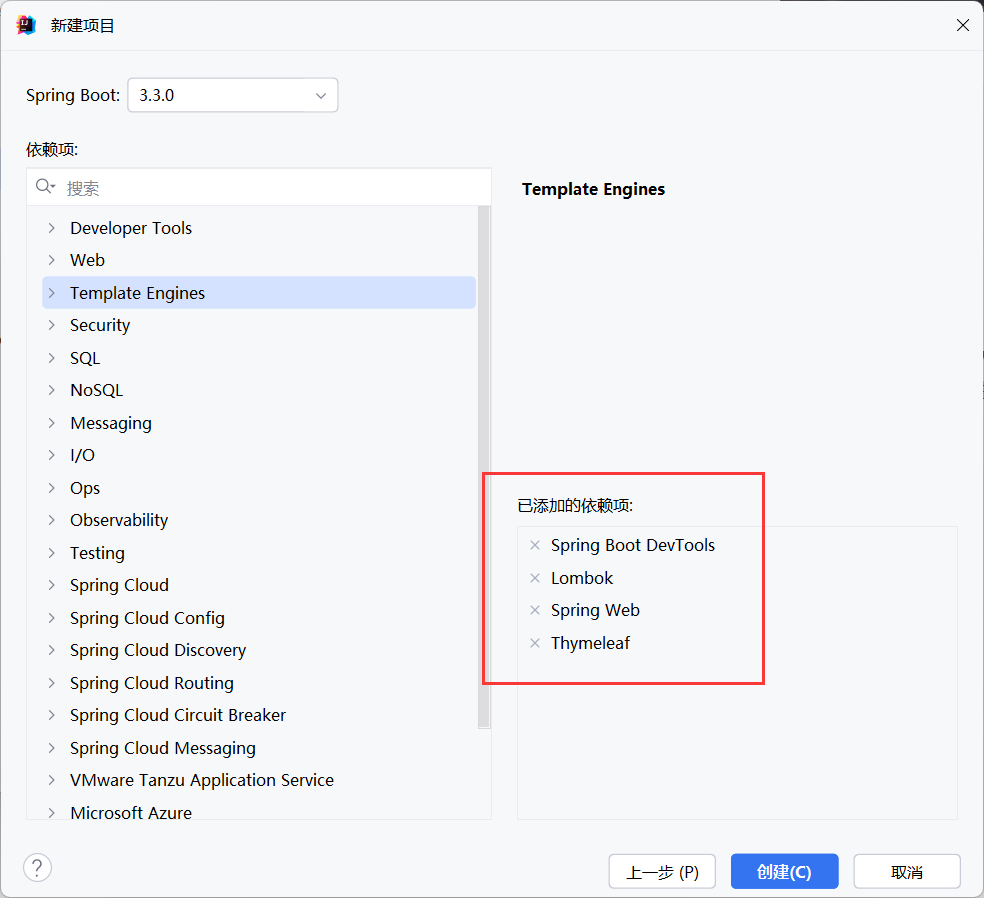
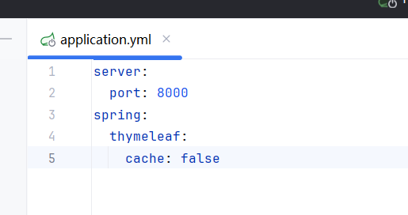
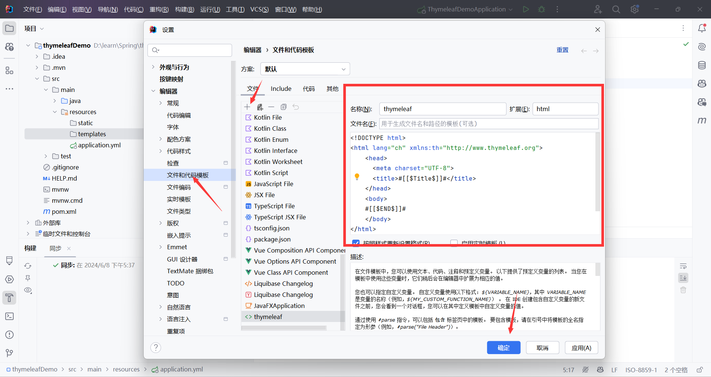
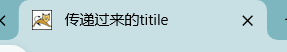
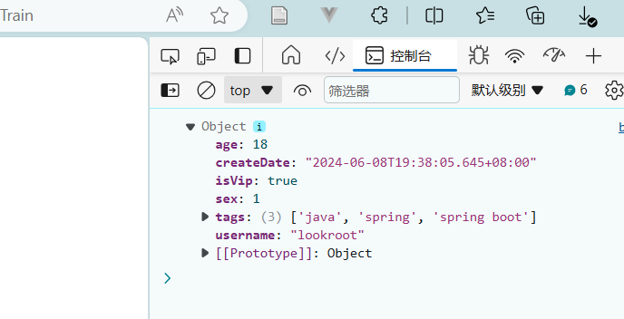

#   前言

**Thymeleaf** 适合用在传统的 Java Web 应用中，特别是与 Spring 框架结合时，能够快速、高效地生成服务器端渲染的页面。而 **Vue** 更适合构建现代的单页应用，提供丰富的前端交互和更好的用户体验。如果你的项目需要更强的前端交互和动态性，Vue 是更好的选择；如果项目更注重后端逻辑和服务器端渲染，Thymeleaf 则更加适合。

之前的文章中有介绍过vue，在此介绍一下Thymeleaf的一些基本用法


# 准备工作

### 创建项目

我们首先创建一个简单的spring boot项目，勾选thymeleaf模板引擎，创建maven项目



然后在配置文件（这里选用yml格式）中，配置一下相关的设置，将thymeleaf的缓存设为禁止。要注意的是，我们在开发过程中将其禁止， 在项目部署时需要将其打开。

在开发和部署时，对 Thymeleaf 的缓存设置有不同的需求，这是为了优化开发效率和运行时性能。在开发时禁用 Thymeleaf 缓存，可以方便快速查看模板修改的效果，提高开发效率；而在生产环境中启用缓存，则可以提升应用性能，减少服务器负载。这种策略可以确保在不同阶段获得最佳的开发和运行体验。



### 创建模板

在设置里的文件和代码模板中创建一个thymeleaf的模板，可以自定义名称，选择扩展html



```html
<!DOCTYPE html>
<html lang="ch" xmlns:th="http://www.thymeleaf.org">
<head>
  <meta charset="UTF-8">
  <title></title>
</head>
<body>
    
</body>
</html>
```

# 基础语法

### **th:text="\${}$"**

该语法用于在 HTML 元素中动态插入文本内容。它可以帮助开发者将服务器端的数据绑定到前端页面上。

同样可以更换content、keywords等内容。

### **举个栗子**

假设有一个模型对象 `user`，其 `name` 属性需要显示在页面上：

```java
model.addAttribute("user", new User("Alice"));
```

在 Thymeleaf 模板中，可以使用 `th:text` 来绑定这个值：

```html
<!DOCTYPE html>
<html xmlns:th="http://www.thymeleaf.org">
<head>
    <title>Thymeleaf 示例</title>
</head>
<body>
    <h1>欢迎，<span th:text="${user.name}">用户</span>!</h1>
</body>
</html>
```

在上述代码中，`th:text="${user.name}"` 将替换 `<span>` 标签中的文本内容，使其显示为 "欢迎，Alice!"。


又比如说，我们的index页面的title显示什么内容

```html
<head>
    <meta charset="UTF-8">
    <title th:text="${title}">默认title</title>
</head>
```

我们写一个controller类来控制这个页面的title

```java
package org.thymeleafdemo.controller;

import org.springframework.stereotype.Controller;
import org.springframework.ui.Model;
import org.springframework.web.bind.annotation.GetMapping;

@Controller
public class IndexController {
    @GetMapping("/index")			
    public String index(Model model){
        model.addAttribute("title","传递过来的titile");		// 设置title
        return "index";
    }
}
```

那么当我们没有启动服务器时，该页面的title理应为  默认title ：


 而当我们启动服务器时，title变为了：



### **字符串拼接**

在th:text=""的双引号中如果需要拼接字符串，需要使用 | |

```html
<title th:text="|text-${title}|"></title>
```


# css、js的引用

```html
<head>
    <meta charset="UTF-8">
    <title>title</title>
    <link rel="stylesheet" th:href="@{app.css}">
</head>
```

使用 th:href = "@{xxxx}" ， 其中css放置在静态资源下

```html
<script th:inline="javascript">
    const user=/*[[${user}]]*/{}
    console.log(user)
</script>
```

使用inline表明动态资源


