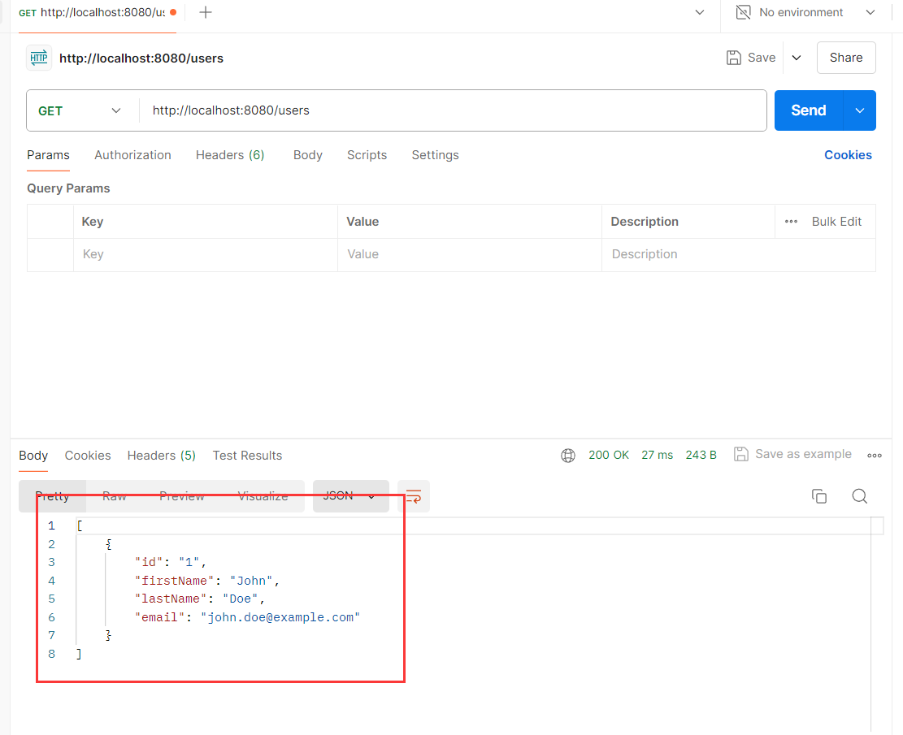

# 引言

Cassandra最初由Facebook开发，现已成为Apache基金会的顶级项目。其设计初衷是为了解决大规模数据存储和高可用性的问题，现已被Twitter、Netflix等众多互联网巨头采用。

# 基本使用方法

## 安装与配置

在开始使用Cassandra之前，你需要先进行安装和基本配置。以下是安装Cassandra的步骤：

**下载Cassandra**：

 ```
wget https://downloads.apache.org/cassandra/4.0.0/apache-cassandra-4.0.0-bin.tar.gz
tar -xzf apache-cassandra-4.0.0-bin.tar.gz
cd apache-cassandra-4.0.0
 ```

**配置Cassandra**

 编辑`conf/cassandra.yaml`文件，设置集群名称、数据目录、日志目录等基本配置。

**启动Cassandra**

```
bin/cassandra
```

**使用docker**  除了上述方法，还可以使用docker镜像拉取，这也是更加便利的方式

```dockerfile
docker network create cassandra-net
docker run --name my-cassandra --network cassandra-net -p 9042:9042 -d cassandra:latest
```

## CQL（Cassandra Query Language）

CQL是Cassandra的查询语言，类似于SQL，专为NoSQL数据库设计。以下是一些常见的CQL操作。

### 创建键空间（Keyspace）

键空间是Cassandra中的最高级别的命名空间，类似于SQL数据库中的数据库。

```sql
CREATE KEYSPACE mykeyspace WITH REPLICATION = {
  'class': 'SimpleStrategy',
  'replication_factor': 3
};
```

### 创建表

在键空间中创建表，定义表的结构和主键。

```sql
USE mykeyspace;

CREATE TABLE users (
  user_id UUID PRIMARY KEY,
  first_name TEXT,
  last_name TEXT,
  email TEXT
);
```

### 插入数据

向表中插入数据。

```sql
INSERT INTO users (user_id, first_name, last_name, email)
VALUES (uuid(), 'John', 'Doe', 'john.doe@example.com');
```

### 查询数据

从表中查询数据。

```sql
SELECT * FROM users;
```

### 更新数据

更新表中的数据。

```sql
UPDATE users SET email = 'john.new@example.com' WHERE user_id = some-uuid;
```

### 删除数据

从表中删除数据。

```sql
DELETE FROM users WHERE user_id = some-uuid;
```

# 基本类型

Cassandra支持多种数据类型，以下是一些常见的数据类型及其用途。

## 基本数据类型

- **text**：可变长度的UTF-8编码字符串。
- **int**：32位有符号整数。
- **bigint**：64位有符号整数。
- **float**：32位浮点数。
- **double**：64位浮点数。
- **boolean**：布尔值，true或false。
- **uuid**：通用唯一标识符。

### 集合数据类型

- list：有序集合，可以包含重复元素。

  ```sql
  CREATE TABLE example (id UUID PRIMARY KEY, values_list LIST<TEXT>);
  ```
  
- set：无序集合，不包含重复元素。

  ```sql
  CREATE TABLE example (id UUID PRIMARY KEY, values_set SET<TEXT>);
  ```
  
- map：键值对集合，键必须唯一。

  ```sql
  CREATE TABLE example (id UUID PRIMARY KEY, values_map MAP<TEXT, TEXT>);
  ```

### 自定义数据类型

可以通过`CREATE TYPE`语句创建自定义数据类型。

```sql
CREATE TYPE address (
  street TEXT,
  city TEXT,
  zip_code INT
);

CREATE TABLE users (
  user_id UUID PRIMARY KEY,
  name TEXT,
  address FROZEN<address>
);
```

# 实践示例

以下是一个简单的实践示例，展示如何使用Cassandra存储和查询用户信息。

```sql
-- 创建键空间
CREATE KEYSPACE exampleks WITH REPLICATION = {
  'class': 'SimpleStrategy',
  'replication_factor': 3
};

-- 切换到键空间
USE exampleks;

-- 创建用户表
CREATE TABLE users (
  user_id UUID PRIMARY KEY,
  first_name TEXT,
  last_name TEXT,
  email TEXT,
  phone_numbers SET<TEXT>
);

-- 插入数据
INSERT INTO users (user_id, first_name, last_name, email, phone_numbers)
VALUES (uuid(), 'Alice', 'Smith', 'alice.smith@example.com', {'123-456-7890', '098-765-4321'});

-- 查询数据
SELECT * FROM users WHERE user_id = some-uuid;

-- 更新数据
UPDATE users SET email = 'alice.new@example.com' WHERE user_id = some-uuid;

-- 删除数据
DELETE FROM users WHERE user_id = some-uuid;
```

# SpringBoot整合示例

接下来展示一个小小的查询用户数据的栗子

## 启动Cassandra

我使用的是更为便利的docker方式创建数据库


**使用CQL**

```
docker run -it  --network cassandra-net --rm cassandra cqlsh my-cassandra
```

**创建键空间**

```
CREATE KEYSPACE mykeyspace WITH replication = {'class':'SimpleStrategy', 'replication_factor' : 1};
```

## 创建项目

我们导入以下依赖，在idea中创建一个新的项目，使用Cassandra就需要导入相关的依赖，在此我们选用非反射型的Cassandra。


## 配置Cassandra

```yml
spring:
  cassandra:
    contact-points: localhost
    port: 9042
    local-datacenter: datacenter1
    keyspace-name: keyspace
    schema-action: CREATE_IF_NOT_EXISTS
```


我们来逐行看这些配置的作用

```
contact-points=127.0.0.1
```

- **作用**：指定Cassandra集群中的节点地址。可以是一个或多个节点的IP地址或主机名。
- **示例**：`127.0.0.1` 表示连接到本地运行的Cassandra节点。
- **注意**：如果有多个节点，可以使用逗号分隔，例如：`127.0.0.1,192.168.1.100`

```
port=9042
```

- **作用**：指定Cassandra节点的端口号。
- **默认值**：Cassandra默认使用9042端口。
- **示例**：`9042` 是Cassandra的默认CQL端口。

```
local-datacenter=datacenter1
```

- **作用**：指定Cassandra集群中的本地数据中心名称。这对于数据分片和复制策略非常重要。
- **示例**：`datacenter1` 表示本地数据中心的名称。
- **注意**：必须匹配Cassandra集群中配置的数据中心名称，特别是在使用多数据中心部署时。

```
keyspace-name=mykeyspace
```

- **作用**：指定要连接的Cassandra键空间（Keyspace）。
- **示例**：`mykeyspace` 是应用程序要使用的键空间名称。
- **注意**：键空间是Cassandra中的顶级命名空间，类似于关系数据库中的数据库。

```
schema-action=create-if-not-exists
```

- **作用**：指定应用程序启动时的模式操作。
- 选项：
  - `create-if-not-exists`：如果键空间或表不存在，则创建它们。
  - `create`：无论键空间或表是否存在，都尝试创建。
  - `update`：更新现有的模式。
  - `validate`：验证现有模式是否与应用程序的实体定义一致。
  - `none`：不执行任何模式操作。
- **示例**：`create-if-not-exists` 会在启动时检查键空间和表是否存在，如果不存在则创建它们。

## 创建实体

```java
import lombok.AllArgsConstructor;
import lombok.Data;
import lombok.NoArgsConstructor;
import org.springframework.data.cassandra.core.mapping.Column;
import org.springframework.data.cassandra.core.mapping.PrimaryKey;
import org.springframework.data.cassandra.core.mapping.Table;

@Data
@Table
@NoArgsConstructor
@AllArgsConstructor
public class User {

    @PrimaryKey
    private String id;
    @Column
    private String firstName;
    @Column
    private String lastName;
    @Column
    private String email;
}
```

- `@Data` 自动生成getter、setter、`toString`、`equals`、`hashCode`和所有字段的构造函数等方法。使得代码更加简洁。
- `@NoArgsConstructor` 自动生成一个无参构造函数。对于JPA和一些框架要求实体类必须有一个无参构造函数，这个注解非常有用。
- `@AllArgsConstructor` 自动生成一个包含所有字段的构造函数。方便在创建对象时直接初始化所有字段。
- `@Table` 指定该类是一个Cassandra表的映射类。默认情况下，表名与类名相同，但可以通过参数来指定不同的表名。
- `@Column` 标记该字段为Cassandra表中的列。默认情况下，列名与字段名相同，但可以通过参数来指定不同的列名。
- `@PrimaryKey` 标记字段为表的主键。这是Cassandra中用来唯一标识每一行的关键字段。

## Repo接口

Spring Data Cassandra提供了类似Spring Data JPA的Repository接口，简化数据访问层的开发。

```java
import org.cassendrademo.entity.User;
import org.springframework.data.cassandra.repository.CassandraRepository;

public interface UserRepo 
        extends CassandraRepository<User, String> {
}
```

## 编写Service类

编写一个Service类，用于处理业务逻辑。

```java
import org.cassendrademo.entity.User;
import org.springframework.beans.factory.annotation.Autowired;
import org.springframework.stereotype.Service;
import java.util.Optional;

@Service
public class UserService {

    @Autowired
    private UserRepo userRepo;

    public User saveUser(User user) {
        return userRepo.save(user);
    }

    public Optional<User> getUserById(String id) {
        return userRepo.findById(id);
    }

    public Iterable<User> getAllUsers() {
        return userRepo.findAll();
    }

    public void deleteUserById(String id) {
        userRepo.deleteById(id);
    }
}
```

## 创建Controller类

编写一个控制器，提供API接口。

```java
import org.cassendrademo.entity.User;
import org.springframework.beans.factory.annotation.Autowired;
import org.springframework.web.bind.annotation.*;

import java.util.Optional;

@RestController
@RequestMapping("/users")
public class UserController {

    @Autowired
    private UserService userService;
    
    // 创建用户
    @PostMapping
    public User createUser(@RequestBody User user) {
        return userService.saveUser(user);
    }

    // 获取用户
    @GetMapping("/{id}")
    public Optional<User> getUser(@PathVariable String id) {
        return userService.getUserById(id);
    }

    // 获取所有用户
    @GetMapping
    public Iterable<User> getAllUsers() {
        return userService.getAllUsers();
    }
    
    // 删除用户
    @DeleteMapping("/{id}")
    public void deleteUser(@PathVariable String id) {
        userService.deleteUserById(id);
    }
}
```

## 启动类

在启动类上加入注解

```java
import org.springframework.boot.SpringApplication;
import org.springframework.boot.autoconfigure.SpringBootApplication;
import org.springframework.data.cassandra.repository.config.EnableCassandraRepositories;

@SpringBootApplication
@EnableCassandraRepositories
public class CassendrademoApplication {

    public static void main(String[] args) {
        SpringApplication.run(CassendrademoApplication.class, args);
    }

}
```

## postman测试

- 创建用户：POST请求，URL: `http://localhost:8080/users`，请求体示例：

```json
{
  "id": "1",
  "firstName": "John",
  "lastName": "Doe",
  "email": "john.doe@example.com"
}
```


可以看到，成功提交了创建用户的请求


- 获取用户：GET请求，URL: `http://localhost:8080/users/1`   


- 获取所有用户：GET请求，URL: `http://localhost:8080/users`

- 删除用户：DELETE请求，URL: `http://localhost:8080/users/1`


