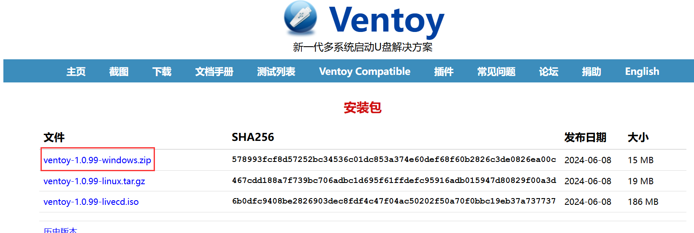
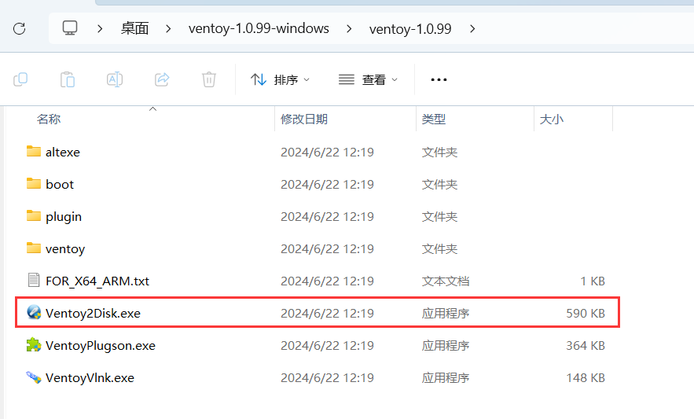
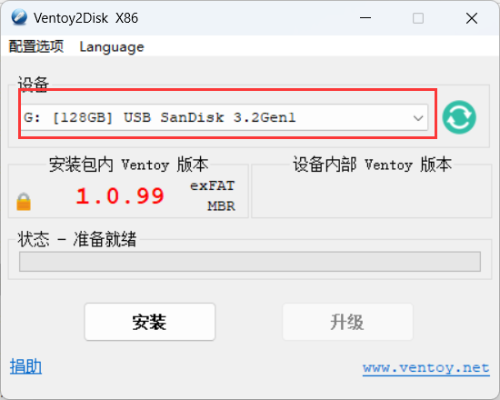
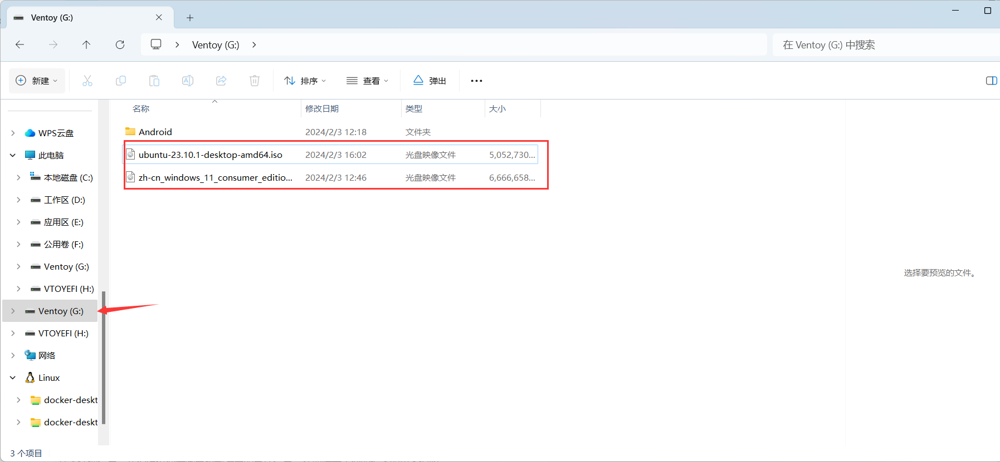
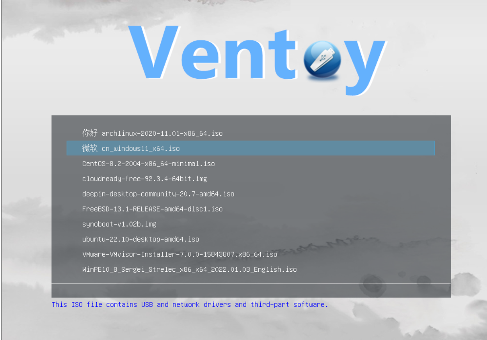

## 一、准备空U盘

首先，我们需要一个空的U盘作为启动盘，用于系统安装。

## 二、下载Ventoy刻录工具

自行安装系统需要通过系统镜像进行，而刻录工具的作用是将系统镜像装入U盘中，以便我们在BIOS中选择U盘启动进行系统安装。

我们使用Ventoy工具进行刻录：[下载Ventoy](https://www.ventoy.net/cn/download.html)

如果下载速度较慢，可以使用百度网盘的下载链接：链接：https://pan.baidu.com/s/1S4aOif3wIyCiXJn_YrrVmA?pwd=g5em 提取码：g5em

解压后，打开`ventoy2Disk.exe`。

选择你要刻录的U盘，然后点击安装。Ventoy会在U盘上创建一个启动分区，所有数据将被清除，请确保U盘中没有重要数据。

## 三、下载系统镜像

推荐几个可靠的系统镜像下载站点：

- [HelloWindows.cn - 精校 完整 极致 Windows系统下载仓储站](https://hellowindows.cn/)
- [MSDN, 我告诉你 - 做一个安静的工具站 (itellyou.cn)](https://msdn.itellyou.cn/)

你也可以使用百度网盘链接下载：链接：https://pan.baidu.com/s/1dXR-4AWbrqCwxEN7kmjq-w?pwd=u7k5 提取码：u7k5

## 四、刻录系统镜像

使用Ventoy进行刻录非常简单，只需将系统镜像文件（ISO格式）直接复制到U盘中即可。当完成安装后，你的U盘会有两个分区`Ventoy`和`VTOYEFI`，只需将ISO文件移动到`Ventoy`分区下即可。

## 五、设置BIOS启动

完成上述步骤后，关闭电脑并插入U盘启动。在启动过程中按 F2 进入BIOS（不同电脑的进入按键可能不同，如 F2 或 F12），如果不成功，请多次尝试。

### BIOS设置参考

- [戴尔台式电脑Bios设置U盘启动步骤 - 系统之家](https://www.xitongzhijia.net/xtjc/20230805/293273.html)
- [戴尔笔记本电脑BIOS设置U盘启动（新版） - CSDN博客](https://blog.csdn.net/2301_77010897/article/details/135310505)

## 六、安装系统

U盘启动后，会自动进入安装引导界面。

选择要安装的ISO文件，如果有多个镜像，会有多个条目，选中要安装的镜像并按回车即可。

详细安装步骤可以参考：[Windows 11系统新手保姆级U盘安装教程 - CSDN博客](https://blog.csdn.net/qq_46034913/article/details/131707076)

## 七、更新驱动

如果你新安装的是Windows系统，需要手动安装驱动程序。

推荐使用驱动精灵工具：[驱动精灵](https://sem.duba.net/sem/subset/f20.html?sfrom=196&keyID=0939&TFT=3&msclkid=d4172b9c1beb108370aa4dea42d67c09)

使用教程参考：[驱动精灵如何使用 - 百度经验](https://jingyan.baidu.com/article/ff42efa9731d9ec19e220229.html)

## 参考资料

- [多系统启动U盘Ventoy下载、安装、使用 - CSDN博客](https://blog.csdn.net/zengliguang/article/details/130683118)
- [HelloWindows.cn](https://hellowindows.cn/)
- [MSDN, 我告诉你](https://msdn.itellyou.cn/)
- [戴尔台式电脑Bios设置U盘启动 - 系统之家](https://www.xitongzhijia.net/xtjc/20230805/293273.html)
- [戴尔笔记本电脑BIOS设置U盘启动（新版） - CSDN博客](https://blog.csdn.net/2301_77010897/article/details/135310505)
- [驱动精灵如何使用 - 百度经验](https://jingyan.baidu.com/article/ff42efa9731d9ec19e220229.html)
- [Windows 11系统新手保姆级U盘安装教程 - CSDN博客](https://blog.csdn.net/qq_46034913/article/details/131707076)
