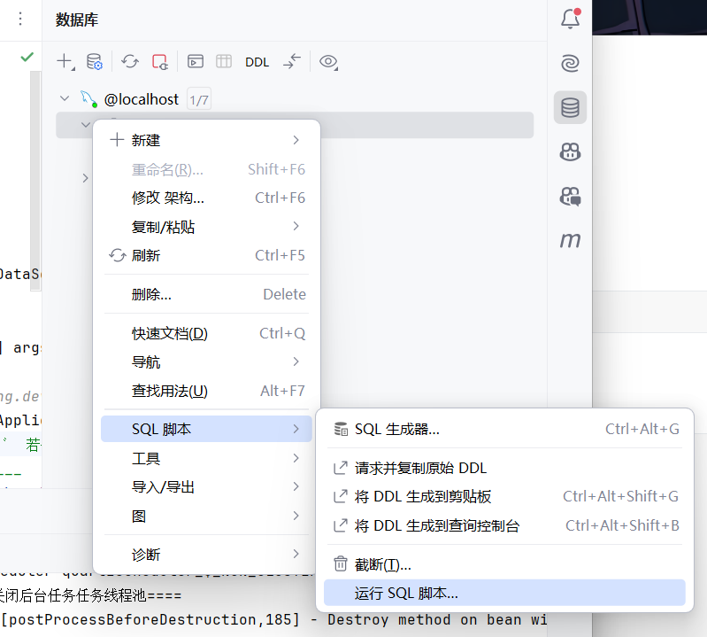
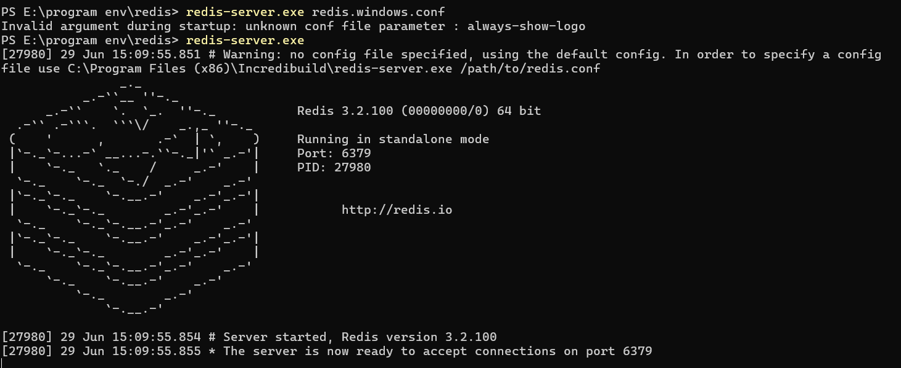
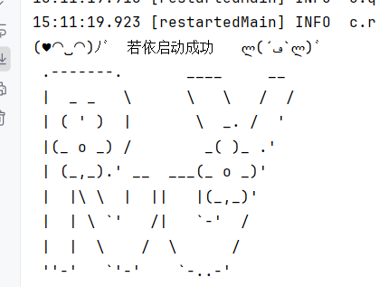
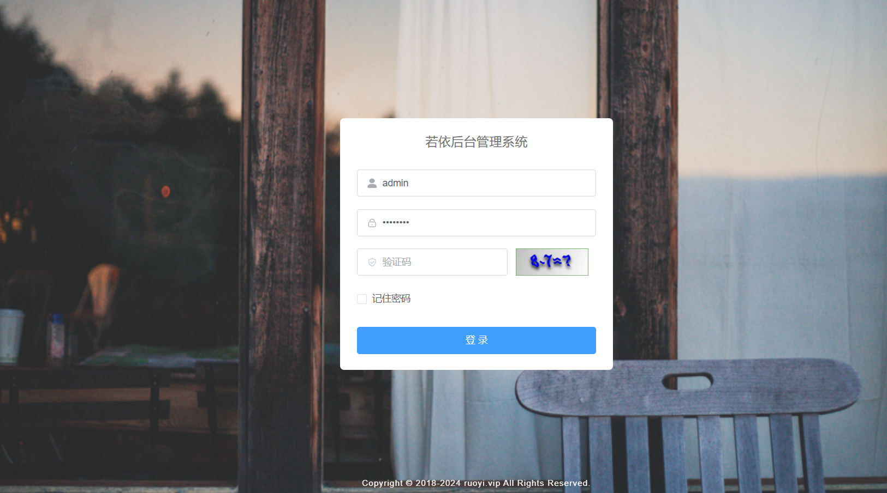

# 前言

RuoYi 是一个基于 Spring Boot 和 Vue.js 的快速开发平台，致力于为开发者提供一个轻量级的快速开发工具。它集成了用户管理、权限管理、代码生成等功能模块，是企业级开发的良好选择。本文将详细介绍如何从零开始搭建一个 RuoYi 后端项目。

# 后端项目搭建

本文代码结构

**后端：**[yangzongzhuan/RuoYi-Vue: :tada: (RuoYi)官方仓库 基于SpringBoot，Spring Security，JWT，Vue & Element 的前后端分离权限管理系统，同时提供了 Vue3 的版本 (github.com)](https://github.com/yangzongzhuan/RuoYi-Vue)

**前端：**[yangzongzhuan/RuoYi-Vue3: :tada: (RuoYi)官方仓库 基于SpringBoot，Spring Security，JWT，Vue3 & Vite、Element Plus 的前后端分离权限管理系统 (github.com)](https://github.com/yangzongzhuan/RuoYi-Vue3)

## 一、环境准备

在开始搭建项目之前，需要准备以下开发环境：

1. **JDK 1.8 及以上**：确保你的计算机上已经安装了 JDK，并配置好了环境变量。
2. **Maven**：用于项目的构建和依赖管理。
3. **IDE**：推荐使用 IntelliJ IDEA。
4. **MySQL**：数据库，版本建议使用 5.7 及以上。

## 二、获取项目源码

你可以从 [RuoYi 官方网站](https://doc.ruoyi.vip/) 下载最新版本的源码，或者直接通过 GitHub 仓库进行克隆：

```bash
git clone https://github.com/yangzongzhuan/RuoYi.git
```

## 三、导入项目到 IDE

1. **打开 IntelliJ IDEA**，选择 `File -> New -> Project from Existing Sources...`。
2. 选择刚刚克隆下来的项目目录，点击 `OK`。
3. 选择 `Import project from external model`，选择 `Maven`，然后点击 `Next`。
4. 保持默认设置，直到导入完成。

## 四、配置数据库

1. **创建数据库**：

   打开 MySQL 客户端工具，执行以下 SQL 语句创建一个新的数据库：

   ```sql
   CREATE DATABASE ruoyi DEFAULT CHARACTER SET utf8mb4 COLLATE utf8mb4_general_ci;
   ```

2. **修改配置文件**：

   打开 `src/main/resources/application-druid.yml` 文件，找到数据库配置部分，修改为你本地的数据库信息：

   ```yaml
   druid:
     datasource:
       master:
         driver-class-name: com.mysql.cj.jdbc.Driver
         url: jdbc:mysql://localhost:3306/ruoyi?serverTimezone=UTC&useUnicode=true&characterEncoding=utf8&useSSL=false
         username: root
         password: 你的数据库密码
   ```

## 五、初始化数据库

RuoYi 提供了数据库初始化脚本，你可以在 `sql` 目录下找到 `ruoyi.sql` 文件。将该文件导入到你的数据库中，以初始化必要的表和数据。两个sql脚本无导入先后顺序。



## 六、下载并启动redis

[Releases · tporadowski/redis (github.com)](https://github.com/tporadowski/redis/releases)

```bash
redis-server.exe redis.windows.conf
```



## 七、启动项目

在 IDEA 中，找到 `RuoYiApplication.java` 文件，右键选择 `Run 'RuoYiApplication.main()'`，启动项目。



## 八、项目结构说明

RuoYi 后端项目的主要目录结构如下：

- `ruoyi-admin`：管理后台模块，主要包含控制器层代码。
- `ruoyi-common`：公共模块，包含一些公共的工具类和配置。
- `ruoyi-framework`：框架模块，主要包含一些核心的框架代码，如安全认证、拦截器等。
- `ruoyi-generator`：代码生成模块，包含代码生成器的相关代码。
- `ruoyi-quartz`：定时任务模块，包含定时任务的相关代码。
- `ruoyi-system`：系统模块，主要包含系统的业务逻辑代码，如用户管理、权限管理等。


# 前端项目搭建

## 一、环境准备

在开始搭建前端项目之前，需要准备以下开发环境：

1. **Node.js**：推荐安装 LTS 版本，可以从 [Node.js 官方网站](https://nodejs.org) 下载。
2. **VSCode**：轻量级的代码编辑器，可以从 [VSCode 官方网站](https://code.visualstudio.com) 下载。

## 二、获取前端项目源码

你可以从 [RuoYi 官方网站](https://doc.ruoyi.vip/) 下载最新版本的前端源码，或者直接通过 GitHub 仓库进行克隆：

```bash
git clone https://github.com/yangzongzhuan/ruoyi-vue3.git
```

## 三、安装依赖

1. **打开 VSCode**，选择 `File -> Open Folder...`，选择刚刚克隆下来的前端项目目录。

2. 打开终端，执行以下命令安装项目依赖：

   ```bash
   npm install
   ```

## 四、配置环境变量

在项目根目录下找到 `.env.development` 文件，修改后端 API 地址为你本地的后端项目地址：

```env
VITE_APP_BASE_API = 'http://localhost:8080'
```

## 五、启动项目

在终端中执行以下命令启动前端项目：

```bash
npm run dev
```

启动成功后，可以在浏览器中访问 `http://localhost:80`，使用默认管理员账号 `admin` 和密码 `admin123` 进行登录。



## 六、项目结构说明

RuoYi-Vue3 前端项目的主要目录结构如下：

- `src`：项目源码目录。
  - `api`：存放 API 请求相关代码。
  - `assets`：存放静态资源。
  - `components`：存放公共组件。
  - `router`：存放路由配置。
  - `store`：存放 Vuex 状态管理相关代码。
  - `views`：存放各页面视图。
  - `utils`：存放工具函数。
  
- `public`：公共静态资源目录。
