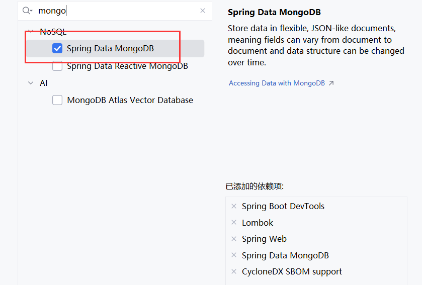
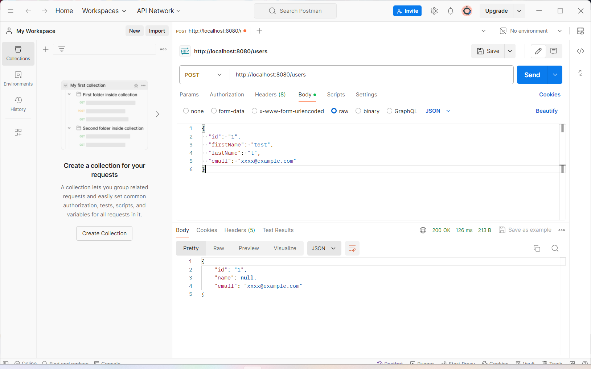
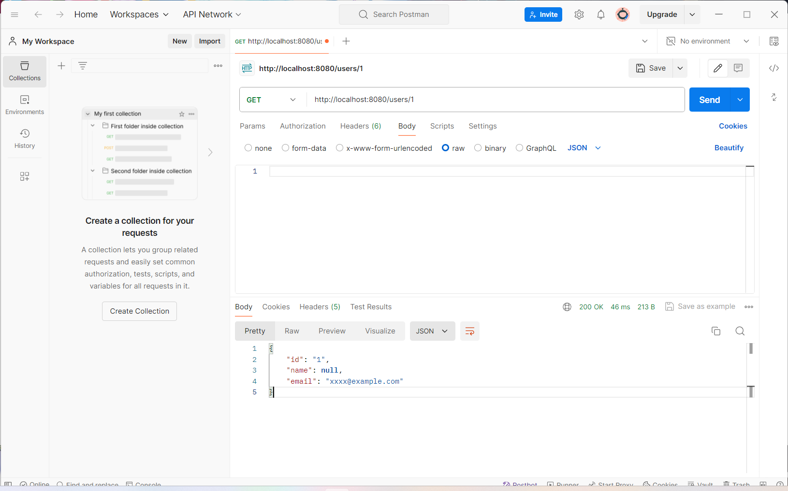
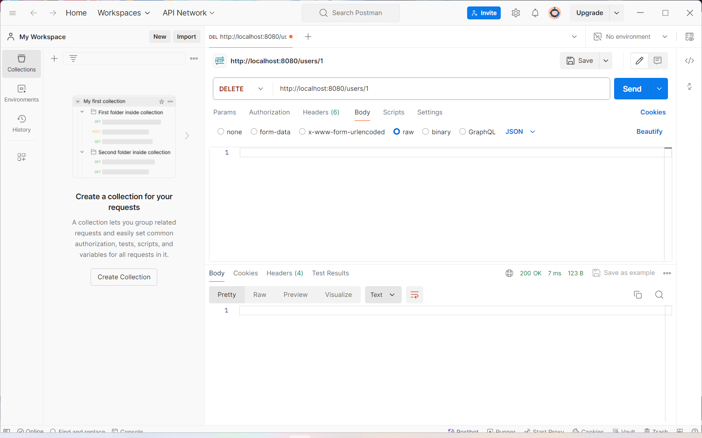

# MongoDB

MongoDB 是一种基于文档的NoSQL数据库，以其高性能、高可用性和易扩展性而著称。它使用 BSON（类似 JSON 的二进制格式）来存储数据，提供了灵活的数据模型，使得开发者可以更轻松地存储和查询复杂的数据结构。将MongoDB与Spring Boot应用程序整合可以大大增强应用程序的数据处理能力。本指南将带你一步步完成如何通过Docker或Flapdoodle嵌入式MongoDB库来设置MongoDB与Spring Boot的整合。

[MongoDB: The Developer Data Platform | MongoDB](https://www.mongodb.com/)

[MongoDB 教程 | 菜鸟教程 (runoob.com)](https://www.runoob.com/mongodb/mongodb-tutorial.html)

## MongoDB 的主要特点

1. **文档存储**：MongoDB 使用文档（Document）作为数据的基本存储单位。一个文档是一个键值对的集合，类似于 JSON 对象。这种存储方式使得数据的表示更加直观和灵活。
2. **灵活的数据模型**：与传统的关系型数据库不同，MongoDB 允许在一个集合（Collection）中存储具有不同结构的文档。这种灵活性使得应用程序能够更快速地适应变化。
3. **高性能**：MongoDB 提供高效的查询性能和写入速度，能够处理大量的数据和高并发的操作。
4. **高可用性和自动分片**：MongoDB 支持复制集（Replica Set）和分片（Sharding），从而实现数据的高可用性和水平扩展。复制集提供了数据的冗余和故障切换能力，而分片允许将数据分布在多个服务器上以实现负载均衡。
5. **丰富的查询语言**：MongoDB 提供了强大的查询语言，可以通过条件、排序、聚合等多种方式来查询和操作数据。还支持全文搜索、地理空间查询等高级功能。
6. **事务支持**：从 MongoDB 4.0 开始，支持多文档 ACID 事务，使得开发者可以在多个文档之间进行原子性操作。

## 使用场景

- **内容管理系统**：灵活的数据模型使得 MongoDB 能够轻松存储和管理不同类型的内容。
- **实时分析**：高性能和丰富的查询功能使得 MongoDB 成为实时数据分析和处理的理想选择。
- **物联网（IoT）应用**：可以高效地处理来自各种设备的大量数据。
- **移动应用和游戏**：能够处理高并发的用户请求，并提供快速的响应时间。

---


# SpringBoot + MongoDB

## 添加MongoDB依赖

首先，你需要在`pom.xml`文件中添加MongoDB相关的依赖。



```xml
<dependencies>
    <dependency>
        <groupId>org.springframework.boot</groupId>
        <artifactId>spring-boot-starter-data-mongodb</artifactId>
    </dependency>
</dependencies>
```

## 使用Docker启动MongoDB

如果你选择使用Docker启动MongoDB，可以按照以下步骤进行操作：

1. 确保已安装Docker。
2. 使用以下命令启动MongoDB容器：

```bash
docker run -p 27017:27017 -d mongo:latest
```


## 配置文件

在Spring Boot的`application.yml`文件中配置MongoDB连接：

```yaml
spring:
  data:
    mongodb:
      host: localhost
      port: 27017
      database: test
```


## 示例

与 [初识Apache Cassandra：从基础到实践](/2024/06/11/2024-06-11/) 中的代码基本相同，可跳转至文章阅读第五节。

**实体类**

```java
package org.mongodbdemo.pojo;

import lombok.AllArgsConstructor;
import lombok.Data;
import lombok.AccessLevel;
import lombok.NoArgsConstructor;
import org.springframework.data.annotation.Id;
import org.springframework.data.mongodb.core.mapping.Document;

@Data
@Document
@AllArgsConstructor
@NoArgsConstructor(access = AccessLevel.PRIVATE, force = true)
public class User {
    @Id
    private String id;
    private String name;
    private String email;
}
```

**存储库接口**

```java
package org.mongodbdemo.repo;

import org.mongodbdemo.pojo.User;
import org.springframework.data.repository.CrudRepository;

public interface UserRepo extends
        CrudRepository<User, String>{
}
```

**服务类**

```java
package org.mongodbdemo.service;
import org.mongodbdemo.pojo.User;
import org.mongodbdemo.repo.UserRepo;
import org.springframework.beans.factory.annotation.Autowired;
import org.springframework.stereotype.Service;
import java.util.Optional;

@Service
public class UserService {

    @Autowired
    private UserRepo userRepo;

    public User saveUser(User user) {
        return userRepo.save(user);
    }

    public Optional<User> getUserById(String id) {
        return userRepo.findById(id);
    }

    public Iterable<User> getAllUsers() {
        return userRepo.findAll();
    }

    public void deleteUserById(String id) {
        userRepo.deleteById(id);
    }
}
```

**控制类**

```java
package org.mongodbdemo.controller;

import org.mongodbdemo.pojo.User;
import org.mongodbdemo.service.UserService;
import org.springframework.beans.factory.annotation.Autowired;
import org.springframework.web.bind.annotation.*;

import java.util.Optional;

@RestController
@RequestMapping("/users")
public class UserController {

    @Autowired
    private UserService userService;

    // 创建用户
    @PostMapping
    public User createUser(@RequestBody User user) {
        return userService.saveUser(user);
    }

    // 获取用户
    @GetMapping("/{id}")
    public Optional<User> getUser(@PathVariable String id) {
        return userService.getUserById(id);
    }

    // 获取所有用户
    @GetMapping
    public Iterable<User> getAllUsers() {
        return userService.getAllUsers();
    }

    // 删除用户
    @DeleteMapping("/{id}")
    public void deleteUser(@PathVariable String id) {
        userService.deleteUserById(id);
    }
}
```

**测试结果**

增加



查询



删除


