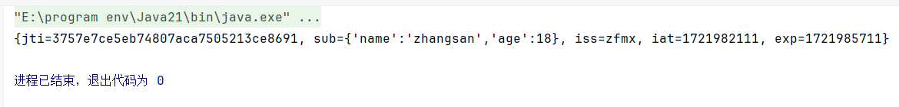

#  前言

**jjwt 库** 是一个流行的 Java 库，用于创建和解析 JWT。我在学习spring security 的过程中看到了很多关于jwt的教程，其中最流行的就是使用jjwt实现jwt认证，但是教程之中依然使用的旧版的jjwt库，许多的类与方法已经标记弃用或者是已经被删除了，新版 jjwt 增加了许多新特性和改进，使得生成和验证 JWT 更加方便，故写此文以作记忆。

**环境：**

- jjwt 0.12.5
- jdk17+
- Maven 
- Spring Boot 3.3.1

# JWT的相关知识

 **JSON Web Token (JWT)** 是一个开放标准（RFC 7519），它定义了一种紧凑的、自包含的方式，用于在各方之间以 JSON 对象的形式安全地传输信息。由于这些信息是经过数字签名的，因此可以被验证和信任。

## JWT 的结构

JWT 由三部分组成：头部（Header）、载荷（Payload）和签名（Signature），这三部分用点 (`.`) 分隔。

1. **头部（Header）**： 头部通常包括两部分：令牌的类型（JWT）和所使用的签名算法（如 HMAC SHA256 或 RSA）。

   ```json
   {
     "alg": "HS256",
     "typ": "JWT"
   }
   ```

   这部分会进行 Base64Url 编码，形成 JWT 的第一部分。

2. **载荷（Payload）**： 载荷部分包含声明（Claims），声明是有关实体（通常是用户）和其他数据的声明。有三种类型的声明：注册声明（Registered claims）、公共声明（Public claims）和私有声明（Private claims）。

   例如：

   ```json
   {
     "sub": "1234567890",
     "name": "zfmx",
     "iat": 1516239022
   }
   ```

   这部分也会进行 Base64Url 编码，形成 JWT 的第二部分。

3. **签名（Signature）**： 签名部分用于验证消息在传输过程中是否未被篡改。需要将编码后的头部和载荷用点 (`.`) 连接在一起，然后使用指定的签名算法（如 HMAC SHA256）和一个密钥对其进行签名。签名的结果是 JWT 的第三部分。

# 编写JWT工具

## 引入jjwt库

首先要做的就是把jjwt引入到项目之中

```xml
<dependency>
    <groupId>io.jsonwebtoken</groupId>
    <artifactId>jjwt</artifactId>
    <version>0.12.5</version>
</dependency>
```

写本文时最新的库应该是0.12.6，但是在引入过程中jjwt-jackson的坐标定位失败，故采用了0.12.5。

## 定义属性

这里有两个属性需要定义：

- 有效时间：public static final Long  JWT_TTL
- 加密密钥：public static final String  JWT_KEY

## 加密方法

传入subject、ttlMillis、uuid生成tooken。

`hmacShaKeyFor` 方法生成的密钥可以用于 JWT 的签名和验证。

`currentTimeMillis` 方法生成时间戳

`Jwts`类构建一个jwt构建器返回

```java
 /**
 * 生成JWT
 * @param subject 用户信息 json格式
 * @param ttlMillis 有效时间
 * @param uuid 自定义uuid
 * @return JWT令牌
 */
private static JwtBuilder getJwtBuilder(String subject, Long ttlMillis, String uuid){
    SecretKey secretKey = Keys.hmacShaKeyFor(JwtUtil.JWT_KEY.getBytes(StandardCharsets.UTF_8));

    long nowMillis = System.currentTimeMillis();    // 当前时间戳
    Date now = new Date(nowMillis);                 // 当前时间
    if(ttlMillis == null){
        ttlMillis = JwtUtil.JWT_TTL;
    }
    long expMillis = nowMillis + ttlMillis;     // 过期时间戳
    Date exp = new Date(expMillis);             // 过期时间
    return Jwts.builder()
            .id(uuid)
            .subject(subject)
            .issuer("zfmx")
            .issuedAt(now)
            .signWith(secretKey)
            .expiration(exp);
}
```

值得注意的是，原本的setId、setSubject等方法已经在新版jjwt中废弃，这里采用的是新版的写法

## 生成token

注意这里的getUUID为自己实现的生成uuid方法，重载createJWT方法来适应多种应用情况

```java
/**
 * 生成JWT
 * @param subject 用户信息 json格式
 * @return JWT令牌
 */
public static String createJWT(String subject){
    JwtBuilder jwtBuilder = getJwtBuilder(subject, null, getUUID());
    return jwtBuilder.compact();
}

/**
 * 生成JWT
 * @param subject 用户信息 json格式
 * @param ttlMillis 有效时间
 * @return JWT令牌
 */
public static String createJWT(String subject, Long ttlMillis){
    JwtBuilder builder = getJwtBuilder(subject, ttlMillis, getUUID());
    return builder.compact();
}

/**
 * 生成JWT
 * @param id 自定义uuid
 * @param subject 用户信息 json格式
 * @param ttlMillis 有效时间
 * @return JWT令牌
 */
public static String createJWT(String id,String subject,Long ttlMillis){
    JwtBuilder builder = getJwtBuilder(subject, ttlMillis, id);
    return builder.compact();
}

// 生成uuid
public static String getUUID(){
    return UUID.randomUUID().toString().replaceAll("-","");
}
```

## 解码方法

```java
/**
 * 解析JWT
 * @param jwt JWT令牌
 * @return Claims
 * @throws Exception 解析异常
 */
public static Claims parseJWT(String jwt) throws Exception{
    SecretKey secretKey = Keys.hmacShaKeyFor(JwtUtil.JWT_KEY.getBytes());
    return Jwts.parser()
            .verifyWith(secretKey)
            .build()
            .parseSignedClaims(jwt)
            .getPayload();
}
```

这里的parser()\parseSignedClaims()等方法都是新版的使用方法。

## 浅浅测试一下吧

```java
public static void main(String[] args) throws Exception {
    var token = createJWT("{'name':'zhangsan','age':18}");
    Claims claims = parseJWT(token);
    System.out.println(claims);
}
```



# 参考

[JSON Web 令牌 - 维基百科 --- JSON Web Token - Wikipedia](https://en.wikipedia.org/wiki/JSON_Web_Token)

[JJWT最新版本0.12.x使用指南，实现登陆功能，JwtUtils_jjwt 0.12-CSDN博客](https://blog.csdn.net/shenyunmomie/article/details/139805325)

[jjwt/CHANGELOG.md at master · jwtk/jjwt (github.com)](https://github.com/jwtk/jjwt/blob/master/CHANGELOG.md)

[SpringSecurity-从入门到精通-三更草堂 - 起跑线小言 - 博客园 (cnblogs.com)](https://www.cnblogs.com/qipaoxian/p/16920743.html)
