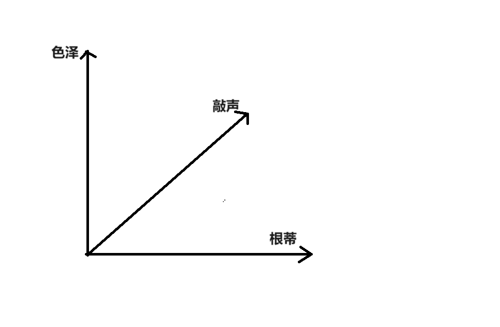

# 前言

在我们踏入机器学习的世界时，常常会被一连串晦涩的术语搞得晕头转向。然而，这些术语不仅仅是枯燥的概念，它们是理解和应用机器学习的基石，是打开数据世界的钥匙。无论你是刚刚开始探索这片领域的新手，还是已经有些经验的研究者，掌握这些术语都至关重要.在本文中，我们将逐一揭示这些术语的内涵，帮助你建立起一个系统的知识框架，提升你对机器学习的理解和应用能力。通过对这些术语的学习和掌握，你不仅能够更好地处理实际问题，还能在机器学习的道路上走得更远、更稳。

# 开始噜

为了使这些术语更加易于理解，我们将以一个生动的比喻来开启我们的讨论——想象你站在一个西瓜摊位前，面对着一堆色泽各异、形态各异的西瓜。每个西瓜都带着它的特征： 

**(色泽=青绿；根蒂=蜷缩；敲声=浊响)**  **(色泽=乌黑；根蒂=稍蜷；敲声=沉闷)**  **(色泽=浅白；根蒂=硬挺；敲声=清脆)**  ……

你看见这些记录，是因为——欢迎来到机器学习的世界。接下来，我们将从这些熟悉的西瓜开始，深入探讨与机器学习相关的基础术语。

## 数据集 

首先，让我们定义一下 **数据集 data set** 。在机器学习中，数据集是用于训练模型的一组数据。令 $D={x_1,x_2,...x_m}$ 表示包含 m 个样本的 **数据集 data set**，其中每个样本都由 d 个 **属性 attribute** 描述。每个样本 $x_i=(x_{i1},x_{i2},...x_{id})$ 是 **d 维样本空间** $X$ 中的一个向量，$x_i\in X$，其中 $x_{ij}$ 是 $x_i$ 在第 j 个属性上的取值，d 被称为样本 $x_i$ 的 **维数 dimensionality**。

回到我们西瓜摊位：

- 这个摊位上所有西瓜的记录集合就是一个 **数据集 data set** 。
- 每个西瓜都有多个特征，例如"色泽"、"根蒂"、"敲声"，这些就是数据集的 **属性 attribute** 。
- 而属性的具体值，如“青绿”、“乌黑”等，则被称为 **属性值 attribute value**。

## 样本

在数据集中，每一个独立的记录都被称为 **样本 sample** 。样本可以被定义为对一个事件或对象的描述。这意味着，不仅仅是物理对象，如西瓜，可以被称为样本，事件也可以。例如，在一个交通监控系统中，每次发生的交通事故可以被记录为一个样本。这个样本可能包含事故发生的时间、地点、涉及的车辆数量和类型、天气状况等信息。所有这些事故样本汇总在一起，就构成了一个交通事故数据集。通过分析这些数据，研究人员可以找出事故多发的时间段和地点，识别导致事故的关键因素，从而采取有效的预防措施。

## 样本空间

有点扯远了，我们再回到我们的西瓜摊，接下来，让我们来了解 **样本空间 sample space** 。样本空间是由属性张成的空间，所以也可以叫做 **属性空间 attribute space** 。想象我们用"色泽"、"根蒂"、"敲声"三个属性作为坐标轴(x, y, z)，这些属性构成了一个三维样本空间。这个空间中的每个点都对应一个特征向量，所以我们可以将每个西瓜（也就是一个样本）表示为一个 **特征向量 feature vector**  。

## 训练

要从一堆西瓜中挑选出好吃的，我们需要学习哪些西瓜会更好吃。在机器学习中，这个从数据中学得模型的过程被称为 **训练 training** 或者 **学习 learning**  。训练过程中使用的数据被称为 **训练数据 training data** ，每个样本被称为一个 **训练样本 training sample** ，这些训练样本的集合被称为 **训练集 training set**  。

 

## 标记

在训练模型之后，我们需要使用模型进行**预测 prediction**，也就是判断出哪个西瓜更好吃。为了做到这一点，在训练阶段我们会给训练数据标记好结果信息，标记哪些西瓜是好吃的。通常用 $(x_i,y_i)$ 表示第 i 个样本，其中 $y_i\in Y$ 是样本 $x_i$ 的标记，$Y$ 是所有标记的集合，称为**标记空间 label space** 或 **输出空间 output space**。

## 分类与回归

如果我们预测的是离散值，比如判断这个西瓜是好是坏，那么这个任务就被称为 **分类 classification** 任务。如果这个分类任务只涉及两个类别，那么它被称为 **二分类 binary classification** 任务；如果涉及多个类别，则称为 **多分类 multi-class classification** 任务。如果我们预测的是连续值，比如判断西瓜的成熟度（如 0.95, 0.50），那么这个任务就被称为 **回归 regression**。

简单来说，**分类预测离散值，而回归预测连续值**。

定义上，预测任务是希望通过对训练集 ${(x_1,y_1),(x_2,y_2)...(x_m,y_m)}$ 的学习，建立一个从输入空间 $X$ 到输出空间 $Y$ 的映射 $f：x - y$。对于二分类任务，通常令 $y = {-1,1}$ 或 $y = {0,1}$；对于多分类任务常用 $|y|>2$；对于回归任务，$y=R$，$R$ 为实数集。

## 测试

学得模型后，使用它进行预测的过程被称为 **测试 testing**，被预测的样本则称为 **测试样本 testing sample** 。例如，在学得映射函数 $f$ 后，我们可以对测试样本 $x$ 进行预测，得到预测标记 $y=f(x)$。

## 聚类

**聚类 clustering**  是通过样本的属性特征自动将样本分成若干组的过程，每个组称为一个 **簇 cluster** 。这些自动形成的簇可能对应着一些潜在的概念划分。根据训练过程中是否使用了标记信息，学习任务可以划分为两大类：

- **监督学习（supervised learning）** ：如分类、回归任务。
- **无监督学习（unsupervised learning）**：如聚类。

## 泛化能力

最后，机器学习的目标是让学得的模型不仅能在训练样本上表现出色，更能在新样本上也具备良好的预测能力。这种模型适用于新样本的能力被称为 **泛化能力 generalization ability** 。

# 后记

通过这篇文章，我们借助一个简单而生动的比喻，带领你走进了机器学习的基础术语世界。就像站在西瓜摊前挑选西瓜一样，理解和掌握这些术语也是迈向机器学习领域的第一步。这些术语构成了机器学习的语言，帮助我们描述、分析和解决各种数据问题。无论是数据集、样本空间，还是训练、测试，这些概念在机器学习中都扮演着至关重要的角色。掌握它们不仅能帮助你更好地理解机器学习的基本原理，还能为你在未来的学习和研究中奠定坚实的基础。机器学习是一个充满挑战和机遇的领域。随着你不断深入探索，你会发现更多的术语和概念会进入你的视野。希望这篇文章能成为你旅程中的一块垫脚石，帮助你在机器学习的道路上走得更远、更稳。

**祝愿你在机器学习的世界里探索得愉快，并取得丰硕的成果！**

