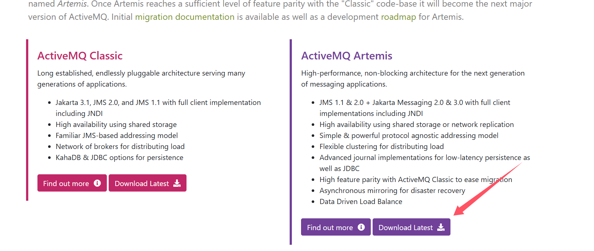

#  1.安装ActiveMQ Artemis

ActiveMQ Artemis 是 Apache ActiveMQ 的下一代消息队列服务。你可以在官方页面下载所需的安装包：[ActiveMQ (apache.org)](https://activemq.apache.org/index.html)

下载并解压后，进入 `bin` 目录，执行以下命令来创建实例。




# 2.创建实例

为方便管理，建议在解压目录的同级位置创建一个 `Instance` 文件夹，实例将被创建到该目录。

1. 打开终端或命令行，进入解压后的 `bin` 目录。

2. 运行以下命令：

   ```bash
   ./artemis create /path/to/Instance
   ```

   其中，`/path/to/Instance` 为你刚刚创建的文件夹路径。


# 3.运行ActiveMQ Artemis

切换到刚刚创建的实例目录，并进入 `bin` 子目录，使用以下命令启动 ActiveMQ Artemis：

```bash
./artemis run
```

启动后，你将看到 Artemis 服务正在监听相关端口并等待连接请求。


# 4.访问Artemis控制台

地址：http://localhost:8161  ，输入刚刚的用户名和密码


# 5.在 Spring Boot 中集成 ActiveMQ Artemis

在 Spring Boot 应用中，可以通过配置文件来简化与 Artemis 的集成。

## 配置文件示例

在 `application.yml` 中配置 Artemis 连接：

```yaml
spring:
  artemis:
    mode: native
    broker-url: tcp://localhost:61616
    user: admin
    password: xxxx
  jms:
    template:
      default-destination: tacocloud.order.queue
```

## 发送消息示例

使用 `JmsTemplate` 将订单发送到队列：

```java
package tacos.messaging;

import jakarta.annotation.Resource;
import org.springframework.jms.core.JmsTemplate;
import org.springframework.stereotype.Service;
import tacos.TacoOrder;

@Service
public class JmsOrderMessagingService implements OrderMessagingService {

    @Resource(name = "jmsTemplate")
    private JmsTemplate jms;

    @Override
    public void sendOrder(TacoOrder order) {
        jms.send(session -> session.createObjectMessage(order));
    }
}
```

## REST API 控制器示例

我们可以编写一个简单的控制器，通过 REST API 接收订单并发送到队列：

```java
package tacos.messaging;

import jakarta.annotation.Resource;
import org.springframework.http.HttpStatus;
import org.springframework.web.bind.annotation.*;
import tacos.TacoOrder;
import tacos.data.OrderRepository;

@RestController
@RequestMapping(path = "api/orders", produces = "application/json")
@CrossOrigin(origins = "http://localhost:8080")
public class OrderApiController {

    @Resource
    private OrderRepository orderRepo;

    @Resource
    private OrderMessagingService orderMessagingService;

    @PostMapping(consumes = "application/json")
    @ResponseStatus(HttpStatus.CREATED)
    public TacoOrder postOrder(@RequestBody TacoOrder order) {
        TacoOrder saved = orderRepo.save(order);
        orderMessagingService.sendOrder(saved);
        return saved;
    }
}
```
