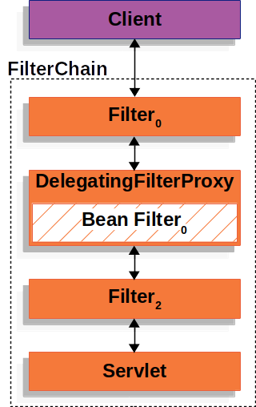
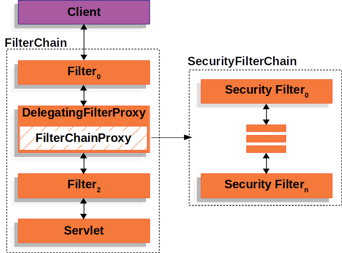

Spring Security 是一个强大且灵活的安全框架，其核心功能包括身份认证、授权和防御常见攻击。要深入了解其底层原理，需要理解以下关键概念和组件。而Spring Security的底层原理是传统的 **Servlet过滤器** ，欲了解更多详细信息，您可以访问 [Architecture :: Spring Security](https://docs.spring.io/spring-security/reference/servlet/architecture.html)。
## 1. A Review of Filters
下图展示了处理一个Http请求时，过滤器和Servlet的工作流程


客户端向应用程序发送请求，容器根据请求 URI 的路径创建一个`FilterChain` ，其中包含应处理`HttpServletRequest`的`Filter`实例和`Servlet` 。在 Spring MVC 应用程序中，`Servlet`是[`DispatcherServlet`](https://docs.spring.io/spring-framework/docs/6.1.12/reference/html/web.html#mvc-servlet)的实例。一个`Servlet`最多可以处理一个`HttpServletRequest`和`HttpServletResponse` 。然而，多个`Filter`可用于：

- 防止调用下游`Filter`实例或`Servlet` 。在这种情况下， `Filter`通常会写入`HttpServletResponse` 。
- 修改下游`Filter`实例和`Servlet`使用的`HttpServletRequest`或`HttpServletResponse` 。

`FilterChain`的使用示例：
```java
public void doFilter(ServletRequest request, 
					 ServletResponse response, FilterChain chain) { 
	// do something before the rest of the application
	chain.doFilter(request, response); 
	// do something after the rest of the application
}
```
由于`Filter`仅影响下游`Filter`实例和`Servlet` ，因此调用每个`Filter`顺序非常重要。

## 2. DelegatingFilterProxy
Spring 提供了一个名为[`DelegatingFilterProxy`](https://docs.spring.io/spring-framework/docs/6.1.12/javadoc-api/org/springframework/web/filter/DelegatingFilterProxy.html)的`Filter`实现，它允许在 Servlet 容器的生命周期和 Spring 的`ApplicationContext`之间进行桥接。 Servlet容器允许使用自己的标准注册`Filter`实例，但它不知道Spring定义的Bean。可以通过标准 Servlet 容器机制注册`DelegatingFilterProxy` ，但将所有工作委托给实现`Filter` Spring Bean。

`DelegatingFilterProxy`从`ApplicationContext`中查找 Bean Filter 0  ，然后调用 Bean Filter 0。

```java
public void doFilter(ServletRequest request, 
					 ServletResponse response, FilterChain chain) {
	Filter delegate = getFilterBean(someBeanName); // 延迟获取注册为 Spring Bean 的 Filter
	delegate.doFilter(request, response); // 将工作委托给 Spring Bean
}
```
`DelegatingFilterProxy`的另一个好处是它允许延迟查找`Filter` bean 实例。这很重要，因为容器需要在容器启动之前注册`Filter`实例。然而，Spring 通常使用`ContextLoaderListener`来加载 Spring Bean，直到需要注册`Filter`实例之后才会完成此操作。

## 3. FilterChainProxy
Spring Security 的 Servlet 支持包含在`FilterChainProxy`中。 `FilterChainProxy`是 Spring Security 提供的一个特殊`Filter` ，它允许通过 `SecurityFilterChain` 委托给许多`Filter`实例。由于`FilterChainProxy`是一个 Bean，因此它通常包装在 DelegatingFilterProxy 中。


## 4. SecurityFilterChain
[FilterChainProxy](https://docs.spring.io/spring-security/reference/servlet/architecture.html#servlet-filterchainproxy)使用[`SecurityFilterChain`](https://docs.spring.io/spring-security/site/docs/6.3.3/api/org/springframework/security/web/SecurityFilterChain.html)来确定应为当前请求调用哪些 Spring Security `Filter`实例。


`SecurityFilterChain`中的[安全过滤器](https://docs.spring.io/spring-security/reference/servlet/architecture.html#servlet-security-filters)通常是 Bean，但它们是使用`FilterChainProxy`而不是[DelegatingFilterProxy](https://docs.spring.io/spring-security/reference/servlet/architecture.html#servlet-delegatingfilterproxy)注册的。 `FilterChainProxy`提供了直接向 Servlet 容器或[DelegatingFilterProxy](https://docs.spring.io/spring-security/reference/servlet/architecture.html#servlet-delegatingfilterproxy)注册的许多优点。首先，它为 Spring Security 的所有 Servlet 支持提供了一个起点。因此，如果尝试对 Spring Security 的 Servlet 支持进行故障排除，那么在`FilterChainProxy`中添加调试点是一个很好的起点。

由于`FilterChainProxy`是 Spring Security 使用的核心，因此它可以执行不被视为可选的任务。例如，它清除`SecurityContext`以避免内存泄漏。它还应用 Spring Security 的[`HttpFirewall`](https://docs.spring.io/spring-security/reference/servlet/exploits/firewall.html#servlet-httpfirewall)来保护应用程序免受某些类型的攻击。

它在确定何时应调用`SecurityFilterChain`方面提供了更大的灵活性。在 Servlet 容器中，仅根据 URL 调用`Filter`实例。但是， `FilterChainProxy`可以使用`RequestMatcher`接口根据`HttpServletRequest`中的任何内容确定调用。


在上图中， `FilterChainProxy`决定应使用哪个`SecurityFilterChain` 。仅调用第一个匹配的`SecurityFilterChain` 。如果请求`/api/messages/`的 URL，它首先匹配`/api/**`的`SecurityFilterChain 0`模式，因此仅调用`SecurityFilterChain 0` ，即使它也匹配`SecurityFilterChain n` 。如果请求`/messages/`的 URL，则它与`/api/**`的`SecurityFilterChain 0`模式不匹配，因此`FilterChainProxy`继续尝试每个`SecurityFilterChain` 。假设没有其他`SecurityFilterChain`实例匹配，则调用`SecurityFilterChain n` 。`SecurityFilterChain 0`仅配置了三个安全`Filter`实例。然而， `SecurityFilterChain n`配置了四个安全`Filter`实例。需要注意的是，每个`SecurityFilterChain`都可以是唯一的，并且可以单独配置。事实上，如果应用程序希望 Spring Security 忽略某些请求， `SecurityFilterChain`安全`Filter`实例可能为零。


## 5. Security Filters
安全过滤器通过[SecurityFilterChain](https://docs.spring.io/spring-security/reference/servlet/architecture.html#servlet-securityfilterchain) API 插入到[FilterChainProxy](https://docs.spring.io/spring-security/reference/servlet/architecture.html#servlet-filterchainproxy)中。这些过滤器可用于多种不同的目的，例如[身份验证](https://docs.spring.io/spring-security/reference/servlet/authentication/index.html)、[授权](https://docs.spring.io/spring-security/reference/servlet/authorization/index.html)、[漏洞保护](https://docs.spring.io/spring-security/reference/servlet/exploits/index.html)等。过滤器按照特定的顺序执行，以保证它们在正确的时间被调用，例如，执行身份验证的`Filter`应该在执行授权的`Filter`之前被调用。通常不需要知道 Spring Security 的`Filter`的顺序。但是，有时了解顺序是有好处的，如果您想了解它们，可以检查[`FilterOrderRegistration`代码](https://github.com/spring-projects/spring-security/tree/6.3.3/config/src/main/java/org/springframework/security/config/annotation/web/builders/FilterOrderRegistration.java)。
```java
@Configuration
@EnableWebSecurity
public class SecurityConfig {

    @Bean
    public SecurityFilterChain filterChain(HttpSecurity http) throws Exception {
        http
            .csrf(Customizer.withDefaults())
            .authorizeHttpRequests(authorize -> authorize
                .anyRequest().authenticated()
            )
            .httpBasic(Customizer.withDefaults())
            .formLogin(Customizer.withDefaults());
        return http.build();
    }

}
```
