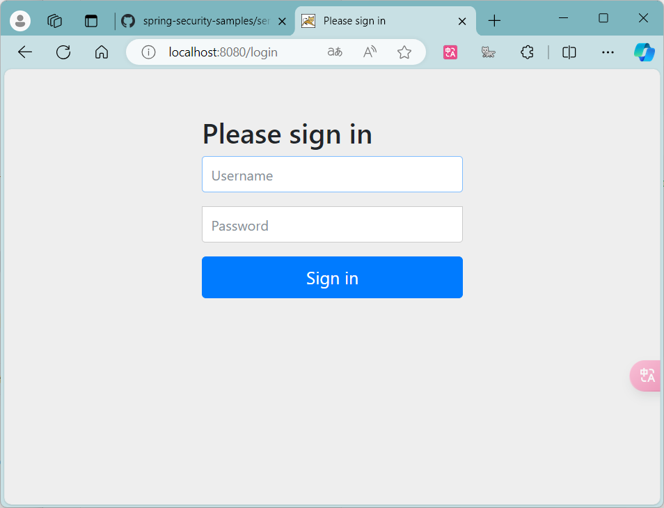
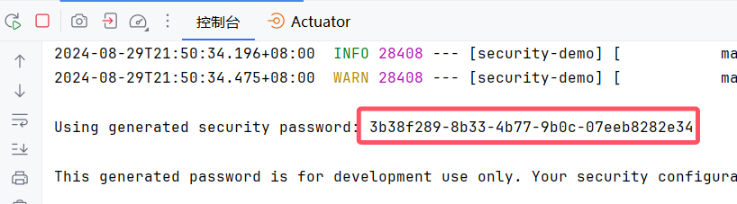
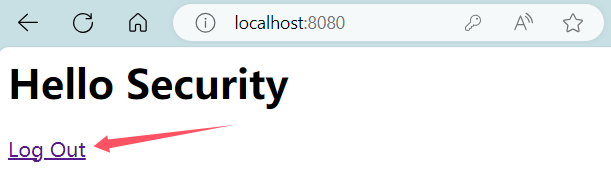
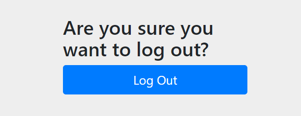
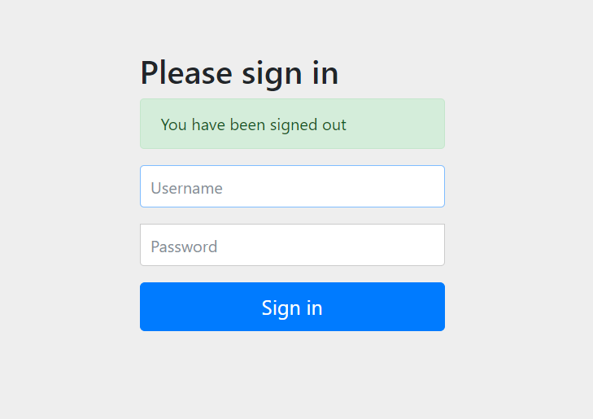
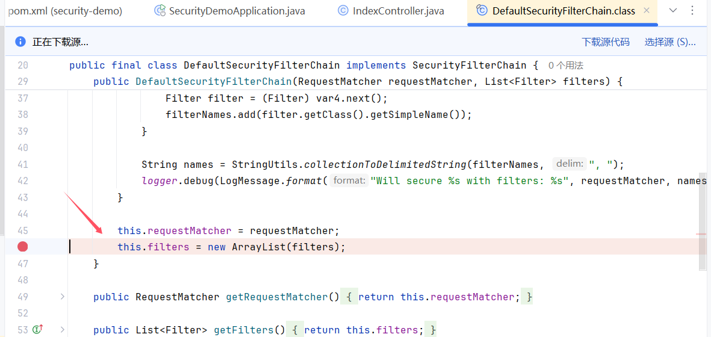

## 官方文档

欲了解更多详细信息，您可以访问 [Spring Security 官方文档](https://docs.spring.io/spring-security/reference/index.html)。

### 功能概述

Spring Security 是一款强大的安全框架，主要提供以下功能：

- **身份认证** (Authentication)：验证用户的身份。
- **授权** (Authorization)：控制用户对资源的访问权限。
- **防御常见攻击** (Protection against common attacks)：如CSRF、会话劫持等。

# 1. 身份认证 (Authentication)

在这个部分，我们将通过一个简单的Spring Boot项目演示如何配置和使用Spring Security进行身份认证。

官方样例代码库：[spring-projects/spring-security-samples (GitHub)](https://github.com/spring-projects/spring-security-samples)

### 1.1 创建项目

我们将使用以下技术栈创建一个基本的Spring Boot项目：

- **JDK**：17
- **Spring Boot**：3.3.3
- **Dependencies**：Spring Web, Spring Security, Thymeleaf

#### 初始化项目

您可以使用 [Spring Initializr](https://start.spring.io/) 来快速生成项目骨架，选择上述依赖项即可。

### 1.2 创建控制器 `IndexController`

控制器负责处理基本的页面请求，我们创建一个简单的 `IndexController` 来返回主页：

```java
import org.springframework.stereotype.Controller;  
import org.springframework.web.bind.annotation.GetMapping;  
  
@Controller  
public class IndexController {  
  
    @GetMapping("/")  
    public String index(){  
        return "index";  
    }  
}
```
### 1.3 创建视图 `index.html`

在 `src/main/resources/templates` 目录下创建 `index.html` 文件：
```html
<html xmlns:th="https://www.thymeleaf.org">  
<head>  
    <title>Hello Security!</title>  
</head>  
<body>  
<h1>Hello Security</h1>  
<a th:href="@{/logout}">Log Out</a>  
</body>  
</html>
```
此 `a` 标签提供了一个方便的登出链接。

### 1.4 启动项目并测试

启动项目后，访问 `http://localhost:8080/`，您将看到如下界面：

系统会自动生成一个用户名为 `user` 的用户，密码在控制台中生成并打印：

使用该用户名和密码登录后，您将看到主页，并可以通过点击 “Log Out” 链接进行登出：

点击登出后，系统会显示一个默认的登出页面提示：

成功登录后能够通过a标签登出


### 1.5 Spring Security 默认配置分析

Spring Security 在默认情况下已经提供了许多安全功能，以下是一些主要功能：

- **URL 保护**：自动保护所有应用程序URL，要求用户进行身份验证后才能访问。
- **默认用户**：在应用程序启动时自动生成一个默认用户 `user`。
- **随机密码**：为默认用户生成一个随机密码，并在控制台上打印出来。
- **默认登录表单**：生成一个默认的基于表单的登录页面和注销页面。
- **表单登录与注销**：提供简单的登录和注销机制，支持基于表单的操作。
- **请求重定向**：对于Web请求，未认证用户会被重定向到登录页面；对于服务请求，则返回 `401 Unauthorized`。
- **CSRF 保护**：自动处理跨站请求伪造（CSRF）攻击。
- **会话管理**：处理会话劫持攻击，提供会话固定保护。
- **安全头设置**：自动添加安全相关的HTTP头，如 `Strict-Transport-Security`、`X-Content-Type-Options`、`Cache-Control` 和 `X-Frame-Options`，以防止常见的安全攻击。

### 1.6 程序的启动和运行
##### DefaultSecurityFilterChain
在 Spring Security 中，`SecurityFilterChain` 接口定义了过滤链的契约，这些过滤链是处理请求的一系列过滤器。`DefaultSecurityFilterChain` 是一个常见的实现类，在配置 Spring Security 时，它会加载默认的 15 个过滤器。
**查看过滤器**
1. **插入断点**：在 `DefaultSecurityFilterChain` 类的构造方法中插入一个断点（可在源码中查找并设置断点）。
2. **启动调试模式**：运行应用程序并进入调试模式。
3. **查看加载的过滤器**：在调试控制台中，你将能够看到加载的这 15 个过滤器的详细列表。

以下是调试时控制台显示的过滤器列表截图： 



通过这种方式，可以深入了解 Spring Security 的默认过滤器是如何加载和工作的。

##### SecurityProperties
Spring Security 在初始化配置时，会通过 `SecurityProperties` 类来设置默认的用户名和密码。默认情况下，Spring Security 会自动生成一个用户名为 `user` 的账号，并生成一个随机的 `UUID` 作为密码。
**查看默认用户名和密码**
1. **初始配置**：Spring Boot 在启动时会输出生成的默认密码
2. **自定义配置**：如果需要自定义用户名和密码，可以通过在 `application.properties` 或 `application.yml` 文件中配置 `spring.security.user.name` 和 `spring.security.user.password` 来实现。
通过理解这些默认配置，可以更好地掌握 Spring Security 的安全机制。
