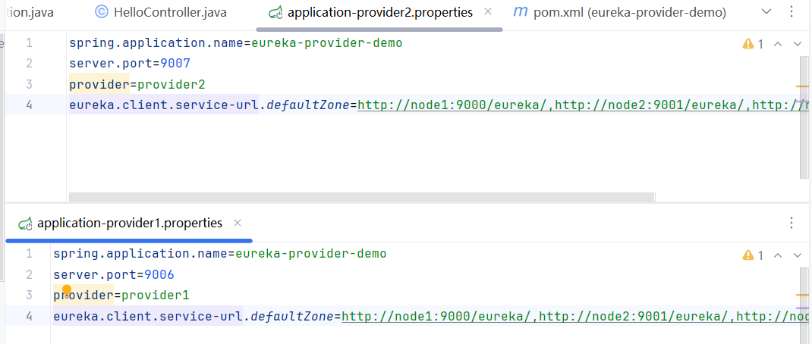

本文详细介绍如何使用 **Spring Cloud** 和 **Eureka** 实现一个微服务架构，包括服务中心集群、服务提供者集群以及服务消费者的实现。通过本例，您将学习到如何配置和使用Eureka进行服务注册与发现。具体的代码可以在github上看到：[zhifengmuxue/springcloud-learn: 微服务架构学习 (github.com)](https://github.com/zhifengmuxue/springcloud-learn)
# 架构设计

我们将实现1个服务中心集群，1个服务提供者集群以及1个服务消费者的架构；通过服务中心Eureka来进行服务治理，服务消费者调用服务提供者的服务。我们的架构由以下几部分组成：

- **服务中心集群**（Eureka Server）
- **服务提供者集群**（Eureka Client）
- **服务消费者**（使用Feign进行调用）


# 创建Spring Cloud 项目
创建一个springBoot项目


导入spring cloud 依赖以及 eureka 依赖（2018年停止维护，仅在这里用于简要说明spring cloud的工作原理，后续开发可以选用Consul或其他的实现服务集群）
附上依赖：

```xml
<dependency>  
    <groupId>org.springframework.cloud</groupId>  
    <artifactId>spring-cloud-starter-netflix-eureka-server</artifactId>  
</dependency>  
<dependency>  
    <groupId>org.springframework.cloud</groupId>  
    <artifactId>spring-cloud-starter</artifactId>  
</dependency>
```

# 用Eureka实现“服务中心”

### 添加配置文件
我们需要配置“服务中心”的地址、端口号和应用名称等重要的信息


```properties
spring.application.name=eureka-server-demo   # 应用名称
server.port=8080                             # 服务器端口号
eureka.client.register-with-eureka=true      # 是否注册到Eureka Server
eureka.client.fetch-registry=true            # 是否从Eureka Server获取注册信息
# 设置与Eureka Server交互的地址。查询服务和注册服务均依赖于此
eureka.client.serviceUrl.defaultZone=http://localhost:${server.port}/eureka/ 
```
### 实现“服务中心”集群
这一部分演示的是在一台电脑上实现“服务中心”集群，这里模拟三台：

| 访问URI           | IP(本机)  | 节点名称 | 端口号 |
| ----------------- | --------- | -------- | ------ |
| http://node1:8081 | 127.0.0.1 | node1    | 8081   |
| http://node2:8082 | 127.0.0.1 | node2    | 8082   |
| http://node3:8083 | 127.0.0.1 | node3    | 8083   |
##### 配置虚拟地址
我们先去修改本机的DNS表，新增集群的域名转换，一般配置文件在 `C:\\Windows\System32\drivers\etc` 下，名为 `hosts` 的文件


##### 多环境配置
接下来我们要创建多个配置文件，来模拟多个“服务中心”

创建节点node1的配置文件 application-node1.properties，并将“service-url"指向节点node2,node3

```properties
spring.application.name=eureka-server-demo  
server.port=8081  
# 节点的名称
eureka.instance.hostname=node1  
eureka.client.register-with-eureka=true  
eureka.client.fetch-registry=true  
# 设置与Eureka Server交互的地址
eureka.client.service-url.defaultZone=http://node2:8082/eureka/,http://node3:8083/eureka/
```
同理，我们创建node2，node3的配置文件：

(这里的图的域名写的不正确，导致呈现效果不好，这里的代码块已经修改，用节点名更换localhost)

### 注意点1
要注意的是，配置完成后无法直接启动服务，我们需要在启动器上应用注解`@EnableEurekaServer` 
```java
@SpringBootApplication  
@EnableEurekaServer  
public class EurekaServerDemoApplication {  
  
    public static void main(String[] args) {  
        SpringApplication.run(EurekaServerDemoApplication.class, args);  
    }  
  
}
```

启动之后访问8080端口即可看到服务：


###  注意点2
启动会抛出异常 `Exception: java.net.ConnectException: Connection refused: ` 
注意几个配置文件都要更改，因为后面要分别运行。

我们需要修改配置文件防止Eureka启动时注册本身服务。
参考：[SpringCloud —— Eureka详细使用教程，以及实战案例演示-CSDN博客](https://blog.csdn.net/weixin_38111957/article/details/88780334)

### 打包和部署”服务中心“
使用maven工具进行打包，记得打包前先进行clean操作


接下来我们使用命令行启动这三个服务，在命令行进入jar包的目录下，执行：

```powershell
java -jar eureka-server-demo-0.0.1-SNAPSHOT.jar --spring.profiles.active=node1
java -jar eureka-server-demo-0.0.1-SNAPSHOT.jar --spring.profiles.active=node2
java -jar eureka-server-demo-0.0.1-SNAPSHOT.jar --spring.profiles.active=node3
```
要注意的是，需要开三个命令行，分别运行上面的语句，因为我们要模拟的是三台服务中心。

我们需要依次去访问路径看看服务是否成功。（这里我发现我的8082端口占用最后换用了9000-9002端口继续进行)


至此，多节点服务中心集群已经配置完成


# 用Eureka实现”服务提供者“
### 实现”服务提供者“的客户端

##### 1. 创建Eureka客户端项目
导入eureka discovery client依赖以及springboot web依赖：
```xml
<dependency>  
    <groupId>org.springframework.boot</groupId>  
    <artifactId>spring-boot-starter-web</artifactId>  
</dependency>  
<dependency>  
    <groupId>org.springframework.cloud</groupId>  
    <artifactId>spring-cloud-starter-netflix-eureka-client</artifactId>  
</dependency>
```
##### 2. 添加配置
```properties
spring.application.name=eureka-provider-demo  
server.port=9005 
eureka.client.service-url.defaultZone=http://node1:9000/eureka/,http://node2:9001/eureka/,http://node3:9002/eureka/
```
把之前的三个配置完成的服务中心集群的地址填入这里。
##### 3. 启用注册和发现
在启动类中添加注解 `@EnableDiscoveryClient` 
```java
@SpringBootApplication  
@EnableDiscoveryClient  
public class EurekaProviderDemoApplication {  
  
    public static void main(String[] args) {  
        SpringApplication.run(EurekaProviderDemoApplication.class, args);  
    }  
  
}
```

##### 4. 添加一个测试接口
```java
@RestController  
public class HelloController {  
    @Value("${spring.application.name}")  
    private String applicationName;  
  
    @Value("${server.port}")  
    private String port;  
  
    @RequestMapping("/hello")  
    public String hello() {  
        return "Hello from " + applicationName + ":" + port;  
    }  
}
```
### 检查服务的有效性
启动服务中心集群，启动服务提供者应用，进入控制台查看服务是否注册：

可以发现在 Instances currently registered with Eureka下出现了应用名称，但是上面出现了一行红字
” **EMERGENCY! EUREKA MAY BE INCORRECTLY CLAIMING INSTANCES ARE UP WHEN THEY'RE NOT. RENEWALS ARE LESSER THAN THRESHOLD AND HENCE THE INSTANCES ARE NOT BEING EXPIRED JUST TO BE SAFE.**“ 这是Eureka的心跳检测，在测试环境中我们可以使用配置将其关闭，但是上线时一定要保证开启：

```
eureka.server.enable-self-preservation=false
```
我们去访问服务提供者，可以发现能够正常访问，这说明”服务提供者“接口正在正常工作


### 实现”服务提供者“集群
我们修改接口，让他能够区分属于哪一个服务提供者：
```java
@RestController  
public class HelloController {  
    @Value("${provider}")  
    private String name;  // 改为服务提供者名字
  
    @Value("${server.port}")  
    private String port;  
  
    @RequestMapping("/hello")  
    public String hello() {  
        return "Hello from " + name + ":" + port;  
    }  
}
```
下面我们编写配置文件，然后如同“服务中心”集群一样操作

maven打包，在命令行中执行：

```powershell
java -jar eureka-provider-demo-0.0.1-SNAPSHOT.jar --spring.profiles.active=provider1
java -jar eureka-provider-demo-0.0.1-SNAPSHOT.jar --spring.profiles.active=provider2
```
同样需要在两个窗口执行哦

至此，”服务提供者“集群配置完成

# 使用Feign实现”服务消费者“
### 实现”服务消费者“客户端

##### 1. 创建Eureka客户端项目
导入 Eureka Discovery Client 依赖 springboot web依赖以及Feign客户端依赖
```xml
<dependency>  
    <groupId>org.springframework.boot</groupId>  
    <artifactId>spring-boot-starter-web</artifactId>  
</dependency>  
<dependency>  
    <groupId>org.springframework.cloud</groupId>  
    <artifactId>spring-cloud-starter-netflix-eureka-client</artifactId>  
</dependency>  
<dependency>  
    <groupId>org.springframework.cloud</groupId>  
    <artifactId>spring-cloud-starter-openfeign</artifactId>  
</dependency>  
```
##### 2. 添加配置
```properies
spring.application.name=eureka-custom-demo  
server.port=10005  
eureka.client.register-with-eureka=false  
eureka.client.service-url.defaultZone=http://node1:9000/eureka/,http://node2:9001/eureka/,http://node3:9002/eureka/
```
这里不需要把消费者注册到服务中心，设置为false

### 调用”服务提供者“接口
##### 1. 启用客户端发现和远程调用
`@EnableDiscoveryClient` 注解启用客户端的服务注册和发现功能，`@EnableFeignClients` 注解启用Feign的远程服务调用。
```java
@SpringBootApplication  
@EnableDiscoveryClient  
@EnableFeignClients  
public class EurekaCustomDemoApplication {  
    public static void main(String[] args) {  
        SpringApplication.run(EurekaCustomDemoApplication.class, args);  
    }  
}
```
##### 2. 编写接口
定义一个接口，注解`@FeignClient` 中的 name 属性时远程”服务提供者“的名字，此接口中的方法需要和远程”服务提供者“中的方法名和参数保持一致
```java
@FeignClient(name = "eureka-provider-demo")  
public interface MyFeignClient {  
    @RequestMapping("/hello")  
    String hello();  
}
```
##### 3. 实现客户端接口
接下来将实现的MyFeignClient接口注入Controller层
```java
@RestController  
public class ConsumerController {  
    private final MyFeignClient myFeignClient;  
      
    @Autowired  
    public ConsumerController(MyFeignClient myFeignClient) {  
        this.myFeignClient = myFeignClient;  
    }  
      
    @RequestMapping("/hello")  
    public String hello() {  
        return myFeignClient.hello();  
    }  
}
```
这个接口将提供给最终用户

# 测试微服务系统
### 启动服务
启动”服务中心“集群，”服务提供者“集群，”服务消费者“

### 访问服务消费者
访问接口 http://localhost:10005/hello 


返回的是服务provider1的服务，因为实现了”服务提供者“负载均衡，当你在此访问时，会出现：

多次访问，会交替出现上述两种情况，这说明”服务提供者“集群已经正常工作。

### 异常测试
可以尝试关闭其中任意一个”服务提供者“，在此访问接口，依旧能正常工作；
可以尝试关闭其中任意两个”服务中心“，在此访问接口，依旧能正常工作。
