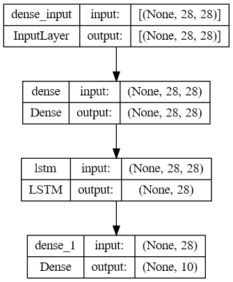
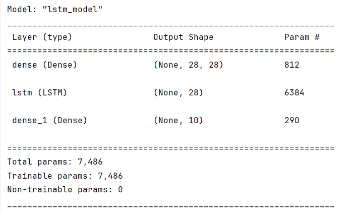
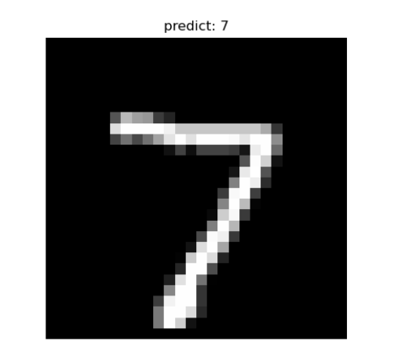

LSTM（Long Short-Term Memory，长短期记忆网络）是一种特殊类型的**循环神经网络（RNN）**，其目的是解决标准RNN难以捕捉长时间序列信息、容易遗忘远期信息的局限。LSTM能够更好地处理时间序列数据，尤其是当数据中存在长时间依赖关系时，LSTM表现尤为出色。  参考论文：[Convolutional LSTM Network: A Machine Learning Approach for Precipitation Nowcasting (neurips.cc)](https://proceedings.neurips.cc/paper/2015/hash/07563a3fe3bbe7e3ba84431ad9d055af-Abstract.html)

# 1. LSTM的工作原理

LSTM通过引入一组特殊的**门机制（Gate Mechanism）**来控制信息的流动，从而有效解决了传统RNN中的梯度消失问题。这些门决定了哪些信息需要保留、哪些信息需要遗忘，以及新信息如何被引入到当前状态。LSTM的核心组件如下：

#### 1.1 遗忘门（Forget Gate）

- **功能：** 遗忘门用于决定保留多少前一时刻的单元状态信息。通过控制哪些信息需要被遗忘，遗忘门帮助模型避免过度记忆不必要的信息。

- **实现：** 遗忘门的输出是一个介于 0 和 1 之间的值，1 表示完全保留信息，0 表示完全遗忘。其公式为：

  $$ f_t = \sigma(W_f \cdot [h_{t-1}, x_t] + b_f) $$

  其中，$f_t$ 表示遗忘门的输出，$h_{t-1}$ 是前一时刻的隐藏状态，$x_t$ 是当前的输入，$W_f$ 是遗忘门的权重矩阵，$b_f$ 是偏置项，$\sigma$ 是Sigmoid激活函数。

#### 1.2 输入门（Input Gate）

- **功能：** 输入门用于决定哪些新信息将会被加入到当前的状态中。它包含两个部分：首先是一个门来控制更新多少信息，其次是一个候选状态来表示可能更新的信息。

- **实现：**

  首先，通过
  
  $$i_t = \sigma(W_i \cdot [h_{t-1}, x_t] + b_i)$$
  
  确定要更新的信息量，然后计算候选状态，者代表潜在的信息。
  

#### 1.3 状态更新（Cell State Update）

- **功能：** LSTM通过遗忘门和输入门的配合，更新当前的**单元状态（Cell State）**。遗忘门决定了需要从先前状态中丢弃的信息，输入门则决定了从当前输入中引入的新信息。
- **实现：** 更新当前的单元状态，公式：$$C_t = f_t * C_{t-1} + i_t * \tilde{C}_t$$

#### 1.4 输出门（Output Gate）

- **功能：** 输出门控制最终的输出，这个输出基于单元状态的某些部分，同时结合输入门和遗忘门的操作。

- **实现：** 输出门的计算如下：  $$o_t = \sigma(W_o \cdot [h_{t-1}, x_t] + b_o)$$

   $$h_t = o_t * \tanh(C_t)$$

  其中，$h_t$​ 是LSTM在当前时刻的输出。

### 1.5 **信息流动的总结**

通过这四个门，LSTM 网络能够灵活地控制信息的流入和流出，使得模型在处理长时间序列时能够有效地捕捉和保留重要的上下文信息，从而克服传统 RNN 的局限性。

# 2. LSTM的优势

LSTM通过这些门机制克服了传统RNN的梯度消失和梯度爆炸问题，能够捕捉序列中长距离的依赖关系，广泛用于需要处理时间依赖信息的场景，例如：

- 自然语言处理（NLP）
- 语音识别
- 机器翻译
- 时间序列预测（如股票预测、气象预测）

# 3. 手写体识别

以下是一个使用 LSTM 网络进行手写体识别的示例代码。该示例使用了 TensorFlow 和 Keras 库，并在 MNIST 数据集上进行训练。**这里使用了Tensorflow实现，版本为2.11**

```python
from tensorflow.keras import layers, models
from tensorflow.keras.datasets import mnist
from tensorflow.keras.utils import to_categorical

# 超参数
batch_size = 128  # 批大小
num_classes = 10  # MNIST 是 10 个类别
epochs = 10        # 训练轮数

# 加载 MNIST 数据集
(x_train, y_train), (x_test, y_test) = mnist.load_data()

# 归一化数据到 [0, 1] 之间
x_train = x_train.astype('float32') / 255.0
x_test = x_test.astype('float32') / 255.0

# 将标签转换为独热编码格式
y_train = to_categorical(y_train, num_classes)
y_test = to_categorical(y_test, num_classes)

# 调整输入数据形状
x_train = x_train.reshape(-1, 28, 28)  # (60000, 28, 28)
x_test = x_test.reshape(-1, 28, 28)    # (10000, 28, 28)


# 构建 LSTM 模型
model = models.Sequential([
    layers.Dense(28),
    layers.LSTM(28),
    layers.Dense(10, activation='softmax')
    ], name='lstm_model')

# 编译模型
model.compile(loss='categorical_crossentropy', optimizer='adam', metrics=['accuracy'])

# 训练模型
model.fit(x_train, y_train, batch_size=batch_size, epochs=epochs, validation_data=(x_test, y_test))

# 评估模型
test_loss, test_acc = model.evaluate(x_test, y_test, verbose=0)
print(f"测试准确率: {test_acc:.4f}")

# 模型结构
model.summary()

# 输出结构图
from tensorflow.keras.utils import plot_model
plot_model(model, to_file='lstm_model.png', show_shapes=True)

# 保存模型
model.save('lstm_model.h5')
```

### 3.1 代码说明

- **数据预处理**：数据被归一化到 [0, 1] 范围，并将标签转换为独热编码格式，以便进行分类任务。
- **模型构建**：LSTM 模型由一层 Dense 层、LSTM 层和输出层组成。
- **模型训练**：使用交叉熵作为损失函数，采用 Adam 优化器进行训练。
- **模型评估**：在测试集上评估模型性能，并打印测试准确率。

### 3.2 网络结构

代码在同目录中会生成网络结构图：



在控制台中会输出详细的网络结构：



可以看到各层的可训练参数

### 3.3 预测结果

基本上训练10轮左右，loss值趋近于稳定，接下来我们写一个预测脚本：

```python
import numpy as np
from tensorflow.keras.datasets import mnist
from tensorflow.keras.models import load_model
from matplotlib import pyplot as plt

(x_train, y_train), (x_test, y_test) = mnist.load_data()

model = load_model('lstm_model.h5')

def predict_digit(model, image):
    # 预处理图像
    image = image.astype('float32') / 255.0
    image = image.reshape(1, 28, 28)  # 调整形状为 (1, 28, 28)

    # 进行预测
    prediction = model.predict(image)
    predicted_class = np.argmax(prediction, axis=1)  # 获取预测的类别
    return predicted_class[0]

# 测试预测功能
sample_index = 0  # 可以更改为任意测试集索引
sample_image = x_test[sample_index]  # 从测试集中获取一张样本图像
predicted_class = predict_digit(model, sample_image)

# 展示图像
plt.imshow(sample_image, cmap='gray')
plt.title(f"predict: {predicted_class}")
plt.axis('off')  # 不显示坐标轴
plt.show()
```



这里我把预测结果写到题注里面了，可以看到预测结果还是较为准确的。
