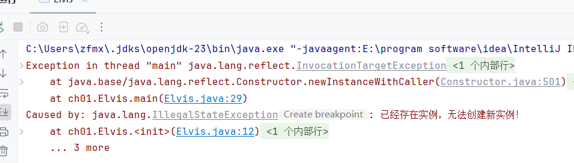

# Singleton

Singleton设计模式确保一个类只有一个实例，并提供全局访问点。它通常用于管理共享资源或系统组件，例如配置管理器或连接池。需要注意的是，将一个类设计为Singleton可能会使客户端的测试变得复杂，因为无法继承Singleton，从而无法轻易创建其模拟实现。


# 私有构造器

私有构造器模式的核心在于将构造器设为私有，通过公有的静态成员访问唯一实例。

### 公有静态成员

首先，我们可以使用final字段作为公有静态成员：

```java
public class Elvis {
    private final String name;
    public static final Elvis INSTANCE = new Elvis("单例模式");
    
    private Elvis(String name) {
        this.name = name;
    }

    public String getName() {
        return name;
    }
}
```

这样可以保证私有的构造器只被调用一次，用来初始化公有的静态final字段 Elvis.INSTANCE 。因为没有提供公有的或受保护的构造器，也就保证了Elvis的全局唯一性。一旦Elvis类被初始化，就只会有一个Elvis实例存在，不会多，也不会少。

但是值得注意的是，越权的客户端可以借助反射的方式，调用私有构造器，从而达到破坏单例的目的：

```java
public static void main(String[] args) throws Exception {
    // 获取构造方法
    Constructor<Elvis> constructor = Elvis.class.getDeclaredConstructor(String.class);
    constructor.setAccessible(true); // 取消访问检查

    // 创建新的实例
    Elvis elvis1 = Elvis.INSTANCE;
    Elvis elvis2 = constructor.newInstance("另一个实例");

    System.out.println(elvis1.getName()); // 输出 "单例模式"
    System.out.println(elvis2.getName()); // 输出 "另一个实例"
}
```

我们来看这段代码的运行结果：


这表明了 Elvis 出现了两个不同的实例，要防御这一种攻击，可以修改构造器，使他在被要求创建第二个实例的时候抛出异常：

```java
public class Elvis {
    private final String name;
    private static boolean instanceExists = false; // 标记实例是否存在
    public static final Elvis INSTANCE = new Elvis("单例模式");

    private Elvis(String name) {
        if (instanceExists) {
            throw new IllegalStateException("已经存在实例，无法创建新实例！");
        }
        this.name = name;
        instanceExists = true; // 设置实例已存在标记
    }

    public String getName() {
        return name;
    }
}
```

再次运行越权者代码，可以发现抛出了异常



### 静态工厂

采用私有构造器完成单例模式，还可以采用静态工厂：

```java
public class ElvisFactory {
    private final String name;
    private static final ElvisFactory INSTANCE = new ElvisFactory("单例模式");

    public static ElvisFactory getInstance() {
        return INSTANCE;
    }
    private ElvisFactory(String name) {
        this.name = name;
    }
}
```

对ElvisFactory.getInstance方法的所有调用都会返回同一个实例，同样越权的客户端可以借助反射的方式，调用私有构造器，从而达到破坏单例的目的，我们来看看越权者代码：

```java
public static void main(String[] args) throws Exception {
    // 获取构造方法
    Constructor<ElvisFactory> constructor = ElvisFactory.class.getDeclaredConstructor(String.class);
    constructor.setAccessible(true); // 取消访问检查

    // 创建新的实例
    ElvisFactory factory1 = ElvisFactory.getInstance();
    ElvisFactory factory2 = constructor.newInstance("另一个实例");

    // 输出
    System.out.println(factory1); // 输出原始实例
    System.out.println(factory2); // 输出新创建的实例
}
```

这段代码与刚刚不同的是直接输出实例，可以看到两者的编号并不相同，这说明出现了两个实例


我们可以采用相似的方式防御：

```java
public class ElvisFactory {	
	private final String name;
    private static boolean instanceExists = false; // 标记实例是否存在
    private static final ElvisFactory INSTANCE = new ElvisFactory("单例模式");

    public static ElvisFactory getInstance() {
        return INSTANCE;
    }

    private ElvisFactory(String name) {
        if (instanceExists) {
            throw new IllegalStateException("已经存在实例，无法创建新实例！");
        }
        this.name = name;
        instanceExists = true; // 设置实例已存在标记
    }
}
```


第一种方式的主要优点是，API可以清楚的表明该类是个Singleton: 公有的静态字段是finial 的，因此他将永远包含同一个对象引用，第二个优点是她更简单。而第二种方式，提供了足够的灵活性，即使以后不再想将这个类设为Singleton，也不需要修改其API。

### 序列化支持

如果需要序列化单例类，需要在字段前加上`transient`，并提供`readResolve`方法以确保反序列化时返回相同的实例：

```java
public class ElvisFactory implements Serializable {
    private static final long serialVersionUID = 1L; // 序列化版本号
    private transient String name; // 使用transient修饰
    private static boolean instanceExists = false; // 标记实例是否存在
    private static final ElvisFactory INSTANCE = new ElvisFactory("单例模式");

    public static ElvisFactory getInstance() {
        return INSTANCE;
    }

    private ElvisFactory(String name) {
        if (instanceExists) {
            throw new IllegalStateException("已经存在实例，无法创建新实例！");
        }
        this.name = name;
        instanceExists = true; // 设置实例已存在标记
    }

    private Object readResolve() {
        return INSTANCE;
    }

    public String getName() {
        return name;
    }
}
```

# 枚举方式

一种更加实用的单例设计方式是通过枚举类来实现，这一种方式更加简洁，而且自带序列化机制，还为防止多次实例化问题提供了保障。即使在一开始接触到的时候可能会有些不太自然，但是 单元素的枚举类型往往是实现Singleton的最佳方式

```java
public enum Elvis {
    INSTANCE;

    private final String name = "单例模式";

    public String getName() {
        return name;
    }
}
```

使用方式：

```java
public static void main(String[] args) {
    Elvis elvis = Elvis.INSTANCE;
    System.out.println(elvis.getName()); // 输出 "单例模式"
}
```

