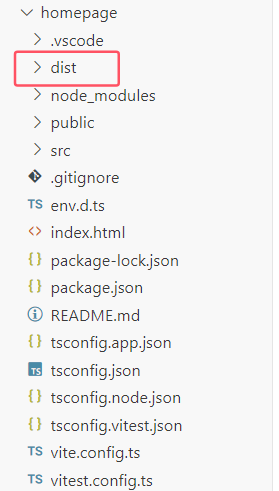
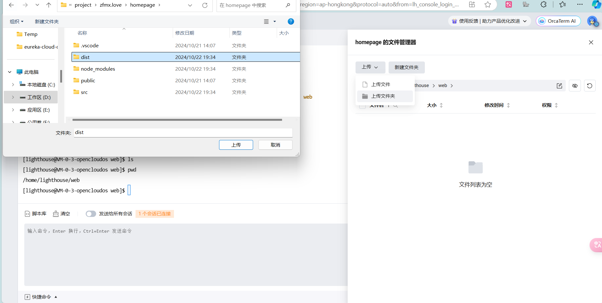
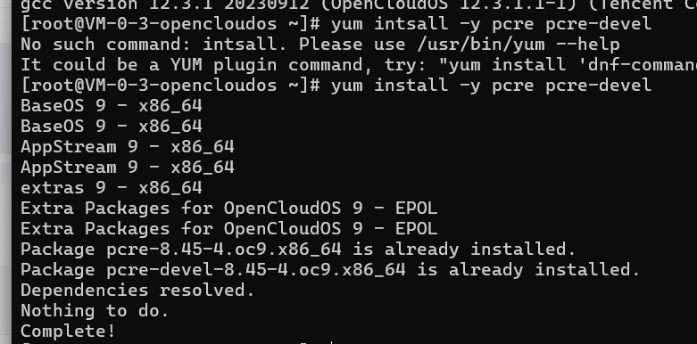
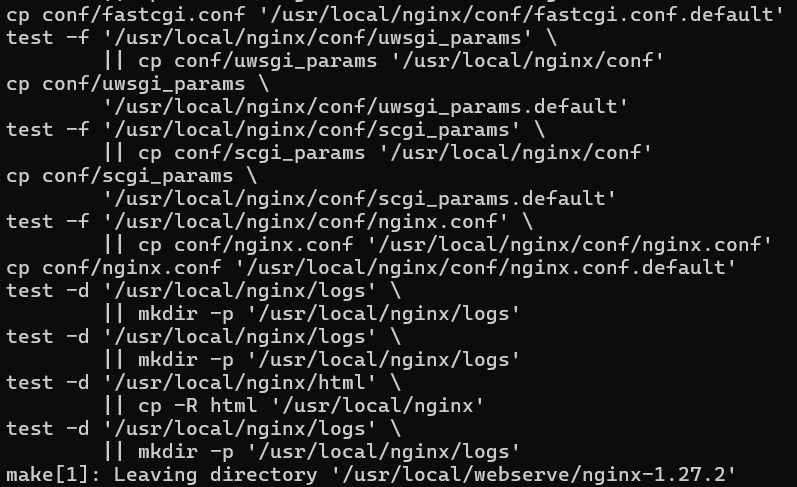
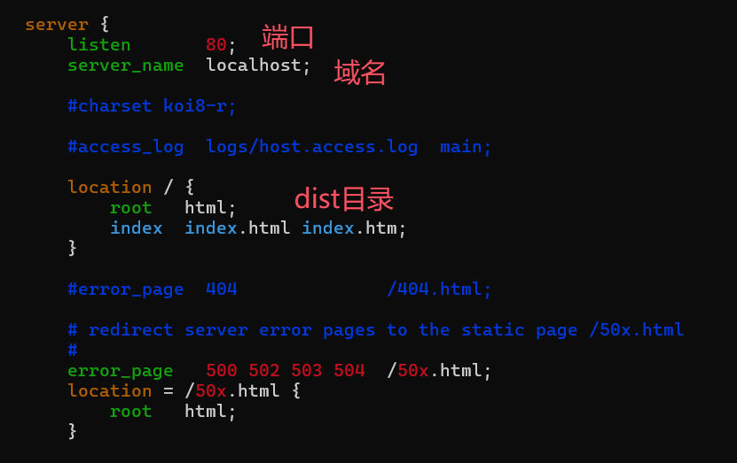

# 准备工作

### 1. Vue TypeScript 支持

**安装 Vue TypeScript 支持** :  （如果你采用了 TS 来编写）

```bash
npm install --save-dev @vue/runtime-core
```

**创建声明文件**： 在 `src` 目录下（或你的 TypeScript 文件所在位置）创建一个 `shims-vue.d.ts` 文件，内容如下：

```ts
declare module '*.vue' {
    import { DefineComponent } from 'vue';
    const component: DefineComponent<{}, {}, any>;
    export default component;
}
```


### 2. 跨域请求问题

在vue.config.js文件中配置反向代理解决跨域请求问题（如果有跨域需要）

```json
const { defineConfig } = require('@vue/cli-service')
module.exports = defineConfig({
  transpileDependencies: true,
  devServer: {
    proxy: {
      "/api": {
        target: "后端url地址",
        //允许跨域请求
        changeOrigin: true
      }
    }
  }
})
```

# 部署

### 1. vue项目打包

在vue项目根目录运行 

```bash
npm run build
```

运行完之后会出现一个dist文件夹



### 2. 创建web存放目录

链接云服务器，创建 web文件夹 用来存放dist文件夹

```bash
cd /usr/local/
sudo mkdir web
```

### 3.上传dist文件

通过工具上传文件夹 ， 这里演示通过lighthouse上传



### 4.安装gcc、pcre、pcre-devel

```bash
yum -y install gcc
yum install -y pcre pcre-devel
```



### 5.安装 zlib

```bash
yum install -y zlib zlib-devel		
```

### 6.安装open ssl

```
yum install -y openssl openssl-devel
```

这里均正常安装即可，服务器上有了的话就不需要安装了。

### 7.安装nginx

在 /usr/local下新建文件夹，（这里应该根据你观看博客时的最新稳定版进行安装[nginx: download](https://nginx.org/en/download.html)）

```bash
mkdir webserve
cd webserve
wget https://nginx.org/download/nginx-1.27.2.tar.gz
tar -zxvf nginx-1.27.2.tar.gz
```

这里下载并解压nginx，解压成功，切换到安装后的目录

```bash
cd /usr/local/webserve/nginx-1.27.2/
```

依次执行

```bash
./configure
make
make install
```

执行完成后可以在 /usr/local/下看到nginx文件夹



这样就是完成了。

### 8.配置nginx

进入配置文件

```bash
cd /usr/local/nginx/conf
vim nginx.conf
```




# 宝塔面板一键部署

如果你的云服务器上预先安装了宝塔面板，那么就不需要上述步骤，使用命令

```
bt defualt
```

就可以启动宝塔面板了，跟着他的新手引导即可完成配置

