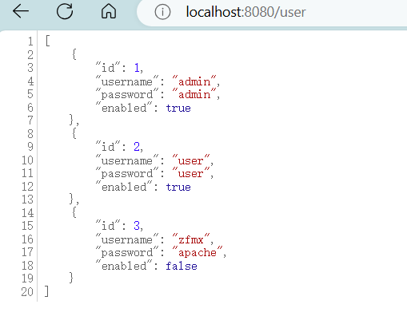
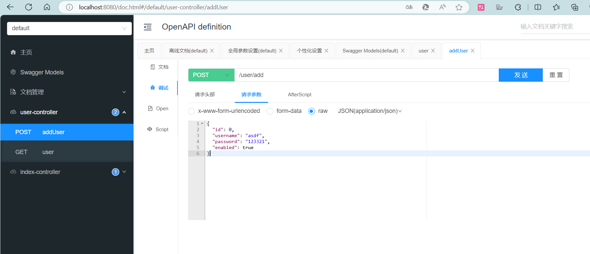

# **SpringSecurity**默认配置

在使用 Spring Security 时，如果没有提供任何自定义配置，Spring Security 会为你自动配置一些安全设置。这些默认配置可以帮助你快速启动和运行安全机制，确保应用程序的基础安全性。

## 1.默认配置

Spring Security 默认提供的配置如下：
```java
@Bean
public SecurityFilterChain filterChain(HttpSecurity http) throws Exception {
	http
		.authorizeHttpRequests(authorize -> authorize
			.anyRequest().authenticated()
		)
		.formLogin(withDefaults())
		.httpBasic(withDefaults());
	return http.build();
}
```

让我们逐一分析这段代码中的每一部分。

### authorizeHttpRequests 和 anyRequest().authenticated()
```java
.authorizeHttpRequests(authorize -> authorize
    .anyRequest().authenticated()
)
```
- **授权请求 (`authorizeHttpRequests`)**：这个配置表示所有的 HTTP 请求都将经过 Spring Security 的保护。
- **`anyRequest().authenticated()`**：表示任何进入应用程序的请求都需要用户已经通过身份验证。换句话说，未认证的用户无法访问应用的任何资源。

这种默认行为确保应用程序的所有端点都是安全的，只有经过验证的用户才能访问。

### formLogin(withDefaults())
```java
.formLogin(withDefaults())
```
- **表单登录 (`formLogin`)**：默认启用了基于表单的登录机制。当用户访问需要认证的资源时，Spring Security 会自动展示一个标准的登录页面。
- **`withDefaults()`**：使用默认配置，这包括使用一个默认的登录页面，并在登录成功后重定向到用户最初请求的资源。

这个配置非常适合快速启动，并且 Spring Security 提供的默认登录页面对基本需求已经足够。

### httpBasic(withDefaults())
```java
.httpBasic(withDefaults())
```
- **HTTP Basic 认证 (`httpBasic`)**：此外，Spring Security 还启用了 HTTP Basic 认证。这是一种简单的认证方式，通过在 HTTP 请求的头部发送用户名和密码来进行验证。
- **`withDefaults()`**：同样，`withDefaults()` 使用默认的设置，使得 HTTP Basic 认证可以立即使用。
这个选项常用于 RESTful API 的基本保护，但在生产环境中通常不推荐单独使用。

## 2.默认配置的优点
- **简单易用**：默认配置足够简单，允许开发者快速启动安全机制，而不必深入到复杂的配置细节中。
- **全面保护**：即便没有自定义配置，Spring Security 仍然会确保应用的每个端点都得到基本的保护。
- **灵活性**：尽管默认配置足够智能，但你可以根据需要随时添加或修改配置，来满足特定的安全需求。

## 3.扩展与自定义
尽管 Spring Security 的默认配置功能强大且易于使用，但在实际应用中，开发者通常会根据具体需求进行自定义配置。例如，你可能会想要自定义登录页面、定义不同的访问权限规则，或者使用更加复杂的认证方式，如 OAuth2。

# **用户认证配置**

## 1.基于内存的用户认证

### 1.1 创建自定义配置
首先创建我们的 Spring Security Java 配置。该配置将创建一个称为`springSecurityFilterChain`的 Servlet 过滤器，它负责应用程序中的所有安全性（保护应用程序 URL、验证提交的用户名和密码、重定向到登录表单等）。以下示例显示了 Spring Security Java 配置的最基本示例：
```java
@Configuration  // 配置类声明
@EnableWebSecurity  // 开启自定义配置（springboot项目可省略）
public class WebSecurityConfig {  
    @Bean  
    public UserDetailsService userDetailsService() {  
	    // 创建基于内存的用户信息管理器
		InMemoryUserDetailsManager manager = new InMemoryUserDetailsManager(); 	
		// 创建一个UserDetails的对象
		manager.createUser(
			User.withDefaultPasswordEncoder()  
		        .username("user")
		        .password("password")
		        .roles("USER")
		        .build()  
		);
        return manager;  
    }  
}
```
### 1.2 用户认证流程
- **程序启动时** 
	- 创建`InMemoryUserDetailsManager` 对象
	- 创建 `User` 对象，封装用户名密码
	- 使用 `InmemoryUserDetailsManager` 将 `User` 放入内存
- **校验用户时**
	- 自动使用 `InMemoryUserDetailsManager` 的 `loadUserByUsername` 方法从内存中获取对象
	- 在 `UsernamePasswordAuthenticationFilter` 中的attemptAuthentication方法将用户数据的用户名和密码从内存中获取到的用户名信息进行比较，进行用户认证

## 2.基于数据库的用户认证
### 2.1 创建数据库
这里采用sqlite数据库，我们增加两个依赖项：
```xml
<dependency>  
    <groupId>com.baomidou</groupId>  
    <artifactId>mybatis-plus-spring-boot3-starter</artifactId>  
    <version>3.5.7</version>  
</dependency>  
<dependency>  
    <groupId>org.xerial</groupId>  
    <artifactId>sqlite-jdbc</artifactId>  
</dependency>
<dependency>  
    <groupId>org.projectlombok</groupId>  
    <artifactId>lombok</artifactId>  
    <scope>annotationProcessor</scope>  
</dependency>
```
创建一个sqlite数据库，并创建用户表：
```sqlite
create table 'user' (  
    id INTEGER primary key autoincrement,  
    username varchar(255) not null,  
    password varchar(255) not null,  
    enabled boolean not null  
);  
  
create unique index 'user_username_uindex' on 'user' (username);  
  
insert into 'user' (username, password, enabled) values ('admin', '{bcrypt}', true);  
insert into 'user' (username, password, enabled) values ('user', '{bcrypt}', true);  
insert into 'user' (username, password, enabled) values ('zfmx', '{bcrypt}', false);
```
**其中密码需要使用Bcrypt加密后的{bcrypt}xxxxxxx。** 
### 2.2 数据持久化
采用mybatis-plus的基础语法，在此不再详细说明，仅展示部分
```java
@Mapper  
public interface UserMapper   
	extends BaseMapper<User> {  
}
@Service  
public class UserServiceImpl  
        extends ServiceImpl<UserMapper,User>  
        implements UserService {  
}
```
写一个测试Controller看下是否成功：
```java
@RestController  
@RequestMapping  
public class UserController {  
  
    @Resource  
    private UserService userService;  
  
    @GetMapping("/user")  
    public Object user(){  
        return userService.list();  
    }  
}
```
运行前记得在配置文件中完成数据库的配置，如我使用sqlite可以这样写：
```properties
spring.application.name=security-demo  
spring.datasource.driver-class-name=org.sqlite.JDBC  
spring.datasource.url=jdbc:sqlite:security.sqlite
```
我们去访问这个api，可以发现成功的将用户信息返回。


### 2.3 创建DBMemoryUserDetailsManager
参考基于内存的用户认证管理器原码，编写基于数据库的，注意我们使用了mybatis作为持久层方案，无法使用jdbcMemoryUserDetailsManager这个类。仅展示了重写的地方，其余默认。
```java
public class DBUserDetailsManager implements UserDetailsManager, UserDetailsPasswordService {  
  
    @Resource  
    private UserMapper userMapper;  
  
    @Override  
    public UserDetails loadUserByUsername(String username) throws UsernameNotFoundException {  
        QueryWrapper<User> userQueryWrapper = new QueryWrapper<>();  
        userQueryWrapper.eq("username", username);  
        User user = userMapper.selectOne(userQueryWrapper);  
        if (user == null){  
            throw new UsernameNotFoundException("用户不存在");  
        }else{  
            Collection<GrantedAuthority> authorities = new ArrayList<>();  
            return new org.springframework.security.core.userdetails.User(  
                    user.getUsername(), user.getPassword(), user.isEnabled(),  
                    true, true, true,  
                    authorities);  
        }  
    }  
}
```


### 2.4 配置文件中启用数据库方案
```java
@Configuration  // 配置类声明  
@EnableWebSecurity  // 开启自定义配置（springboot项目可省略）  
public class WebSecurityConfig {  
//    @Bean  
//    public UserDetailsService userDetailsService() {  
//        // 创建基于内存的用户信息管理器  
//        InMemoryUserDetailsManager manager = new InMemoryUserDetailsManager();  
//        // 创建一个UserDetails的对象  
//        manager.createUser(  
//                User.withDefaultPasswordEncoder()  
//                        .username("user")  
//                        .password("password")  
//                        .roles("USER")  
//                        .build()  
//        );  
//        return manager;  
//    }  
  
    @Bean  
    public UserDetailsService userDetailsService(){  
        return new DBUserDetailsManager();  
    }  
}
```

或者更加简便的方式是在刚刚编写好的 `DBMemoryUserDetailsManager` 上添加注解 `@Component`
### 2.3 用户认证流程
- **程序启动时** 
	- 创建`DBMemoryUserDetailsManager` 对象，接口 `UserDetailsManager`,  `UserDetailsPasswordService`
- **校验用户时**
	- 自动使用 `DBMemoryUserDetailsManager` 的 `loadUserByUsername` 方法从数据库中获取对象
	- 在 `UsernamePasswordAuthenticationFilter` 中的 attemptAuthentication 方法将用户数据的用户名和密码从内存中获取到的用户名信息进行比较，进行用户认证

## 3.添加用户

### 3.1 controller 
首先想要添加用户，我们就需要在controller层中创建这个添加用户的接口：
```java
@RestController  
@RequestMapping  
public class UserController {  
    ...
    
    @Resource  
    private UserService userService;  
	  
    @PostMapping("/add_user")  
    public void addUser(@RequestBody User user){  
        userService.saveUserDetails(user);  
    }  
}
```
将Body中的信息转化成user类，在通过userService中的保存来实现创建新用户。

### 3.2 service
默认接口中是没有 saveUserDetails 方法滴，我们需要自己添加接口以及实现：
```java
public interface UserService extends IService<User> {  
    void saveUserDetails(User user);  
}
```
```java
@Service  
public class UserServiceImpl  
        extends ServiceImpl<UserMapper,User>  
        implements UserService {  
  
    @Resource  
    private DBUserDetailsManager dbUserDetailsManager;  
  
    @Override  
    public void saveUserDetails(User user) {  
        PasswordEncoder passwordEncoder = new BCryptPasswordEncoder();  
        UserDetails userDetails = org.springframework.security.core.userdetails.User.builder()  
                .username(user.getUsername())  
                .password(passwordEncoder.encode(user.getPassword()))  
                .roles("USER") // 添加用户角色，或根据需要进行配置  
                .build();  
        dbUserDetailsManager.createUser(userDetails);  
    }  
}
```
我们使用了 `DBUserDetailsManager` 类中 `UserDetailsManager` 提供的 `createUser` 方法。
同时使用了security的User类创建一个 `userDetails` 进行保存。
### 3.3 creaeUser方法
```java
@Component  
public class DBUserDetailsManager implements UserDetailsManager, UserDetailsPasswordService {  
	  
    @Resource  
    private UserMapper userMapper;  
    
	...
  
    @Override  
    public void createUser(UserDetails userDetails) {  
        User user = new User();  
        user.setUsername(userDetails.getUsername());  
        user.setPassword(userDetails.getPassword());  
        user.setEnabled(true);  
        userMapper.insert(user);  
    }
    ...
}
```

同时 `UserDetailsManager` 接口还提供了许多user的其他方法。
### 3.4 测试接口
我们使用 knife4j 对接口进行请求:   [xiaoymin/knife4j: Knife4j is a set of Swagger2 and OpenAPI3 All-in-one enhancement solution (github.com)](https://github.com/xiaoymin/knife4j) knife4j是为Java MVC框架集成Swagger生成Api文档的增强解决方案,前身是swagger-bootstrap-ui。
```xml
<dependency>  
    <groupId>com.github.xiaoymin</groupId>  
    <artifactId>knife4j-openapi3-jakarta-spring-boot-starter</artifactId>  
    <version>4.4.0</version>  
</dependency>
```
访问 `localhost:8080/doc.html` 就可以进行相关的接口测试了：

直接测试将会遇到403授权问题，我们将csrf关闭测试：

```java
@Configuration  // 配置类声明  
@EnableWebSecurity  // 开启自定义配置（springboot项目可省略）  
public class WebSecurityConfig {  
    @Bean  
    public SecurityFilterChain filterChain(HttpSecurity http) throws Exception {  
        http.authorizeHttpRequests(  
                authorize->authorize.anyRequest().authenticated()  
        ).formLogin(Customizer.withDefaults());  
          
        http.csrf(AbstractHttpConfigurer::disable);  // 关闭csrf
        return http.build();  
    }  
  
}
```
