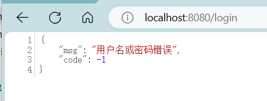

## 1 用户认证
### 1.1 用户认证流程
后端仅需返回json数据给前端
- 登录成功后调用： `AuthenticationSuccessHandler`
- 登录失败后调用： `AuthenticationFailureHandler`

如果我们想要返回json数据，需要实现 `AuthenticationFailureHandler` 接口和 `AuthenticationSuccessHandler` 接口。
### 1.2 fastjson
引入json工具：
```xml
<dependency>  
    <groupId>com.alibaba.fastjson2</groupId>  
    <artifactId>fastjson2</artifactId>  
    <version>2.0.52</version>  
</dependency>
```

### 1.3 登录成功
 `AuthenticationSuccessHandler` 的实现
```java
public class MyAuthenticationSuccessHandler implements AuthenticationSuccessHandler {  
    @Override  
    public void onAuthenticationSuccess(HttpServletRequest request,  
                                        HttpServletResponse response,  
                                        Authentication authentication)  
            throws IOException, ServletException {  
        var principal = authentication.getPrincipal();  // 获取登录用户信息  
  
        /* 更常用的为自定义响应 */        
        HashMap<Object, Object> result = new HashMap<>();  
        result.put("code", 0);  
        result.put("msg", "登录成功");  
        result.put("data", principal);  
  
        String json = JSON.toJSONString(result);  
        response.setContentType("application/json;charset=utf-8");  
        response.getWriter().println(json);  
    }  
}
```
这里采用了简单的HashMap返回，实际使用时可以考虑自定义响应类来返回。写完后需要在配置文件中装入这个类：
```java
@Configuration  public class WebSecurityConfig {  
    @Bean  
    public SecurityFilterChain filterChain(HttpSecurity http) throws Exception {  
        http.authorizeHttpRequests(  
                authorize->authorize  
                        .anyRequest().authenticated()  
        );  
        http.formLogin(login->login  
                .loginPage("/login").permitAll()  
                .successHandler(new MyAuthenticationSuccessHandler()) // 登录成功处
        );  
        http.csrf(AbstractHttpConfigurer::disable);  
        return http.build();  
    }  
}
```
此时去尝试登录成功，会获得以下json信息：


### 1.4 登录失败
`AuthenticationFailureHandler` 的实现
```java
public class MyAuthenticationFailureHandler implements AuthenticationFailureHandler {  
    @Override  
    public void onAuthenticationFailure(HttpServletRequest request,  
                                        HttpServletResponse response,  
                                        AuthenticationException exception)  
            throws IOException, ServletException {  
        String localizeMessage = exception.getLocalizedMessage();  
  
        /* 更常用的为自定义响应 */        
        HashMap<Object, Object> result = new HashMap<>();  
        result.put("code", -1);  
        result.put("msg", localizeMessage);  
  
        String json = JSON.toJSONString(result);  
        response.setContentType("application/json;charset=utf-8");  
        response.getWriter().println(json);  
    }  
}
```
这里采用了简单的HashMap返回，实际使用时可以考虑自定义响应类来返回。写完后同样需要在配置文件中装入这个类：
```java
@Configuration  
public class WebSecurityConfig {  
    @Bean  
    public SecurityFilterChain filterChain(HttpSecurity http) throws Exception {  
        http.authorizeHttpRequests(  
                authorize->authorize  
                        .anyRequest().authenticated()  
        );  
        http.formLogin(login->login  
                .loginPage("/login").permitAll()  
                .successHandler(new MyAuthenticationSuccessHandler()) // 登录成功  
                .failureHandler(new MyAuthenticationFailureHandler()) // 登录失败  
        );  
        http.csrf(AbstractHttpConfigurer::disable);  
        return http.build();  
    }  
}
```
此时去尝试登录失败，会获得以下json信息：


### 1.5 注销用户处理
需要实现 `LogoutSuccessHandler` 接口
```java
public class MyLogoutSuccessHandler implements LogoutSuccessHandler {  
    @Override  
    public void onLogoutSuccess(HttpServletRequest request,   
                                HttpServletResponse response,   
                                Authentication authentication)   
            throws IOException, ServletException {  
          
        HashMap<Object, Object> result = new HashMap<>();  
        result.put("code", 200);  
        result.put("msg", "注销成功");  
  
        String json = JSON.toJSONString(result);  
        response.setContentType("application/json;charset=utf-8");  
        response.getWriter().println(json);  
    }  
}
```
同样需要装入配置中：
```java
@Configuration  
public class WebSecurityConfig {  
    @Bean  
    public SecurityFilterChain filterChain(HttpSecurity http) throws Exception {  
        http.authorizeHttpRequests(  
                authorize->authorize  
                        .anyRequest().authenticated()  
        );  
        http.formLogin(login->login  
                .loginPage("/login").permitAll()  
                .successHandler(new MyAuthenticationSuccessHandler()) 
                .failureHandler(new MyAuthenticationFailureHandler()) 
        );  
        http.logout(logout->logout  
                .logoutSuccessHandler(new MyLogoutSuccessHandler()) // 注销成功处理 
        );  
        http.csrf(AbstractHttpConfigurer::disable);  
        return http.build();  
    }  
}
```


## 2 请求未认证的接口

### 2.1 实现AuthenticationEntryPoint接口
当访问一个需要认证之后才能访问的接口的时候，SpringSecurity会使用 `AuthenticationEntryPoint` 将用户请求跳转到登录页面，要求用户提供登录凭证，同样我们需要返回 json 结果

```java
public class MyAuthenticationEntryPoint implements AuthenticationEntryPoint {  
    @Override  
    public void commence(HttpServletRequest request,  
                         HttpServletResponse response,  
                         AuthenticationException authException)  
            throws IOException, ServletException {  
        String localizeMessage = exception.getLocalizedMessage();
        HashMap<Object,Object> result = new HashMap<>();  
        result.put("code",-1);  
        result.put("msg", localizeMessage);  
        String json = JSON.toJSONString(result);  
        response.setContentType("application/json;charset=utf-8");  
        response.getWriter().println(json);  
    }  
}
```

将这个类装入配置文件中：
```java
@Configuration  
public class WebSecurityConfig {  
    @Bean  
    public SecurityFilterChain filterChain(HttpSecurity http) throws Exception {  
        http.authorizeHttpRequests(  
                authorize->authorize  
                        .anyRequest().authenticated()  
        );  
        http.formLogin(login->login  
                .loginPage("/login").permitAll()  
                .successHandler(new MyAuthenticationSuccessHandler()) 
                .failureHandler(new MyAuthenticationFailureHandler())
        );  
        http.logout(logout->logout  
                .logoutSuccessHandler(new MyLogoutSuccessHandler())
        );  
        http.exceptionHandling(exception->exception  
			    // 未登录处理  
                .authenticationEntryPoint(new MyAuthenticationEntryPoint()) 
        );  
        http.csrf(AbstractHttpConfigurer::disable);  
        return http.build();  
    }  
}
```
现在访问为认证的api时，将会返回如下信息：


## 3 获取用户认证信息

用户的所有信息存放于 `Authentication` 中
![[securitycontextholder.png]]
- `Principal` ：用户登录信息
- `Credentials` ： 用户凭证
- `Authorities` ：用户权限
在controller中我们可以按照这样获取并返回：
```java
@RestController  
public class IndexController {  
  
    @GetMapping("/")  
    public HashMap<Object,Object> index(){  
        HashMap<Object, Object> result = new HashMap<>();  
        Authentication authentication = SecurityContextHolder.getContext().getAuthentication();  
//        var principal = authentication.getPrincipal();  
//        var credentials = authentication.getCredentials();  
        Collection<? extends GrantedAuthority> authorities = authentication.getAuthorities();  
        result.put("code",0);  
        result.put("authentication",authorities);  
        return result;  
    }  
}
```
要注意一般不返回principal和credentials，这里的注释仅展示获取方法。


## 4 会话并发登录
**处理后登录的账号使先登录的账号失效的问题**

实现接口 `SessionInformationExpiredStrategy`
```java
public class MySessionInformationExpiredStrategy implements SessionInformationExpiredStrategy {  
    @Override  
    public void onExpiredSessionDetected(SessionInformationExpiredEvent event)  
            throws IOException, ServletException {  
        HashMap<Object,Object> result = new HashMap<>();  
        result.put("code", -1);  
        result.put("msg", "您的账号已在其他地方登录，您被迫下线！");  
  
        String json = JSON.toJSONString(result);  
        event.getResponse().setContentType("application/json;charset=utf-8");  
        event.getResponse().getWriter().println(json);  
    }  
}
```
在配置类中放入这个类
```java
@Configuration  
public class WebSecurityConfig {  
    @Bean  
    public SecurityFilterChain filterChain(HttpSecurity http) throws Exception {  
        ...
        http.sessionManagement(session->session  
                .maximumSessions(1).expiredSessionStrategy(new MySessionInformationExpiredStrategy()) // session管理  
        );  
	    ...
        return http.build();  
    }  
}
```
