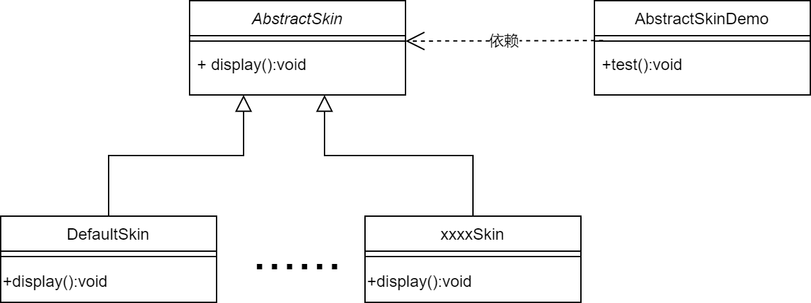
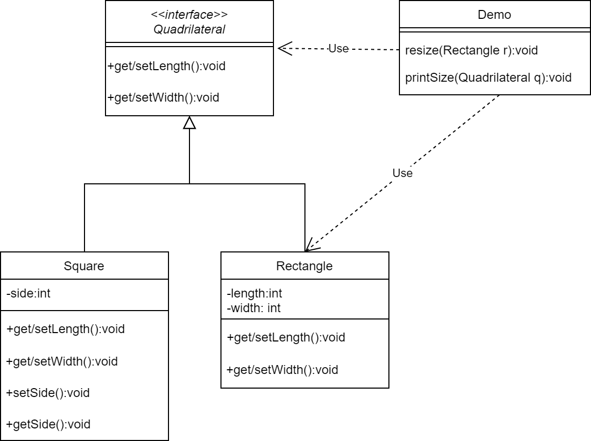
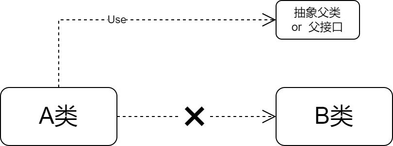
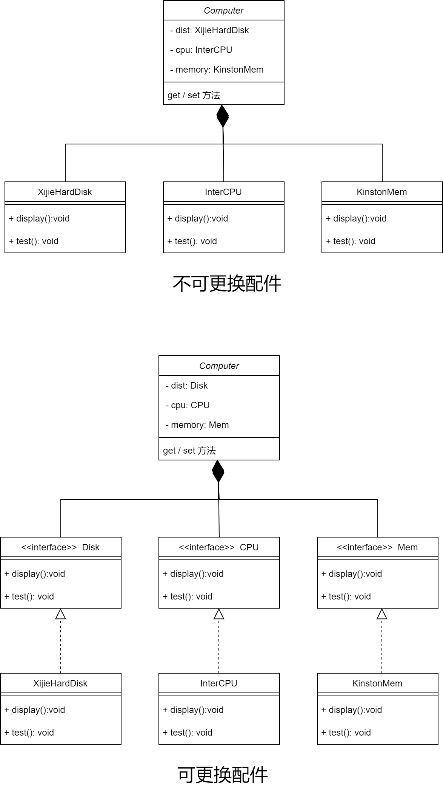
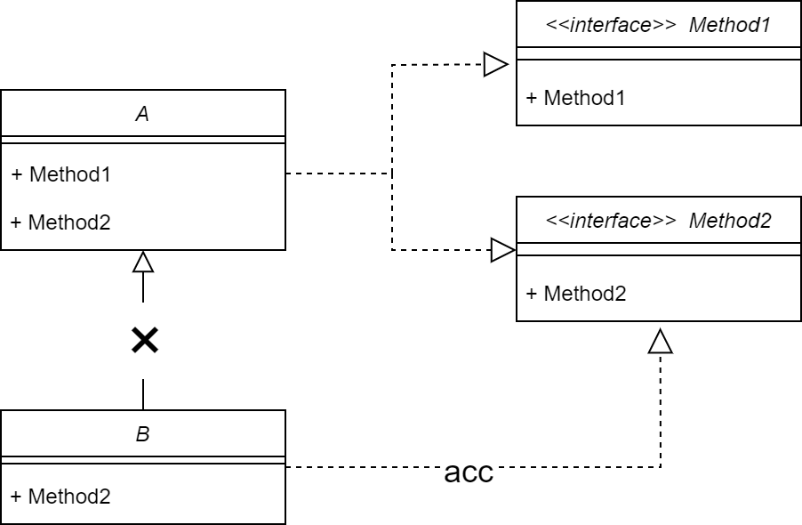
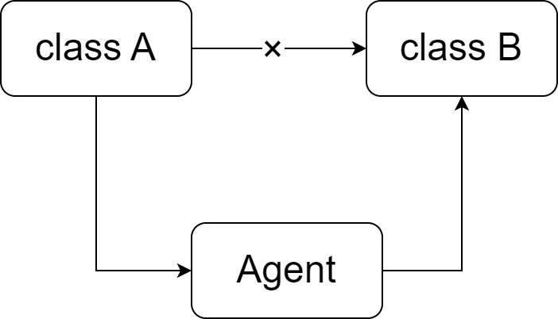

# 设计原则

为了提高软件的可维护性、可复用性，增加软件的可扩展性和灵活性，在面向对象编程的过程中我们需要遵守以下六条原则。

### 开闭原则

**定义：** 编写的代码需要对 **扩展开放** 对 **修改关闭** ，实现 **热插拔** 的效果。

例：在编写不同皮肤类的时候， **不能对抽象类进行修改** ，而是开放扩展功能，通过编写子类实现不同效果。

### 里氏代换原则

**定义：** 任何 **基类** 可以出现的地方， **子类** 一定可以出现。即，子类 **可以扩展** 父类功能，但 **不能改变** 原有的功能，尽量 **不重写** 父类的方法。 **多态频繁的程序出错的概率很大。**

例：正方形若直接继承长方形，则需要修改其父类的方法。正确的方式应该是将两者抽象出一个共同的接口，用于实现。

### 依赖倒转原则

**定义：** 高层模块 **不应该** 依赖低层模块，两者都应该 **都依赖其抽象** 。抽象不应该依赖于细节，**细节应该依赖抽象** 。

若A类是高层模块，B类是低层模块，那么他们应该有如下关系：

例：若要组装一个电脑类，若实现的是各个部件组合于此类，则会出现不能进行具体更改的情况，应该实现将他们的接口组合于此类的效果，再实现各个接口。

### 接口隔离原则

**定义：** 客户端不应该依赖于他不使用的方法。一个类对另一个类的依赖应该建立在最小的接口上。

列：若B类想要实现A类中的方法2，则不应该继承A类，而是实现方法2的接口。

### 迪米特法则

**定义：** 又称 **最少知识法则**，*Talk only to your immediate friends and not to strangers.* 如果两个软件实体 **无需通信** ，那么就 **不应当** 发生直接的相互调用，可通过 **第三方转发调用** 。（降低耦合）

**friend:** 当前对象 **本身** ，当前对象的 **成员对象** ，当前对象 **所建的对象** ，当前对象的 **方法参数** 。  

### 合成复用原则

**定义：** 尽量先使用组合或聚合等关联关系实现某一个实例，其次才考虑继承。通常类的复用分为 **继承复用** 和 **合成复用**

- **继承复用：** 简单、易实例化
  - 破坏类的封装性
  - 子类与父类的耦合度高
  - 限制复用的灵活性
- **组合/聚合复用：** 将已有对象进行组合
  - 维护了类的封装性
  - 子类父类低耦合
  - 灵活性得到了保证
