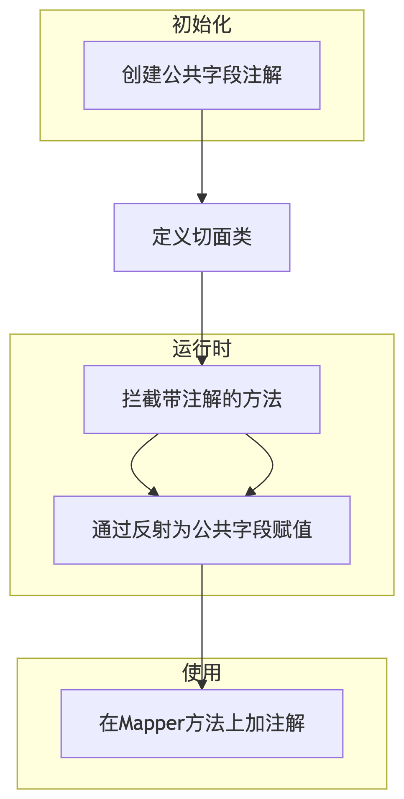

## 问题的出现
当我们进行后端开发的时候会出现很多表格都存在很多相同名称的字段如

```java
private LocalDateTime createTime;
private LocalDateTime updateTime;
private Long createUser;
private Long updateUser;
```

我们在service中可能会出现多次重复的赋值操作，如:
```java
// 每次新增数据时
entity.setCreateTime(LocalDateTime.now());
entity.setUpdateTime(LocalDateTime.now());
entity.setCreateUser(当前登录用户ID);
entity.setUpdateUser(当前登录用户ID);

// 每次更新数据时
entity.setUpdateTime(LocalDateTime.now());
entity.setUpdateUser(当前登录用户ID);
```
这样的代码不仅繁琐，而且容易遗漏，导致数据不一致。Spring框架为我们提供了一种优雅的解决方案——使用公共字段自动填充功能。

## 实现思路


1. 创建公共字段注解，用于标识

```java
public enum OperationType {
    INSERT,
    UPDATE
}

@Target(ElementType.METHOD)
@Retention(RetentionPolicy.RUNTIME)
public @interface AutoFill {
    OperationType value();
}
```
2. 定义切面类，统一拦截加注解的方法，通过反射为公共字段赋值

```java
@Aspect
@Slf4j
@Component
public class AutoFillAspect {
    // 切入点
    @Pointcut("execution(* top.zfmx.mapper.*.*(..)) && @annotation(top.zfmx.annotation.AutoFill)")
    public void autoFillPointCut(){}

    // 前置通知
    @Before("autoFillPointCut()")
    public void autoFill(JoinPoint joinPoint) throws NoSuchMethodException, InvocationTargetException, IllegalAccessException {
        log.info("开始公共字段的自动填充");
        // 获取注解
        MethodSignature signature = (MethodSignature) joinPoint.getSignature();
        AutoFill annotation = signature.getMethod().getAnnotation(AutoFill.class);

        // 获取类型
        OperationType value = null;
        if (annotation != null) {
            value = annotation.value();
        }

        // 获取参数
        Object[] args = joinPoint.getArgs();

        Object entity = args[0];
        LocalDateTime now = LocalDateTime.now();
        Long currentId = BaseContext.getCurrentId();

        // 反射赋值
        if(value == OperationType.INSERT){
            Method setCreateTime = entity.getClass().getDeclaredMethod(AutoFillConstant.SET_CREATE_TIME, LocalDateTime.class);
            Method setCreateUser = entity.getClass().getDeclaredMethod(AutoFillConstant.SET_CREATE_USER, Long.class);
            Method setUpdateTime = entity.getClass().getDeclaredMethod(AutoFillConstant.SET_UPDATE_TIME, LocalDateTime.class);
            Method setUpdateUser = entity.getClass().getDeclaredMethod(AutoFillConstant.SET_UPDATE_USER, Long.class);

            setCreateTime.invoke(entity,now);
            setCreateUser.invoke(entity,currentId);
            setUpdateTime.invoke(entity,now);
            setUpdateUser.invoke(entity,currentId);
        }else if (value == OperationType.UPDATE){
            Method setUpdateTime = entity.getClass().getDeclaredMethod(AutoFillConstant.SET_UPDATE_TIME, LocalDateTime.class);
            Method setUpdateUser = entity.getClass().getDeclaredMethod(AutoFillConstant.SET_UPDATE_USER, Long.class);

            setUpdateTime.invoke(entity,now);
            setUpdateUser.invoke(entity,currentId);
        }
    }
}

```
3. 在mapper加入注解
```java
@Mapper
public interface CategoryMapper {
    @AutoFill(value = OperationType.UPDATE)
    void update(Category category);
}
// ...为所有涉及到公共属性的mapper赋值
```

## 使用总结

通过以上步骤，我们成功利用Spring AOP实现了公共字段的自动填充功能。通过合理利用Spring AOP，我们可以将各种横切关注点从业务逻辑中分离出来，使应用程序更加模块化、可维护和可扩展。
