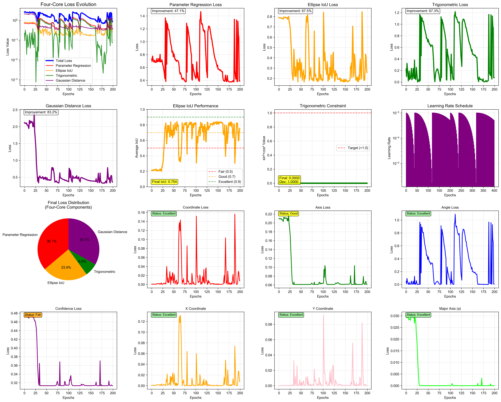
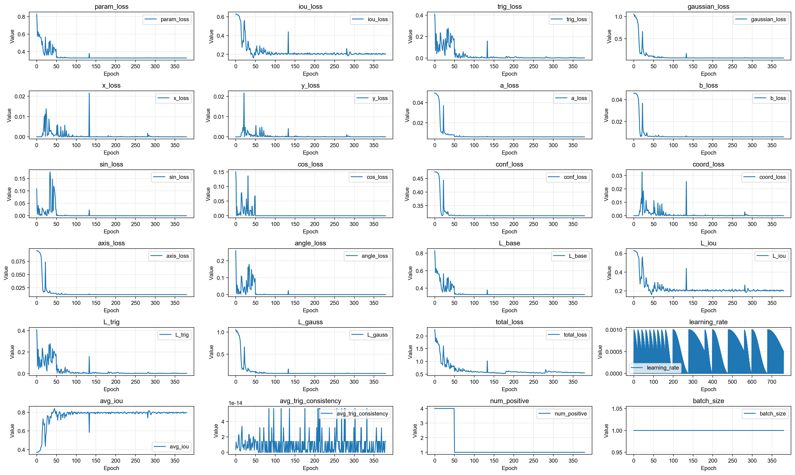
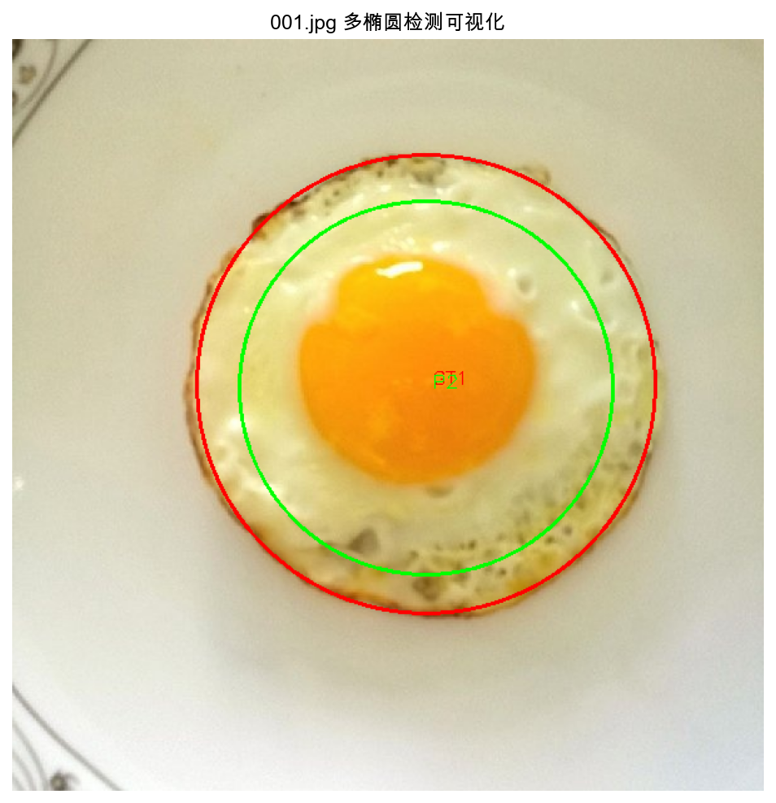

# Introduction

Ellipse detection has long been a fundamental problem in computer vision, with wide applications in fields such as medical imaging (e.g., cell or organ boundary analysis), industrial inspection (e.g., pipe/circle conformity detection), and visual tracking (e.g., iris or pupil tracking).

While traditional circle detection methods (e.g., Hough transform or contour fitting) can handle perfect circles well, they often struggle with detecting elliptical shapes that involve orientation, rotation, and aspect ratio variance.

In this post, we introduce a novel hybrid architecture combining Vision Transformer (ViT) [1] and Graph Neural Network (GNN) [2] to tackle the ellipse detection task. This architecture leverages ViT's global context modeling and GNN's geometric relationship encoding, offering robust, interpretable, and geometrically consistent predictions of ellipse parameters under complex scenarios.

# Model Architecture

Our model introduces a hybrid architecture that integrates **Vision Transformer (ViT)** [1] and **Graph Neural Network (GNN)** [2] for robust and interpretable ellipse detection in complex scenes.

**Patch Embedding and Transformer Encoding**

The input image, sized 640×640, is divided into 16×16 patches, resulting in a total of 1600 patches (40×40). Each patch is projected into a 768-dimensional feature vector. Subsequently, six layers of standard Transformer blocks are applied to capture global context and extract rich semantic features.

**Patch-to-Graph Projection**

Patch features are first projected into a 256-dimensional space to serve as node features for the graph neural network (GNN). A k-nearest neighbor (kNN) graph, typically with k = 8, is constructed based on spatial proximity, where graph edges encode spatial interactions among patches.

**Graph Neural Network Modeling**

The local geometric structure is modeled using three layers of Graph Convolution (GraphConv), with residual connections and Layer Normalization applied after each layer to enhance training stability.

**Dual-path Ellipse Regression**

For ellipse regression, a dual-path approach is employed: the global path uses global average pooling (GAP) to extract a holistic representation, while the local path aggregates a weighted combination of local patch features through an attention mechanism. These outputs are fused to regress seven parameters **[x, y, a, b, sinθ, cosθ, confidence]**. A sigmoid function constrains the output range, and unit-circle normalization ensures consistent angle prediction.

# Loss Function Design

The loss function is designed with four key components to guide the model toward accurate and geometrically consistent ellipse predictions:

**Parameter Regression Loss**

The parameter regression loss supervises the prediction of the ellipse parameters, including **the center coordinates** (x,y), **semi-axes lengths** (a,b), and **angle components** (sinθ,cosθ). To penalize deviations from the ground truth, either Smooth L1 loss or Mean Squared Error (MSE) is employed.

**Ellipse IoU Loss**

Inspired by EllipseNet (MICCAI 2021) [3], the Ellipse IoU loss computes the Intersection over Union (IoU) between the predicted ellipse $E_p$  and the ground truth ellipse $E_{gt}$. This is typically done by sampling point masks or using rasterized representations of the ellipses. The IoU is defined as:
$$ IoU(E_p,E_{gt}) = \frac{|E_p \cap E_{gt}|}{|E_p \cup E_{gt}|}$$
where ∣⋅∣ denotes the area of the ellipse region. Extended versions such as Generalized IoU (GIoU) [4] and Complete IoU (CIoU) [5] can also be applied to provide better gradient behavior and convergence.

**Trigonometric Angle Loss**

To overcome discontinuity near ±π, angles are expressed as $[sinθ,cosθ]$. The L2 distance between predicted and ground truth angle components is used as the loss, encouraging correct orientation while avoiding issues related to angle wrap-around.

**Gaussian Distribution Loss**

Viewing an ellipse as a 2D Gaussian distribution [6], the similarity between the predicted covariance matrix $\Sigma_p$ and the ground truth covariance matrix $\Sigma_{gt}$ is measured. One common metric used is the Log-Euclidean Distance (LED) [7], defined as:

$$
\mathcal{L}_{\mathrm{Gaussian}} = \left\lVert \log(\Sigma{p}) - \log(\Sigma{gt}) \right\rVert_F
$$

where $\log(\cdot)$ denotes the matrix logarithm and $\|\cdot\|_F$ is the Frobenius norm. This loss ensures global shape similarity across scale, rotation, and orientation.

# Experiment Analysis

At the current stage, we have trained the model on a simplified dataset where each image contains only a single synthetic ellipse.

Under this setting, the model converges well and accurately predicts the ellipse parameters, including shape, position, rotation, and scale. As shown below, we provide the training loss curve and a visualization of predicted vs.

These results verify the model's feasibility and effectiveness in ideal conditions, paving the way for more comprehensive evaluations.

# Future Work

In future work, we plan to extend the experiments to more complex scenarios, including images containing multiple ellipses. We will also evaluate our approach on real-world datasets from industrial and medical domains. Additionally, we aim to integrate robust multi-object matching strategies such as Optimal Transport and Hungarian Matching. Finally, new evaluation metrics focused on parameter-level accuracy and geometric consistency will be developed to better assess model performance.

# References

[1] Dosovitskiy, A., Beyer, L., Kolesnikov, A., et al. "An Image is Worth 16x16 Words: Transformers for Image Recognition at Scale." ICLR 2021. [PDF/ArXiv](https://arxiv.org/abs/2010.11929)

[2] Kipf, T. N., & Welling, M. "Semi-Supervised Classification with Graph Convolutional Networks." ICLR 2017. [PDF/ArXiv](https://arxiv.org/abs/1609.02907)

[3] Zhu, Y., Wang, J., Li, Y., et al. "EllipseNet: Efficient and Robust Ellipse Detection with Convolutional Neural Networks." MICCAI 2021. [PDF/ArXiv](https://arxiv.org/abs/2107.11662)

[4] Rezatofighi, H., Tsoi, N., Gwak, J. Y., et al. "Generalized Intersection over Union: A Metric and a Loss for Bounding Box Regression." CVPR 2019. [PDF/Website](https://openaccess.thecvf.com/content_CVPR_2019/html/Rezatofighi_Generalized_Intersection_Over_Union_A_Metric_and_a_Loss_for_CVPR_2019_paper.html)

[5] Zheng, Z., Wang, P., Liu, W., et al. "Distance-IoU Loss: Faster and Better Learning for Bounding Box Regression." AAAI 2020. [PDF/ArXiv](https://arxiv.org/abs/1911.08287)

[6] Fitzgibbon, A., Pilu, M., & Fisher, R. B. "Direct Least Square Fitting of Ellipses." IEEE Transactions on Pattern Analysis and Machine Intelligence, 1999. [PDF/IEEE](https://ieeexplore.ieee.org/document/709602)

[7] Arsigny, V., Fillard, P., Pennec, X., & Ayache, N. "Log-Euclidean Metrics for Fast and Simple Calculus on Diffusion Tensors." Magnetic Resonance in Medicine, 2006. [PDF/Wiley](https://onlinelibrary.wiley.com/doi/abs/10.1002/mrm.20965)