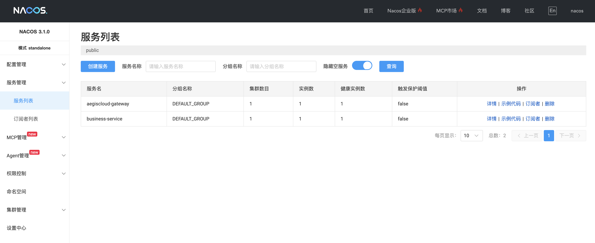

## 微服务为什么需要注册发现

在传统单体应用中，服务调用通常是固定的 URL 或 IP，
但一旦进入微服务时代，这种做法会迅速失效：

> “当微服务数量超过三个，如果服务地址写死，每次扩容或重启都要手动修改配置，这会迅速导致系统失控。”

在 AegisCloud 中，我们的第一步是**让服务自动注册**，
让系统自己感知有哪些服务在运行，避免硬编码地址和频繁手动修改配置。
同时，这也是自治闭环的前提：
只有系统知道自己有哪些服务，
才能实现动态流量治理、限流、熔断和自愈策略下发。

因此，服务注册发现是微服务架构中的**基础能力**，
它为后续的配置管理、策略下发和闭环执行提供了可靠的支撑。

---

##  核心概念：Nacos 是什么

在微服务架构中，服务数量不断增加，如果没有统一的管理和发现机制，调用关系就会变得混乱。Nacos 在 AegisCloud 中的角色可以理解为：

> **“微服务的通讯录 + 广播站”**

它主要负责：
- **服务注册**：每个服务启动时主动注册自己的信息，包括地址、端口、元数据等
- **服务发现**：调用方通过 Nacos 查询可用服务实例，实现动态调用
- **实例状态管理**：监控服务实例的健康状态，剔除不可用节点
- **元数据存储**：为后续自治策略下发、限流规则或自愈操作提供数据支持

> 🔑 今天我们先专注于 **服务注册与发现**，配置中心功能将在 Day 8 的实践中展开。

---

##  项目中如何集成 Nacos

在 AegisCloud 中，我们希望业务服务能够**自动注册到 Nacos**，实现服务发现。请配合上一篇《微服务环境配置》食用，nacos注册的核心步骤如下：

### a. 添加依赖

在业务模块的 `pom.xml` 中添加 Nacos 注册发现依赖：

```xml
<dependency>
  <groupId>com.alibaba.cloud</groupId>
  <artifactId>spring-cloud-starter-alibaba-nacos-discovery</artifactId>
</dependency>
```

> 这个依赖会为 Spring Boot 应用自动配置 Nacos 服务注册和发现功能。

### b. 配置 application.yml

```yaml
spring:
  application:
    name: aegis-service-business
  cloud:
    nacos:
      discovery:
        server-addr: localhost:8848
        username: ${username}
        password: ${password}
```

> 这里 `server-addr` 指向 Nacos 服务地址，服务启动后会自动注册到 Nacos。

### c. 开启服务发现

在 **网关模块**中，为了让它能够感知其他微服务（比如业务服务）的实例，需要开启 **服务发现** 功能。只需在启动类加上 `@EnableDiscoveryClient` 注解即可：

```java
package com.aegiscloud.gateway;  
  
import org.springframework.boot.SpringApplication;  
import org.springframework.boot.autoconfigure.SpringBootApplication;  
import org.springframework.cloud.client.discovery.EnableDiscoveryClient;  

@SpringBootApplication  
@EnableDiscoveryClient  
public class GatewayApplication {  
    public static void main(String[] args) {  
        SpringApplication.run(GatewayApplication.class, args);  
    }  
}
```

**说明：**

- `@EnableDiscoveryClient`
    - 告诉 Spring Cloud 这是一个 **注册到服务发现中心（Nacos）的客户端**
    - 启动后，网关可以自动获取其他服务实例的信息，实现请求转发和负载均衡
- **配合 application.yml**
    - 确保指定 `spring.cloud.nacos.discovery.server-addr`
    - 与业务服务统一注册到同一个 Nacos 实例

> 这样，网关就能动态感知业务服务的状态，保证系统请求路由和自治闭环后续功能顺利接入。


### d. 启动后观察

- 启动业务服务（如 `aegis-service-business`）
- 打开 **Nacos 控制台**（默认 `http://localhost:8848/nacos`）
- 可以看到该服务实例已经注册成功，包括 IP、端口和健康状态

> 这样，每个微服务都能被动态发现，无需手动维护调用地址，为后续流量治理和自治闭环奠定基础。
---

##  Docker + 数据卷启动 Nacos

#### 目录结构

```text
AegisCloud/
├── docker-compose.yml
├── aegiscloud/
├── nacos-docker/ 
│   ├── data/
│   └── logs/ 
```

#### docker-compose.yml 示例

```yaml
services:
  nacos:
    image: nacos/nacos-server:v3.1.0
    container_name: aegis-nacos
    platform: linux/amd64
    environment:
      - MODE=standalone
      - PREFER_HOST_MODE=hostname
      - NACOS_AUTH_ENABLE=true              # 开启认证
      - NACOS_AUTH_IDENTITY_KEY=${NACOS_USER}
      - NACOS_AUTH_IDENTITY_VALUE=${NACOS_PASSWORD}
      - NACOS_AUTH_TOKEN=${NACOS_AUTH_TOKEN}
    ports:
      - "8080:8080"   # 控制台端口
      - "8848:8848"   # 服务注册/客户端端口
      - "9848:9848"   # gRPC/cluster 端口（可选）
    volumes:
      - ./nacos-docker/data:/home/nacos/data
      - ./nacos-docker/logs:/home/nacos/logs
```

> 数据卷挂载 `/home/nacos/data` + `/home/nacos/logs`，保证重启不丢失服务注册信息和日志。

启动命令：

```bash
docker compose up -d
```

访问管理界面：

```
http://localhost:8080/#/
```



---

## 工程化价值 & 学习体会

今天通过 Nacos 服务注册发现和 Docker 启动实践，
我总结了几个工程化价值和学习收获：

1. **Docker-compose + 数据卷**
    - 一键启动 Nacos 服务，实现微服务基础设施工程化，保证环境可复现。
2. **Apple Silicon 特殊处理**
    - 对 M1/M2 等 ARM 架构，需要加 `platform: linux/amd64` 才能顺利拉取镜像。
3. **服务注册发现**
    - 系统第一次能够自动感知自身服务拓扑，是自治闭环的第一步。
4. **为未来 Phase 铺垫**
    - Nacos 配置中心（Config）
    - Sentinel 规则下发
    - AI 自愈决策与执行
