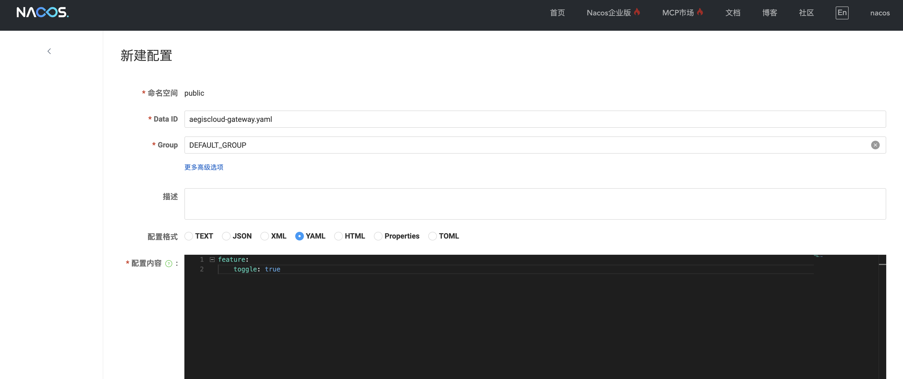
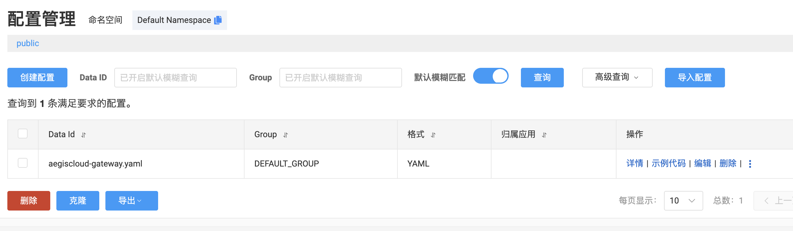

## 为什么要用配置中心

在微服务自治系统中，配置管理是基础但又非常关键的一环：
- **配置分散且频繁变动**：每个服务可能都有自己的路由规则、功能开关或限流阈值，如果写死在本地文件中，修改配置就意味着重启服务，效率低且容易出错。
- **动态更新是刚需**：像 Gateway 的路由配置、业务模块的功能开关或限流参数，都可能需要随时调整。重启服务显然无法满足这种实时性。
- **集中管理 + 动态刷新**：Nacos Config 让微服务可以统一管理配置，并支持 **动态刷新**，即修改配置即可立即生效，无需人工干预或服务重启。

> 回顾 之前的多模块化架构和注册发现实践，配置中心是微服务自治系统的关键基础设施，它让服务不仅能被发现，还能被**实时感知和控制**，为未来自动限流、自愈策略和闭环自治打下坚实基础。

---

## Nacos Config 基础概念

在微服务自治系统中，**Nacos Config** 是实现 **动态配置和集中管理**的核心组件，其基础概念如下：

- **DataId**：每一份配置的唯一标识，相当于配置的“身份证”，用于区分不同服务或模块的配置。
- **Group**：配置分组，默认是 `DEFAULT_GROUP`，可以用于环境隔离（如 `DEV`、`PROD`）。
- **动态刷新**：Spring Cloud 集成 Nacos 后，修改配置即可触发 **自动刷新**，无需重启服务，保证配置调整立即生效。

> 这个机制让服务不仅能被发现，还能被 **实时控制和调整**，是微服务自治能力的重要基础。


flowchart TB
    A["开发者修改配置 (DataId + Group)"] --> B[Nacos 配置中心]
    B --> C[服务实例接收更新]
    C --> D[Spring Cloud 自动刷新]
    D --> E[业务模块行为更新]
    
    style A fill:#f9f,stroke:#333,stroke-width:1px
    style B fill:#ff9,stroke:#333,stroke-width:1px
    style C fill:#9ff,stroke:#333,stroke-width:1px
    style D fill:#9f9,stroke:#333,stroke-width:1px
    style E fill:#fc9,stroke:#333,stroke-width:1px


---

## Gateway 接入 Nacos Config

1. 在 `application.yml` 配置 Nacos：

```yaml
spring:
  application:
    name: aegiscloud-gateway
  config:
    import: optional:nacos:aegiscloud-gateway.yaml  #关于optional后面解释
  cloud:
    nacos:
      discovery:
        server-addr: localhost:8848
        username: nacos
        password: nacos
      config:
        server-addr: localhost:8848
        file-extension: yaml
        refresh-enabled: true
        username: nacos
        password: nacos
server:
  port: 9001
management:
  endpoints:
    web:
      exposure:
        include: health,info
```

2. 解释配置：
- `spring.config.import: optional:nacos:...` → 如果 Nacos 配置不存在，服务仍能启动
- `refresh-enabled: true` → 支持动态刷新

---

## Nacos 控制台操作

1. 登录 Nacos 控制台：http://localhost:8080/#/
2. 创建 **配置**：

| 项目      | 示例值                       |
| ------- | ------------------------- |
| Data ID | `aegiscloud-gateway.yaml` |
| Group   | `DEFAULT_GROUP`           |

配置内容：
```yaml
feature:
  toggle: true
```


3. 保存配置


3. 测试动态刷新：

- 在 Gateway Bean 上加 `@RefreshScope`，例如：

```java
@RefreshScope
@RestController
public class FeatureController {
    @Value("${feature.toggle:false}")  // 如果配置中心不生效的话返回false
    private boolean featureToggle;

    @GetMapping("/feature")
    public String feature() {
        return "feature toggle is " + featureToggle;
    }
}
```

- 修改 Nacos 配置 `feature.toggle: false` → 保存 → 调用 `/feature` → 输出自动更新

---

## 效果展示


---
## 小结
今天通过 Nacos Config，我们完成了 AegisCloud 微服务系统的 **动态配置能力**初体验，主要收获如下：

- **配置集中管理**
    - 所有服务的配置（如开关、限流、路由等）都统一存放在 Nacos 上，方便统一维护和运维。
- **动态刷新**
    - 修改配置后无需重启服务，Spring Cloud 自动注入新值，实现业务无感知的动态更新。
- **DataId / Group 概念清晰**
    - 每份配置通过 DataId 唯一标识，Group 做分组管理，形成可组织、可追踪的配置体系。
- **可选配置与日志理解**
    - `optional: true` 配置允许服务启动即便暂时拉取配置失败
    - WARN 日志（如 401 / 403）仅为提醒，不阻塞应用启动
- **工程化落地**
    - 配合 Docker Compose，可快速搭建 Nacos + 微服务实验环境
    - 为后续 Sentinel 动态规则下发、AI 自愈策略、自治闭环打下基础

> 今天系统第一次实现了 **服务的动态自我感知和配置更新能力**，这是 AegisCloud 自治闭环建设的重要里程碑。

---
### 关于 Nacos 启动日志里的 401 / 403

在启动服务或拉取配置时，你可能会在控制台看到类似：

`WARN ... 401 Unauthorized WARN ... 403 Forbidden`

不用慌，这并不意味着服务启动失败。原因在于：

1. **`optional: true` 配置**
    - 当你在 Spring Cloud Alibaba Nacos 配置中设置了 `optional: true`，表示 **如果拉取配置失败，服务依然可以启动**
    - 这适合开发环境或配置中心尚未就绪时的容错
2. **日志只是提醒，不阻塞启动**
    - Spring Boot 会记录警告，但仍会继续完成应用上下文初始化
    - 真正生效的配置，仍需等 Nacos 服务可用时动态刷新

> 看到 401 / 403 WARN 日志不用紧张，只要服务能启动并访问 `/actuator/health` 就说明当前配置可选且安全。
