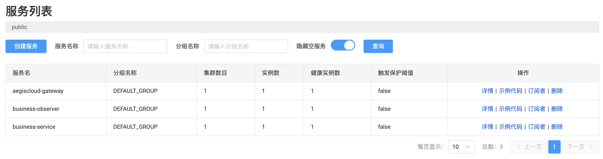
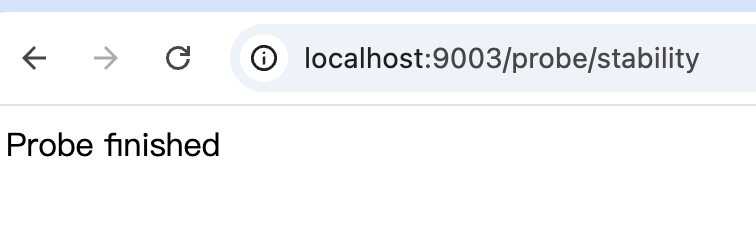
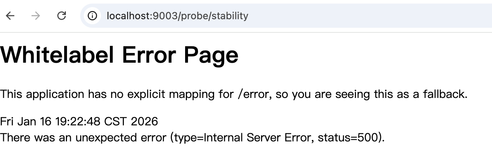
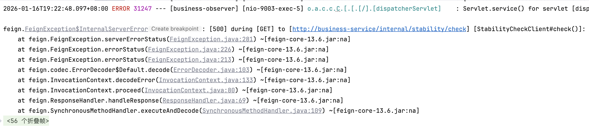

## 微服务的风险，往往从一次调用开始

在微服务系统中，大多数问题并不是突然发生的。

它们往往从一次不起眼的现象开始：
- 某个接口偶尔变慢
- 某次调用突然失败
- 某个下游开始“不太稳定”

而这些信号，**最早出现的地方，几乎一定是在服务调用层**。

在 AegisCloud 中，我们希望构建一个具备自治与自愈能力的系统，
而要做到这一点，系统首先要能 **正确地进行服务间通信，并暴露真实的调用行为**。

这正是 OpenFeign 在整个系统中的切入点。

---

## OpenFeign 是什么？它解决了什么问题

在传统的 Spring 应用中，服务间调用通常通过 `RestTemplate` 或 `WebClient` 完成。

这种方式的问题在于：

- 需要手动拼接 URL
- 调用代码重复且分散
- 与服务注册发现的集成不自然

OpenFeign 提供了一种完全不同的思路：

> **通过声明式接口，来描述一次远程服务调用。**

开发者只需要定义一个 Java 接口，OpenFeign 会在运行时为其生成代理对象，并负责：

- 服务发现
- 请求构造
- HTTP 调用
- 结果反序列化

从使用体验上看，**远程调用被“伪装”成了一次本地方法调用**。
如果我们需要使用这个中间件，我们就要在pom中引入
```xml
<dependency>
    <groupId>org.springframework.cloud</groupId>
    <artifactId>spring-cloud-starter-openfeign</artifactId>
</dependency>
<dependency>  
    <groupId>org.springframework.cloud</groupId>  
    <artifactId>spring-cloud-starter-loadbalancer</artifactId>  
</dependency>
```

并在启动器上加上开启注解：

```java
@SpringBootApplication  
@EnableDiscoveryClient  // 上一节的注册中心
@EnableFeignClients  
public class BusinessServiceApplication {  
    public static void main(String[] args) {  
        SpringApplication.run(BusinessServiceApplication.class, args);  
    }  
}
```
这里提前引入 `spring-cloud-starter-loadbalancer`
是为了避免 Feign 在启动时出现依赖缺失的问题
至于 LoadBalancer 在调用链中的具体作用
我们将在后续章节再详细展开

---

## OpenFeign 的基本工作机制

在不深入源码的前提下，可以用一个简化模型来理解 OpenFeign：


flowchart TD
    A[Feign Client 接口<br/>@FeignClient] --> B[Feign 动态代理<br/>Feign Proxy]
    B --> C[LoadBalancer<br/>Spring Cloud LoadBalancer]
    C --> D[HTTP Client<br/>HttpURLConnection / OkHttp / Apache HttpClient]


调用过程可以概括为：

1. 启动时扫描 `@FeignClient` 接口
2. 为接口生成代理对象并注入 Spring 容器
3. 调用方法时，通过服务名查找实例
4. 选取一个实例并发起 HTTP 请求

一个非常重要的结论是：

> **Feign 本身并不负责“找服务”，它只负责“怎么调用”。**

服务实例的发现，依赖的是注册中心。

---

## OpenFeign 与 Nacos 的协作关系

在 AegisCloud 中，我们已经在 Day 7 接入了 Nacos 作为服务注册中心。

此时，组件之间的职责边界非常清晰：

|组件|职责|
|---|---|
|Nacos Discovery|管理服务实例列表|
|OpenFeign|发起远程调用|
|LoadBalancer|从实例列表中选择目标|

也正因为这种清晰的分工，Feign 才能天然成为后续：
流量治理，熔断降级，调用监控的统一入口。

---

## AegisCloud 当前阶段的服务设计

在当前阶段，AegisCloud 并没有刻意拆分大量微服务，而是先从两个核心业务服务开始：

- `aegis-service-business`
- `aegis-observer

这个服务既承担业务逻辑，也**模拟系统中的下游依赖调用**。

这样做的目的并不是省事，而是：

> **在不增加系统复杂度的前提下，提前为治理与自愈能力预留结构。**

---

## 一个“系统级能力”的调用抽象

在业务处理前，我们设计了一个非常真实的场景：

> **每一次业务请求，在执行核心逻辑之前，都要进行一次“系统稳定性检查”。**

从工程角度看，这是一种典型的“下游依赖”。

我们通过 OpenFeign 将它抽象为一个接口，并把它放置到`aegis-observer`服务中
我们在这个服务中监控所有的接口的状态
在此我就不带大家在此重复之前的内容创建一个`aegis-observer`服务了，
请参看之前的博客把它注册入nacos中

```java
@FeignClient(name = "business-service")
public interface StabilityCheckClient {

    @GetMapping("/internal/stability/check")
    Boolean check();
}
```

这里需要强调的是：

- 这是一个 **系统级能力接口**
- 它代表的是“系统是否适合继续处理请求”
- 未来完全可以被拆分为独立服务

---

## 一个刻意“不完美”的下游实现

为了让系统行为更贴近真实场景，
我们在`aegis-service-business`中创建一个模拟检查系统稳定性的接口
且并没有让这个检查永远成功：

```java
@RestController
@RequestMapping("/internal/stability")
public class StabilityController {

    @GetMapping("/check")
    public Boolean check() {
        if (System.currentTimeMillis() % 3 == 0) {
            throw new RuntimeException("System unstable");
        }
        return true;
    }
}
```

这个实现存在明显的不确定性。

但这是**刻意的设计**：

> **一个永远不会失败的调用，也就永远不需要治理，更谈不上自愈。**

---

## 业务入口中的 Feign 调用
然后我们再来创建一个模拟业务接口

```java
@RestController  
@RequestMapping("/business")  
public class BusinessController {  
  
    @GetMapping("/process")  
    public String process() {  
        return "Business processed";  
    }  
}
```

当请求进入系统时：

1. 首先触发一次 Feign 调用
2. 下游异常会直接中断流程
3. 成功后才继续执行业务逻辑

这正是大多数真实系统中**关键依赖的行为模式**。

---

## 发起一次调用

为了观察到`aegis-service-business` 服务是否稳定
我们在`aegis-service-observer`中创建接口查看
```java
@RestController
@RequestMapping("/probe")
public class ProbeController {

    private final StabilityCheckClient stabilityCheckClient;

    public ProbeController(StabilityCheckClient stabilityCheckClient) {
        this.stabilityCheckClient = stabilityCheckClient;
    }

    @GetMapping("/stability")
    public String probe() {
        stabilityCheckClient.check();
        return "Probe finished";
    }
}

```

- 触发 Feign 调用
- 后续可以接 Sentinel / AI / 自愈逻辑

---

## 一次真实的 Feign 调用效果展示

> 在讨论服务调用“意味着什么”之前，我们先看看——  
> **它到底发生了什么。**

确保以下两个服务已启动并成功注册到 Nacos：
- `aegis-service-business`
- `aegis-observer`


我们访问观测服务中的接口：

`GET http://localhost:9003/probe/stability`

> ⚠️ 端口以你本地配置为准

当 `aegis-service-business` 的稳定性检查正常返回时：



此时发生的事情是：


graph TD
    A["aegis-observer"] -->|Feign 调用| B["aegis-service-business"]
    B --> C["/internal/stability/check"]
    
    C -->|成功| D["返回 true"]
    C -->|失败| E["抛出异常"]
    
    E -->|503| F["LoadBalancer 无实例"]
    E -->|404| G["接口不存在"]
    E -->|500| H["服务内部错误"]
    
    style D fill:#d4edda
    style E fill:#f8d7da


这是一次**标准的服务间调用**。

由于 `StabilityController` 中的逻辑：

```java
if (System.currentTimeMillis() % 3 == 0) {     
	throw new RuntimeException("System unstable"); 
}
```

你会**偶尔看到请求失败**，例如：



或者日志中出现：



这次“失败”很重要

注意一件事：
我们没有写 Sentinel，没有写监控，没有写 AI
**但系统已经“暴露风险”了。**
这一刻：调用失败、异常被抛出、RT 变长、状态开始波动
**风险第一次显性化，正是发生在「服务调用层」。**


## 从一次调用开始，系统如何“感知风险”

在当前阶段，这次 Feign 调用只是完成了通信功能。

但在 AegisCloud 的整体设计中，它未来会成为：

- Sentinel 限流与熔断的入口
- 调用失败率、RT 指标的采集点
- AI 异常分析的重要上下文

可以说：

> **所有“系统开始不对劲”的信号，最早都会出现在服务调用层。**

---

## 工程边界说明

本文没有展开以下内容：

- Feign 重试机制
- Feign + Sentinel 降级
- 调用链路监控
- 负载均衡机制

原因很简单：

> **在 AegisCloud 中，这些能力属于“治理层”，而不是“调用层”。**

它们会在后续阶段逐步引入。

---

## 小结

OpenFeign 不只是一个远程调用工具
它是微服务系统中风险最集中的位置
在 AegisCloud 中，它是自治与自愈能力的起点之一
从此刻开始，AegisCloud 的各个模块第一次真正“协作”起来。  
而后续所有的治理、诊断与自愈能力，都会围绕这一次调用逐步展开。
