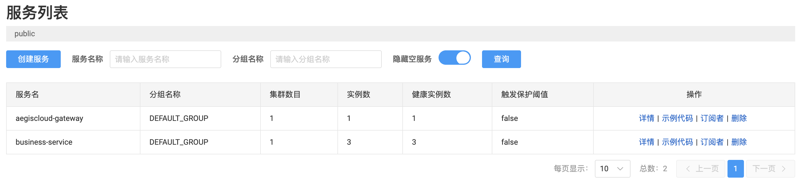
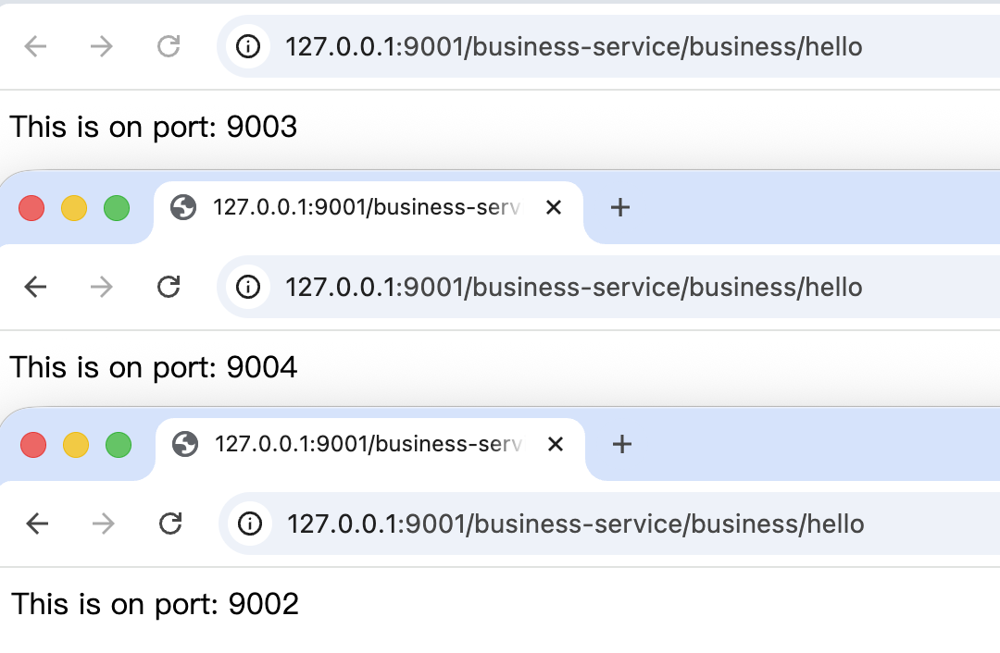

## 一次看似简单的请求，真的简单吗？

在单体应用中，一次 HTTP 请求的路径非常清晰：

> Controller → Service → DAO

但在微服务系统中，当我在浏览器中访问一个地址时：

```text
http://localhost:9001/business/hello
```

这个请求**究竟会落到哪一台机器上？**

- 是随机的吗？
- 是最近启动的那台吗？
- 如果同一个服务启动了 10 个实例呢？
- 如果其中一个实例已经“半死不活”呢？

这些问题，单体应用几乎不会遇到，但在微服务系统中却是**日常**。

而答案，藏在一个经常被低估的组件里：**负载均衡（LoadBalancer）**。

---
## 没有负载均衡，微服务会退化成什么？

如果没有负载均衡，微服务系统会迅速退化成一种非常危险的形态：

- 服务地址被写死
- 扩容毫无意义
- 实例故障直接影响用户
- 每一次变更都需要人工介入

本质上，这样的系统只是 **“分布式部署的单体应用”**。

> **负载均衡不是优化手段，而是微服务存在的前提。**

只有当系统可以在多个实例之间**自主选择**，微服务架构才真正成立。

---

## 从服务发现到实例选择

在 AegisCloud 中，请求路由并不是一个“一步到位”的过程，而是被清晰地拆分成了两个阶段：

### 服务发现：有哪些实例？

服务发现由 **Nacos** 负责。

当 `aegis-service-business` 启动多个实例后，Nacos 中维护的状态大致是这样的：

```text
aegis-service-business
 ├─ 127.0.0.1:9004
 ├─ 127.0.0.1:9003
 ├─ 127.0.0.1:9002
```

这一步解决的是：

> **“系统里现在有哪些可用实例？”**

但注意：  
**Nacos 并不负责做选择。**

---

### 负载均衡：选哪一个？

真正做出“选择”的，是 **Spring Cloud LoadBalancer**。

一句话总结两者的分工：

> **服务发现告诉系统“有哪些选择”，负载均衡告诉系统“该选哪一个”。**

在 AegisCloud 中，无论是 Gateway 还是 OpenFeign，都不会自己决定调用哪一个实例，而是：

- 向 Nacos 获取实例列表
- 把“选择权”交给 LoadBalance

这也是为什么负载均衡是一个**决策组件**，而不是简单的工具类。

---

## 一次请求在 AegisCloud 中的真实路径

当我访问：

```text
http://localhost:9001/business-service/business/hello
```

系统内部实际发生了下面这些事情：

1. 请求进入 `aegis-gateway`
2. Gateway 根据路由规则匹配到目标服务名
3. Gateway 向 Nacos 查询该服务的实例列表
4. **LoadBalancer 从实例列表中选择一个实例**
5. 请求被转发到选中的实例
6. 实例返回响应，结果沿原路返回给客户端

其中，**真正“决定命运”的，是第 4 步**。

---

## 多实例验证：我亲眼看到了“选择”

为了验证负载均衡是否真的在工作，我为业务服务加了一个非常简单的接口：

```java
@RestController  
@RequestMapping("/business")  
public class BusinessController {  
      
    @Value("${server.port}")  
    private String port;  
  
    @GetMapping("/process")  
    public String process() {  
        return "Business processed";  
    }  
      
    @GetMapping("/hello")  
    public String hello(){  
        return "This is on port: " + port;  
    }  
}
```

然后启动同一个服务的三个实例：

- 实例 A：9004
- 实例 B：9003
- 实例 C：9002


接着多次访问同一个 Gateway 地址：

```text
http://localhost:9001/business-service/business/hello
```

返回结果却在不断变化：


这不是巧合，而是系统在**持续替我做选择**。

---

## AegisCloud 视角：为什么“选择”这么重要？

在 AegisCloud 的设计中，负载均衡并不是一个“基础设施细节”，而是**自治系统的起点**。

今天我们看到的是：

|现在|说明|
|---|---|
|轮询算法|最基础的选择策略|
|无感知|不关心实例健康|
|静态|不会动态调整|

但在未来阶段，这个“选择”会逐渐演进为：

|未来|意义|
|---|---|
|健康感知|避开异常实例|
|指标驱动|RT / 错误率参与决策|
|AI 介入|智能路由与自愈执行|

> **当系统开始替你做选择，它就具备了自治的可能性。**

---

## 小结：微服务第一次“有了意识”

在今天之前，AegisCloud 更像是多个服务的简单组合。

从负载均衡开始，系统第一次具备了：
- 感知多个实例的能力
- 在不确定性中做出选择的能力

这看似只是一次请求路由，但它是后续
- 限流
- 熔断
- 自愈
- AI 决策
的**起点**。

> **一次请求是如何被路由的？  
> 本质上，是系统如何第一次替人承担复杂性。**
