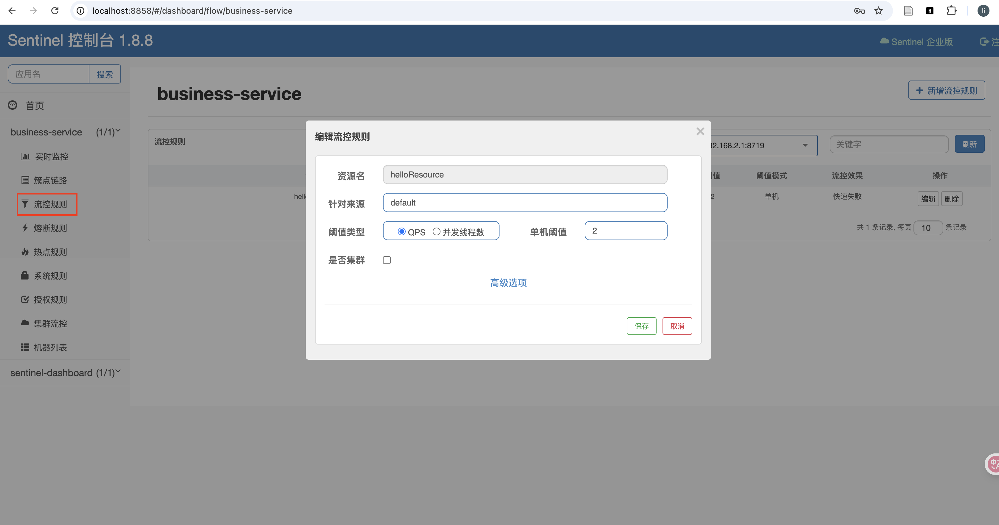
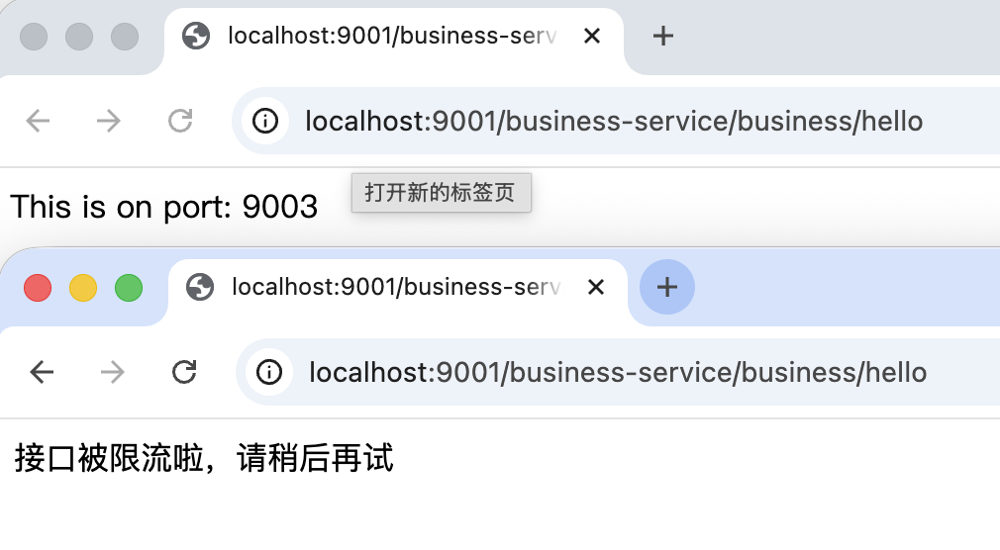

在微服务系统中，**流量的瞬时暴涨**、**下游服务的不稳定**，往往会迅速放大问题并引发级联故障，最终导致系统雪崩。  
传统的应对方式通常依赖运维介入或人工调整，但在一个真正成熟的系统中，我们更希望它具备一种能力：**在异常出现时，系统能够主动保护自己**。

Sentinel 正是在这一背景下发挥价值的。  
它并不仅仅是一个“限流组件”，而是微服务体系中的**安全阀、守门员，以及稳定性治理的执行中枢**。

---

## 微服务系统为什么需要 Sentinel

当系统缺乏统一的流量治理与保护机制时，通常会面临以下问题：

- **流量冲击**：请求瞬时激增，服务线程耗尽，最终导致服务不可用
- **下游雪崩**：某个服务异常被快速放大，并沿调用链向上传播
- **核心能力失守**：关键功能无法在高压场景下稳定对外提供
- **运维成本高**：问题出现后只能依赖人工干预恢复系统

Sentinel 提供了一套完整的运行时保护框架，通过**资源建模、流量控制、熔断降级以及实时指标采集**，使系统在高压或异常场景下仍然具备可控性，并为更高层的自治决策提供稳定、可信的数据基础。

---

## Sentinel 的核心设计思想

从整体设计上看，Sentinel 的工作机制可以高度概括为四个阶段：

> **资源 → 规则 → 执行 → 反馈**

这一闭环，使 Sentinel 不只是“被动限流”，而是一个持续感知与调节系统状态的运行时组件。

---

### 1. 资源（Resource）

在 Sentinel 中，**一切需要被保护的对象都是资源**。  
资源可以是：

- 一个 HTTP 接口
- 一个方法调用
- 一个 URL 或 RPC 入口

每个资源都可以独立配置流控、熔断和降级规则，从而实现细粒度的稳定性治理。

---

### 2. 流量控制（Flow Control）

流控是 Sentinel 最基础、也是最常用的能力：

- 支持基于 **QPS** 或 **并发数** 的限制策略
- 当请求超过阈值时，主动拒绝或排队
- 在系统压力过大时，优先保障整体可用性而非单次请求成功率

其核心目标是：**在不可避免的高压场景下，让系统“慢下来”，而不是“直接崩溃”**。

---

### 3. 熔断与降级（Degrade）

当系统已经出现异常趋势时，仅靠限流是不够的：

- 当 **响应时间持续过高**
- 或 **异常比例超过阈值**

Sentinel 会触发熔断机制，暂时切断对不稳定服务的访问，并通过降级逻辑提供业务兜底，从而阻止故障在调用链中继续扩散。

---

### 4. 控制台与指标反馈（Dashboard）

Sentinel Dashboard 并非只是一个“监控界面”，而是整个系统的**调控中枢**：

- 实时展示资源调用情况
- 支持动态下发和调整规则
- 提供系统健康度的关键运行指标

这些指标，正是后续自治系统进行决策和自愈的基础输入。

---

## Sentinel 在 AegisCloud 中的角色定位

在 AegisCloud 架构中，Sentinel 被定位为**系统运行时的第一道防线**：

|能力|作用|
|---|---|
|流量控制|防止请求洪峰直接冲垮服务|
|熔断机制|当下游异常时及时隔离风险|
|服务降级|保证核心能力在极端情况下仍可用|
|指标采集|为后续 AI 自治决策提供高质量信号|

> Sentinel 是自治系统的**第一感知点与第一执行点**，所有自愈与优化策略，都依赖其对系统真实状态的反馈能力。

---

## Sentinel 的实际使用示例

下面通过一个简单示例，演示 Sentinel 在实际项目中的使用方式。

### 1. 使用 Docker 部署 Sentinel Dashboard

Sentinel 的规则配置和运行监控，依赖 Dashboard 完成：

```yaml
services:
  sentinel:
    image: bladex/sentinel-dashboard:1.8.8
    container_name: aegis-sentinel
    ports:
      - "8858:8858"
    restart: always
    volumes:
      - ./sentinel-docker/logs:/root/logs/csp
```

---

### 2. 在服务中引入 Sentinel 依赖

以 `aegis-service-business` 模块为例：

```xml
<dependency>  
    <groupId>com.alibaba.cloud</groupId>  
    <artifactId>spring-cloud-starter-alibaba-sentinel</artifactId>  
</dependency>
```

并配置 Dashboard 地址：

```yaml
spring:  
  cloud:  
    sentinel:  
      transport:  
        dashboard: localhost:8858
```

---

### 3. 将接口注册为 Sentinel 资源

```java
@GetMapping("/hello")  
@SentinelResource(value = "helloResource", blockHandler = "handleBlock")  
public String hello() {  
    return "This is on port: " + port;  
}  

public String handleBlock(BlockException ex) {  
    return "接口被限流啦，请稍后再试";  
}
```

---

### 4. 在控制台配置流控规则

此处配置 **QPS 单机阈值为 2**：



当请求频率超过阈值时，即会触发限流逻辑：



---

## 总结

Sentinel 远不只是一个限流工具，它是微服务体系中的：

- **安全阀**：在高压下释放系统风险
- **守门员**：阻止异常流量和故障扩散
- **感知中枢**：持续输出真实、可用的系统运行信号

在 AegisCloud 中，Sentinel 为自治系统提供了坚实的底座能力：  
**当系统遭遇压力或异常时，它能够率先感知、立即执行，并为后续自愈策略提供可靠依据。**

> Sentinel 是我们迈向系统自愈与自治的起点，也是整个稳定性闭环中不可或缺的核心组件。
