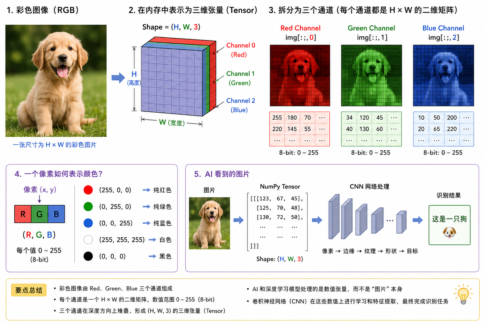
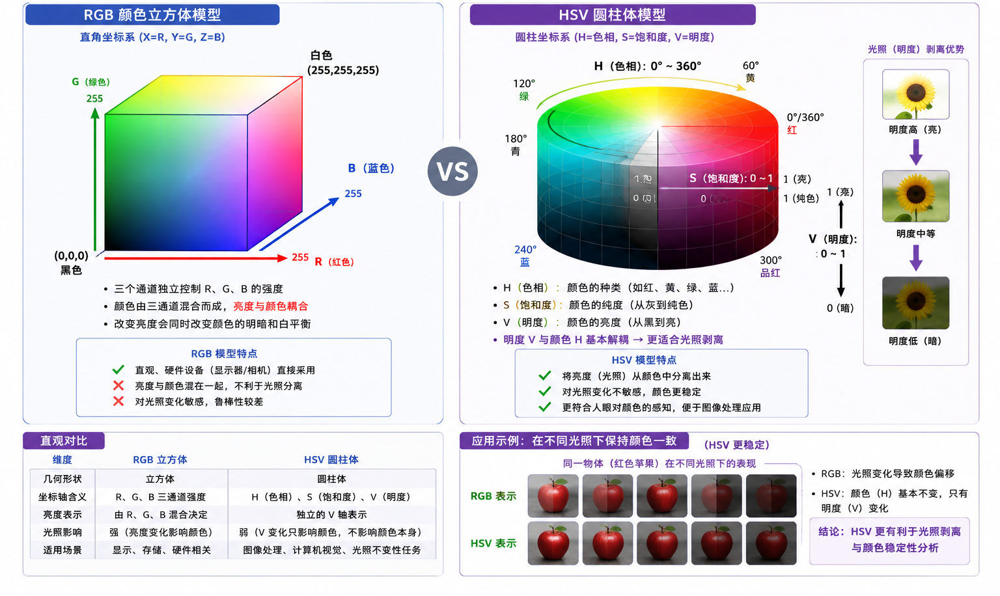
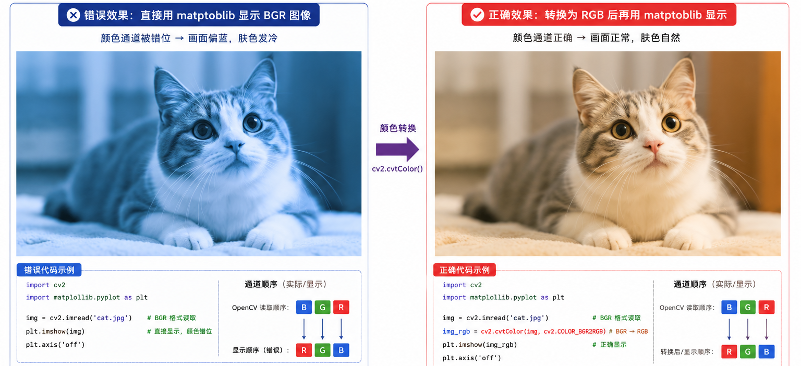
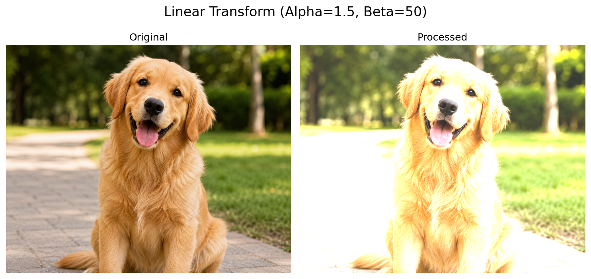
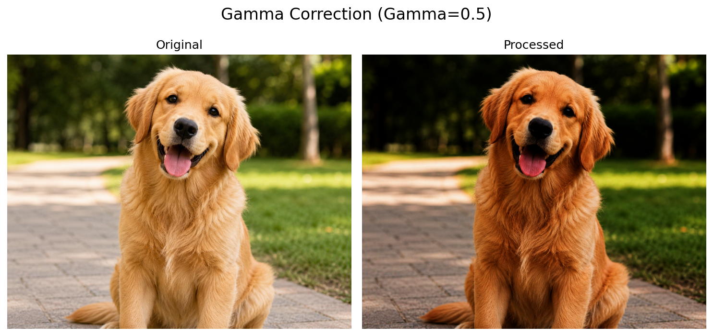
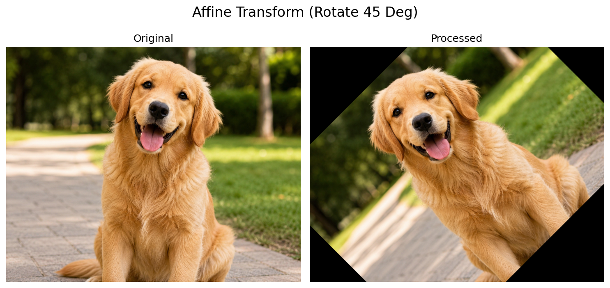
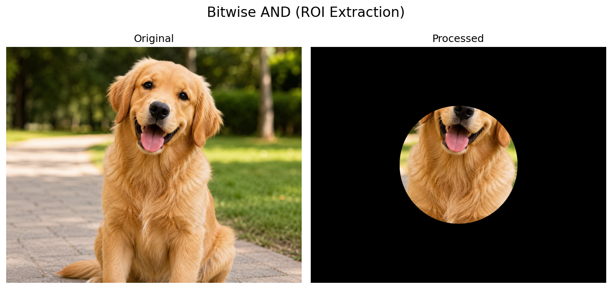

数字图像处理（Digital Image Processing）是计算机视觉（Computer Vision）的基石。在构建复杂的深度学习模型（如 CNN、Vision Transformer）之前，理解图像在计算机内部的数学表示与底层存储方式是必不可少的环节。

本文将从数字图像的离散化过程出发，探讨其矩阵本质，并结合 OpenCV 与 PIL，解析图像在空间域（Spatial Domain）的基础操作与通道原理。

<!-- more -->

## 1. 图像的数字化重构与底层存储

现实世界中的图像是连续的光信号分布。计算机要处理这些信息，必须通过传感器（如 CCD/CMOS）将其转化为离散的数字矩阵。这一过程主要由两步构成：**空间采样**与**幅度量化**。

### 1.1 采样与量化
- **采样（Sampling）**：对连续的空间坐标进行离散化，决定了图像的**空间分辨率**（如 $1920 \times 1080$）。根据奈奎斯特-香农采样定理（Nyquist-Shannon sampling theorem），采样频率必须大于图像最高空间频率的两倍，否则会出现混叠（Aliasing）现象。
- **量化（Quantization）**：对采样后的连续亮度值进行离散化，决定了图像的**色彩深度**。最常见的是 8-bit 量化，即将亮度映射到 $[0, 255]$ 的整数区间。

### 1.2 图像的 Numpy 矩阵表示
在 Python 环境中，图像的本质是多维数组（Tensor）。OpenCV 读取的图像对象即为 `<class 'numpy.ndarray'>`。



对于一张彩色图像，其内存排列通常表现为 **HWC**（Height, Width, Channel）格式。
例如，一张 $1080 \times 1920$ 的彩色图像，其 Numpy 形状（Shape）为 `(1080, 1920, 3)`。这意味着它是一个由 $1080 \times 1920$ 个像素点构成的矩阵，每个像素点包含 3 个维度的色彩信息。

> **注（工程陷阱与通道顺序）**：
> 从你上面看到的原理图可知，标准的彩色图像通道是 **RGB**。但需要特别注意的是：
> 1. 传统的图像处理库（如 OpenCV）在内存中默认读取的通道顺序是 **BGR**（历史遗留原因），而非图示的 RGB。
> 2. 它们默认使用 **HWC** 格式排列。但在深度学习框架（如 PyTorch）中，为了优化卷积计算与内存对齐，张量通常被重构为 **CHW**（Channel, Height, Width）格式。在进行模型推理前，必须使用 `np.transpose(img, (2, 0, 1))` 进行轴交换。

## 2. 色彩空间与多通道代数表示

色彩空间（Color Space）是使用数学模型表示颜色的方法。不同的色彩空间适用于不同的算法需求。

### 2.1 RGB 色彩模型
RGB（Red, Green, Blue）是基于人类视觉系统三原色原理建立的笛卡尔坐标系模型。
任何一种颜色都可以表示为三个基向量的线性组合：
$$ Color = r \cdot \mathbf{R} + g \cdot \mathbf{G} + b \cdot \mathbf{B} $$

### 2.2 工业界常用的衍生色彩空间
虽然 RGB 适合显示器输出，但由于其三个通道具有极强的相关性，且对光照变化敏感，在计算机视觉任务中通常会转换到其他色彩空间：



- **HSV / HSI 空间**：将颜色拆分为色相（Hue）、饱和度（Saturation）和明度（Value/Intensity）。正如上方对比图底部演示的那样，在做肤色检测或特定颜色追踪（如红色苹果）时，HSV 空间可以直接通过判定 $H$ 通道的阈值来剥离光照（$V$ 通道）的干扰，鲁棒性极高。
- **YUV / YCrCb 空间**：人类视觉对亮度（Luminance, Y）的敏感度远高于色度（Chrominance, U/V）。视频压缩算法（如 H.264）及 JPEG 压缩正是利用了这一点，对色度通道进行下采样（如 YUV 4:2:0）以极大地减少存储体积。

## 3. 图像在空间域的数学操作

空间域操作是指直接对图像矩阵中的像素点 $f(x, y)$ 进行代数运算，生成新图像 $g(x, y)$。这与我们下一篇要讲的频率域（如傅里叶变换）操作有着本质的区别。

### 3.1 逐像素运算（Point Operations）
逐像素运算是最基础的操作，它不改变像素的空间坐标位置，仅改变其幅度值（亮度或颜色）。

**1. 线性变换（亮度与对比度）**：
$$ g(x, y) = \alpha \cdot f(x, y) + \beta $$
- **$\alpha$（增益 / 对比度）**：当 $\alpha > 1$ 时，像素值的差距被放大，图像对比度增加；当 $0 < \alpha < 1$ 时，对比度降低。
- **$\beta$（偏置 / 亮度）**：当 $\beta > 0$ 时，所有像素值统一增加，图像整体变亮；反之变暗。
- *工程实现注意*：在代码中做加法和乘法时，极易出现数值溢出（超过 255）。必须使用如 `cv2.convertScaleAbs` 或 Numpy 的 `np.clip` 进行截断（Clipping）处理。

**2. 非线性变换（Gamma 校正）**：
线性变换容易导致高光过曝或暗部死黑。此时需要使用非线性变换：
$$ s = c \cdot r^\gamma $$
- 当 **$\gamma < 1$** 时：变换曲线向上凸起，会大幅拉伸低灰度（暗部）区域的动态范围。常用于拯救曝光不足、暗部细节丢失的照片。
- 当 **$\gamma > 1$** 时：变换曲线向下凹陷，会拉伸高灰度（亮部）区域。常用于压暗过曝的天空。

### 3.2 图像的算术与逻辑融合（Image Blending & Masking）
在实际应用中，我们经常需要将多张图像进行合并，或者提取特定的区域。

**1. 图像加权融合（Alpha Blending）**：
$$ g(x,y) = (1 - \alpha) \cdot f_1(x,y) + \alpha \cdot f_2(x,y) $$
这就是著名的“溶解”效果。通过调节权重系数 $\alpha \in [0,1]$，可以实现两张图片的平滑过渡（例如视频编辑中的淡入淡出）。

**2. 逻辑运算与掩膜（Mask）**：
这是 CV 中最强大的工具之一。利用布尔代数（AND, OR, NOT, XOR），我们可以对图像进行像素级的“抠图”。
- **按位与（Bitwise AND）**：`cv2.bitwise_and(img, img, mask=mask)`。只有当 Mask 矩阵中对应位置的值为 1（白色）时，原图像的像素才会被保留；否则变为 0（黑色）。这在背景去除、ROI（感兴趣区域）提取中极其常用。

### 3.3 几何变换（Geometric Transformations）
几何变换涉及像素空间坐标的重新映射。它不仅改变了像素的位置，通常还会改变图像的 Shape。

其底层核心依赖于**仿射变换矩阵（Affine Transformation Matrix）**。
为了能将“平移（加法）”和“缩放/旋转（乘法）”统一为一个矩阵乘法操作，数学家引入了齐次坐标（Homogeneous coordinates），增加了一个维度：
$$
\begin{bmatrix} x' \\ y' \\ 1 \end{bmatrix} = 
\begin{bmatrix} a_{11} & a_{12} & t_x \\ a_{21} & a_{22} & t_y \\ 0 & 0 & 1 \end{bmatrix}
\begin{bmatrix} x \\ y \\ 1 \end{bmatrix}
$$
- **平移（Translation）**：通过控制矩阵中的 $t_x$ 和 $t_y$ 实现。
- **缩放（Scaling）**：通过控制主对角线上的 $a_{11}$ 和 $a_{22}$ 实现。
- **旋转（Rotation）**：$a_{11}, a_{12}, a_{21}, a_{22}$ 会变成由 $\cos\theta$ 和 $\sin\theta$ 组成的三角函数矩阵。

> **核心难点：插值（Interpolation）**
> 在进行放大或旋转时，原图像的离散坐标 $(x, y)$ 映射到新图像时，大概率会落在一个**浮点数坐标**上（例如 $x'=1.5, y'=2.3$）。由于屏幕上的像素只能是整数，必须通过周围已知的整数像素来“猜”出这个点的值。
> 常见的插值算法有：
> - **最近邻插值（Nearest Neighbor）**：计算最快，但会产生严重的马赛克锯齿。
> - **双线性插值（Bilinear）**：综合周围 4 个点的值，是 OpenCV 默认的算法，平滑且速度适中。
> - **双三次插值（Bicubic）**：综合周围 16 个点，质量最高，适合图像放大，但计算最慢。

## 4. 生产级框架：OpenCV 与 PIL 解析

在 Python 生态中，`OpenCV` 与 `PIL (Pillow)` 是图像处理的两大基石，但其设计哲学截然不同。

### 4.1 架构与设计差异
- OpenCV (`cv2`)：底层基于 C/C++ 开发，数据结构完全依赖 Numpy 数组，计算性能极高。其历史遗留的特点是：读取彩色图像时，通道顺序为 **BGR** 而非 RGB。
- PIL (`Pillow`)：Python 原生的图像处理库，封装为面向对象的 `Image` 类，默认通道顺序为 **RGB**。其强项在于图像文件的 I/O、基础格式转换以及高质量的文本渲染。

### 4.2 基础操作实战与避坑

**图像的读取与显示**：
```python
import cv2
import numpy as np
from PIL import Image
import matplotlib.pyplot as plt

# --- OpenCV 方式 ---
img_cv = cv2.imread('sample.jpg') # 返回 Numpy array，形状为 (H, W, 3)，通道为 BGR
# OpenCV 显示
# cv2.imshow('OpenCV', img_cv)
# cv2.waitKey(0)

# --- PIL 方式 ---
img_pil = Image.open('sample.jpg') # 返回 PIL.Image 对象，通道为 RGB
# img_pil.show()
```

**框架混用的经典陷阱：通道错位**
在使用 OpenCV 读取图像，并试图使用 `Matplotlib` 进行可视化时，常会出现图像变成“冷色调（阿凡达）”的现象。这是因为 Matplotlib 期望输入 RGB 格式，而 OpenCV 提供的是 BGR 格式。

必须进行通道重排（Color Conversion）：




### 4.3 空间域数学操作的代码复现

为了呼应第 3 节的理论，我们使用 OpenCV 将上述的数学操作进行代码落地。

**1. 线性变换（亮度和对比度）与防溢出截断**：
```python
alpha = 1.5  # 提升对比度
beta = 50    # 提升亮度

# 错误做法：直接用 numpy 加法，超过 255 的像素会溢出变成 0 附近的值（如 250+10 = 4）
# wrong_img = img_cv * alpha + beta 

# 正确做法：使用 cv2.convertScaleAbs，它会自动处理饱和截断（Clipping）
adjusted_img = cv2.convertScaleAbs(img_cv, alpha=alpha, beta=beta)
```
<br>



**2. Gamma 非线性校正**：
```python
gamma = 0.5  # gamma < 1，提亮暗部细节
# 构建查找表 (Lookup Table, LUT) 以加速运算
invGamma = 1.0 / gamma
table = np.array([((i / 255.0) ** invGamma) * 255 for i in np.arange(0, 256)]).astype("uint8")

# cv2.LUT 会将图像中的每个像素值通过查找表直接映射为新值，速度极快
gamma_corrected = cv2.LUT(img_cv, table)
```
<br>



**3. 仿射变换（旋转与插值）**：
```python
(h, w) = img_cv.shape[:2]
center = (w // 2, h // 2)

# 1. 获取旋转的仿射变换矩阵 (中心点, 旋转角度, 缩放比例)
M = cv2.getRotationMatrix2D(center, 45, 1.0)

# 2. 应用仿射矩阵，并指定插值算法为双线性插值 (INTER_LINEAR)
rotated_img = cv2.warpAffine(img_cv, M, (w, h), flags=cv2.INTER_LINEAR)
```
<br>



**4. 逻辑掩膜（Masking）提取 ROI**：
```python
# 创建一个与原图宽高相同的全黑单通道掩膜
mask = np.zeros(img_cv.shape[:2], dtype="uint8")

# 在掩膜中心画一个白色的实心圆 (值为 255)
cv2.circle(mask, center, 100, 255, -1)

# 按位与运算：只保留掩膜中为白色的区域，其他区域变黑
roi_img = cv2.bitwise_and(img_cv, img_cv, mask=mask)
```
<br>


